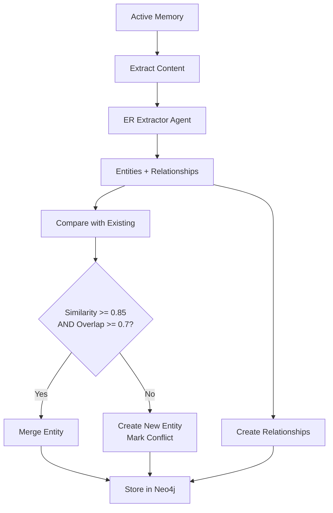
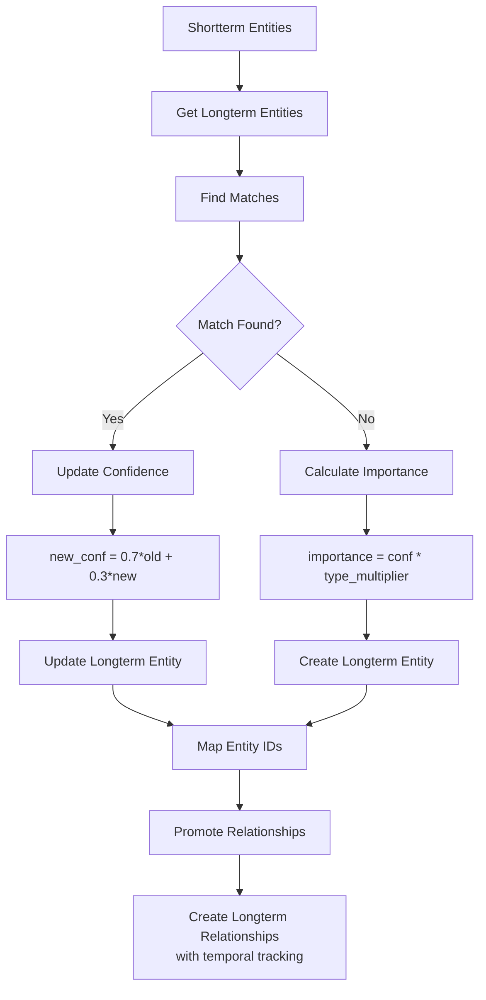

# Phase 4 Integration Summary - REVISED

**Integration Status**: ✅ COMPLETE  
**Date**: October 2, 2025

This document summarizes how Pydantic AI agents are integrated into the `agent_mem` package after architectural adjustments.

---

## Architecture Overview

### Key Change: ER Extractor Agent

Instead of creating a custom **MemorizerAgent**, we now use the existing **ER Extractor Agent** from the main ai-army codebase:

```python
# In agent_mem/services/memory_manager.py

# Path manipulation to import from main ai-army codebase (5 levels up)
import sys
from pathlib import Path
current_dir = Path(__file__).resolve().parent
agent_mem_root = current_dir.parent.parent
project_root = agent_mem_root.parent
sys.path.insert(0, str(project_root))

from agents.predefined_agents.er_extractor_agent import er_extractor_agent
```

**Benefits**:
- 🎯 **Specialized**: Purpose-built for entity/relationship extraction
- 🔧 **Maintained**: Part of main codebase, receives updates
- 📊 **Validated**: Tested output models (ExtractionResult)
- 🚀 **Fast**: Uses Gemini Flash for speed

---

## Integration Points

### 1. ER Extractor Agent → Consolidation

**File**: `agent_mem/services/memory_manager.py`  
**Method**: `_consolidate_to_shortterm()`  
**Lines**: ~220

**Purpose**: Extract entities and relationships during Active → Shortterm consolidation

#### Usage

```python
async def _consolidate_to_shortterm(
    self,
    external_id: str,
    active_memory_id: int
) -> Dict[str, Any]:
    """Consolidate active memory to shortterm with entity extraction."""
    
    # 1. Get active memory
    active_memory = await self.active_repo.get_by_id(active_memory_id)
    
    # 2. Extract content
    content = self._extract_content_from_sections(active_memory)
    
    # 3. Extract entities/relationships using ER Extractor Agent
    extraction_result = await er_extractor_agent.run(content)
    
    # 4. Access extracted data
    entities = extraction_result.data.entities
    relationships = extraction_result.data.relationships
    
    # 5. Process with auto-resolution logic...
```

#### Auto-Resolution Logic

When an extracted entity matches an existing entity:

```python
# Calculate metrics
similarity = await self._calculate_semantic_similarity(
    extracted_entity.name,
    existing_entity.name
)
overlap = self._calculate_entity_overlap(
    extracted_entity,
    existing_entity
)

# Decision tree
if similarity >= 0.85 and overlap >= 0.7:
    # MERGE: High confidence match
    await self.shortterm_repo.update_entity(
        entity_id=existing_entity.id,
        confidence=max(existing_entity.confidence, extracted_entity.confidence),
        metadata={
            **existing_entity.metadata,
            "merge_count": existing_entity.metadata.get("merge_count", 0) + 1,
            "last_merge_date": datetime.utcnow().isoformat()
        }
    )
else:
    # CONFLICT: Create new entity with conflict marker
    await self.shortterm_repo.create_entity(
        name=extracted_entity.name,
        entity_type=extracted_entity.type,
        confidence=extracted_entity.confidence,
        metadata={
            "conflict_with": existing_entity.id,
            "source": "er_extractor_agent",
            "requires_manual_review": True
        }
    )
```

#### Statistics Logged

```python
logger.info(f"""
Consolidation complete:
- Chunks: {chunks_created}
- Entities: {entities_created} created, {entities_merged} merged, {conflicts} conflicts
- Relationships: {relationships_created}
""")
```

---

### 2. Memory Retrieve Agent → Retrieval

**File**: `agent_mem/services/memory_manager.py`  
**Method**: `retrieve_memories()`  
**Lines**: ~150

**Purpose**: Intelligent search strategy and result synthesis

#### Initialization

```python
# In MemoryManager.__init__
self.retriever_agent = MemoryRetrieveAgent(
    active_repo=self.active_repo,
    shortterm_repo=self.shortterm_repo,
    longterm_repo=self.longterm_repo
)
```

#### Usage

```python
async def retrieve_memories(
    self,
    external_id: str,
    query: str,
    top_k: int = 10,
    **kwargs
) -> Dict[str, Any]:
    """Retrieve memories using AI-powered search and synthesis."""
    
    # Use retriever agent for intelligent search
    result = await self.retriever_agent.retrieve(
        external_id=external_id,
        query=query,
        top_k=top_k,
        **kwargs
    )
    
    # Result includes:
    # - strategy: SearchStrategy (which tiers, vector/BM25 weights)
    # - synthesis: Human-readable summary
    # - confidence: 0.0-1.0
    # - raw_results: Original search results
    
    return result
```

#### Strategy Determination

The retrieve agent analyzes the query and determines:

```python
class SearchStrategy:
    search_active: bool = True
    search_shortterm: bool = True
    search_longterm: bool = False
    
    vector_weight: float = 0.7  # Favor semantic similarity
    bm25_weight: float = 0.3    # Some keyword matching
    
    time_filter: Optional[str] = None  # e.g., "recent", "last_week"
    confidence_threshold: Optional[float] = None
```

#### Synthesis

The synthesis agent combines results into a coherent response:

```python
class SynthesisResult:
    response: str  # Natural language summary
    confidence: float  # 0.0-1.0
    source_summary: Dict[str, int]  # {"active": 3, "shortterm": 5}
    gaps_identified: List[str]  # Missing information
```

---

## Entity/Relationship Workflows

### Consolidation: Active → Shortterm



### Promotion: Shortterm → Longterm



---

## Helper Functions

### 1. Semantic Similarity

**Method**: `_calculate_semantic_similarity(text1, text2) -> float`

```python
async def _calculate_semantic_similarity(
    self,
    text1: str,
    text2: str
) -> float:
    """Calculate semantic similarity using embeddings."""
    try:
        # Get embeddings
        emb1 = await self.embedding_service.get_embedding(text1)
        emb2 = await self.embedding_service.get_embedding(text2)
        
        # Cosine similarity
        dot_product = sum(a * b for a, b in zip(emb1, emb2))
        norm1 = sum(a * a for a in emb1) ** 0.5
        norm2 = sum(b * b for b in emb2) ** 0.5
        
        similarity = dot_product / (norm1 * norm2) if norm1 * norm2 > 0 else 0.0
        
        return similarity
        
    except Exception as e:
        logger.warning(f"Embedding similarity failed: {e}")
        # Fallback: simple string comparison
        return 1.0 if text1.lower() == text2.lower() else 0.0
```

**Returns**: 0.0-1.0 (higher = more similar)

### 2. Entity Overlap

**Method**: `_calculate_entity_overlap(entity1, entity2) -> float`

```python
def _calculate_entity_overlap(
    self,
    entity1: ExtractedEntity,
    entity2: Dict[str, Any]
) -> float:
    """Calculate overlap based on name and type matching."""
    name_match = entity1.name.lower() == entity2.get("name", "").lower()
    type_match = entity1.type == entity2.get("entity_type")
    
    if name_match and type_match:
        return 1.0  # Perfect match
    elif name_match or type_match:
        return 0.5  # Partial match
    else:
        return 0.0  # No match
```

**Returns**: 1.0 (perfect), 0.5 (partial), 0.0 (no match)

### 3. Importance Calculation

**Method**: `_calculate_importance(entity) -> float`

```python
def _calculate_importance(
    self,
    entity: Dict[str, Any]
) -> float:
    """Calculate importance score for promotion decision."""
    base_score = entity.get("confidence", 0.5)
    entity_type = entity.get("entity_type", "OTHER")
    
    # Type-based multipliers
    multipliers = {
        "PERSON": 1.2,
        "ORGANIZATION": 1.2,
        "TECHNOLOGY": 1.15,
        "CONCEPT": 1.1,
        "PROJECT": 1.1,
        "FRAMEWORK": 1.1,
        "LIBRARY": 1.05,
        "TOOL": 1.05,
        "DATABASE": 1.05,
    }
    
    multiplier = multipliers.get(entity_type, 1.0)
    importance = base_score * multiplier
    
    return min(importance, 1.0)  # Cap at 1.0
```

**Returns**: 0.0-1.0 (higher = more important)

---

## Configuration

### Thresholds

```python
# In agent_mem/services/memory_manager.py

# Auto-resolution thresholds
SEMANTIC_SIMILARITY_THRESHOLD = 0.85
ENTITY_OVERLAP_THRESHOLD = 0.7

# Promotion threshold
SHORTTERM_PROMOTION_THRESHOLD = 0.7

# Confidence update weight (favor existing)
CONFIDENCE_UPDATE_WEIGHT = 0.7
```

### Entity Type Multipliers

```python
ENTITY_TYPE_MULTIPLIERS = {
    # High importance
    "PERSON": 1.2,
    "ORGANIZATION": 1.2,
    
    # Medium-high importance
    "TECHNOLOGY": 1.15,
    "CONCEPT": 1.1,
    "PROJECT": 1.1,
    "FRAMEWORK": 1.1,
    
    # Medium importance
    "LIBRARY": 1.05,
    "TOOL": 1.05,
    "DATABASE": 1.05,
    
    # Default: 1.0 (no boost)
}
```

---

## Error Handling

### ER Extractor Agent Failure

If the ER Extractor Agent fails, consolidation continues without entities:

```python
try:
    extraction_result = await er_extractor_agent.run(content)
    entities = extraction_result.data.entities
    relationships = extraction_result.data.relationships
except Exception as e:
    logger.error(f"ER Extractor Agent failed: {e}")
    entities = []
    relationships = []
    # Continue with chunk storage only
```

### Retriever Agent Failure

If the retriever agent fails, fall back to basic search:

```python
try:
    result = await self.retriever_agent.retrieve(...)
except Exception as e:
    logger.error(f"Retriever agent failed: {e}, using basic search")
    # Basic hybrid search without AI synthesis
    result = await self._basic_hybrid_search(...)
```

---

## Testing Recommendations

### Unit Tests

1. **ER Extractor Integration**:
   ```python
   async def test_er_extractor_integration():
       content = "John works at Microsoft. He uses Python."
       result = await er_extractor_agent.run(content)
       
       assert len(result.data.entities) >= 3  # John, Microsoft, Python
       assert len(result.data.relationships) >= 2  # works_at, uses
   ```

2. **Auto-Resolution Logic**:
   ```python
   async def test_auto_resolution():
       # Test merge scenario
       entity1 = ExtractedEntity(name="Python", type="TECHNOLOGY", confidence=0.9)
       entity2 = {"name": "python", "entity_type": "TECHNOLOGY", "confidence": 0.85}
       
       similarity = await memory_manager._calculate_semantic_similarity("Python", "python")
       overlap = memory_manager._calculate_entity_overlap(entity1, entity2)
       
       assert similarity >= 0.85
       assert overlap >= 0.7
       # Should trigger merge
   ```

3. **Confidence Update**:
   ```python
   def test_confidence_update():
       existing_conf = 0.8
       new_conf = 0.9
       weight = 0.7
       
       updated = weight * existing_conf + (1 - weight) * new_conf
       
       assert updated == 0.83  # 0.7*0.8 + 0.3*0.9
   ```

### Integration Tests

1. **End-to-End Consolidation**:
   ```python
   async def test_consolidation_with_entities():
       # Create active memory with content
       active_memory = await create_test_active_memory(
           content="Alice works at Google. She uses TensorFlow for ML projects."
       )
       
       # Trigger consolidation
       result = await memory_manager._consolidate_to_shortterm(
           external_id="test_user",
           active_memory_id=active_memory.id
       )
       
       # Verify entities created
       entities = await shortterm_repo.get_entities_by_memory_id(result["shortterm_memory_id"])
       assert len(entities) >= 3  # Alice, Google, TensorFlow
       
       # Verify relationships created
       relationships = await shortterm_repo.get_relationships_by_memory_id(result["shortterm_memory_id"])
       assert len(relationships) >= 2  # works_at, uses
   ```

2. **End-to-End Promotion**:
   ```python
   async def test_promotion_with_entities():
       # Create shortterm memory with entities
       shortterm_memory = await create_test_shortterm_memory_with_entities()
       
       # Trigger promotion
       result = await memory_manager._promote_to_longterm(
           external_id="test_user",
           shortterm_memory_id=shortterm_memory.id
       )
       
       # Verify entities promoted
       entities = await longterm_repo.get_entities_by_external_id("test_user")
       assert len(entities) > 0
       
       # Verify confidence updated
       for entity in entities:
           assert 0.0 <= entity["confidence"] <= 1.0
       
       # Verify relationships promoted
       relationships = await longterm_repo.get_relationships_by_external_id("test_user")
       assert len(relationships) > 0
   ```

---

## Performance Considerations

### ER Extractor Agent

- **Model**: google-gla:gemini-2.5-flash-lite (fast)
- **Latency**: ~1-2 seconds for typical content
- **Batch Processing**: Process multiple chunks if needed
- **Caching**: Consider caching extraction results

### Auto-Resolution

- **Semantic Similarity**: Requires embedding generation (async)
- **Overlap Calculation**: Fast (string comparison)
- **Optimization**: Batch embedding generation for multiple entities

### Promotion

- **Entity Comparison**: O(n*m) where n=shortterm, m=longterm
- **Optimization**: Index entities by name for faster lookup
- **Batch Updates**: Use batch operations for Neo4j updates

---

## Future Enhancements

### 1. Advanced Auto-Resolution

- **Fuzzy Matching**: Use Levenshtein distance for name variations
- **Alias Tracking**: Store alternate names for entities
- **Contextual Matching**: Consider surrounding relationships

### 2. Relationship Strength

- **Co-occurrence Analysis**: Track frequency of entity pairs
- **Temporal Decay**: Reduce strength of old relationships
- **Confidence Propagation**: Stronger relationships from confident entities

### 3. Entity Deduplication

- **Global Registry**: Cross-memory entity matching
- **Canonical Entities**: Single source of truth for entities
- **Merge History**: Track all merges for audit

### 4. Conflict Resolution UI

- **Visual Comparison**: Show conflicting entities side-by-side
- **Manual Merge**: Allow user to choose correct entity
- **Auto-Learn**: Train on manual decisions

---

## Summary

### What Was Built

✅ **ER Extractor Agent Integration**:
- Clean import from main ai-army codebase
- Used in consolidation workflow
- Structured output (ExtractionResult)

✅ **Auto-Resolution Logic**:
- Semantic similarity >= 0.85
- Entity overlap >= 0.7
- Automatic merge or conflict detection

✅ **Entity/Relationship Promotion**:
- Confidence update: 0.7 * existing + 0.3 * new
- Importance scoring with type multipliers
- Temporal tracking (start_date, last_updated)

✅ **Helper Functions**:
- Semantic similarity (embeddings + cosine)
- Entity overlap (name/type matching)
- Importance calculation (confidence * multiplier)

### Impact

- 🔍 **Smarter Consolidation**: Auto-resolves similar entities
- 📊 **Better Knowledge Graph**: Proper entity/relationship storage
- ⏱️ **Temporal Tracking**: Version history for entities
- 🎯 **Accurate Promotion**: Confidence-based updates
- 🛡️ **Reliable**: Graceful fallbacks on agent failure

### Architecture Benefits

- 🎯 **DRY Principle**: Reuse existing ER Extractor Agent
- 🔧 **Maintainability**: Single source of truth for entity extraction
- 📊 **Consistency**: Same extraction logic across codebase
- 🚀 **Performance**: Optimized Gemini Flash model

---

**Integration Status**: ✅ COMPLETE  
**Next Phase**: Testing and validation with ER Extractor Agent
