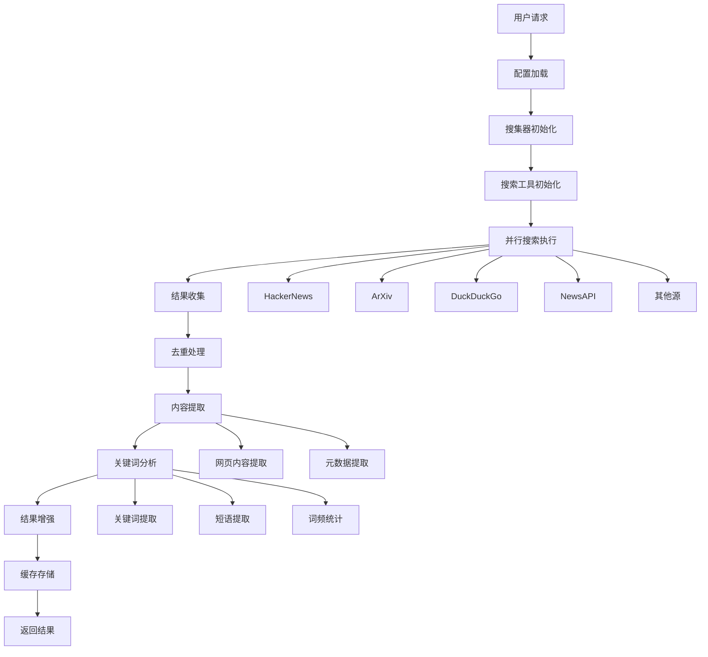

# AI News Collector Library 架构说明

## 📋 概述

AI News Collector Library 是一个用于收集AI相关新闻的Python库，采用模块化设计，支持多种搜索源和高级功能。本文档详细说明了库的架构设计、模块组织和数据流。

## 🏗️ 整体架构

```
┌─────────────────────────────────────────────────────────────┐
│                    AI News Collector Library                │
├─────────────────────────────────────────────────────────────┤
│  Core Layer (核心层)                                        │
│  ┌─────────────────┐  ┌─────────────────────────────────┐   │
│  │   Collector     │  │    Advanced Collector          │   │
│  │   (基础搜集器)   │  │    (高级搜集器)                 │   │
│  └─────────────────┘  └─────────────────────────────────┘   │
├─────────────────────────────────────────────────────────────┤
│  Data Layer (数据层)                                        │
│  ┌─────────────────┐  ┌─────────────────────────────────┐   │
│  │     Article     │  │         SearchResult            │   │
│  │   (文章模型)     │  │        (搜索结果)                │   │
│  └─────────────────┘  └─────────────────────────────────┘   │
├─────────────────────────────────────────────────────────────┤
│  Tools Layer (工具层)                                       │
│  ┌─────────────────┐  ┌─────────────────────────────────┐   │
│  │  Search Tools   │  │      Content Extractor          │   │
│  │  (搜索工具)      │  │      (内容提取器)               │   │
│  └─────────────────┘  └─────────────────────────────────┘   │
│  ┌─────────────────┐  ┌─────────────────────────────────┐   │
│  │ Keyword Extractor│  │        Cache Manager            │   │
│  │ (关键词提取器)    │  │        (缓存管理器)             │   │
│  └─────────────────┘  └─────────────────────────────────┘   │
├─────────────────────────────────────────────────────────────┤
│  Config Layer (配置层)                                      │
│  ┌─────────────────┐  ┌─────────────────────────────────┐   │
│  │  Search Config  │  │    Advanced Search Config       │   │
│  │  (搜索配置)      │  │    (高级搜索配置)               │   │
│  └─────────────────┘  └─────────────────────────────────┘   │
├─────────────────────────────────────────────────────────────┤
│  Utils Layer (工具层)                                       │
│  ┌─────────────────┐  ┌─────────────────────────────────┐   │
│  │    Scheduler    │  │        Report Generator         │   │
│  │   (调度器)       │  │        (报告生成器)             │   │
│  └─────────────────┘  └─────────────────────────────────┘   │
└─────────────────────────────────────────────────────────────┘
```

## 📁 目录结构详解

```
ai_news_collector_lib/
├── __init__.py                 # 库入口点，导出主要接口
├── core/                       # 核心模块
│   ├── __init__.py
│   ├── collector.py           # 基础搜集器实现
│   └── advanced_collector.py  # 高级搜集器实现
├── models/                     # 数据模型
│   ├── __init__.py
│   ├── article.py             # 文章数据模型
│   └── result.py              # 搜索结果模型
├── config/                     # 配置管理
│   ├── __init__.py
│   └── settings.py            # 配置设置
├── tools/                      # 搜索工具
│   ├── __init__.py
│   └── search_tools.py        # 各种搜索源实现
├── utils/                      # 工具模块
│   ├── __init__.py
│   ├── content_extractor.py   # 内容提取器
│   ├── keyword_extractor.py   # 关键词提取器
│   ├── cache.py               # 缓存管理器
│   ├── scheduler.py           # 定时调度器
│   └── reporter.py            # 报告生成器
├── examples/                   # 示例代码
│   ├── basic_usage.py         # 基础使用示例
│   └── advanced_usage.py      # 高级使用示例
├── tests/                      # 测试代码
│   ├── __init__.py
│   └── test_collector.py      # 搜集器测试
└── docs/                       # 文档
    ├── README.md
    ├── USAGE_GUIDE.md
    └── ARCHITECTURE.md
```

## 🔧 核心模块详解

### 1. Core Layer (核心层)

#### AINewsCollector (基础搜集器)

```python
class AINewsCollector:
    """基础AI新闻搜集器"""
    
    def __init__(self, config: SearchConfig):
        self.config = config
        self.tools = {}
        self._initialize_tools()
    
    async def collect_news(self, query: str, sources: List[str] = None) -> SearchResult:
        """收集新闻的核心方法"""
        # 1. 初始化搜索任务
        # 2. 并行执行搜索
        # 3. 收集结果
        # 4. 去重处理
        # 5. 返回结果
```

**职责：**

- 管理搜索工具的生命周期
- 协调多个搜索源的并行搜索
- 实现结果去重和聚合
- 提供基础的新闻收集功能

#### AdvancedAINewsCollector (高级搜集器)

```python
class AdvancedAINewsCollector(AINewsCollector):
    """高级AI新闻搜集器"""
    
    def __init__(self, config: AdvancedSearchConfig):
        super().__init__(config)
        self.content_extractor = ContentExtractor()
        self.keyword_extractor = KeywordExtractor()
        self.cache_manager = CacheManager()
    
    async def collect_news_advanced(self, query: str) -> Dict[str, Any]:
        """高级新闻收集"""
        # 1. 检查缓存
        # 2. 执行基础搜索
        # 3. 内容提取
        # 4. 关键词分析
        # 5. 结果增强
        # 6. 缓存结果
```

**职责：**

- 继承基础搜集器的所有功能
- 提供内容提取和关键词分析
- 实现结果缓存机制
- 支持多主题收集

### 2. Data Layer (数据层)

#### Article (文章模型)

```python
@dataclass
class Article:
    """基础文章数据结构"""
    title: str
    url: str
    summary: str
    published: str
    author: str
    source_name: str
    source: str
    content: Optional[str] = None
    
    def to_dict(self) -> dict:
        """转换为字典"""
    
    @classmethod
    def from_dict(cls, data: dict) -> 'Article':
        """从字典创建实例"""
```

#### AdvancedArticle (增强文章模型)

```python
@dataclass
class AdvancedArticle(Article):
    """增强文章数据结构"""
    keywords: List[str] = field(default_factory=list)
    sentiment: Optional[str] = None
    word_count: int = 0
    reading_time: int = 0
    hash_id: str = ""
```

#### SearchResult (搜索结果模型)

```python
@dataclass
class SearchResult:
    """搜索结果数据结构"""
    total_articles: int
    unique_articles: int
    duplicates_removed: int
    articles: List[Article]
    source_progress: Dict[str, Dict[str, Any]]
```

### 3. Tools Layer (工具层)

#### Search Tools (搜索工具)

```python
class BaseSearchTool:
    """搜索工具基类"""
    
    def search(self, query: str, days_back: int = 7) -> List[Article]:
        """执行搜索"""
        raise NotImplementedError

class HackerNewsTool(BaseSearchTool):
    """HackerNews搜索工具"""
    
class ArxivTool(BaseSearchTool):
    """ArXiv搜索工具"""
    
class DuckDuckGoTool(BaseSearchTool):
    """DuckDuckGo搜索工具"""
```

**支持的搜索源：**

- 🔥 **HackerNews** - 技术社区讨论
- 📚 **ArXiv** - 学术论文和预印本
- 🦆 **DuckDuckGo** - 隐私保护的网页搜索
- 📡 **NewsAPI** - 多源新闻聚合
- 🔍 **Tavily** - AI驱动的搜索API
- 🌐 **Google Search** - Google自定义搜索API
- 🔵 **Bing Search** - 微软Bing搜索API
- ⚡ **Serper** - 快速Google搜索API
- 🦁 **Brave Search** - 独立隐私搜索API

#### Content Extractor (内容提取器)

```python
class ContentExtractor:
    """内容提取器"""
    
    def extract_content(self, url: str) -> str:
        """提取网页内容"""
        # 1. 发送HTTP请求
        # 2. 解析HTML
        # 3. 提取主要内容
        # 4. 清理和格式化
        # 5. 返回内容
```

#### Keyword Extractor (关键词提取器)

```python
class KeywordExtractor:
    """关键词提取器"""
    
    def extract_keywords(self, text: str) -> List[str]:
        """提取关键词"""
        # 1. 文本清理
        # 2. 分词处理
        # 3. 停用词过滤
        # 4. 词频统计
        # 5. 返回关键词
```

#### Cache Manager (缓存管理器)

```python
class CacheManager:
    """缓存管理器"""
    
    def get_cached_result(self, cache_key: str) -> Optional[Dict]:
        """获取缓存结果"""
    
    def cache_result(self, cache_key: str, result: Dict, ttl_hours: int = None):
        """缓存结果"""
```

### 4. Config Layer (配置层)

#### SearchConfig (搜索配置)

```python
@dataclass
class SearchConfig:
    """基础搜索配置"""
    # 传统源
    enable_hackernews: bool = True
    enable_arxiv: bool = True
    enable_newsapi: bool = False
    enable_rss_feeds: bool = True
    
    # 搜索引擎源
    enable_duckduckgo: bool = True
    enable_tavily: bool = False
    enable_google_search: bool = False
    enable_bing_search: bool = False
    enable_serper: bool = False
    enable_brave_search: bool = False
    
    # API密钥
    newsapi_key: Optional[str] = None
    tavily_api_key: Optional[str] = None
    # ... 其他API密钥
    
    # 搜索参数
    max_articles_per_source: int = 10
    days_back: int = 7
    similarity_threshold: float = 0.85
```

#### AdvancedSearchConfig (高级搜索配置)

```python
@dataclass
class AdvancedSearchConfig(SearchConfig):
    """高级搜索配置"""
    # 高级功能
    enable_content_extraction: bool = True
    enable_sentiment_analysis: bool = False
    enable_keyword_extraction: bool = False
    cache_results: bool = True
    cache_duration_hours: int = 24
    
    # 内容处理参数
    max_content_length: int = 5000
    keyword_count: int = 10
```

### 5. Utils Layer (工具层)

#### Scheduler (调度器)

```python
class DailyScheduler:
    """每日调度器"""
    
    def __init__(self, collector_func: Callable, schedule_time: str = "09:00"):
        self.collector_func = collector_func
        self.schedule_time = schedule_time
    
    def start(self):
        """启动调度器"""
    
    def stop(self):
        """停止调度器"""
```

#### Report Generator (报告生成器)

```python
class ReportGenerator:
    """报告生成器"""
    
    def generate_daily_report(self, result: Dict, format: str = "markdown") -> str:
        """生成每日报告"""
    
    def save_report(self, result: Dict, filename: str = None, format: str = "markdown") -> str:
        """保存报告到文件"""
```

## 🔄 数据流图



## 🎯 设计原则

### 1. 模块化设计

- **单一职责**：每个模块只负责一个特定功能
- **低耦合**：模块间依赖关系清晰，易于测试和维护
- **高内聚**：相关功能组织在同一个模块内

### 2. 可扩展性

- **插件化架构**：新的搜索源可以轻松添加
- **配置驱动**：通过配置文件控制功能启用
- **接口标准化**：所有搜索工具实现统一接口

### 3. 性能优化

- **异步处理**：全异步API，支持并发搜索
- **缓存机制**：避免重复搜索，提高响应速度
- **资源管理**：合理管理内存和网络资源

### 4. 错误处理

- **优雅降级**：单个源失败不影响整体功能
- **重试机制**：网络错误自动重试
- **日志记录**：详细的错误日志便于调试

## 🔧 扩展指南

### 1. 添加新的搜索源

```python
class CustomSearchTool(BaseSearchTool):
    """自定义搜索工具"""
    
    def __init__(self, api_key: str, max_articles: int = 10):
        super().__init__(max_articles)
        self.api_key = api_key
    
    def search(self, query: str, days_back: int = 7) -> List[Article]:
        """实现搜索逻辑"""
        # 1. 构建搜索请求
        # 2. 发送API请求
        # 3. 解析响应
        # 4. 转换为Article对象
        # 5. 返回结果
        pass
```

### 2. 添加新的内容处理器

```python
class CustomContentProcessor:
    """自定义内容处理器"""
    
    def process_article(self, article: Article) -> Article:
        """处理文章内容"""
        # 1. 内容清理
        # 2. 格式转换
        # 3. 质量检查
        # 4. 返回处理后的文章
        return article
```

### 3. 添加新的报告格式

```python
class CustomReportGenerator:
    """自定义报告生成器"""
    
    def generate_custom_report(self, result: Dict) -> str:
        """生成自定义格式报告"""
        # 1. 数据格式化
        # 2. 模板渲染
        # 3. 返回报告内容
        pass
```

## 📊 性能特性

### 1. 并发处理

- **异步搜索**：多个搜索源并行执行
- **任务调度**：智能任务分配和负载均衡
- **超时控制**：避免长时间等待

### 2. 内存管理

- **流式处理**：大文件分块处理
- **垃圾回收**：及时释放不需要的对象
- **内存监控**：实时监控内存使用情况

### 3. 网络优化

- **连接池**：复用HTTP连接
- **请求合并**：批量处理相似请求
- **压缩传输**：减少网络传输量

## 🧪 测试策略

### 1. 单元测试

- **模块测试**：每个模块独立测试
- **接口测试**：验证接口契约
- **边界测试**：测试边界条件

### 2. 集成测试

- **端到端测试**：完整流程测试
- **性能测试**：负载和压力测试
- **兼容性测试**：不同环境测试

### 3. 测试工具

- **pytest**：测试框架
- **pytest-asyncio**：异步测试支持
- **mock**：模拟外部依赖

## 🚀 部署架构

### 1. 单机部署

```
┌─────────────────────────────────────┐
│           单机部署架构               │
├─────────────────────────────────────┤
│  ┌─────────────────────────────────┐│
│  │     AI News Collector          ││
│  │     (主程序)                    ││
│  └─────────────────────────────────┘│
│  ┌─────────────────────────────────┐│
│  │     Scheduler                   ││
│  │     (定时任务)                  ││
│  └─────────────────────────────────┘│
│  ┌─────────────────────────────────┐│
│  │     Cache                       ││
│  │     (本地缓存)                  ││
│  └─────────────────────────────────┘│
└─────────────────────────────────────┘
```

### 2. 分布式部署

```
┌─────────────────────────────────────────────────────────────┐
│                   分布式部署架构                             │
├─────────────────────────────────────────────────────────────┤
│  ┌─────────────┐  ┌─────────────┐  ┌─────────────┐       │
│  │   Worker 1  │  │   Worker 2  │  │   Worker 3  │       │
│  │  (搜集器)   │  │  (搜集器)   │  │  (搜集器)   │       │
│  └─────────────┘  └─────────────┘  └─────────────┘       │
├─────────────────────────────────────────────────────────────┤
│  ┌─────────────────────────────────────────────────────────┐│
│  │                Scheduler                               ││
│  │              (任务调度器)                               ││
│  └─────────────────────────────────────────────────────────┘│
├─────────────────────────────────────────────────────────────┤
│  ┌─────────────────────────────────────────────────────────┐│
│  │                Redis Cache                             ││
│  │                (分布式缓存)                            ││
│  └─────────────────────────────────────────────────────────┘│
└─────────────────────────────────────────────────────────────┘
```

## 📈 监控和日志

### 1. 日志系统

```python
import logging

# 配置日志
logging.basicConfig(
    level=logging.INFO,
    format='%(asctime)s - %(name)s - %(levelname)s - %(message)s',
    handlers=[
        logging.FileHandler('ai_news_collector.log'),
        logging.StreamHandler()
    ]
)
```

### 2. 性能监控

- **搜索耗时**：记录每个搜索源的响应时间
- **成功率**：统计搜索成功率
- **资源使用**：监控CPU、内存、网络使用情况

### 3. 错误监控

- **异常捕获**：捕获和记录所有异常
- **错误分类**：按类型分类错误
- **告警机制**：关键错误自动告警

## 🔮 未来规划

### 1. 功能扩展

- **机器学习**：智能内容推荐和分类
- **多语言支持**：支持多种语言的新闻收集
- **实时更新**：支持实时新闻推送

### 2. 性能优化

- **分布式处理**：支持大规模分布式部署
- **智能缓存**：基于机器学习的智能缓存策略
- **负载均衡**：自动负载均衡和故障转移

### 3. 生态建设

- **插件系统**：支持第三方插件扩展
- **API网关**：提供统一的API接口
- **社区支持**：建立开发者社区

---

**这个架构设计确保了库的可扩展性、可维护性和高性能，为AI新闻收集提供了强大的技术基础。** 🚀
