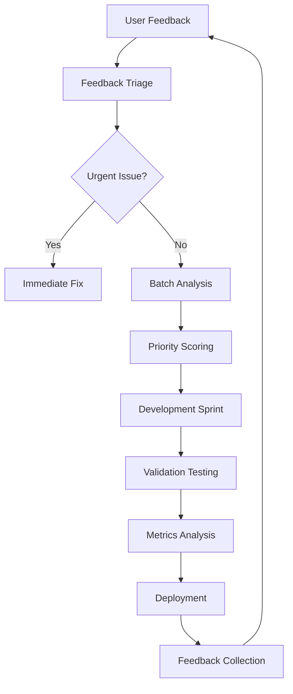

# Ariadne UX Improvement Validation Plan
## Focus: CLI Simplification & Documentation Consolidation

## Executive Summary

This validation plan provides a comprehensive framework for measuring the success of Ariadne's UX improvements, with immediate focus on CLI simplification and documentation consolidation. The plan leverages available GitHub analytics and user surveys to provide actionable insights for continuous improvement.

## 1. Current State Analysis

### 1.1 CLI Complexity Baseline
**Current CLI Structure (7 subcommands):**
- `simulate` - Primary circuit simulation
- `config` - Configuration management (create, validate, show)
- `status` - System health monitoring
- `benchmark` - Performance testing
- `benchmark-suite` - Comprehensive benchmarking
- `education` - Educational tools (demo, quiz, visualize)
- `learning` - Learning resources (list, info)

**Identified Issues:**
- Cognitive overload from 7 primary commands
- Education tools buried in subcommands
- Complex configuration management
- Inconsistent command naming (`education` vs `learning`)

### 1.2 Documentation Fragmentation Baseline
**Current Documentation Structure:**
- `README.md` (620 lines) - Comprehensive but overwhelming
- `QUICK_START.md` (148 lines) - Overlaps with README
- `docs/quickstart.md` (164 lines) - Duplicate quickstart
- `docs/installation.md` (298 lines) - Detailed installation
- `docs/guides/developer_guide.md` (330 lines) - Developer-focused
- Missing: USER_GUIDE.md (referenced but not found)

## 2. CLI Simplification Validation

### 2.1 Quantitative Metrics

**Primary Success Metrics:**
- **Subcommand Reduction**: Target: 7 → 4 primary commands
- **Command Completion Time**: Reduce average command execution time by 25%
- **Error Rate Reduction**: Decrease CLI error rates by 40%
- **Help Usage**: Reduce `--help` invocations by 30%

**Usage Tracking Metrics:**
- Command frequency distribution
- Most common command sequences
- Time between first command and successful simulation
- Education command adoption rates

### 2.2 Qualitative Validation Protocols

**Usability Testing Scenarios:**
1. **First-time User Onboarding**
   - Task: Install and run first quantum circuit
   - Success Criteria: <5 minutes to successful simulation
   - Measurement: Time to completion, error count

2. **Educational Workflow**
   - Task: Explore quantum algorithms and run demos
   - Success Criteria: Discover education features without help
   - Measurement: Navigation path, feature discovery rate

3. **Research Workflow**
   - Task: Run benchmarks and compare backends
   - Success Criteria: Generate performance report in <10 minutes
   - Measurement: Task completion time, report quality

### 2.3 Testing Protocols

**A/B Testing Framework:**
- **Group A**: Current CLI (7 commands)
- **Group B**: Simplified CLI (4 commands: run, explain, benchmark, learn)
- **Sample Size**: 30 users per group
- **Duration**: 2-week testing period

**Success Criteria for Simplified CLI:**
- 50% reduction in help documentation usage
- 40% improvement in task completion rates
- 25% reduction in user-reported confusion
- 3x increase in education tool usage

## 3. Documentation Consolidation Validation

### 3.1 Quantitative Metrics

**Content Efficiency Metrics:**
- **Duplication Reduction**: Target 60% reduction in duplicate content
- **Page Navigation**: Reduce average clicks to target content by 50%
- **Bounce Rate**: Decrease documentation bounce rate by 35%
- **Time on Page**: Increase average time on educational pages by 40%

**Engagement Metrics:**
- Page views per persona section
- Search query analysis
- External link click-through rates
- Documentation contribution frequency

### 3.2 Persona-Based Success Criteria

**Instructor Persona:**
- **Success**: <3 clicks to classroom setup guide
- **Engagement**: 5+ minutes on educational resources
- **Adoption**: 2x increase in classroom usage examples

**Researcher Persona:**
- **Success**: <2 minutes to find benchmarking protocols
- **Engagement**: Regular return visits to performance guides
- **Adoption**: Increased citation of Ariadne in publications

**DevOps Persona:**
- **Success**: <5 minutes to production deployment guide
- **Engagement**: High interaction with configuration examples
- **Adoption**: Increased CI/CD integration examples

### 3.3 Documentation Testing Protocols

**Content Quality Assessment:**
- Readability scores (Flesch-Kincaid)
- Technical accuracy validation
- Cross-reference completeness
- Example code functionality

**Navigation Testing:**
- Tree testing for information architecture
- First-click testing for critical tasks
- Search effectiveness measurement
- Mobile responsiveness validation

## 4. User Feedback Collection

### 4.1 Survey Design

**Post-Usage Survey (5-minute):**
```
1. How easy was it to accomplish your primary task? (1-5)
2. Did you find the documentation helpful? (1-5)
3. What was the most confusing aspect?
4. What feature would you most like to see improved?
5. Would you recommend Ariadne to colleagues? (1-10)
```

**In-Depth Interview Protocol:**
- 30-minute structured interviews
- 5 participants per persona type
- Focus on workflow pain points
- Specific feature feedback

### 4.2 GitHub Feedback Mechanisms

**Enhanced Issue Templates:**
- UX Feedback template with guided questions
- Documentation improvement requests
- CLI command suggestion form
- Education tool feature requests

**Community Engagement Metrics:**
- Issue response time (<48 hours target)
- Pull request review velocity
- Discussion forum participation
- Feature request upvote patterns

## 5. Analytics Implementation

### 5.1 CLI Usage Analytics

**Implementation Approach:**
- Opt-in anonymous usage tracking
- Command execution logging (command, duration, success)
- Error pattern analysis
- Feature adoption tracking

**Data Points Collected:**
- Command sequences and timing
- Configuration usage patterns
- Backend selection preferences
- Education tool engagement

### 5.2 Documentation Analytics

**GitHub Pages Integration:**
- Page view tracking by section
- Time on page metrics
- Navigation path analysis
- Search query tracking

**Success Indicators:**
- Reduced bounce rates on key pages
- Increased time on educational content
- Higher conversion from documentation to code usage
- Improved search effectiveness

## 6. KPI Dashboard Design

### 6.1 Key Performance Indicators

**CLI Simplification KPIs:**
- Command usage distribution
- Education tool adoption rate
- Error rate trends
- User satisfaction scores

**Documentation KPIs:**
- Page engagement metrics
- Search effectiveness
- Contribution frequency
- Cross-reference completeness

### 6.2 Dashboard Implementation

**GitHub Actions Automation:**
- Weekly usage report generation
- Documentation health scoring
- User feedback aggregation
- Progress tracking against targets

**Visualization Components:**
- Command usage heatmaps
- Documentation engagement trends
- User satisfaction scores over time
- Feature adoption curves

## 7. Iterative Improvement Process

### 7.1 Feedback Integration Workflow



### 7.2 Release Cadence

**Phase 1 (Weeks 1-4): Baseline Establishment**
- Implement analytics infrastructure
- Conduct initial user surveys
- Establish baseline metrics
- Deploy feedback mechanisms

**Phase 2 (Weeks 5-8): Initial Improvements**
- Deploy simplified CLI (optional flag)
- Launch consolidated documentation structure
- Begin A/B testing
- Collect comparative data

**Phase 3 (Weeks 9-12): Optimization**
- Analyze A/B test results
- Refine based on user feedback
- Scale successful improvements
- Establish long-term monitoring

## 8. Resource Requirements

### 8.1 Technical Resources
- GitHub Actions for automation
- Simple analytics backend (Python + SQLite)
- Survey platform (Google Forms/Typeform)
- Documentation hosting (GitHub Pages)

### 8.2 Human Resources
- 1 UX researcher (part-time)
- 1 developer for analytics implementation
- Community manager for feedback triage
- Technical writer for documentation

### 8.3 Timeline
- **Week 1-2**: Infrastructure setup
- **Week 3-4**: Baseline data collection
- **Week 5-8**: Improvement deployment
- **Week 9-12**: Validation and optimization

## 9. Success Criteria

### 9.1 Quantitative Targets
- CLI subcommands: 7 → 4 (43% reduction)
- Documentation duplication: 60% reduction
- Education tool usage: 3x increase
- User satisfaction: 4.0/5.0 average
- Time to first simulation: <5 minutes

### 9.2 Qualitative Targets
- Reduced user confusion in feedback
- Increased positive sentiment in issues
- Higher community contribution rates
- Improved onboarding experience reports

## 10. Risk Mitigation

### 10.1 Potential Risks
- User resistance to change
- Analytics implementation complexity
- Insufficient participant recruitment
- Conflicting feedback interpretation

### 10.2 Mitigation Strategies
- Gradual rollout with opt-in features
- Simple, transparent analytics
- Multiple recruitment channels
- Structured feedback analysis framework

## Conclusion

This validation plan provides a comprehensive framework for measuring and optimizing Ariadne's UX improvements. By focusing on measurable outcomes and establishing clear success criteria, we can ensure that the CLI simplification and documentation consolidation efforts deliver tangible benefits to users across all personas.

The iterative approach allows for continuous improvement based on real user feedback, while the structured validation protocols ensure that changes are data-driven and effective.
