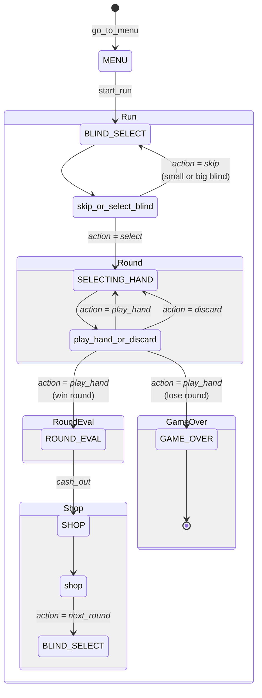

# Developing Bots

BalatroBot allows you to create automated players (bots) that can play Balatro by implementing decision-making logic in Python. Your bot communicates with the game through a TCP socket connection, sending actions to perform and receiving back the game state.

## Bot Architecture

A bot is a finite state machine that implements a sequence of actions to play the game.
The bot can be in one state at a time and has access to a set of functions that can move the bot to other states.

| **State**        | **Description**                              | **Functions**                            |
| ---------------- | -------------------------------------------- | ---------------------------------------- |
| `MENU`           | The main menu                                | `start_run`                              |
| `BLIND_SELECT`   | Selecting or skipping the blind              | `skip_or_select_blind`                   |
| `SELECTING_HAND` | Selecting cards to play or discard           | `play_hand_or_discard`, `rearrange_hand` |
| `ROUND_EVAL`     | Evaluating the round outcome and cashing out | `cash_out`                               |
| `SHOP`           | Buy items and move to the next round         | `shop`                                   |
| `GAME_OVER`      | Game has ended                               | –                                        |

Developing a bot boils down to providing the action name and its parameters for each state.

### State Diagram

The following diagram illustrates the possible states of the game and how the functions can be used to move the bot between them:

- Start (◉) and End (⦾) states
- States are written in uppercase (e.g., `MENU`, `BLIND_SELECT`, ...)
- Functions are written in lowercase (e.g., `start_run`, `skip_or_select_blind`, ...)
- Function parameters are written in italics (e.g., `action = play_hand`). Not all parameters are reported in the diagram.
- Comments are reported in parentheses (e.g., `(win round)`, `(lose round)`).
- Abstract groups are written with capital letters (e.g., `Run`, `Round`, ...)

<div style="text-align: center">



</div>

## Development Environment Setup

The BalatroBot project provides a complete development environment with all necessary tools and resources for developing bots.

### Environment Setup

Before developing or running bots, you need to set up the development environment by configuring the `.envrc` file:

=== "Windows"

    ```sh
    cd %AppData%/Balatro/Mods/balatrobot
    copy .envrc.example .envrc
    .envrc
    ```

=== "MacOS"

    ```sh
    cd "/Users/$USER/Library/Application Support/Balatro/Mods/balatrobot"
    cp .envrc.example .envrc
    source .envrc
    ```

=== "Linux"

    ```sh
    cd ~/.local/share/Steam/steamapps/compatdata/2379780/pfx/drive_c/users/steamuser/AppData/Roaming/Balatro/Mods/balatrobot
    cp .envrc.example .envrc
    source .envrc
    ```

!!! warning "Always Source Environment"

    Remember to source the `.envrc` file every time you start a new terminal
    session before developing or running bots. The environment variables are
    essential for proper bot functionality.

!!! tip "Automatic Environment Loading with direnv"

    For a better development experience, consider using
    [direnv](https://direnv.net/) to automatically load and unload environment
    variables when entering and leaving the project directory.

    After installing direnv and hooking it into your shell:

    ```sh
    # Allow direnv to load the .envrc file automatically
    direnv allow .
    ```

    This eliminates the need to manually source `.envrc` every time you work on
    the project.

### Bot File Location

When developing new bots, place your files in the `bots/` directory using one of these recommended patterns:

- **Single file bots**: `bots/my_new_bot.py`
- **Complex bots**: `bots/my_new_bot/main.py` (for bots with multiple modules)

## Next Steps

After setting up your development environment:

- Explore the [BalatroBot API](balatrobot-api.md) for detailed client and model documentation
- Learn about the underlying [Protocol API](protocol-api.md) for TCP communication details
