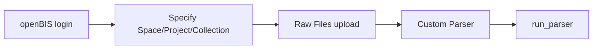
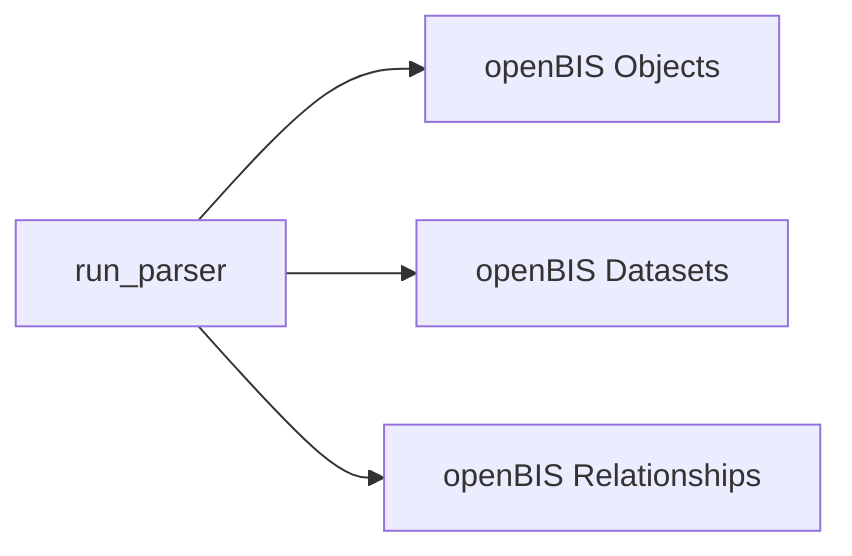

# Automating Metadata Injection with the Parser API

This tutorial teaches you how to automate metadata injection from multiple files into openBIS using the `run_parser()` function and custom parsers. This is useful when you have many files (e.g., experimental data, instrument outputs, logs) and want to systematically extract metadata and push it to your openBIS instance.

By the end of this tutorial, you will be able to:

- Understand the purpose and workflow of `run_parser()`.
- Create a custom parser that extracts metadata from files.
- Use the parser to inject metadata into openBIS automatically.
- Handle relationships between objects.
- Update existing objects in openBIS.

!!! note "Prerequisites"
    - **Python ≥ 3.10** installed
    - **bam-masterdata** package installed (`pip install bam-masterdata`)
    - Basic understanding of Object Types, as explained in [Tutorial - Getting started: Your first `bam-masterdata` experience](getting_started.md#your-first-bam-masterdata-experience)
    - An openBIS instance with login credentials (for local testing)

??? warning "Working with openBIS"
    This tutorial includes examples that connect to openBIS. If you don't have access to an openBIS instance, you can still follow along and understand the concepts by focusing on the parser creation and testing sections.

    We recommend contacting your openBIS admin team to get access credentials.

## Understanding the ETL Workflow

When working with research data, you often need to:

1. **Extract** metadata from raw files (CSV, JSON, XML, etc.).
2. **Transform** the metadata into structured objects and define their relations.
3. **Load** the structured objects into a database system like openBIS.

The `run_parser()` function automates this ETL (Extract-Transform-Load) pipeline. The process can be summarized in the following diagram:



The `run_parser()` then maps the `bam-masterdata` objects and their relationships into openBIS native objects, relationships, and datasets:



The whole process then depends on the inputs and output `run_parser()`:

- **Inputs**
    - `space_name`: _string_, this coincides with the space name you have associated in your openBIS instance
    - `project_name`: _string_, the name of the project where you want to store the parsed objects
    - `collection_name`: _string_, optional, the name of the collection you want to store the parsed objects
    - `files_parser`: _dict_, a dictionary where the keys are the parser class instances (see below) and the values are the files you want to pass to the specific parser class
- **Output**: the metadata objects and relationships mapped to your space/project/collection in openBIS


## Creating Your First Parser

Let's start by creating a simple parser that reads metadata from JSON files. You can read more in [How-to - Create new parsers](../howtos/parsing/create_new_parsers.md).

Imagine you have experimental setup JSON files that look like this:

```json
{
  "experiment_name": "Tensile Test 001",
  "date": "2024-10-15",
  "temperature": 23.5,
  "operator": "Dr. Smith"
}
```

### Step 1: Create the Parser Class

All parsers must inherit from `AbstractParser` and implement the `parse()` method:

```python
import json
import datetime
from bam_masterdata.parsing import AbstractParser
from bam_masterdata.datamodel.object_types import ExperimentalStep


class ExperimentSetupParser(AbstractParser):
    """Parser for experimental setup JSON files."""

    def parse(self, files, collection, logger):
        """
        Parse experimental setup files and populate the collection.

        Args:
            files (list[str]): List of file paths to parse
            collection (CollectionType): Collection to populate with objects
            logger: Logger for status messages
        """
        for file_path in files:
            logger.info(f"Parsing file: {file_path}")

            # Read the JSON file
            with open(file_path, "r", encoding="utf-8") as f:
                data = json.load(f)

            # Create an ExperimentalStep object
            experiment = ExperimentalStep(
                name=data.get("experiment_name"),
                start_date=datetime.datetime.strptime(
                    data.get("date"), "%Y-%m-%d"
                ).date(),
            )

            # Add to collection
            exp_id = collection.add(experiment)
            logger.info(f"Added experiment with ID: {exp_id}")
```

??? note "Mapping metadata to openBIS"
    Not all metadata fields you have defined in your files are necessarily defined in your openBIS instance. If you feel a field is important but missing in openBIS, please, contact the admins of your instance to include such field.

    For `bam-masterdata`, you can [open an issue](https://github.com/BAMresearch/bam-masterdata/issues) with your prefered changes. The whole list of Object Types and their metadata is defined [here](https://github.com/BAMresearch/bam-masterdata/blob/main/bam_masterdata/datamodel/object_types.py).

### Step 2: Test the Parser Locally

Before using `run_parser()`, test your parser to ensure it works correctly:

```python
from bam_masterdata.metadata.entities import CollectionType
from bam_masterdata.logger import logger

# Create a test collection
test_collection = CollectionType()

# Create an instance of your parser
parser = ExperimentSetupParser()

# Parse some test files
test_files = ["experiment_001.json", "experiment_002.json"]
parser.parse(test_files, test_collection, logger)

# Check what was added
print(f"Objects added: {len(test_collection.attached_objects)}")
for obj_id, obj in test_collection.attached_objects.items():
    print(f"{obj_id}: {obj}")
```

This will output something like:
```
Objects added: 2
EXP12345678: ExperimentalStep(name='Tensile Test 001', start_date=datetime.date(2024, 10, 15))
EXP87654321: ExperimentalStep(name='Tensile Test 002', start_date=datetime.date(2024, 10, 16))
```

## Using run_parser() to Upload to openBIS

Once your parser is tested, use `run_parser()` to inject the metadata into openBIS.

### Step 1: Connect to openBIS

First, establish a connection to your openBIS instance:

```python
from pybis import Openbis

# Connect to openBIS
openbis = Openbis(url="https://your-openbis-instance.com")
openbis.login(username="your_username", password="your_password", save_token=True)
```

!!! tip "Token-based Authentication"
    Using `save_token=True` saves your session token so you don't need to re-enter credentials for subsequent connections.

### Step 2: Run the Parser

Now, use `run_parser()` to automate the entire workflow:

```python
from bam_masterdata.cli.run_parser import run_parser

# Define which parser to use and which files to parse
files_parser = {
    ExperimentSetupParser(): [
        "experiment_001.json",
        "experiment_002.json",
        "experiment_003.json"
    ]
}

# Run the parser
run_parser(
    openbis=openbis,
    space_name="MY_RESEARCH_SPACE",
    project_name="MY_PROJECT",
    collection_name="MY_EXPERIMENT_COLLECTION",
    files_parser=files_parser
)
```

### What Happens Next?

When you call `run_parser()`, the following steps occur automatically:

1. **Space and Project Setup**: The function checks if the specified space and project exist. If not, it uses your user space and creates a new project.
2. **Collection Creation**: A collection is created (or retrieved if it exists) to group the objects. If not specified, the objects will be directly created under the project.
3. **Parsing**: Each parser processes its files and populates a `CollectionType`.
4. **Object Creation**: Objects from the collection are created in openBIS with their metadata.
5. **File Upload**: The raw files are uploaded as datasets to the collection.
6. **Relationship Mapping**: Any parent-child relationships are established.

## Adding Multiple Parsers

You can use multiple parsers in a single `run_parser()` call to process different types of files:

```python
from bam_masterdata.cli.run_parser import run_parser

# Use multiple parsers for different file types
files_parser = {
    ExperimentSetupParser(): [
        "experiment_001.json",
        "experiment_002.json"
    ],
    MaterialSampleParser(): [
        "sample_data_A.csv",
        "sample_data_B.csv"
    ],
    TestResultParser(): [
        "results_20241015.xml"
    ]
}

run_parser(
    openbis=openbis,
    space_name="MY_RESEARCH_SPACE",
    project_name="MY_PROJECT",
    collection_name="MULTI_DATA_COLLECTION",
    files_parser=files_parser
)
```

Each parser handles its specific file format, and all results are combined into a single collection.

## Creating Relationships Between Objects

Often, objects in your data model are related. For example, a measurement might be related to a sample, or an experimental step might be a child of another step.

### Example: Linking Samples to Experiments

```python
import json
from bam_masterdata.parsing import AbstractParser
from bam_masterdata.datamodel.object_types import ExperimentalStep, Sample


class ExperimentWithSamplesParser(AbstractParser):
    """Parser that creates experiments and links samples to them."""

    def parse(self, files, collection, logger):
        for file_path in files:
            with open(file_path, "r", encoding="utf-8") as f:
                data = json.load(f)

            # Create the main experiment
            experiment = ExperimentalStep(name=data.get("experiment_name"))
            exp_id = collection.add(experiment)
            logger.info(f"Created experiment: {exp_id}")

            # Create samples and link them to the experiment
            for sample_data in data.get("samples", []):
                sample = Sample(name=sample_data.get("sample_name"))
                sample_id = collection.add(sample)

                # Create parent-child relationship
                # The experiment is the parent, samples are children
                collection.add_relationship(parent_id=exp_id, child_id=sample_id)
                logger.info(f"Linked sample {sample_id} to experiment {exp_id}")
```

Example JSON file structure:
```json
{
  "experiment_name": "Batch Processing 2024-10",
  "samples": [
    {"sample_name": "Sample A"},
    {"sample_name": "Sample B"},
    {"sample_name": "Sample C"}
  ]
}
```

When `run_parser()` processes this, it will:
1. Create the experiment object in openBIS
2. Create all sample objects
3. Establish parent-child links between the experiment and each sample

!!! note "OBJECT properties vs. parent-child relationships"
    The `add_relationship()` method creates parent-child relationships in openBIS. However, some object types have properties with `data_type="OBJECT"` that reference other objects directly (e.g., an Instrument's `responsible_person` property). These are semantically different ways of linking objects:

    - **Parent-child relationships**: Use `collection.add_relationship(parent_id, child_id)` for hierarchical structures. The link has no semantic meaning and instead links inputs with outputs.
    - **OBJECT property references**: Assign directly to the property (e.g., `instrument.responsible_person = person_obj`). The link has semantic meaning according to the assigned property.

    See [Working with object references](getting_started.md#working-with-object-references) for more details on object referencing.

## Updating Existing Objects

Sometimes you want to use parsers to update objects that already exist in openBIS rather than creating new ones. To do this, set the `code` attribute on your object before adding it to the collection.

### Example: Updating an Existing Sample

```python
import json
from bam_masterdata.parsing import AbstractParser
from bam_masterdata.datamodel.object_types import Sample


class SampleUpdateParser(AbstractParser):
    """Parser that updates existing samples with new metadata."""

    def parse(self, files, collection, logger):
        for file_path in files:
            with open(file_path, "r", encoding="utf-8") as f:
                data = json.load(f)

            # Create a sample object
            sample = Sample(
                name=data.get("sample_name"),
                # Add any other metadata fields
            )

            # Reference an existing object by its code
            if data.get("existing_code"):
                sample.code = data.get("existing_code")
                logger.info(f"Updating existing sample: {sample.code}")
            else:
                logger.info("Creating new sample")

            # Add to collection
            sample_id = collection.add(sample)
```

Example JSON for updating:
```json
{
  "sample_name": "Updated Sample Name",
  "existing_code": "SAMPLE_001"
}
```

!!! warning "Code Format"
    The `code` must exactly match the object's code in openBIS, including case and format (usually uppercase with underscores).

!!! note "Identifier Construction"
    The full identifier for updating is:

    - With collection: `/{space_name}/{project_name}/{collection_name}/{code}`
    - Without collection: `/{space_name}/{project_name}/{code}`

## Working Without a Collection

You can also run parsers without specifying a collection. In this case, objects are attached directly to the project:

```python
run_parser(
    openbis=openbis,
    space_name="MY_RESEARCH_SPACE",
    project_name="MY_PROJECT",
    collection_name="",  # Empty string for no collection
    files_parser=files_parser
)
```

!!! note "Dataset Limitation"
    When working without a collection, dataset uploads may fail because pyBIS requires datasets to be attached to collections. The objects will still be created, but raw files may not be uploaded.

## Complete Example: Multi-File Automation Script

Here's a complete script that demonstrates automating metadata injection for multiple files:

```python
import json
import datetime
import os

from pybis import Openbis

from bam_masterdata.cli.run_parser import run_parser
from bam_masterdata.parsing import AbstractParser
from bam_masterdata.datamodel.object_types import ExperimentalStep, SoftwareCode


class ExperimentParser(AbstractParser):
    """Parser for experiment metadata files."""

    def parse(self, files, collection, logger):
        for file_path in files:
            logger.info(f"Processing: {file_path}")

            with open(file_path, "r", encoding="utf-8") as f:
                data = json.load(f)

            # Create experiment object
            experiment = ExperimentalStep(
                name=data.get("name"),
                start_date=datetime.datetime.strptime(
                    data.get("date"), "%Y-%m-%d"
                ).date() if data.get("date") else None,
                finished_flag=data.get("completed", False),
            )

            exp_id = collection.add(experiment)
            logger.info(f"Added experiment: {exp_id}")

            # If software information is provided, create and link it
            if data.get("software"):
                software = SoftwareCode(
                    name=data["software"].get("name"),
                    version=data["software"].get("version"),
                )
                soft_id = collection.add(software)
                collection.add_relationship(parent_id=soft_id, child_id=exp_id)
                logger.info(f"Linked software {soft_id} to experiment {exp_id}")


def main():
    # Configuration
    OPENBIS_URL = "https://your-openbis-instance.com"
    USERNAME = os.getenv("OPENBIS_USERNAME")
    PASSWORD = os.getenv("OPENBIS_PASSWORD")

    # Connect to openBIS
    print("Connecting to openBIS...")
    openbis = Openbis(url=OPENBIS_URL)
    openbis.login(username=USERNAME, password=PASSWORD, save_token=True)
    print(f"Connected as: {openbis.username}")

    # Find all experiment files in a directory
    data_dir = "./experiment_data"
    experiment_files = [
        os.path.join(data_dir, f)
        for f in os.listdir(data_dir)
        if f.endswith(".json")
    ]

    print(f"Found {len(experiment_files)} files to process")

    # Setup parser
    files_parser = {
        ExperimentParser(): experiment_files
    }

    # Run the parser
    print("Running parser...")
    run_parser(
        openbis=openbis,
        space_name="RESEARCH_SPACE",
        project_name="AUTOMATION_TEST",
        collection_name="BATCH_EXPERIMENTS",
        files_parser=files_parser
    )

    print("Metadata injection complete!")


if __name__ == "__main__":
    main()
```

## Best Practices

### Error Handling

Add error handling to make your parsers robust:

```python
class RobustParser(AbstractParser):
    def parse(self, files, collection, logger):
        for file_path in files:
            try:
                with open(file_path, "r", encoding="utf-8") as f:
                    data = json.load(f)

                # Your parsing logic here
                experiment = ExperimentalStep(name=data.get("name"))
                collection.add(experiment)

            except FileNotFoundError:
                logger.error(f"File not found: {file_path}")
            except json.JSONDecodeError:
                logger.error(f"Invalid JSON in file: {file_path}")
            except Exception as e:
                logger.error(f"Error parsing {file_path}: {str(e)}")
```

### Validation

Validate data before creating objects:

```python
def parse(self, files, collection, logger):
    for file_path in files:
        with open(file_path, "r", encoding="utf-8") as f:
            data = json.load(f)

        # Validate required fields
        if not data.get("name"):
            logger.warning(f"Skipping file {file_path}: missing required 'name' field")
            continue

        # Validate data types
        if data.get("temperature") and not isinstance(data["temperature"], (int, float)):
            logger.warning(f"Invalid temperature value in {file_path}")
            continue

        # Create object only if validation passes
        experiment = ExperimentalStep(name=data["name"])
        collection.add(experiment)
```

### Logging

Use different log levels appropriately:

```python
logger.info("Starting to parse files")      # General progress
logger.warning("Missing optional field")    # Non-critical issues
logger.error("Failed to parse file")        # Errors that need attention
logger.critical("Database connection lost") # Critical failures
```

## Troubleshooting

### Common Issues

**Issue**: "No files or parsers to parse" error
- **Solution**: Ensure `files_parser` is not empty and contains valid parser instances with file lists.

**Issue**: Objects not appearing in openBIS
- **Solution**: Check that the space and project names are correct and that you have write permissions.

**Issue**: "Space does not exist in openBIS"
- **Solution**: The function will automatically use your user space. Make sure it exists or specify a valid space name.

**Issue**: Relationships not created
- **Solution**: Verify that both parent and child objects are added to the collection before calling `add_relationship()`.

**Issue**: Files not uploaded as datasets
- **Solution**: Ensure you're using a collection (not attaching directly to a project), as pyBIS requires collections for dataset uploads.
