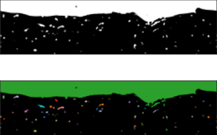

# BlobID-Python

A python library for identifying bubbles/droplets based on volume of fluid (VOF) simulation data.

# Installation

It is suggested to install the library with [Numba](https://numba.pydata.org/) enabled:
```
pip install blobid[numba]
```

# Documentation

For the latest release: [dgaylo.github.io/blobid-python](https://dgaylo.github.io/blobid-python)

# Example

Here we load a 2D slice from a simulation of air bubbles in water near the surface, 
and then use this library to identify and label all the air bubble.
```Python Console
>>> import numpy as np
>>> from blobid import get_labels
>>> vof = 1.0 - np.load("tests/resources/fs_vof.npy")[:, 0, :]
>>> labels = get_labels(vof, periodic=[True, False])
```

Below is a rendering of the `vof` field (air is white, water is black) and the `labels` field calculated using `get_labels()`



The full script, including creating these graphics using [Matplotlib](https://matplotlib.org/), is [doc/example.py](doc/example.py).

