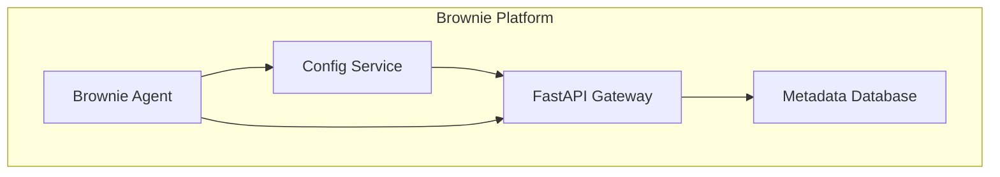
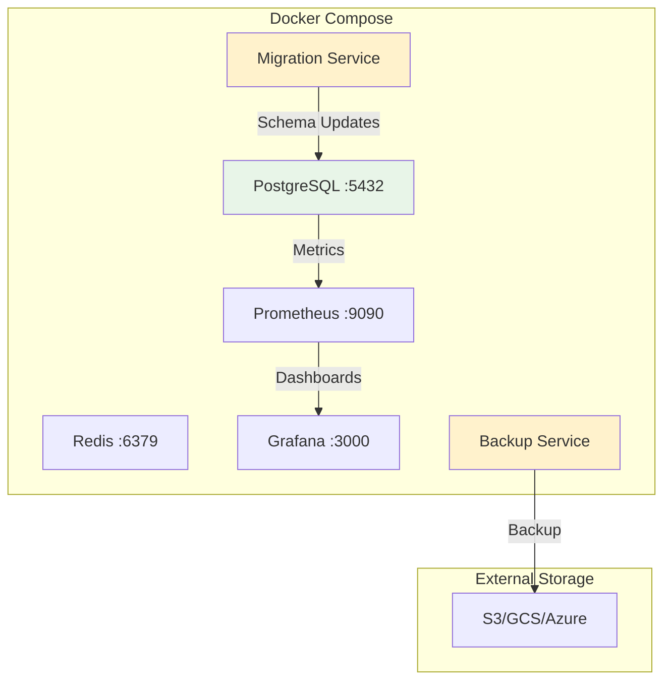
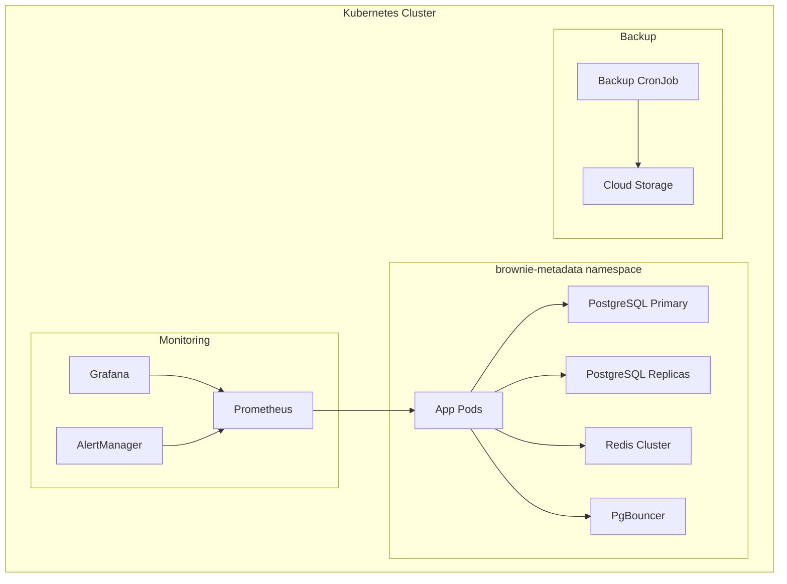

# Brownie Metadata Database

[](https://github.com/longyi-brownie/brownie-metadata-database)
[](LICENSE)
[](https://python.org)
[](https://postgresql.org)

The Brownie Metadata Database is the central metadata store for the [Brownie](https://github.com/longyi-brownie/brownie) incident assistant platform. It provides enterprise-grade data management, access control, and operational capabilities for managing incident data, team configurations, and system metadata.

> **Version 0.1.0** - Complete database infrastructure with enterprise security, monitoring, and high availability features.

## Overview

Brownie is an AI-powered incident assistant that helps teams manage and resolve incidents more effectively. This metadata database serves as the backbone for storing and managing:

- **Team Configurations**: Team structures, roles, and permissions
- **Incident Metadata**: Incident types, priorities, and resolution data
- **Agent Configurations**: AI agent settings and behavior parameters
- **User Management**: User accounts, authentication, and access control
- **System Statistics**: Performance metrics and operational data

### Database Schema

The database includes the following core tables:

- `organizations` - Multi-tenant organization management
- `teams` - Team structures within organizations
- `users` - User accounts and authentication
- `incidents` - Incident tracking and metadata
- `agent_configs` - AI agent configuration settings
- `stats` - System performance and usage statistics

### System Architecture



**Related Repositories:**
- [Brownie Core](https://github.com/longyi-brownie/brownie) - Main Brownie incident assistant
- [Brownie Config Service](https://github.com/longyi-brownie/brownie-config-service) - Configuration management service
- [Brownie Metadata FastApi Server](https://github.com/longyi-brownie/brownie-metadata-api) - This repository

## Quick Start

### Prerequisites

- Docker and Docker Compose
- Git

### 1. Clone and Setup

```bash
git clone https://github.com/longyi-brownie/brownie-metadata-database.git
cd brownie-metadata-database
```

### 2. Generate SSL Certificates

**Required before starting services** - Generate development certificates for SSL/TLS:

```bash
./scripts/setup-dev-certs.sh
```

This creates:
- `dev-certs/ca.crt` - Certificate Authority
- `dev-certs/server.crt` - PostgreSQL server certificate  
- `dev-certs/server.key` - PostgreSQL server private key
- `dev-certs/client.crt` - Client certificate for database connections
- `dev-certs/client.key` - Client private key for database connections

### 3. Start Database & Monitoring Services

```bash
docker compose up -d
```

This will start:
- PostgreSQL with SSL and certificate authentication
- Database migrations
- Redis for caching
- **Enterprise metrics sidecar** - Custom business & technical metrics
- **Prometheus** - Metrics collection and alerting
- **Grafana** - Enterprise dashboards ready for copy-paste

### 4. Verify Everything Works

```bash
# Check all services are running
docker compose ps

# Test database connection with certificates
docker compose exec postgres psql -U brownie-fastapi-server -d brownie_metadata -c "SELECT version();"

# Test Redis connection
docker compose exec redis redis-cli ping

# Test metrics collection
curl http://localhost:9091/metrics

# Access Grafana dashboards
open http://localhost:3000
# Login: admin/admin
```

### 5. Access Services

- **PostgreSQL**: localhost:5432 (certificate auth required)
- **Redis**: localhost:6379
- **Prometheus**: http://localhost:9090
- **Grafana**: http://localhost:3000 (admin/admin)
- **Custom Metrics**: http://localhost:9091/metrics

## 📁 Project Structure

```
brownie-metadata-database/
├── alembic/                    # Database migrations
├── k8s/                        # Kubernetes deployment configs
├── monitoring/                 # Enterprise monitoring stack
│   ├── dashboards/            # Grafana dashboards
│   ├── alerts/                # Prometheus alerting rules
│   ├── provisioning/          # Grafana auto-configuration
│   └── README.md              # Monitoring documentation
├── runbooks/                  # Operational procedures
│   ├── RUNBOOK-*.md          # Specific runbooks
│   └── README.md             # Runbook index
├── scripts/                   # Database setup scripts
│   ├── init-db.sql           # Database initialization
│   ├── setup-dev-certs.sh    # Certificate generation
│   ├── setup-postgres-ssl.sh # SSL configuration
│   ├── pg_hba.conf           # PostgreSQL auth config
│   └── postgresql.conf       # PostgreSQL server config
├── src/                       # Core database code
│   ├── certificates.py       # Server certificate management
│   └── database/             # SQLAlchemy models and connection
├── tests/                     # Test suite
├── metrics_sidecar/          # Custom metrics collection
├── docker-compose.yml        # Complete stack definition
├── Dockerfile                # Database migration container
├── Dockerfile.metrics        # Metrics sidecar container
└── README.md                 # This file
```

### Enterprise Monitoring Features

- ✅ **Custom Metrics Sidecar** - Collects database, Redis, and business metrics
- ✅ **Ready-to-Use Dashboards** - Copy-paste Grafana dashboards for enterprise customers
- ✅ **Alerting Rules** - Pre-configured alerts for database health and business metrics
- ✅ **SSL/TLS Configuration** - PostgreSQL starts with SSL enabled
- ✅ **Certificate Authentication** - Only clients with valid certificates can connect
- ✅ **User Creation** - `brownie-fastapi-server` user created automatically
- ✅ **Database Migrations** - Schema applied automatically

**📊 [Complete Monitoring Documentation](monitoring/README.md)**  
**📚 [Operational Runbooks](runbooks/README.md)**

**Kubernetes (Production):**
```bash
# 1. Apply PostgreSQL configuration
kubectl apply -f k8s/postgres-config.yaml

# 2. Deploy with automated setup
kubectl apply -k k8s/

# PostgreSQL is automatically configured with:
# - pg_hba.conf for certificate auth
# - User creation and permissions
# - Certificate mounting
```

**Manual Setup (If Needed):**
```sql
-- Create user that matches certificate CN
CREATE USER "brownie-fastapi-server" WITH CERTIFICATE;

-- Grant necessary permissions
GRANT CONNECT ON DATABASE brownie_metadata TO "brownie-fastapi-server";
GRANT USAGE ON SCHEMA public TO "brownie-fastapi-server";
GRANT SELECT, INSERT, UPDATE, DELETE ON ALL TABLES IN SCHEMA public TO "brownie-fastapi-server";
GRANT USAGE, SELECT ON ALL SEQUENCES IN SCHEMA public TO "brownie-fastapi-server";
```

**What's Automated:**
- ✅ **User Creation** - `brownie-fastapi-server` user with certificate auth
- ✅ **Permissions** - All necessary database permissions
- ✅ **pg_hba.conf** - Certificate authentication configuration
- ✅ **Certificate Mounting** - Server certificates in containers
- ✅ **Future Tables** - Permissions for Alembic migrations

**Docker Compose (Development) - Detailed:**

1. **Clone and start the services:**
```bash
   git clone https://github.com/longyi-brownie/brownie-metadata-database
   cd brownie-metadata-database
   docker compose up -d
```

2. **Verify the services are running:**
```bash
   docker compose ps
```

3. **Check the application:**
```bash
   curl http://localhost:8000/health
   ```

**Docker Infrastructure:**


**Available Components:**
- ✅ **PostgreSQL** - Primary database
- ✅ **Redis** - Caching and sessions
- ✅ **Prometheus** - Metrics collection
- ✅ **Grafana** - Metrics visualization
- ✅ **Backup Service** - Automated database backups
- ✅ **Migration Service** - Database schema updates

**Future Components:**
- 🔄 **Read Replicas** - For read scaling (planned)
- 🔄 **Custom Metrics Scraper** - PostgreSQL-specific metrics (planned)

**Kubernetes (Production) - Detailed:**

1. **Deploy to Kubernetes:**
```bash
   kubectl apply -k k8s/
```

2. **Check deployment status:**
```bash
   kubectl get pods -n brownie-metadata
   ```

3. **Access the application:**
```bash
   kubectl port-forward -n brownie-metadata svc/brownie-metadata-app 8000:8000
   curl http://localhost:8000/health
   ```

**Kubernetes Architecture:**


**Helm Charts (Advanced):**

For production deployments with custom configurations:

```bash
# Install with Helm
helm install brownie-metadata-db ./k8s/helm \
  --namespace brownie-metadata \
  --create-namespace \
  --set database.replicas=3 \
  --set app.replicas=5

# Scale the deployment
helm upgrade brownie-metadata-db ./k8s/helm \
  --set app.replicas=10 \
  --set database.patroni.replicas=5
```

## Configuration

### Environment Variables

**Database Configuration:**
```bash
DB_HOST=postgres
DB_PORT=5432
DB_NAME=brownie_metadata
DB_USER=brownie
DB_SSL_MODE=verify-full
# Certificates automatically read from /certs directory
```


**Certificate Management:**
```bash
# For development (local certificates)
LOCAL_CERT_DIR=dev-certs

# For production (Vault integration)
VAULT_ENABLED=true
VAULT_URL=https://vault.company.com
VAULT_TOKEN=your-vault-token
VAULT_CERT_PATH=secret/brownie-metadata/certs
```

**Backup Configuration:**
```bash
BACKUP_PROVIDER=s3
BACKUP_DESTINATION=my-backup-bucket/database
BACKUP_SCHEDULE=0 2 * * *
BACKUP_RETENTION_DAYS=30
```

**Monitoring Configuration:**
```bash
METRICS_ENABLED=true
METRICS_PORT=8001
LOG_LEVEL=INFO
```

### Kubernetes Configuration

**ConfigMap:**
```yaml
apiVersion: v1
kind: ConfigMap
metadata:
  name: brownie-metadata-config
data:
  # Database configuration
  DB_HOST: "postgres"
  DB_PORT: "5432"
  DB_NAME: "brownie_metadata"
  DB_USER: "brownie"
  DB_SSL_MODE: "verify-full"
  
  # Application configuration
  LOG_LEVEL: "INFO"
  METRICS_ENABLED: "true"
```

**Secrets:**
```yaml
apiVersion: v1
kind: Secret
metadata:
  name: brownie-metadata-secrets
type: Opaque
data:
  # These are placeholders - certificates loaded from Vault or local files
  database-client-cert: "PLACEHOLDER_DO_NOT_USE"
  database-client-key: "PLACEHOLDER_DO_NOT_USE"
  database-ca-cert: "PLACEHOLDER_DO_NOT_USE"
```

**Proper Secret Management:**
```bash
# Option 1: Create from local files (development)
kubectl create secret generic brownie-metadata-secrets \
  --from-file=database-server-cert=dev-certs/server.crt \
  --from-file=database-server-key=dev-certs/server.key \
  --from-file=database-ca-cert=dev-certs/ca.crt

# Option 2: Use Vault (production)
# Certificates automatically loaded from Vault via CertificateManager
```

## Database Connection

### Connect via psql

**Docker Compose:**
```bash
docker exec -it brownie-metadata-postgres psql -U brownie -d brownie_metadata
```

**Kubernetes:**
```bash
kubectl exec -it -n brownie-metadata <postgres-pod> -- psql -U brownie -d brownie_metadata
```

### Test Database Connection

```sql
-- Check database version
SELECT version();

-- List all tables
\dt

-- Check table schemas
\d organizations
\d teams
\d users
\d incidents

-- Sample queries
SELECT COUNT(*) FROM organizations;
SELECT COUNT(*) FROM teams;
SELECT COUNT(*) FROM users;
SELECT COUNT(*) FROM incidents;
```

### API Access

**Health Check:**
```bash
curl http://localhost:8000/health
```

**API Documentation:**
```bash
# OpenAPI/Swagger UI
open http://localhost:8000/docs

# ReDoc documentation
open http://localhost:8000/redoc
```

## Access Control

### Database Authentication

**Client Certificate Authentication:**
- **No passwords** - Uses client certificates for authentication
- **Certificate CN**: `brownie-fastapi-server` (matches certificate Common Name)
- **mTLS Support**: Mutual TLS verification in production
- **Encrypted Connections**: All database traffic encrypted in transit

**Certificate Management:**
- **Development**: Local certificate files (gitignored)
- **Production**: Vault PKI automatic certificate generation
- **Rotation**: Automatic certificate rotation via Vault

### FastAPI Server Authentication

**User Authentication (Handled by FastAPI Server):**
- **JWT/OAuth**: User authentication and authorization
- **RBAC**: Role-based access control
- **Organization Scoping**: Multi-tenant data isolation
- **API Keys**: Service-to-service authentication

**Database Access:**
- **SQLAlchemy ORM**: Type-safe database queries
- **Connection Pooling**: Efficient database connections
- **Certificate-based**: All database access uses client certificates

### Enterprise Features

For enterprise-grade access control including SSO, LDAP integration, advanced RBAC, and compliance features, please contact us at **info@brownie-ai.com** for licensing information.

## Production Deployment

### Metrics and Dashboards

The system includes comprehensive monitoring with Grafana dashboards and Prometheus metrics:

**Access Dashboards:**
```bash
# Grafana (admin/admin)
open http://localhost:3000

# Prometheus metrics
open http://localhost:9090
```

**Key Metrics:**
- Request rate and response times
- Database performance and connections
- User activity and organization metrics
- Incident volume and resolution times
- System resource utilization

**Screenshots**: 


*Business metrics dashboard showing organizations, teams, users, and incident trends*


*Database overview dashboard with connection stats, table sizes, and Redis metrics*

### Alerting

Enterprise-grade alerting with multiple notification channels:

**Alert Categories:**
- **Critical**: Service down, high error rates, SLA breaches
- **Warning**: Performance degradation, resource issues
- **Info**: User growth, unusual patterns

**Notification Channels:**
- PagerDuty integration
- Slack notifications
- Email alerts
- Microsoft Teams

### Backup and Disaster Recovery

Automated backup system with cloud storage support:

**Supported Providers:**
- AWS S3
- Google Cloud Storage
- Azure Blob Storage
- Local filesystem

**Backup Configuration:**
```bash
# Set backup parameters
export BACKUP_PROVIDER="s3"
export BACKUP_DESTINATION="my-backup-bucket/database"
export BACKUP_SCHEDULE="0 2 * * *"  # Daily at 2 AM
export BACKUP_RETENTION_DAYS="30"
export BACKUP_ACCESS_KEY="your-access-key"
export BACKUP_SECRET_KEY="your-secret-key"
```

**Backup Operations:**
```bash
# Create backup
curl -X POST http://localhost:8000/backup/create

# List backups
curl http://localhost:8000/backup/list

# Restore backup
curl -X POST http://localhost:8000/backup/restore \
  -H "Content-Type: application/json" \
  -d '{"backup_name": "backup-2024-01-15"}'
```

**Recovery Time Objectives:**
- Local restore: < 5 minutes
- Cloud restore: < 15 minutes
- Cross-region: < 30 minutes

## Operations

### Database Migrations
See [Database Migration Runbook](docs/RUNBOOK-database-migration.md) for detailed procedures.

**Quick Commands:**
```bash
# Docker Compose
docker compose exec app alembic upgrade head

# Kubernetes
kubectl exec -it -n brownie-metadata <app-pod> -- alembic upgrade head

# Create new migration
alembic revision --autogenerate -m "Add new table"
alembic upgrade head
```

### Scaling Operations
See [Scaling Operations Runbook](docs/RUNBOOK-scaling-operations.md) for comprehensive scaling procedures.

**Quick Commands:**
```bash
# Scale application replicas
kubectl scale deployment brownie-metadata-app --replicas=5 -n brownie-metadata

# Add read replicas
kubectl scale statefulset patroni --replicas=3 -n brownie-metadata

# Deploy PgBouncer
kubectl apply -f k8s/pgbouncer.yaml
```

### Disaster Recovery
See [Disaster Recovery Runbook](docs/RUNBOOK-disaster-recovery.md) for complete recovery procedures.

**Quick Commands:**
```bash
# Restore from backup
kubectl exec -n brownie-metadata deployment/brownie-metadata-app -- python -c "
from src.backup.manager import BackupManager
from src.backup.config import BackupConfig
config = BackupConfig.from_env()
manager = BackupManager(config)
manager.restore_backup('backup_name')
"
```

### Database Sharding for Enterprise

See [Database Sharding Runbook](docs/RUNBOOK-database-sharding.md) for comprehensive sharding strategies and implementation.

**Quick Overview:**
- **Team-Based Sharding**: Route data by `team_id` for team isolation
- **Time-Based Sharding**: Partition by `created_at` for archival
- **Hybrid Sharding**: Combine team and time-based partitioning

**Performance Tuning:**
- Database connection pooling
- Query optimization
- Index management
- Cache configuration


## Support

### Documentation

- **API Documentation**: [http://localhost:8000/docs](http://localhost:8000/docs)
- **Backup Guide**: [BACKUP.md](BACKUP.md)
- **Monitoring Guide**: [MONITORING.md](MONITORING.md)

### Getting Help

- **Issues**: [GitHub Issues](https://github.com/longyi-brownie/brownie-metadata-database/issues)
- **Discussions**: [GitHub Discussions](https://github.com/longyi-brownie/brownie-metadata-database/discussions)
- **Enterprise Support**: [info@brownie-ai.com](mailto:info@brownie-ai.com)

### Contributing

We welcome contributions! Please see our [Contributing Guide](CONTRIBUTING.md) for details.

## License

This project is licensed under the MIT License - see the [LICENSE](LICENSE) file for details.

---

**Brownie Metadata Database** - Enterprise metadata management for incident response