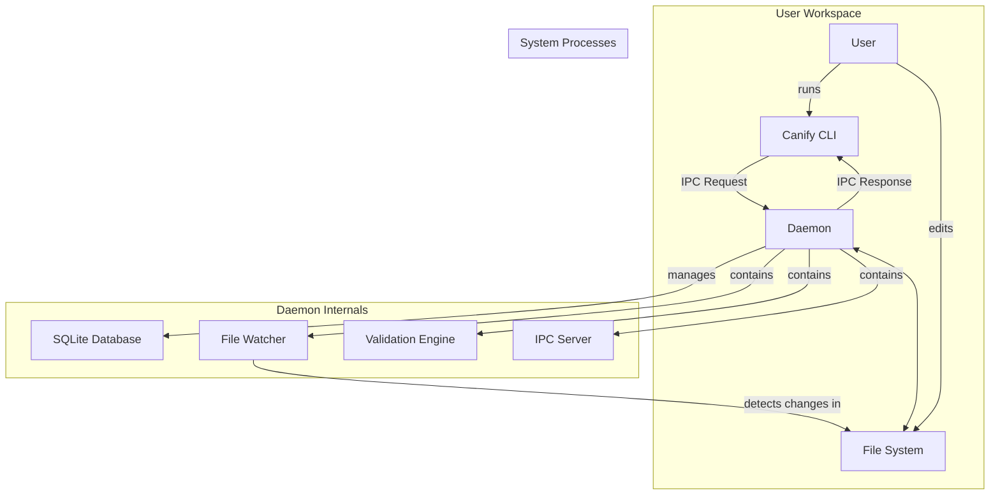

# 系统规约: canify v0.2 架构

## 1. 概述

Canify v0.2 版本的核心是一个响应迅速、持久化的验证服务。其架构围绕一个长期运行的**守护进程 (Daemon)** 和一个轻量级的**命令行客户端 (CLI)** 构建。两者通过进程间通信 (IPC) 协作，为用户提供实时的、增量的“文档即代码”验证体验。

### 1.1 高层架构图

## 2. 核心组件

### 2.1 Canify CLI (`canify`)

- **职责**: 作为用户交互的入口，是一个“瘦客户端”。
  - 使用 `typer` 解析用户输入的命令和参数。
  - 通过 IPC 将验证请求（如 `lint`, `verify`, `validate`）发送给 Daemon。
  - 接收 Daemon 返回的结构化结果，并使用 `rich` 库将其格式化后友好地展示给用户。
- **关键模块**: `src/cli.py`, `src/client/daemon_client.py`

### 2.2 Canify 守护进程 (Daemon)

- **职责**: 系统的核心，一个长期运行的后台服务，负责所有的状态管理和计算密集型任务。
- **生命周期**: 通过 `canify daemon start` 启动。启动时，它会初始化数据库连接，启动文件监视器和 IPC 服务器，然后进入一个事件驱动的循环。通过 `Ctrl+C` 优雅地停止服务。
- **关键模块**: `src/canify/daemon/core.py` (总控制器), `src/commands/daemon.py` (CLI 入口)。

### 2.3 进程间通信 (IPC)

- **技术**: 基于 TCP Sockets 和自定义的 JSON-RPC 2.0 协议。
- **职责**: 作为 CLI 和 Daemon 之间的通信桥梁。CLI 作为客户端，Daemon 作为服务器。
- **机制**: Daemon 启动时会监听一个随机可用端口，并将端口号写入 `~/.canify/daemon.port` 文件。CLI 通过读取此文件来确定连接地址。
- **关键模块**: `src/canify/ipc/` (包含 `server.py`, `client.py`, `protocol.py`)。

### 2.4 存储层 (Storage Layer)

- **技术**: SQLite，通过 `src/canify/storage/database.py` 进行管理。
- **职责**: 持久化存储整个项目的知识图谱（即符号表）。这包括为实体、引用、模式、规约等设计的多个数据表。
- **价值**: 实现了状态的持久化，使得 Daemon 重启后能立即恢复状态。更重要的是，它支持对知识图谱进行快速的增量更新和复杂查询，避免了在每次操作时都需全量扫描和解析项目文件。
- **关键模块**: `src/canify/storage/` (包含 `database.py`, `symbol_table.py`, `spec_storage.py`)。

### 2.5 文件监视器 (File Watcher)

- **技术**: `watchdog` 库。
- **职责**: 作为 Daemon 的一个内部组件，递归地监控项目目录中的文件系统事件（创建、修改、删除）。
- **流程**: 当检测到文件变更时，它会将一个包含事件类型和文件路径的事件放入一个内部队列，交由 Daemon 的主处理循环进行后续处理。
- **关键模块**: `src/canify/daemon/file_watcher.py`。

### 2.6 解析层 (Parsing Layer)

- **职责**: 将不同类型的源文件内容转换为结构化的符号对象。
- **实现**: 针对不同文件类型使用专门的解析器：
  - `EntityDeclarationParser`: 解析 Markdown 中的实体声明。
  - `EntityReferenceParser`: 解析 Markdown 中的实体引用。
  - `EntitySchemaParser`: 使用 AST 解析 Python 代码中的 Pydantic 模式。
  - `SpecParser`: 解析 `spec_*.yaml` 文件中的业务规约。
- **关键模块**: `src/canify/parsers/`。

### 2.7 验证引擎 (Validation Engine)

- **职责**: 统一调度和执行所有语义层面的验证。
- **组件**: 内部包含多个各司其职的验证器：
  - `ReferenceValidator`: 检查引用的存在性。
  - `SchemaValidator`: 验证实体数据是否符合其 Pydantic 模式。
  - `TypeConstraintValidator`: 检查实体引用的类型是否匹配（例如 `owner` 字段必须引用一个 `Team` 类型的实体）。
- **关键模块**: `src/canify/validation/validation_engine.py`。

### 2.8 规约执行器 (Spec Executor)

- **职责**: 负责执行在 `spec` 文件中定义的、最高层次的业务规则。
- **流程**: 动态地加载并执行 `spec` 中指定的 Python `fixture` 函数来准备数据，然后将数据传递给 `test_case` 函数进行最终的断言或逻辑判断。
- **关键模块**: `src/canify/execution/spec_executor.py`。

## 3. 核心流程示例

### 3.1 文件变更处理流程

1. 用户保存一个 `.md` 文件。
2. `File Watcher` 组件捕获到 `modified` 事件。
3. 一个文件变更事件被放入 Daemon 的事件队列。
4. Daemon 的处理线程从队列中取出事件。
5. Daemon 调用 `SymbolTableManager`，删除该文件在数据库中所有旧的符号记录。
6. Daemon 调用相应的解析器（如 `EntityDeclarationParser`）重新解析文件内容，生成新的符号对象。
7. `SymbolTableManager` 将新的符号对象存入数据库。
8. （可选）Daemon 可以自动触发与该文件相关的后台验证。

### 3.2 `canify verify` 命令执行流程

1. 用户在终端执行 `canify verify`。
2. `Canify CLI` 启动，读取 `~/.canify/daemon.port` 文件以获取 Daemon 的服务端口。
3. CLI 通过 IPC 连接到 Daemon，并发送一个 JSON-RPC 请求，方法为 `validate`，参数包含 `command: "verify"`。
4. Daemon 的 `IPC Server` 接收到请求，并交由 `CanifyDaemon` 的核心逻辑处理。
5. `CanifyDaemon` 从数据库中查询并构建一个包含当前项目所有实体、引用和模式的 `View` 对象。
6. 此 `View` 对象被传递给 `ValidationEngine`。
7. `ValidationEngine` 依次运行 `ReferenceValidator` 和 `SchemaValidator` 等，对 `View` 中的内容进行全面检查。
8. 所有验证结果被汇总到一个 `ValidationResult` 对象中。
9. Daemon 将 `ValidationResult` 对象序列化后，作为 RPC 响应发送回 CLI。
10. CLI 接收到响应，解析后将其格式化并打印到终端。
