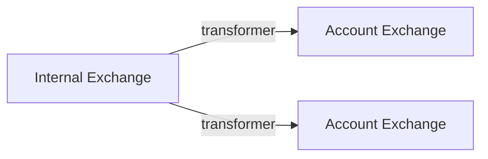

# Extensions

cattle_grid is not meant as one size fits it all Fediverse application,
but something customizable. One of these mechanisms are extensions. These
allow you to

- Affect how messages are parsed through [transformers](#transformers)
- Reacting to messages being received or send [processing](#processing-activities)
- Adjust how content is looked up

## Types of extensions

cattle_grid supports different types of extensions:

- Lookup extensions: Retrieves stuff
- Transform extensions: Takes data and harmonizes the format / adds information
- Processing extensions: When an activity is received or send, the extension does something
- API extensions: Provide something accessible via HTTP

Combining these types of extension is possible.

### Types of subscriptions

Extensions can define new topics, and then perform an action when a message is received. These actions should be either to change the state of the extension, e.g. update its database, or send new messages. These messages should be send to existing topics. Extensions should not send to `incoming.#` (as it is reserved for messages received form the Fediverse), not should they send to `outgoing.#`, instead they should send to `send_message`, which will ensure proper distribution to `outgoing.#`.

However, extensions should subscribe to `outgoing.#` and `incoming.#` to process messages.

## Writing an extension

The basic implementation will be

```python
from cattle_grid.extensions import Extension

extension = Extension("some name", __name__)

...
```

By writing something as a cattle_grid extension, you can first through the lookup and transform method influence cattle_grid's behavior to e.g.

- serve archived activities (e.g. from a migrated account)
- add information to activities, e.g. label them

### Serving content

By adding

```python
@extension.get("/path/{parameter}")
async def serve_content(parameter):
    return {}
```

one can use a cattle_grid extension as one would use a FastAPI router.
By using the dependency injection, one can access various object. (See FIXME)
For example, to access the database, one would use

```python
from cattle_grid.dependencies.fastapi import SqlSession

@extension.get("/path/{parameter}")
async def serve_content(parameter, session: SqlSession):
    await session.scalar(select(MyModel.parameter == parameter))

    return serialize_to_pydantic(MyModel)
```

#### Serving ActivityPub

Serving ActivityPub content isn't as simple as just dropping a JSON somewhere.
First, one needs to ensure that one sets the correct media type, we can do this
with the [ActivityResponese][cattle_grid.tools.fastapi.ActivityResponse]
response class

```python
from cattle_grid.tools.fastapi import ActivityResponse,

@extension.get("/activity_pub", response_class=ActivityResponse)
async def serve_something():
    return activity_pub_object
```

This is nice, but misses the authorization aspects. To do this,
we need two additional helpers. [is_valid_requester_for_obj][cattle_grid.activity_pub.is_valid_requester_for_obj] allows checking
if the requester should have access to the object.
[ActivityPubHeaders][cattle_grid.tools.fastapi.ActivityPubHeaders]
contain the authentication information gathered by cattle_grid.auth.

With these components, we are ready to write the code

```python
from cattle_grid.activity_pub import is_valid_requester_for_obj
from cattle_grid.tools.fastapi import ActivityPubHeaders, ActivityResponse

@extension.get("/activity_pub", response_class=ActivityResponse)
async def serve_something(    
    ap_headers: ActivityPubHeaders,
    session: SqlSession,
):
    if not ap_headers.x_cattle_grid_requester:
        raise HTTPException(401)

    if not await is_valid_requester_for_obj(
        session, ap_headers.x_cattle_grid_requester, activity_pub_object
    ):
        raise HTTPException(401)

    return activity_pub_object
```

For public objects, this ensures that the request has a valid
signature, and is not being blocked by the owner of the object.
For private objects, it is checked that the requester is in
the recipients of the object.

#### Content Negotiation

Fediverse content often exists in two version: human readable HTML and ActivityPub
JSON. It is often useful to be able to distinguish between these two.
cattle_grid offers the [cattle_grid.tools.fastapi.ShouldServe][]
annotation to help with this. The next example shows how to redirect
to the ActivityPub object.

```python
from cattle_grid.tools.fastapi import ShouldServe, ContentType

@extension.get("/html")
async def serve_html(should_serve: ShouldServe):
    if (
        ContentType.html not in should_serve
        and ContentType.activity_pub in should_serve
    ):
        return RedirectResponse(activity_pub_id)

    return "<html>...</html>"
```

#### Testing

One can obtain a [TestClient][fastapi.testclient.TestClient] via

```python
from fastapi.testclient import TestClient

@pytest.fixture
def test_client():
    app = FastAPI()
    app.include_router(extension.api_router)

    return TestClient(app)
```

then proceed to write tests as usual, e.g.
`test_client.get("/url")`.

### Processing activities

By defining a subscriber

```python
@extension.subscribe("method_name")
async def my_subscriber(message: dict):
    ...
```

you can create a subscribtion to the [ActivityExchange](../architecture/exchanges.md#types-of-exchange). The subscribtion should either be
a method name defined by your extension or a subscribtion
on a topic for processing incoming or outgoing messages, i.e.
`incoming.*` or `outgoing.*`.

#### Dependencies

In these methods one can use the dependencies provided by
[cattle_grid.dependencies][] and [cattle_grid.dependencies.processing][].
For example to modify the database use

```python
from cattle_grid.dependencies import CommittingSession

@extension.subsribe("method_name")
async def my_committing_subscriber(message: dict, session: CommittingSession):
    session.add(SqlAlchemyObject(message=message))
```

The session will be committed automatically. Similarly you can use

```python
from cattle_grid.dependencies import ActivityExchangePublisher
from cattle_grid.dependencies.processing import FactoriesForActor
from cattle_grid.model import ActivityMessage

@extension.subsribe("method_name")
async def my_committing_subscriber(
    message: dict, 
    publisher: ActivityExchangePublisher, 
    factories: FactoriesForActor
):
    await publisher(
        ActivityMessage(
            actor=message.get("actor"),
            data=factories[0].like("http://server.example/object/id").build()
        ),
        routing_key="send_message",
    )
```

to publish a like activity. We note that the convention for the factories is

```python
activity_factory, object_factory = factories
```

#### Method Information

Subscribers to a method are automatically added to
method information. The description is either the docstring
or can be specified by adding a description argument, i.e.

```python
@extension.subscribe("method_name", description="my description")
async def my_subscriber(msg: dict):
    ...

# or

@extension.subscribe("method_name")
async def my_subscriber(msg: dict):
    """My description"""
    ...
```

The description passed as an argument takes precedence.

#### Testing

One can unit test a subscriber by just importing and calling it,
e.g.

```python
from . import my_subscriber

async def test_my_subscriber():
    await my_subscriber({"some": "data"})
```

If you wish to test using the [TestRabbitBroker][faststream.rabbit.TestRabbitBroker] following the
[faststream guide](https://faststream.ag2.ai/latest/faststream/#testing-the-service), then one can use [with_test_broker_for_extension][cattle_grid.extensions.testing.with_test_broker_for_extension].
For this one can define the broker as a fixture

```python
@pytest.fixture
async def send_message_mock():
    yield AsyncMock()

@pytest.fixture
async def test_broker(send_message_mock):
    extension.configure({"var": "value"})

    async with with_test_broker_for_extension(
        [extension], {"send_message": send_message_mock}
    ) as tbr:
        yield tbr
```

and then write a test as

```python
async def test_message_send(test_broker, send_message_mock):
    await broker.publish(
        {"my": "message"}, 
        routing_key="my_routing_key", 
        exchange=exchange
    )

    send_message_mock.assert_awaited_once()
```

#### Handling actor deletions

It might be that you want to run some clean up, when an actor deleted by cattle_grid
is being deleted. This can be done with the following code snippet.

```python
from cattle_grid.activity_pub.activity import actor_deletes_themselves

@extension.subscribe("outgoing.Delete")
async def outgoing_delete(message: ActivityMessage):
    if not actor_deletes_themselves(message.data.get("raw")):
        return

    # handle delete here
```

### Transformers

Transformers are applied when shovelling activities from the internal
to the activity and account exchanges.



That means all activities on the `incoming.*` or `outgoing.*` routing
keys are affected by the transformer. Similarly all activities for the
`receive.NAME.incoming` and `receive.NAME.outgoing` in the [Cattle Drive Protocol](../cattle_drive.md).

#### How transformers work

Transformer functions take the form

```python
@extension.transform(inputs=["one", "two"], outputs=["three"])
async def transform(data: dict[str, dict]) -> dict[str, dict]:
    ...
```

where the `inputs` specify the keys that are assumed to exist
on `data`, e.g.

```python
data = {
    "one": { ... },
    "two": { ... }
}
```

and `outputs` specifies the keys that will be added

```python
await transform(data) = {
    "three": { ... }
}
```

#### Doing nothing

The case of the transformer not doing anything can be handled as follows.

```python
@extension.transform(inputs=["one", "two"], outputs=["three"])
async def transform(data: dict[str, dict]) -> dict[str, dict]:
    if transformer_does_nothing(data):
        return {"three": {}}
    
    ...
```

#### Testing transformers

To test a transformer, I recommend creating a pytest fixture that
builds a transformer, e.g.

```python
import pytest
from cattle_grid.extensions.load import build_transformer

from . import extension

@pytest.fixture
def transformer():
    return build_transformer([extension])
```

The reason for doing so is that it takes care of injecting possible
dependencies of your transformer. Furthermore, if your transformer
depends on other extensions, you can include them in the list of
extensions. A test can then look like

```python
async def test_transformer(transformer):
    result = await transformer({"raw": some_data})
    assert result == expected
```

### Database access

cattle_grid uses [SQLAlchemy](https://www.sqlalchemy.org/). In this section,
we discuss how you can use this from your extension.


#### Definition models

We define ORM models as follows. Subsequent database objects
inherit from Base

```python title="models.py"
from sqlalchemy.ext.asyncio import AsyncAttrs
from sqlalchemy.orm import DeclarativeBase, Mapped, mapped_column

class Base(AsyncAttrs, DeclarativeBase): ...

class MyModel(Base):
    key: Mapped[str] = maped_column
```

#### Creating the database objects

If you wish to create the database objects on startup,
you can use [lifespan_for_sql_alchemy_base_class][cattle_grid.extensions.util.lifespan_for_sql_alchemy_base_class] to achieve this like

```python
from cattle_grid.extensions.util import lifespan_for_sql_alchemy_base_class

from .models import Base

extension = Extension(
    name="database example",
    module=__name__,
    lifespan=lifespan_for_sql_alchemy_base_class(Base))
```

#### Accessing the SQL session

cattle_grid uses [FastDepends](https://lancetnik.github.io/FastDepends/) to
inject dependencies,  or the FastAPI equivalent. This means you
can access a [AsyncSession][sqlalchemy.ext.asyncio.AsyncSession] by including

* [cattle_grid.dependencies.SqlSession][]
* [cattle_grid.dependencies.CommittingSession][]

from the processing code, and 

* [cattle_grid.dependencies.fastapi.SqlSession][]
* [cattle_grid.dependencies.fastapi.CommittingSession][]

from the API code.

#### Testing

In order to test with pytest, one can now use

```python
from cattle_grid.testing.fixtures import *  # noqa
from cattle_grid.extensions.util import lifespan_for_sql_alchemy_base_class

from .models import Base


@pytest.fixture(autouse=True)
async def create_tables(sql_engine_for_tests):
    lifespan = lifespan_for_sql_alchemy_base_class(Base)
    async with lifespan(sql_engine_for_tests):
        yield
```

Then the fixture `sql_engine_for_tests` creates an sql_engine. And the
`create_tables` fixtures creates the tables. The wildcard import is necessary
to import the dependent fixtures.

### Running extensions

In order to test extensions, one might want to run these using a separate
process. This can be achieved by running

```bash
python -m cattle_grid.extensions run your.extension.module
```

See [here](./cli.md#python-m-cattle_gridextensions-run) for further details on
this command.

!!! tip
    To run in your host environment change the port with `--port 8000`.

!!! warning
    This only works for processing and API extensions. Transformation
    and lookup extensions are called by cattle_grid directly.

We note here that the configuration will be loaded through
the same mechanism as cattle_grid does. This is in particular
relevant for accessing the database and the RabbitMQ router.

## Configuring extensions

Extensions are configured in `cattle_grid.toml` by adding an entry of the form

```toml
[[extensions]]

module_name = "your.extension"
config = { var = 1}

lookup_order = 2
```

The factory method in the python module `your.extension` will be called with the contents `config` as an argument.

