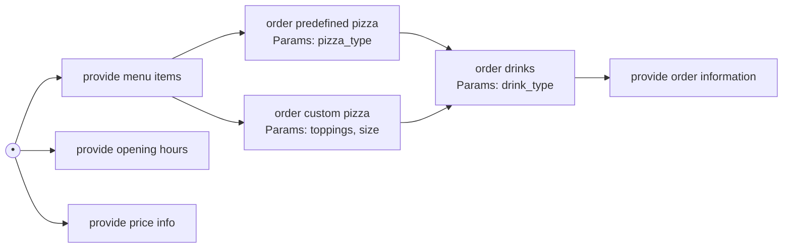
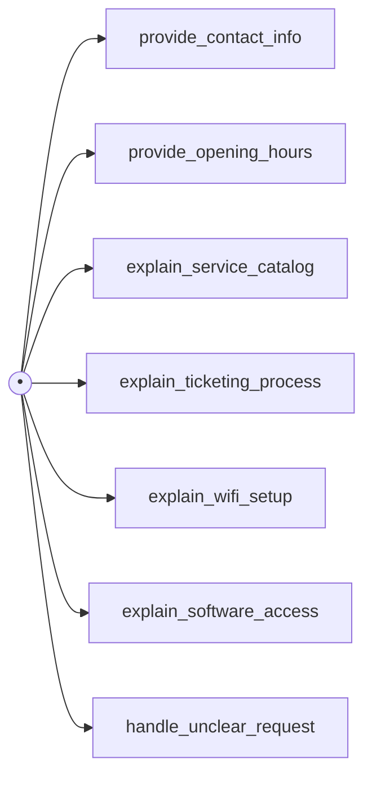

# TRACER

[](https://github.com/Chatbot-TRACER/TRACER/actions/workflows/ci.yml)
[](https://github.com/Chatbot-TRACER/TRACER/blob/main/LICENSE)
[](https://pypi.org/project/chatbot-tracer/)

> Task Recognition and Chatbot ExploreR

A tool for automatically exploring and analyzing chatbots, generating a model of the functionalities and user profiles for testing.

## Installation

The easiest way to install TRACER is from PyPI:

```bash
pip install chatbot-tracer
```

You must also have [Graphviz](https://graphviz.gitlab.io/download/) installed on your system for TRACER to work properly.

This will install the latest released version and all required Python dependencies.

---

If you want to contribute or develop TRACER, see the section below.

## 1. Overview & Goals

TRACER is a tool designed to automatically interact with and analyze target chatbots. It uses Large Language Models (LLMs) to conduct multiple conversational sessions, identify the chatbot's core functionalities, limitations, and interaction flows, and generate structured outputs for testing and analysis.

The main goals of TRACER are:

- **Workflow Modeling:** Model the user's journey through the chatbot as a directed graph, capturing sequential dependencies, branching logic, and optional steps, adapt the modeling approach based on whether the chatbot is primarily transactional or informational.
- **Profile Generation:** Generate standardized YAML user profiles based on discovered functionalities and workflows, suitable for [Sensei](https://github.com/satori-chatbots/user-simulator).

## 2. Core Functionality

The system follows a multi-phase approach implemented via a LangGraph structure:

1. **Chatbot Interaction:** Connect to and converse with target chatbots (initially Taskyto, Ada-UAM) via provided connectors.
2. **Session Preparation:** Before starting the conversations the chatbot's language and fallback message are found by sending a few confusing messages.
3. **Exploration Sessions:**
   1. Conduct multiple conversational sessions to probe different aspects of the chatbot.
   2. If a fallback is received during the conversation, the LLM will rephrase the sentence and if it is received again, the topic will be changed.
   3. After each conversation the LLM tries to extract functionalities so that they can be further explored on the next sessions.
4. **Bot Classification:** After running all the sessions, the conversations and the found functionalities are passed to an LLM which will determine if the chatbot is transactional or informative.
   - **Transactional:** chatbots that allow you to perform actions, such as booking a flight or ordering food.
   - **Informational:** chatbots that provide information, such as answering questions or providing customer support.
   - The detected chatbot type is stored in the application state for use in subsequent processing steps.
5. **Functionality Analysis (LLM-based):** Depending on the chatbot's type a different prompt will be used, but in this section the LLM will receive conversations and functionalities and will try to merge functionalities that are the same, maybe find new ones, and find relationships between them. The output will be a structured representation of the discovered functionalities, including parent/child relationships and unique root nodes.
   - **Transactional:** The LLM will look for sequential dependencies, branching logic, and optional steps.
   - **Informational:** The LLM will look for independent topics and create separate root nodes for each topic.
6. **Profile Generation (LLM-based):** After the functionalities have been found and a workflow is created, the LLM will proceed to create the profiles for Sensei taking into account the discovered things. It is in done in different sections where different prompts will be creating the goals, context, parameters and so on.
7. **YAML Validation & Correction:** Validate generated YAML profiles with a script and if any error is found, pass it to the LLM to try to correct it.
8. **Output Generation:**

- Save validated YAML profiles to disk.
- Generate a text report (`report.txt`).
- Generate a visual workflow graph (`workflow_graph.png`) using Graphviz.

## 3. Workflow Graph Generation

One of the main outputs of this tool is a visual graph (`workflow_graph.png`) showing how users interact with the chatbot. Although, the primary focus of this tool is to make the profiles, this was added to help visualize the discovered functionalities and their relationships.

As it has been explained above, the system uses different approaches for transactional and informational chatbots.

**Example Desired Flow (Transactional - Pizza Bot):**

The goal is to capture flows like this: A user starts, sees menu items. This action leads to selecting a predefined pizza or customizing one. The user then orders drinks, and then the chatbot confirms the order.



**Example Desired Flow (Informational - Ada-UAM Bot):**

For an informational bot, the goal is to represent the different topics the user can inquire about independently. There are typically no required sequences between these topics. The structuring logic should default to creating separate root nodes.



> Note: The Mermaid diagrams above are illustrative of the desired logical flow. The actual implementation uses Graphviz.

## 4. Usage

Execution:

```bash
TRACER --help
```

### Arguments

All arguments are optional.

- `-s, --sessions`: Number of exploration sessions (default: 3).
- `-n, --turns`: Maximum turns per session (default: 8).
- `-t, --technology`: Chatbot connector to use (default: `taskyto`). Use `--list-connectors` to see available options.
- `-cp, --connector-params`: Parameters for the chatbot connector. Use `--list-connector-params <connector>` to see required parameters. Format: JSON string or key=value pairs. Examples:
  ```bash
  tracer -t taskyto -cp '{"base_url":"http://localhost", "port":5000}'
  ```
  ```bash
  tracer -t taskyto -cp "base_url=http://localhost, port=5000"
  ```
- `-m, --model`: Model for exploration (default: `gpt-4o-mini`). Supports both OpenAI models (e.g., `gpt-4o`) and Google Gemini models (e.g., `gemini-2.0-flash`). **Recommended**: Use a more powerful model (e.g., `gpt-4o`) for better exploration quality.
- `-pm, --profile-model`: Model for profile generation (default: same as exploration model). Supports both OpenAI models (e.g., `gpt-4o`) and Google Gemini models (e.g., `gemini-2.0-flash`). **Recommended**: Use a cheaper model (e.g., `gpt-4o-mini`) for cost optimization.
- `-o, --output`: Output directory for generated files (default: `output`).
- `-v` or `-vv`: Verbosity level, none will show key information, `-v` will show the conversation and `-vv` will show be debug information.
- `-gfs`, `--graph-font-size`: Font size for the graph.
- `c`, `--compact`: Compact mode for the graph.
- `-td`, `--top-down`: Top-down layout for the graph.
- `--graph-format`: Export format for the graph (choices: pdf, png, svg, all). Default is pdf. Use 'all' to export in all formats.
- `-nf`, `--nested-forward`: All the variables will be nested, creates more exhaustive profiles but also the number of conversations grows exponentially.

**Help Options:**

- `--list-connectors`: List available chatbot connectors.
- `--list-connector-params`: Show required parameters for a specific connector.
- `-h, --help`: Show help message and exit.

### Chatbot Connectors

TRACER uses the [chatbot-connectors](https://github.com/Chatbot-TRACER/chatbot-connectors) library to connect to different chatbot platforms.

To see available connectors:
```bash
TRACER --list-connectors
```

To see required parameters for a specific connector:
```bash
TRACER --list-connector-params <connector-name>
```

### Environment Variables

- For OpenAI models: Set the `OPENAI_API_KEY` environment variable with your API key.
- For Gemini models: Set the `GOOGLE_API_KEY` environment variable with your API key from Google.

## 5. Input/Output

- **Input:**
  - Command-line arguments (see Usage).
  - Target chatbot accessible via its connector/URL.
- **Output (in the specified `--output` directory, organized by technology):**
  - Multiple `.yaml` files (one per generated user profile).
  - `report.txt` (structured text report summarizing findings).
  - `workflow_graph.png` (visual graph representation of the interaction flow).

### Example Commands

```bash
# List available connectors
TRACER --list-connectors

# Check parameters for a specific connector
TRACER --list-connector-params taskyto

# Basic usage with Taskyto connector
TRACER -t taskyto --connector-params "base_url=http://localhost"

# Using JSON format for connector parameters
TRACER -t taskyto --connector-params '{"base_url": "http://localhost", "port": 5000}'

# Using custom YAML connector
TRACER -t custom --connector-params "config_path=./my-chatbot-config.yml"

# Full example with all options
TRACER -t taskyto --connector-params "base_url=http://localhost" -n 8 -s 12 -m gpt-4o -pm gpt-4o-mini -o generated_profiles/taskyto

# Using different models for exploration and profile generation
TRACER -t millionbot --connector-params "bot_id=your-bot-id" -m gpt-4o -pm gpt-4o-mini

# Mix different model providers
TRACER -t custom --connector-params "config_path=./config.yml" -m gpt-4o -pm gemini-2.0-flash
```

## Development & Contributing

If you want to contribute to TRACER or work on its development, follow these steps:

1. Ensure Python 3.11+ and Graphviz are installed.
2. Clone the repository:

    ```bash
    git clone https://github.com/Chatbot-TRACER/TRACER.git
    cd TRACER
    ```

3. Install dependencies (choose one):

    ```bash
    pip install -r requirements.txt
    # or, using uv (recommended for speed)
    uv sync
    ```

4. (Optional, for CLI development) Install in editable mode to use the `tracer` command:

    ```bash
    pip install -e .
    ```

5. Make sure to have the required environment variables set for OpenAI or Google Gemini models.

    ```bash
    export OPENAI_API_KEY=your_openai_api_key
    export GOOGLE_API_KEY=your_google_api_key
    ```

To run TRACER in development mode:

- As a module (recommended for development):

    ```bash
    python -m tracer.main --help
    ```

- Or, if installed in editable mode, use the CLI:

    ```bash
    tracer --help
    ```
