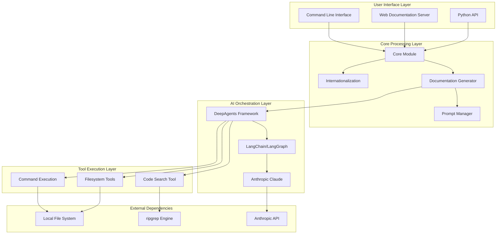
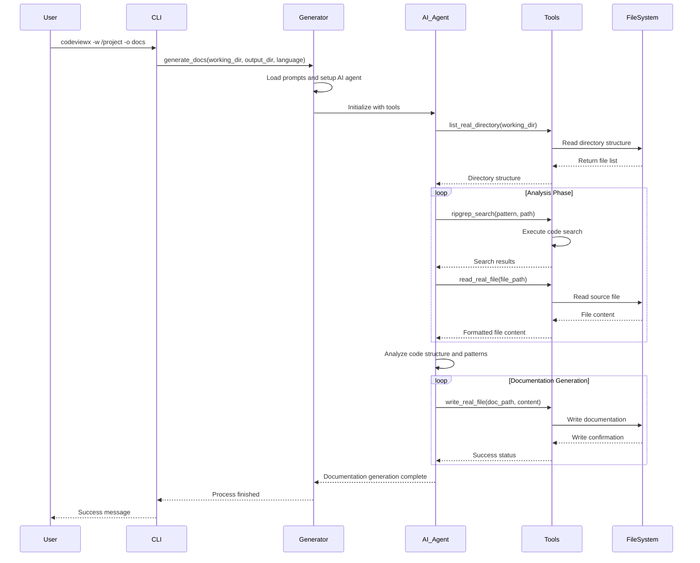
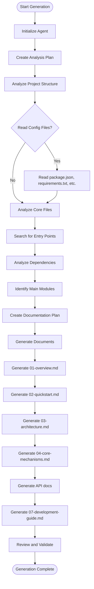
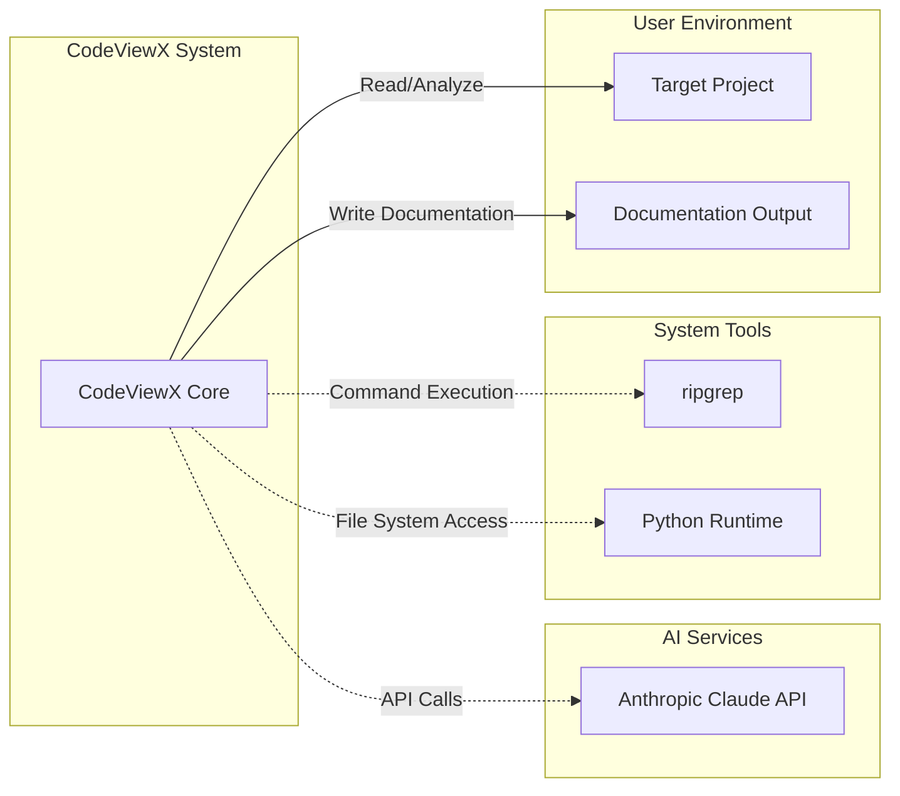

# System Architecture

## Architecture Overview

CodeViewX employs a sophisticated, multi-layered architecture designed around AI agent orchestration and modular tool integration. The system is built on the principle of **AI-first design**, where artificial intelligence agents coordinate various tools to perform complex code analysis and documentation generation tasks.

The architecture can be understood as a pipeline of specialized components working in concert: from the user interface layer down through the AI orchestration core, to the tool execution layer, and finally to the file system interface.

### High-Level Architecture Diagram



## Core Architectural Components

### 1. User Interface Layer

The UI layer provides multiple interaction patterns to accommodate different use cases and user preferences:

#### Command Line Interface (`cli.py`)
**Purpose**: Primary interaction method for most users
**Key Features**:
- Argument parsing and validation
- Progress monitoring and verbose output
- Error handling and user feedback
- Integration with shell environments

**Key Functions**:
```python
def main():  # Entry point for CLI
    # Argument parsing, setup, and execution coordination
```

Reference: [cli.py](../codeviewx/cli.py#L16)

#### Web Documentation Server (`server.py`)
**Purpose**: Interactive documentation browsing and presentation
**Key Features**:
- Flask-based web server
- Markdown rendering with Mermaid diagram support
- File tree navigation
- Responsive design

**Key Functions**:
```python
def start_document_web_server(output_directory):
    # Initialize and run Flask server for documentation browsing
```

Reference: [server.py](../codeviewx/server.py#L140)

#### Python API (`core.py`)
**Purpose**: Programmatic integration for advanced use cases
**Key Features**:
- Clean, function-based API
- Configuration flexibility
- Integration with Python workflows

**Key Functions**:
```python
def generate_docs(working_directory, output_directory, doc_language, ...):
    # Main API for documentation generation
```

Reference: [core.py](../codeviewx/core.py#L12)

### 2. Core Processing Layer

This layer contains the main business logic and coordination components:

#### Documentation Generator (`generator.py`)
**Purpose**: Central orchestration of the documentation generation process
**Key Responsibilities**:
- AI agent initialization and configuration
- Tool registration and management
- Progress tracking and user feedback
- Error handling and recovery

**Architecture Pattern**: Orchestrator Pattern
```python
def generate_docs(working_directory, output_directory, doc_language, ...):
    # 1. Setup and configuration
    # 2. Load prompts and initialize AI agents
    # 3. Register tools
    # 4. Execute analysis workflow
    # 5. Handle results and errors
```

Reference: [generator.py](../codeviewx/generator.py#L25)

#### Prompt Manager (`prompt.py`)
**Purpose**: Template management for AI interactions
**Key Features**:
- Multi-language prompt templates
- Dynamic prompt composition
- Context-aware prompt selection

#### Internationalization (`i18n.py`, `language.py`)
**Purpose**: Multi-language support for both UI and documentation output
**Key Features**:
- Automatic language detection
- Localization of UI messages
- Documentation language specification

### 3. AI Orchestration Layer

This is the core intelligence layer that makes CodeViewX unique:

#### DeepAgents Framework Integration
**Purpose**: High-level AI agent orchestration
**Key Capabilities**:
- Multi-step reasoning and planning
- Tool usage coordination
- Error recovery and alternative strategies

#### LangChain/LangGraph Workflow
**Purpose**: Structured AI workflow execution
**Key Features**:
- State management across analysis steps
- Tool integration and parameter passing
- Streaming responses and progress monitoring

#### Anthropic Claude Integration
**Purpose**: Advanced code analysis and natural language generation
**Key Capabilities**:
- Deep code understanding
- Technical documentation generation
- Multi-language content creation

### 4. Tool Execution Layer

Modular tool system providing specialized capabilities:

#### Code Search Tool (`tools/search.py`)
**Purpose**: High-performance code pattern matching
**Architecture**: Wrapper around ripgrep engine
```python
def ripgrep_search(pattern, path, file_type, ignore_case, max_count):
    # 1. Initialize ripgrep with pattern and path
    # 2. Configure search parameters
    # 3. Apply ignore patterns for common non-source files
    # 4. Execute search and format results
```

Reference: [search.py](../codeviewx/tools/search.py#L15)

#### Filesystem Tools (`tools/filesystem.py`)
**Purpose**: File system operations for code analysis and document generation
**Components**:
- `write_real_file()`: Document output with directory creation
- `read_real_file()`: Source code reading with metadata
- `list_real_directory()`: Directory structure analysis

**Architecture Pattern**: Facade Pattern - provides simplified interface to complex file operations

Reference: [filesystem.py](../codeviewx/filesystem.py#L12)

#### Command Execution Tool (`tools/command.py`)
**Purpose**: System command execution for build tools, testing, and analysis
**Key Features**:
- Safe command execution
- Output capture and formatting
- Error handling and status reporting

## Data Flow Architecture

### Documentation Generation Workflow



### AI Agent Orchestration Pattern



## Design Patterns Employed

### 1. Orchestrator Pattern
**Location**: `generator.py`
**Purpose**: Coordinate multiple AI agents and tools
**Benefits**: 
- Centralized control of complex workflows
- Error handling and recovery
- Progress monitoring and user feedback

### 2. Strategy Pattern
**Location**: `prompt.py`, `language.py`
**Purpose**: Select appropriate strategies for different languages and project types
**Benefits**:
- Flexible adaptation to different contexts
- Easy addition of new languages or project types
- Clean separation of concerns

### 3. Facade Pattern
**Location**: `tools/` package
**Purpose**: Simplified interface to complex operations
**Benefits**:
- Clean API for AI agents
- Consistent error handling
- Easy testing and maintenance

### 4. Factory Pattern
**Location**: AI agent creation in `generator.py`
**Purpose**: Create appropriately configured agents
**Benefits**:
- Centralized agent configuration
- Easy addition of new agent types
- Consistent setup process

### 5. Observer Pattern
**Location**: Progress tracking in `generator.py`
**Purpose**: Monitor and report progress of long-running operations
**Benefits**:
- Real-time user feedback
- Debugging capabilities
- Performance monitoring

## Integration Architecture

### External System Dependencies



### Tool Integration Architecture

The tool system follows a **plugin architecture** where each tool is self-contained but follows a consistent interface:

```python
# Tool Interface Pattern
def tool_function(param1: str, param2: Optional[str] = None) -> str:
    """
    Standard tool interface:
    - Input: Well-defined parameters
    - Output: Formatted string result
    - Error handling: Descriptive error messages
    """
    try:
        # Tool-specific implementation
        return "Success: Operation completed"
    except Exception as e:
        return f"Error: {str(e)}"
```

Reference: [tools/__init__.py](../codeviewx/tools/__init__.py#L5)

## Configuration and Extensibility

### Configuration Architecture
- **Project Configuration**: `pyproject.toml` for dependencies and metadata
- **Runtime Configuration**: Command-line arguments and environment variables
- **AI Configuration**: Prompt templates and agent parameters

### Extension Points
1. **Custom Tools**: Add new analysis tools by implementing the tool interface
2. **Custom Prompts**: Modify or extend prompt templates for specialized domains
3. **Language Support**: Add new languages through i18n system
4. **Output Formats**: Extend to support different documentation formats

## Performance and Scalability Considerations

### Performance Optimizations
1. **Parallel Processing**: Concurrent tool execution where possible
2. **Caching**: Intelligent caching of analysis results
3. **Incremental Analysis**: Only analyze changed files when possible
4. **Resource Management**: Careful memory and CPU usage management

### Scalability Design
1. **Modular Architecture**: Components can be scaled independently
2. **Stateless Design**: Tools are designed to be stateless for better scaling
3. **Streaming Support**: Large result sets are streamed rather than loaded entirely
4. **Error Recovery**: Robust error handling prevents cascading failures

## Security Architecture

### Security Measures
1. **Input Validation**: All user inputs are validated and sanitized
2. **Safe Command Execution**: Commands are executed in controlled environments
3. **API Key Protection**: Secure handling of API credentials
4. **File System Sandboxing**: Limited file system access to prevent unauthorized operations

### Threat Mitigation
- **Command Injection**: Parameterized command execution
- **Path Traversal**: Path validation and normalization
- **Resource Exhaustion**: Limits on file sizes and execution times
- **Information Disclosure**: Controlled error messages to prevent information leaks

This architecture enables CodeViewX to provide powerful, flexible, and secure code documentation generation while maintaining clean separation of concerns and extensibility for future enhancements.