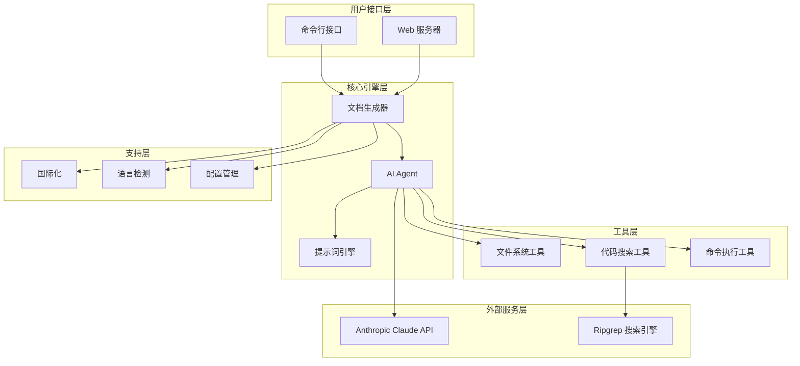
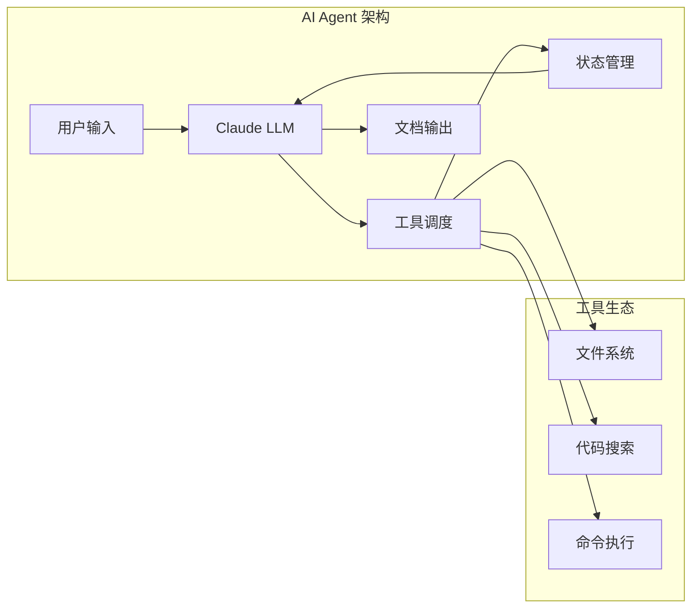
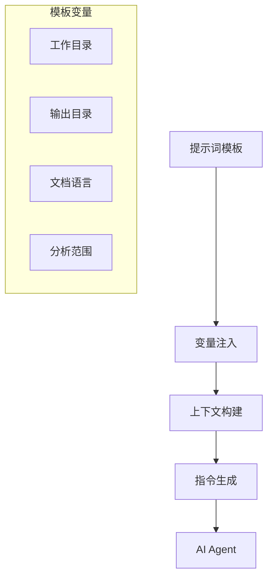
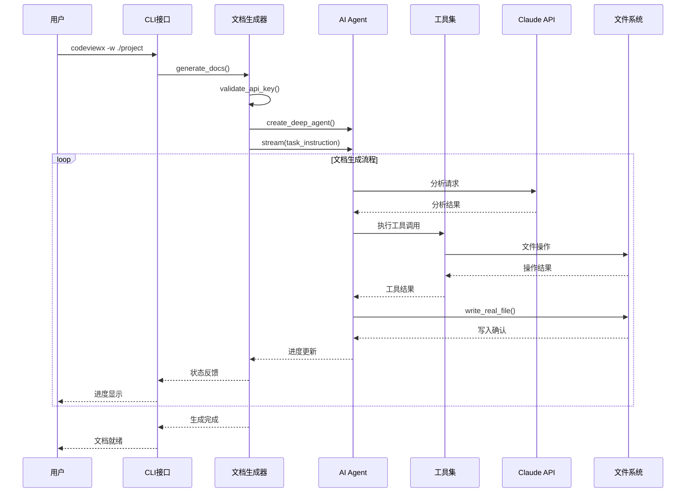
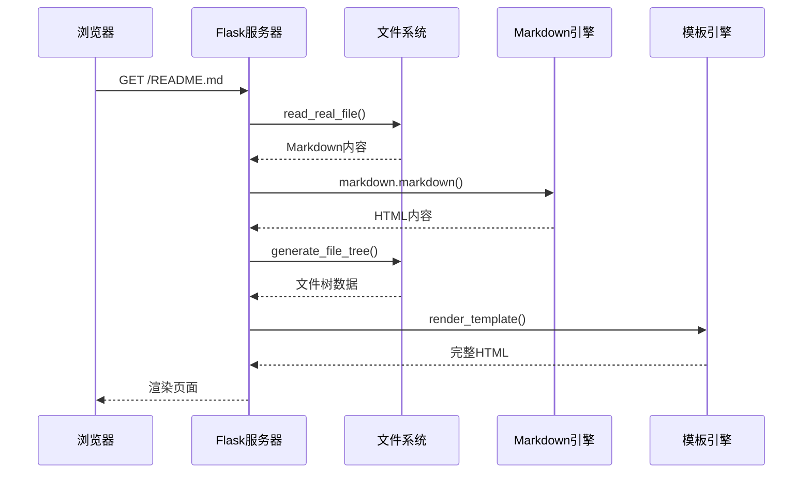

# 系统架构

## 架构概览

CodeViewX 采用分层架构设计，将复杂的文档生成流程分解为多个独立的层次和模块。整个系统基于 AI Agent 模式，结合 LangChain 和 DeepAgents 框架，实现了智能化的代码分析和文档生成。



## 分层架构详解

### 1. 用户接口层 (User Interface Layer)

#### 1.1 命令行接口 (CLI)

**文件**: `cli.py` (166行)

**职责**: 
- 命令行参数解析和验证
- 用户交互和错误处理
- 多语言界面支持

**核心组件**:
```python
def main():
    """命令行入口点"""
    ui_lang = detect_ui_language()
    get_i18n().set_locale(ui_lang)
    
    parser = argparse.ArgumentParser(...)
    # 参数解析逻辑
    
    if args.serve:
        start_document_web_server(args.output_directory)
    else:
        generate_docs(...)
```

**设计特点**:
- 支持多语言界面 (`--ui-lang`)
- 完善的错误处理和用户友好提示
- 灵活的参数配置

#### 1.2 Web 服务器 (Web Server)

**文件**: `server.py` (190行)

**职责**:
- 文档展示和导航
- Markdown 渲染
- 文件树生成

**核心功能**:
```python
@app.route("/")
def home():
    return index("README.md")

@app.route("/<path:filename>")
def index(filename):
    # Markdown 渲染逻辑
    # 文件树生成
    # TOC 处理
    return render_template('doc_detail.html', ...)
```

### 2. 核心引擎层 (Core Engine Layer)

#### 2.1 文档生成器 (Document Generator)

**文件**: `generator.py` (376行)

**职责**:
- AI Agent 创建和管理
- 文档生成流程控制
- 工具调度和状态管理

**核心架构**:
```python
def generate_docs(
    working_directory: Optional[str] = None,
    output_directory: str = "docs",
    doc_language: Optional[str] = None,
    # ... 其他参数
) -> None:
    # 1. 环境配置和验证
    validate_api_key()
    
    # 2. AI Agent 创建
    agent = create_deep_agent(tools, prompt)
    
    # 3. 流式文档生成
    for chunk in agent.stream(...):
        # 进度跟踪和状态更新
        process_chunk(chunk)
```

**设计亮点**:
- **流式处理**: 实时反馈生成进度
- **错误恢复**: 完善的异常处理机制
- **进度可视化**: 任务状态跟踪和展示

#### 2.2 AI Agent 引擎

**技术栈**: DeepAgents + LangChain

**架构设计**:


**核心特性**:
- **工具集成**: 无缝集成文件系统、搜索、命令执行工具
- **状态管理**: 基于 LangGraph 的状态持久化
- **流式输出**: 实时生成和反馈

### 3. 工具层 (Tools Layer)

#### 3.1 文件系统工具

**文件**: `tools/filesystem.py` (120行)

**核心工具**:
```python
@tool
def write_real_file(file_path: str, content: str) -> str:
    """写入文件到真实文件系统"""
    
@tool  
def read_real_file(file_path: str) -> str:
    """从文件系统读取文件内容"""
    
@tool
def list_real_directory(directory: str = ".") -> str:
    """列出目录内容"""
```

**设计特点**:
- **原子操作**: 确保文件操作的原子性
- **错误处理**: 完善的异常处理和错误反馈
- **路径规范化**: 支持相对路径和绝对路径

#### 3.2 代码搜索工具

**文件**: `tools/search.py`

**核心实现**:
```python
@tool
def ripgrep_search(pattern: str, path: str = ".", ...) -> str:
    """基于 ripgrep 的高性能代码搜索"""
    # 使用 ripgrepy 封装 ripgrep 功能
    # 支持正则表达式和文件类型过滤
```

**性能优势**:
- **高速搜索**: 基于 Rust 的 ripgrep 引擎
- **正则支持**: 完整的正则表达式功能
- **文件过滤**: 按文件类型和路径过滤

#### 3.3 命令执行工具

**文件**: `tools/command.py`

**核心功能**:
```python
@tool
def execute_command(command: str, working_dir: str = None) -> str:
    """执行系统命令"""
    # 安全的命令执行
    # 工作目录控制
    # 输出捕获和格式化
```

### 4. 提示词引擎 (Prompt Engine)

#### 4.1 提示词模板系统

**文件**: `prompts/document_engineer_zh.md` (9.9KB)

**架构设计**:


**核心特性**:
- **多语言支持**: 中文和英文提示词模板
- **变量注入**: 动态参数替换
- **结构化指令**: 清晰的工作流程定义

#### 4.2 提示词管理

**文件**: `prompt.py`

```python
def load_prompt(name: str, **kwargs) -> str:
    """加载并处理提示词模板"""
    # 1. 读取模板文件
    # 2. 变量替换
    # 3. 格式验证
    # 4. 返回处理后的提示词
```

### 5. 支持服务层 (Support Services Layer)

#### 5.1 国际化系统

**文件**: `i18n.py` (394行)

**架构设计**:
```python
class I18n:
    def __init__(self, locale: str = 'en'):
        self.locale = locale if locale in MESSAGES else 'en'
    
    def t(self, key: str, **kwargs) -> str:
        """翻译消息并支持变量替换"""
        msg = MESSAGES.get(self.locale, {}).get(key, key)
        return msg.format(**kwargs) if kwargs else msg
```

**支持语言**:
- **英文 (`en`)**: 默认语言
- **中文 (`zh`)**: 完整中文支持
- **自动检测**: 基于系统语言自动选择

#### 5.2 语言检测

**文件**: `language.py`

```python
def detect_system_language() -> str:
    """自动检测系统语言"""
    # 1. 获取系统语言环境
    # 2. 映射到支持的语言
    # 3. 返回最佳匹配
```

## 数据流架构

### 文档生成数据流



### Web 服务数据流



## 核心设计模式

### 1. Agent 模式 (Agent Pattern)

**实现**: 基于 DeepAgents 框架

**特点**:
- **自主性**: Agent 自主决定工具调用顺序
- **感知性**: 能够感知环境和状态变化
- **协作性**: 多个工具协同工作

```python
# Agent 工具集成示例
tools = [
    execute_command,
    ripgrep_search, 
    write_real_file,
    read_real_file,
    list_real_directory,
]

agent = create_deep_agent(tools, prompt)
```

### 2. 工具模式 (Tool Pattern)

**设计**: LangChain Tool 规范

**实现**:
```python
@tool
def read_real_file(file_path: str) -> str:
    """工具装饰器模式实现"""
    # 工具逻辑实现
```

**优势**:
- **标准化**: 统一的工具接口
- **可扩展**: 易于添加新工具
- **类型安全**: 完整的类型提示

### 3. 流式处理模式 (Stream Pattern)

**实现**: 基于 LangGraph 的流式处理

**特点**:
- **实时反馈**: 实时显示处理进度
- **中断恢复**: 支持处理中断和恢复
- **内存优化**: 避免大量数据堆积

```python
for chunk in agent.stream(
    {"messages": [{"role": "user", "content": task}]},
    stream_mode="values",
    config={"recursion_limit": recursion_limit}
):
    process_chunk(chunk)
```

### 4. 模板方法模式 (Template Method Pattern)

**实现**: 提示词模板系统

**结构**:
```python
def load_prompt(name: str, **kwargs) -> str:
    # 1. 模板读取 (固定步骤)
    # 2. 变量替换 (可变步骤)  
    # 3. 格式验证 (固定步骤)
    # 4. 返回结果
```

## 性能优化策略

### 1. 缓存策略

- **文件缓存**: 避免重复读取相同文件
- **搜索缓存**: 缓存 ripgrep 搜索结果
- **API 缓存**: 缓存常见分析模式

### 2. 并发处理

- **工具并行**: 支持多个工具并行执行
- **文件批处理**: 批量处理文件操作
- **搜索优化**: 并行搜索多个模式

### 3. 内存管理

- **流式处理**: 避免大量数据在内存中堆积
- **垃圾回收**: 及时释放不需要的对象
- **分块处理**: 大文件分块读取和处理

## 扩展性设计

### 1. 工具扩展

添加新工具的步骤：
```python
# 1. 创建新工具
@tool
def custom_tool(param: str) -> str:
    """自定义工具实现"""
    pass

# 2. 注册工具
tools.append(custom_tool)

# 3. 更新提示词模板
# 在 prompts/ 目录中更新相关模板
```

### 2. 语言扩展

添加新语言支持：
```python
# 1. 添加翻译
MESSAGES['new_lang'] = {
    'starting': 'New language message',
    # ... 其他翻译
}

# 2. 更新语言检测
def detect_system_language():
    # 添加新语言检测逻辑
    pass
```

### 3. 输出格式扩展

支持新的文档格式：
```python
# 1. 添加格式处理器
class FormatProcessor:
    def process(self, content: str) -> str:
        # 格式转换逻辑
        pass

# 2. 集成到生成器
def generate_docs(format: str = 'markdown'):
    processor = get_processor(format)
    # ... 处理逻辑
```

## 安全性设计

### 1. API 密钥安全

- **环境变量**: 通过环境变量管理密钥
- **密钥验证**: 启动前验证密钥有效性
- **错误处理**: 避免密钥泄露到日志中

### 2. 文件系统安全

- **路径验证**: 防止路径遍历攻击
- **权限检查**: 验证文件访问权限
- **沙箱执行**: 限制命令执行范围

### 3. 网络安全

- **HTTPS**: 强制使用 HTTPS 连接
- **超时控制**: 设置合理的网络超时
- **重试机制**: 实现指数退避重试

## 监控和日志

### 1. 日志系统

```python
# 配置日志级别
logging.basicConfig(
    level=log_level,
    format='%(asctime)s - %(name)s - %(levelname)s - %(message)s'
)

# 分类日志记录
logging.getLogger("httpx").setLevel(logging.WARNING)
logging.getLogger("langchain").setLevel(logging.DEBUG)
```

### 2. 性能监控

- **执行时间**: 记录每个步骤的执行时间
- **内存使用**: 监控内存使用情况
- **API 调用**: 统计 API 调用次数和成本

### 3. 错误追踪

- **异常捕获**: 完整的异常捕获和记录
- **错误分类**: 按错误类型分类处理
- **恢复机制**: 自动错误恢复和重试

---

💡 **架构优势**: CodeViewX 的分层架构设计确保了系统的可扩展性、可维护性和高性能。通过合理的职责分离和模块化设计，每个层次都可以独立演进和优化。