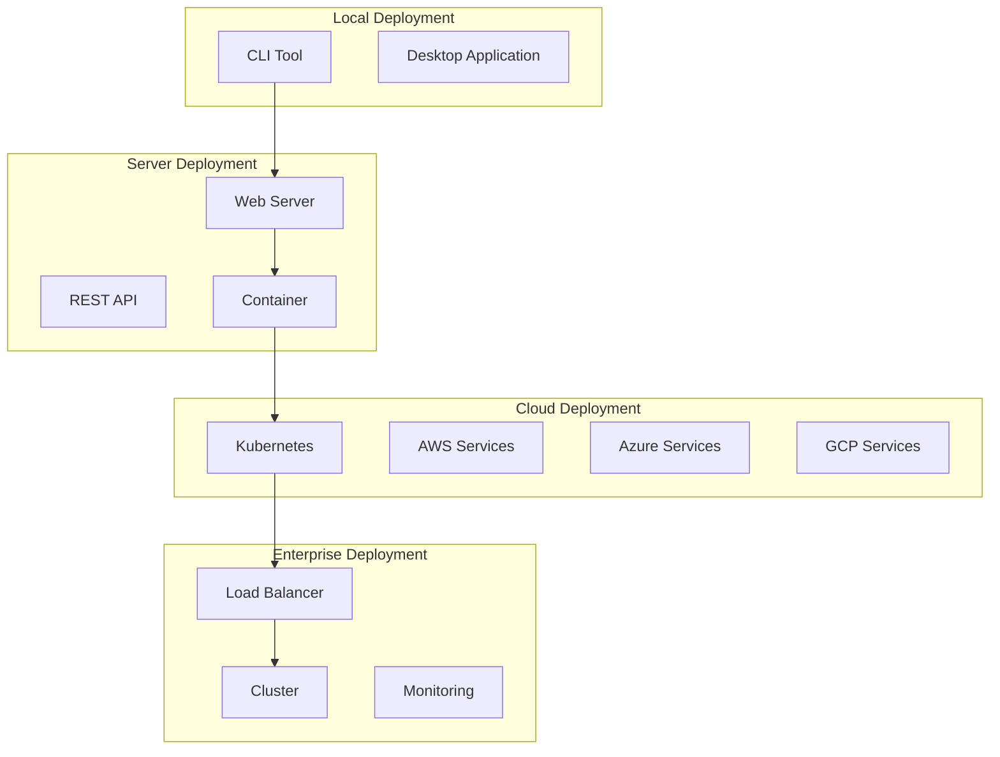

# Deployment Guide

This guide provides comprehensive information for deploying CodeViewX in various environments, from local development setups to enterprise-scale production deployments.

## Deployment Overview

CodeViewX can be deployed in multiple configurations depending on use case, scale, and infrastructure requirements. The system is designed to be flexible and can run as a standalone CLI tool, a web service, or an integrated component in larger workflows.

### Deployment Architectures



## Environment Requirements

### Minimum Requirements

| Component | Minimum | Recommended | Enterprise |
|-----------|---------|-------------|------------|
| **CPU** | 2 cores | 4 cores | 8+ cores |
| **Memory** | 4GB RAM | 8GB RAM | 16GB+ RAM |
| **Storage** | 10GB SSD | 50GB SSD | 100GB+ SSD |
| **Network** | 1 Mbps | 10 Mbps | 100+ Mbps |
| **Python** | 3.8+ | 3.10+ | 3.11+ |

### Software Dependencies

- **Python 3.8+** with pip
- **ripgrep (rg)** for code searching
- **Git** for version control operations
- **Docker** (optional, for containerized deployment)
- **Kubernetes** (optional, for orchestration)

## Local Deployment

### Development Setup

#### 1. Source Installation
```bash
# Clone the repository
git clone https://github.com/dean2021/codeviewx.git
cd codeviewx

# Create virtual environment
python -m venv .venv
source .venv/bin/activate  # On Windows: .venv\Scripts\activate

# Install in development mode
pip install -e ".[dev]"

# Install ripgrep
# macOS
brew install ripgrep

# Ubuntu/Debian
sudo apt install ripgrep

# Windows
choco install ripgrep
```

#### 2. Configuration
```bash
# Set API key
export ANTHROPIC_AUTH_TOKEN="your-api-key-here"

# Add to shell profile for persistence
echo 'export ANTHROPIC_AUTH_TOKEN="your-api-key-here"' >> ~/.bashrc
source ~/.bashrc
```

#### 3. Verification
```bash
# Test installation
codeviewx --version

# Test functionality
codeviewx --working-dir . --output-dir test_docs --verbose

# Test web server
codeviewx --serve --output-dir test_docs
```

### Production Local Setup

#### Systemd Service (Linux)
```ini
# /etc/systemd/system/codeviewx.service
[Unit]
Description=CodeViewX Documentation Service
After=network.target

[Service]
Type=simple
User=codeviewx
Group=codeviewx
WorkingDirectory=/opt/codeviewx
Environment=PATH=/opt/codeviewx/.venv/bin
Environment=ANTHROPIC_AUTH_TOKEN=your-api-key
ExecStart=/opt/codeviewx/.venv/bin/python -m codeviewx.server
Restart=always
RestartSec=10

[Install]
WantedBy=multi-user.target
```

```bash
# Create service user
sudo useradd -r -s /bin/false codeviewx

# Install system-wide
sudo pip install codeviewx

# Enable and start service
sudo systemctl enable codeviewx
sudo systemctl start codeviewx
sudo systemctl status codeviewx
```

#### Docker Compose (Local)
```yaml
# docker-compose.yml
version: '3.8'

services:
  codeviewx:
    build: .
    ports:
      - "5000:5000"
    environment:
      - ANTHROPIC_AUTH_TOKEN=${ANTHROPIC_AUTH_TOKEN}
      - PYTHONUNBUFFERED=1
    volumes:
      - ./data:/app/data
      - ./output:/app/output
    restart: unless-stopped
    healthcheck:
      test: ["CMD", "curl", "-f", "http://localhost:5000"]
      interval: 30s
      timeout: 10s
      retries: 3

  nginx:
    image: nginx:alpine
    ports:
      - "80:80"
      - "443:443"
    volumes:
      - ./nginx.conf:/etc/nginx/nginx.conf
      - ./ssl:/etc/nginx/ssl
    depends_on:
      - codeviewx
    restart: unless-stopped
```

```bash
# Create environment file
echo "ANTHROPIC_AUTH_TOKEN=your-api-key" > .env

# Start services
docker-compose up -d

# Check logs
docker-compose logs -f codeviewx
```

## Container Deployment

### Dockerfile

```dockerfile
# Dockerfile
FROM python:3.11-slim

# Set metadata
LABEL maintainer="CodeViewX Team"
LABEL version="0.2.0"
LABEL description="AI-powered code documentation generator"

# Create non-root user
RUN groupadd -r codeviewx && useradd -r -g codeviewx codeviewx

# Install system dependencies
RUN apt-get update && apt-get install -y \
    ripgrep \
    curl \
    && rm -rf /var/lib/apt/lists/*

# Set working directory
WORKDIR /app

# Copy requirements first for better caching
COPY requirements.txt .
RUN pip install --no-cache-dir -r requirements.txt

# Copy application code
COPY . .

# Install the application
RUN pip install -e .

# Create directories for data and output
RUN mkdir -p /app/data /app/output && \
    chown -R codeviewx:codeviewx /app

# Switch to non-root user
USER codeviewx

# Expose port
EXPOSE 5000

# Health check
HEALTHCHECK --interval=30s --timeout=10s --start-period=5s --retries=3 \
    CMD curl -f http://localhost:5000 || exit 1

# Default command
CMD ["python", "-m", "codeviewx.server", "--host", "0.0.0.0", "--port", "5000"]
```

### Build and Run

```bash
# Build image
docker build -t codeviewx:latest .

# Run container
docker run -d \
  --name codeviewx \
  -p 5000:5000 \
  -e ANTHROPIC_AUTH_TOKEN="your-api-key" \
  -v $(pwd)/data:/app/data \
  -v $(pwd)/output:/app/output \
  codeviewx:latest

# Run with Docker Compose
docker-compose up -d
```

### Multi-stage Dockerfile (Production)

```dockerfile
# Dockerfile.prod
# Build stage
FROM python:3.11-slim as builder

WORKDIR /app

# Install build dependencies
RUN apt-get update && apt-get install -y \
    gcc \
    && rm -rf /var/lib/apt/lists/*

# Copy and install Python dependencies
COPY requirements.txt .
RUN pip install --no-cache-dir -r requirements.txt

# Production stage
FROM python:3.11-slim

# Install runtime dependencies
RUN apt-get update && apt-get install -y \
    ripgrep \
    curl \
    && rm -rf /var/lib/apt/lists/*

# Create user
RUN groupadd -r codeviewx && useradd -r -g codeviewx codeviewx

WORKDIR /app

# Copy Python packages from builder
COPY --from=builder /usr/local/lib/python3.11/site-packages /usr/local/lib/python3.11/site-packages
COPY --from=builder /usr/local/bin /usr/local/bin

# Copy application code
COPY . .

# Install application
RUN pip install -e .

# Create directories
RUN mkdir -p /app/data /app/output && \
    chown -R codeviewx:codeviewx /app

USER codeviewx

EXPOSE 5000

CMD ["python", "-m", "codeviewx.server", "--host", "0.0.0.0", "--port", "5000"]
```

## Cloud Deployment

### Kubernetes Deployment

#### 1. Namespace and ConfigMap
```yaml
# k8s/namespace.yaml
apiVersion: v1
kind: Namespace
metadata:
  name: codeviewx

---
# k8s/configmap.yaml
apiVersion: v1
kind: ConfigMap
metadata:
  name: codeviewx-config
  namespace: codeviewx
data:
  PYTHONUNBUFFERED: "1"
  LOG_LEVEL: "INFO"
  MAX_WORKERS: "16"
  CACHE_TTL: "3600"
```

#### 2. Secret for API Keys
```yaml
# k8s/secret.yaml
apiVersion: v1
kind: Secret
metadata:
  name: codeviewx-secrets
  namespace: codeviewx
type: Opaque
data:
  anthropic-api-key: <base64-encoded-api-key>
```

```bash
# Create secret
kubectl create secret generic codeviewx-secrets \
  --from-literal=anthropic-api-key="your-api-key" \
  --namespace=codeviewx
```

#### 3. Deployment
```yaml
# k8s/deployment.yaml
apiVersion: apps/v1
kind: Deployment
metadata:
  name: codeviewx
  namespace: codeviewx
  labels:
    app: codeviewx
spec:
  replicas: 3
  selector:
    matchLabels:
      app: codeviewx
  template:
    metadata:
      labels:
        app: codeviewx
    spec:
      containers:
      - name: codeviewx
        image: codeviewx:latest
        ports:
        - containerPort: 5000
        env:
        - name: ANTHROPIC_AUTH_TOKEN
          valueFrom:
            secretKeyRef:
              name: codeviewx-secrets
              key: anthropic-api-key
        envFrom:
        - configMapRef:
            name: codeviewx-config
        resources:
          requests:
            memory: "512Mi"
            cpu: "250m"
          limits:
            memory: "1Gi"
            cpu: "500m"
        livenessProbe:
          httpGet:
            path: /
            port: 5000
          initialDelaySeconds: 30
          periodSeconds: 10
        readinessProbe:
          httpGet:
            path: /
            port: 5000
          initialDelaySeconds: 5
          periodSeconds: 5
        volumeMounts:
        - name: output-storage
          mountPath: /app/output
      volumes:
      - name: output-storage
        persistentVolumeClaim:
          claimName: codeviewx-output-pvc
```

#### 4. Service and Ingress
```yaml
# k8s/service.yaml
apiVersion: v1
kind: Service
metadata:
  name: codeviewx-service
  namespace: codeviewx
spec:
  selector:
    app: codeviewx
  ports:
  - protocol: TCP
    port: 80
    targetPort: 5000
  type: ClusterIP

---
# k8s/ingress.yaml
apiVersion: networking.k8s.io/v1
kind: Ingress
metadata:
  name: codeviewx-ingress
  namespace: codeviewx
  annotations:
    kubernetes.io/ingress.class: nginx
    cert-manager.io/cluster-issuer: letsencrypt-prod
spec:
  tls:
  - hosts:
    - codeviewx.example.com
    secretName: codeviewx-tls
  rules:
  - host: codeviewx.example.com
    http:
      paths:
      - path: /
        pathType: Prefix
        backend:
          service:
            name: codeviewx-service
            port:
              number: 80
```

#### 5. Persistent Storage
```yaml
# k8s/pvc.yaml
apiVersion: v1
kind: PersistentVolumeClaim
metadata:
  name: codeviewx-output-pvc
  namespace: codeviewx
spec:
  accessModes:
  - ReadWriteMany
  resources:
    requests:
      storage: 10Gi
  storageClassName: fast-ssd
```

#### 6. Horizontal Pod Autoscaler
```yaml
# k8s/hpa.yaml
apiVersion: autoscaling/v2
kind: HorizontalPodAutoscaler
metadata:
  name: codeviewx-hpa
  namespace: codeviewx
spec:
  scaleTargetRef:
    apiVersion: apps/v1
    kind: Deployment
    name: codeviewx
  minReplicas: 3
  maxReplicas: 10
  metrics:
  - type: Resource
    resource:
      name: cpu
      target:
        type: Utilization
        averageUtilization: 70
  - type: Resource
    resource:
      name: memory
      target:
        type: Utilization
        averageUtilization: 80
```

### Deployment Commands

```bash
# Apply all Kubernetes resources
kubectl apply -f k8s/

# Check deployment status
kubectl get pods -n codeviewx
kubectl get services -n codeviewx
kubectl get ingress -n codeviewx

# View logs
kubectl logs -f deployment/codeviewx -n codeviewx

# Scale deployment
kubectl scale deployment codeviewx --replicas=5 -n codeviewx

# Update deployment
kubectl set image deployment/codeviewx codeviewx=codeviewx:v1.1.0 -n codeviewx
```

## Cloud Provider Deployments

### AWS Deployment

#### 1. ECS (Elastic Container Service)
```json
{
  "family": "codeviewx",
  "networkMode": "awsvpc",
  "requiresCompatibilities": ["FARGATE"],
  "cpu": "512",
  "memory": "1024",
  "executionRoleArn": "arn:aws:iam::account:role/ecsTaskExecutionRole",
  "taskRoleArn": "arn:aws:iam::account:role/ecsTaskRole",
  "containerDefinitions": [
    {
      "name": "codeviewx",
      "image": "your-account.dkr.ecr.region.amazonaws.com/codeviewx:latest",
      "portMappings": [
        {
          "containerPort": 5000,
          "protocol": "tcp"
        }
      ],
      "environment": [
        {
          "name": "PYTHONUNBUFFERED",
          "value": "1"
        }
      ],
      "secrets": [
        {
          "name": "ANTHROPIC_AUTH_TOKEN",
          "valueFrom": "arn:aws:secretsmanager:region:account:secret:codeviewx/api-key"
        }
      ],
      "logConfiguration": {
        "logDriver": "awslogs",
        "options": {
          "awslogs-group": "/ecs/codeviewx",
          "awslogs-region": "us-west-2",
          "awslogs-stream-prefix": "ecs"
        }
      }
    }
  ]
}
```

#### 2. Terraform Configuration
```hcl
# terraform/main.tf
provider "aws" {
  region = var.aws_region
}

# ECR Repository
resource "aws_ecr_repository" "codeviewx" {
  name                 = "codeviewx"
  image_tag_mutability = "MUTABLE"

  image_scanning_configuration {
    scan_on_push = true
  }
}

# ECS Cluster
resource "aws_ecs_cluster" "codeviewx" {
  name = "codeviewx"

  setting {
    name  = "containerInsights"
    value = "enabled"
  }
}

# Application Load Balancer
resource "aws_lb" "codeviewx" {
  name               = "codeviewx-alb"
  internal           = false
  load_balancer_type = "application"
  security_groups    = [aws_security_group.alb.id]
  subnets            = aws_subnet.public[*].id

  enable_deletion_protection = false
}

# ECS Service
resource "aws_ecs_service" "codeviewx" {
  name            = "codeviewx"
  cluster         = aws_ecs_cluster.codeviewx.id
  task_definition = aws_ecs_task_definition.codeviewx.arn
  desired_count   = 2
  launch_type     = "FARGATE"

  network_configuration {
    security_groups  = [aws_security_group.ecs_tasks.id]
    subnets          = aws_subnet.private[*].id
    assign_public_ip = true
  }

  load_balancer {
    target_group_arn = aws_lb_target_group.codeviewx.arn
    container_name   = "codeviewx"
    container_port   = 5000
  }

  depends_on = [aws_lb_listener.codeviewx]
}
```

### Google Cloud Platform Deployment

#### 1. Cloud Run Service
```yaml
# cloudbuild.yaml
steps:
  # Build the container image
  - name: 'gcr.io/cloud-builders/docker'
    args: ['build', '-t', 'gcr.io/$PROJECT_ID/codeviewx', '.']
  
  # Push the container image
  - name: 'gcr.io/cloud-builders/docker'
    args: ['push', 'gcr.io/$PROJECT_ID/codeviewx']
  
  # Deploy to Cloud Run
  - name: 'gcr.io/google.com/cloudsdktool/cloud-sdk'
    entrypoint: gcloud
    args:
    - 'run'
    - 'deploy'
    - 'codeviewx'
    - '--image=gcr.io/$PROJECT_ID/codeviewx'
    - '--region=us-central1'
    - '--platform=managed'
    - '--allow-unauthenticated'
    - '--memory=1Gi'
    - '--cpu=1'
    - '--max-instances=10'
    - '--set-env-vars=PYTHONUNBUFFERED=1'
    - '--set-secrets=ANTHROPIC_AUTH_TOKEN=codeviewx-api-key:latest'

substitutions:
  _SERVICE_NAME: 'codeviewx'
  _DEPLOY_REGION: 'us-central1'

images:
  - 'gcr.io/$PROJECT_ID/codeviewx'
```

#### 2. Kubernetes Engine (GKE)
```yaml
# gke/deployment.yaml
apiVersion: apps/v1
kind: Deployment
metadata:
  name: codeviewx
spec:
  replicas: 3
  selector:
    matchLabels:
      app: codeviewx
  template:
    metadata:
      labels:
        app: codeviewx
    spec:
      containers:
      - name: codeviewx
        image: gcr.io/your-project/codeviewx:latest
        ports:
        - containerPort: 5000
        env:
        - name: ANTHROPIC_AUTH_TOKEN
          valueFrom:
            secretKeyRef:
              name: codeviewx-secrets
              key: api-key
        resources:
          requests:
            cpu: 100m
            memory: 256Mi
          limits:
            cpu: 500m
            memory: 512Mi
```

## Monitoring and Logging

### Prometheus Monitoring

```yaml
# monitoring/prometheus.yaml
apiVersion: v1
kind: ConfigMap
metadata:
  name: prometheus-config
data:
  prometheus.yml: |
    global:
      scrape_interval: 15s
    scrape_configs:
    - job_name: 'codeviewx'
      static_configs:
      - targets: ['codeviewx-service:80']
      metrics_path: /metrics
      scrape_interval: 30s
```

### Grafana Dashboard

```json
{
  "dashboard": {
    "title": "CodeViewX Monitoring",
    "panels": [
      {
        "title": "Request Rate",
        "type": "graph",
        "targets": [
          {
            "expr": "rate(http_requests_total[5m])",
            "legendFormat": "{{method}} {{status}}"
          }
        ]
      },
      {
        "title": "Response Time",
        "type": "graph",
        "targets": [
          {
            "expr": "histogram_quantile(0.95, rate(http_request_duration_seconds_bucket[5m]))",
            "legendFormat": "95th percentile"
          }
        ]
      }
    ]
  }
}
```

### Structured Logging

```python
# codeviewx/monitoring/logging.py
import structlog
import logging
import sys

def setup_logging():
    """Setup structured logging for production"""
    
    # Configure structlog
    structlog.configure(
        processors=[
            structlog.stdlib.filter_by_level,
            structlog.stdlib.add_logger_name,
            structlog.stdlib.add_log_level,
            structlog.stdlib.PositionalArgumentsFormatter(),
            structlog.processors.TimeStamper(fmt="iso"),
            structlog.processors.StackInfoRenderer(),
            structlog.processors.format_exc_info,
            structlog.processors.UnicodeDecoder(),
            structlog.processors.JSONRenderer()
        ],
        context_class=dict,
        logger_factory=structlog.stdlib.LoggerFactory(),
        wrapper_class=structlog.stdlib.BoundLogger,
        cache_logger_on_first_use=True,
    )
    
    # Configure standard logging
    logging.basicConfig(
        format="%(message)s",
        stream=sys.stdout,
        level=logging.INFO,
    )
    
    return structlog.get_logger()
```

## CI/CD Integration

### GitHub Actions

```yaml
# .github/workflows/deploy.yml
name: Build and Deploy

on:
  push:
    branches: [main]
  pull_request:
    branches: [main]

jobs:
  test:
    runs-on: ubuntu-latest
    steps:
    - uses: actions/checkout@v3
    
    - name: Set up Python
      uses: actions/setup-python@v4
      with:
        python-version: '3.11'
    
    - name: Install dependencies
      run: |
        pip install -e ".[dev]"
    
    - name: Run tests
      run: |
        pytest --cov=codeviewx --cov-report=xml
    
    - name: Upload coverage
      uses: codecov/codecov-action@v3
      with:
        file: ./coverage.xml

  build:
    needs: test
    runs-on: ubuntu-latest
    if: github.ref == 'refs/heads/main'
    
    steps:
    - uses: actions/checkout@v3
    
    - name: Build Docker image
      run: |
        docker build -t codeviewx:${{ github.sha }} .
        docker tag codeviewx:${{ github.sha }} codeviewx:latest
    
    - name: Push to registry
      run: |
        echo ${{ secrets.DOCKER_PASSWORD }} | docker login -u ${{ secrets.DOCKER_USERNAME }} --password-stdin
        docker push codeviewx:${{ github.sha }}
        docker push codeviewx:latest

  deploy:
    needs: build
    runs-on: ubuntu-latest
    if: github.ref == 'refs/heads/main'
    
    steps:
    - name: Deploy to Kubernetes
      run: |
        echo ${{ secrets.KUBECONFIG }} | base64 -d > kubeconfig
        export KUBECONFIG=kubeconfig
        
        kubectl set image deployment/codeviewx codeviewx=codeviewx:${{ github.sha }} -n codeviewx
        kubectl rollout status deployment/codeviewx -n codeviewx
```

### GitLab CI/CD

```yaml
# .gitlab-ci.yml
stages:
  - test
  - build
  - deploy

variables:
  DOCKER_REGISTRY: registry.gitlab.com/your-group/codeviewx

test:
  stage: test
  image: python:3.11
  script:
    - pip install -e ".[dev]"
    - pytest --cov=codeviewx
  coverage: '/TOTAL.+?(\d+\%)$/'
  artifacts:
    reports:
      coverage_report:
        coverage_format: cobertura
        path: coverage.xml

build:
  stage: build
  image: docker:20.10.16
  services:
    - docker:20.10.16-dind
  script:
    - docker build -t $DOCKER_REGISTRY:$CI_COMMIT_SHA .
    - docker tag $DOCKER_REGISTRY:$CI_COMMIT_SHA $DOCKER_REGISTRY:latest
    - docker login -u $CI_REGISTRY_USER -p $CI_REGISTRY_PASSWORD $CI_REGISTRY
    - docker push $DOCKER_REGISTRY:$CI_COMMIT_SHA
    - docker push $DOCKER_REGISTRY:latest
  only:
    - main

deploy:
  stage: deploy
  image: bitnami/kubectl:latest
  script:
    - kubectl set image deployment/codeviewx codeviewx=$DOCKER_REGISTRY:$CI_COMMIT_SHA -n codeviewx
    - kubectl rollout status deployment/codeviewx -n codeviewx
  only:
    - main
```

## Backup and Recovery

### Data Backup Strategy

```bash
#!/bin/bash
# backup.sh

BACKUP_DIR="/backups/codeviewx"
DATE=$(date +%Y%m%d_%H%M%S)
BACKUP_FILE="codeviewx_backup_${DATE}.tar.gz"

# Create backup directory
mkdir -p $BACKUP_DIR

# Backup application data
tar -czf $BACKUP_DIR/$BACKUP_FILE \
  /opt/codeviewx/data \
  /opt/codeviewx/output \
  /etc/codeviewx/config

# Upload to cloud storage (AWS S3 example)
aws s3 cp $BACKUP_DIR/$BACKUP_FILE s3://codeviewx-backups/

# Clean old backups (keep last 30 days)
find $BACKUP_DIR -name "codeviewx_backup_*.tar.gz" -mtime +30 -delete

echo "Backup completed: $BACKUP_FILE"
```

### Recovery Procedure

```bash
#!/bin/bash
# recovery.sh

BACKUP_FILE=$1
RESTORE_DIR="/tmp/codeviewx_restore"

if [ -z "$BACKUP_FILE" ]; then
    echo "Usage: $0 <backup_file>"
    exit 1
fi

# Download backup from cloud storage
aws s3 cp s3://codeviewx-backups/$BACKUP_FILE $BACKUP_FILE

# Extract backup
mkdir -p $RESTORE_DIR
tar -xzf $BACKUP_FILE -C $RESTORE_DIR

# Stop service
sudo systemctl stop codeviewx

# Restore data
sudo rsync -av $RESTORE_DIR/opt/codeviewx/data/ /opt/codeviewx/data/
sudo rsync -av $RESTORE_DIR/opt/codeviewx/output/ /opt/codeviewx/output/
sudo rsync -av $RESTORE_DIR/etc/codeviewx/config/ /etc/codeviewx/config/

# Start service
sudo systemctl start codeviewx

echo "Recovery completed from: $BACKUP_FILE"
```

## Security Hardening

### Container Security

```dockerfile
# Security-hardened Dockerfile
FROM python:3.11-slim

# Remove unnecessary packages
RUN apt-get update && apt-get install -y \
    ripgrep \
    && apt-get clean \
    && rm -rf /var/lib/apt/lists/* \
    /tmp/* \
    /var/tmp/*

# Create non-root user
RUN groupadd -r codeviewx && useradd -r -g codeviewx codeviewx

# Set secure permissions
WORKDIR /app
COPY --chown=codeviewx:codeviewx . .

# Install with minimal permissions
RUN pip install --no-cache-dir -e . && \
    chmod -R 755 /app

# Remove build tools
RUN pip uninstall -y pip setuptools wheel

USER codeviewx

EXPOSE 5000

# Health check
HEALTHCHECK --interval=30s --timeout=10s --start-period=5s --retries=3 \
    CMD curl -f http://localhost:5000 || exit 1

CMD ["python", "-m", "codeviewx.server"]
```

### Network Security

```yaml
# Network policy for Kubernetes
apiVersion: networking.k8s.io/v1
kind: NetworkPolicy
metadata:
  name: codeviewx-netpol
  namespace: codeviewx
spec:
  podSelector:
    matchLabels:
      app: codeviewx
  policyTypes:
  - Ingress
  - Egress
  ingress:
  - from:
    - namespaceSelector:
        matchLabels:
          name: ingress-nginx
    ports:
    - protocol: TCP
      port: 5000
  egress:
  - to: []
    ports:
    - protocol: TCP
      port: 443  # HTTPS for API calls
    - protocol: TCP
      port: 53   # DNS
    - protocol: UDP
      port: 53   # DNS
```

## Troubleshooting Deployment Issues

### Common Problems and Solutions

#### 1. Container Startup Issues
```bash
# Check container logs
docker logs codeviewx-container

# Debug container interactively
docker run -it --rm codeviewx:latest /bin/bash

# Check resource usage
docker stats codeviewx-container
```

#### 2. Kubernetes Issues
```bash
# Check pod status
kubectl get pods -n codeviewx
kubectl describe pod <pod-name> -n codeviewx

# Check service connectivity
kubectl port-forward service/codeviewx-service 5000:80 -n codeviewx

# Check events
kubectl get events -n codeviewx --sort-by=.metadata.creationTimestamp
```

#### 3. Performance Issues
```bash
# Monitor resource usage
kubectl top pods -n codeviewx

# Check HPA status
kubectl get hpa -n codeviewx

# Review resource limits
kubectl describe deployment codeviewx -n codeviewx
```

This comprehensive deployment guide ensures CodeViewX can be reliably deployed in any environment, from local development to enterprise-scale cloud infrastructure.