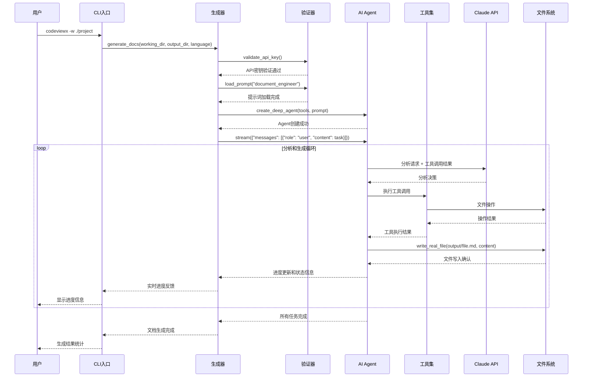
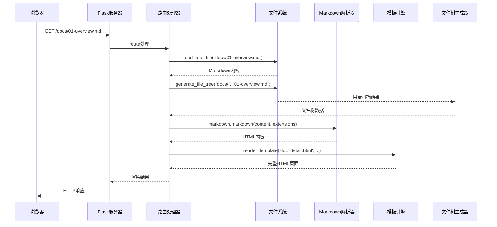

# 核心工作机制

## 概述

CodeViewX 的核心机制基于 AI Agent 模式，通过深度代码分析实现自动化文档生成。本文档将深入分析系统的工作原理、关键算法和实现细节。

## 核心流程 #1: 文档生成主流程

### 概述
用户输入项目路径 → 环境验证 → AI Agent 创建 → 深度代码分析 → 文档生成 → 输出完成

### 时序图



### 详细步骤

#### 步骤 1: 参数解析和预处理

**触发条件**: 用户执行 `codeviewx` 命令

**核心代码**:
```python
# 文件：codeviewx/cli.py | 行：16-58
def main():
    ui_lang = detect_ui_language()
    get_i18n().set_locale(ui_lang)
    
    parser = argparse.ArgumentParser(
        prog="codeviewx",
        description=t('cli_description'),
        formatter_class=argparse.RawDescriptionHelpFormatter,
        epilog=t('cli_examples')
    )
    
    # 参数定义和解析逻辑
    parser.add_argument("-w", "--working-dir", ...)
    parser.add_argument("-o", "--output-dir", ...)
    parser.add_argument("-l", "--language", ...)
    
    args = parser.parse_args()
```

**数据流**: 命令行参数 → ArgumentParser → 解析后的 args 对象 → 参数验证

**关键点**:
- **多语言界面支持**: 基于系统语言自动设置界面语言
- **参数验证**: 确保输入参数的有效性和合理性
- **错误处理**: 提供用户友好的错误提示和解决建议

#### 步骤 2: 环境验证和配置

**触发条件**: CLI 参数解析完成后

**核心代码**:
```python
# 文件：codeviewx/generator.py | 行：25-50
def validate_api_key():
    """验证 Anthropic API 密钥是否正确配置"""
    api_key = os.getenv('ANTHROPIC_AUTH_TOKEN')
    
    if not api_key:
        raise ValueError(
            "❌ " + t('error_api_key_missing') + "\n\n" +
            t('error_api_key_solution')
        )

def generate_docs(...):
    # 设置自定义基础 URL
    if base_url:
        os.environ['ANTHROPIC_BASE_URL'] = base_url
    
    # API 密钥验证
    try:
        validate_api_key()
    except ValueError as api_error:
        print(f"\n{api_error}")
        raise ValueError(f"API key validation failed: {api_error}")
```

**数据流**: 环境变量检查 → API 密钥验证 → 配置设置 → 验证通过

**关键点**:
- **安全性**: 确保 API 密钥的正确配置
- **用户友好**: 提供详细的错误信息和解决方案
- **灵活配置**: 支持自定义 API 端点

#### 步骤 3: AI Agent 创建和初始化

**触发条件**: 环境验证通过后

**核心代码**:
```python
# 文件：codeviewx/generator.py | 行：108-122
def generate_docs(...):
    # 加载提示词模板
    prompt = load_prompt(
        "document_engineer",
        working_directory=working_directory,
        output_directory=output_directory,
        doc_language=doc_language
    )
    print(t('loading_prompt'))
    
    # 注册工具集
    tools = [
        execute_command,
        ripgrep_search,
        write_real_file,
        read_real_file,
        list_real_directory,
    ]
    
    # 创建深度 Agent
    agent = create_deep_agent(tools, prompt)
    print(t('created_agent'))
    print(t('registered_tools', count=len(tools), tools=', '.join([tool.name for tool in tools])))
```

**数据流**: 提示词模板 → 工具集定义 → DeepAgent 创建 → Agent 初始化完成

**关键点**:
- **工具集成**: 集成文件系统、搜索、命令执行等核心工具
- **提示词工程**: 结构化的提示词确保高质量的分析结果
- **模块化设计**: 工具可独立扩展和测试

#### 步骤 4: 项目结构分析

**触发条件**: Agent 创建完成后，开始执行分析任务

**核心代码**:
```python
# 提示词模板中的分析指令 (prompts/document_engineer_zh.md)
# 阶段2: 项目分析 ⭐
# 4. 读取 README（read_real_file）：了解项目背景
# 5. 列出源代码目录（list_real_directory）：识别模块结构
# 6. 搜索核心模式（ripgrep_search）：
#    - 入口点："main|if __name__|func main|@SpringBootApplication"
#    - 类/接口："class |interface |struct |type "
#    - 路由："@app.route|@GetMapping|router\."
#    - 数据库："model|schema|@Entity"
# 7. 读取核心文件（read_real_file）：深入理解实现
```

**实际工具调用示例**:
```python
# 工具调用序列
1. list_real_directory("/root/codeviewx")  # 列出项目根目录
2. read_real_file("/root/codeviewx/pyproject.toml")  # 读取项目配置
3. read_real_file("/root/codeviewx/README.md")  # 读取项目说明
4. list_real_directory("/root/codeviewx/codeviewx")  # 分析源码结构
5. ripgrep_search("class |def ", "/root/codeviewx/codeviewx")  # 搜索类和函数定义
6. read_real_file("/root/codeviewx/codeviewx/cli.py")  # 深入分析核心文件
```

**数据流**: 项目目录 → 文件系统扫描 → 代码模式识别 → 核心文件分析 → 项目结构理解

**关键点**:
- **多层次分析**: 从目录结构到代码实现的多维度分析
- **模式识别**: 使用正则表达式识别常见的代码模式
- **优先级策略**: 优先分析配置文件、入口点和核心模块

#### 步骤 5: 文档生成和写入

**触发条件**: 项目分析完成后，开始生成文档

**核心代码**:
```python
# 文件：codeviewx/tools/filesystem.py | 行：13-32
@tool
def write_real_file(file_path: str, content: str) -> str:
    """
    写入文件到真实文件系统
    
    Features:
        - 自动创建不存在的目录
        - 支持相对路径和绝对路径
        - 返回文件大小信息
    """
    try:
        directory = os.path.dirname(file_path)
        if directory and not os.path.exists(directory):
            os.makedirs(directory, exist_ok=True)
        
        with open(file_path, 'w', encoding='utf-8') as f:
            f.write(content)
        
        file_size = os.path.getsize(file_path)
        file_size_kb = file_size / 1024
        
        return f"✅ Successfully wrote file: {file_path} ({file_size_kb:.2f} KB)"
    
    except Exception as e:
        return f"❌ Failed to write file: {str(e)}"
```

**文档生成顺序**:
```python
# 按照提示词模板中定义的顺序
1. README.md - 总览和导航
2. 01-overview.md - 技术栈和目录结构
3. 02-quickstart.md - 快速开始指南
4. 03-architecture.md - 架构设计
5. 04-core-mechanisms.md - 核心机制（最深入）
6. 其他文档按需生成
```

**数据流**: 分析结果 → 文档模板 → 内容生成 → 文件写入 → 生成确认

**关键点**:
- **原子操作**: 确保文件写入的原子性
- **自动创建**: 自动创建必要的目录结构
- **状态反馈**: 提供详细的写入结果和状态信息

#### 步骤 6: 进度跟踪和用户反馈

**触发条件**: 整个生成过程中的每个步骤

**核心代码**:
```python
# 文件：codeviewx/generator.py | 行：180-250
for chunk in agent.stream(
    {"messages": [{"role": "user", "content": t('agent_task_instruction')}]},
    stream_mode="values",
    config={"recursion_limit": recursion_limit}
):
    if "messages" in chunk:
        step_count += 1
        last_message = chunk["messages"][-1]
        
        # 进度检测和反馈逻辑
        if hasattr(last_message, 'tool_calls') and last_message.tool_calls:
            for tool_call in last_message.tool_calls:
                tool_name = tool_call.get('name', 'unknown')
                
                if tool_name == 'write_todos':
                    # 任务规划进度
                    update_todo_progress(tool_call)
                elif tool_name == 'write_real_file':
                    # 文档生成进度
                    update_doc_generation_progress(tool_call)
                else:
                    # 工具执行进度
                    update_tool_execution_progress(tool_name, tool_call)
```

**进度跟踪机制**:
- **任务规划**: 通过 `write_todos` 工具跟踪整体任务进度
- **文档生成**: 跟踪每个文档文件的生成状态
- **工具执行**: 实时显示文件读取、搜索、命令执行等操作进度

**关键点**:
- **实时反馈**: 流式输出让用户实时了解进度
- **智能过滤**: 只显示关键步骤，避免信息过载
- **错误处理**: 优雅处理和报告各种错误情况

### 异常处理

#### API 认证异常
```python
# 文件：codeviewx/cli.py | 行：125-155
if any(auth_error in error_msg.lower() for auth_error in [
    "could not resolve authentication method",
    "expected either api_key or auth_token to be set",
    "x-api-key",
    "authorization header",
    "401",
    "unauthorized",
    "authentication"
]):
    print(f"\n❌ {t('error_authentication_failed')}")
    print(f"\n{t('error_auth_cause')}")
    print(f"\n🔧 {t('error_auth_solution')}")
    print(f"   export ANTHROPIC_AUTH_TOKEN='your-api-key-here'")
```

#### 文件系统异常
```python
# 文件：codeviewx/tools/filesystem.py | 行：70-85
@tool
def read_real_file(file_path: str) -> str:
    try:
        with open(file_path, 'r', encoding='utf-8') as f:
            content = f.read()
        # ...
    except FileNotFoundError:
        return f"❌ Error: File '{file_path}' does not exist"
    except PermissionError:
        return f"❌ Error: No permission to read file '{file_path}'"
    except UnicodeDecodeError:
        return f"❌ Error: File '{file_path}' is not a text file"
```

### 设计亮点

#### 1. 流式处理架构
- **实时反馈**: 用户可以看到实时的分析进度
- **内存效率**: 避免大量数据在内存中堆积
- **用户体验**: 长时间运行任务时提供进度可视化

#### 2. 智能工具调度
- **自主决策**: AI Agent 自主决定工具调用顺序和参数
- **上下文保持**: 工具调用结果自动包含在下一个请求中
- **错误恢复**: 工具失败时自动尝试其他方法

#### 3. 多层次错误处理
- **预防性验证**: 启动前验证所有必需条件
- **运行时恢复**: 运行时错误的优雅处理和恢复
- **用户友好**: 提供具体的错误信息和解决方案

## 核心流程 #2: Web 文档服务机制

### 概述
用户访问 Web 服务器 → 请求路由 → 文件解析 → Markdown 渲染 → 模板渲染 → HTML 返回

### 时序图



### 详细步骤

#### 步骤 1: 路由处理和参数解析

**核心代码**:
```python
# 文件：codeviewx/server.py | 行：118-135
@app.route("/<path:filename>")
def index(filename):
    if not filename or filename == "":
        filename = "README.md"
    
    print(t('server_debug_accessing', filename=filename))
    print(t('server_debug_output_dir', directory=output_directory))
    
    index_file_path = os.path.join(output_directory, filename)
    # ... 后续处理
```

**关键点**:
- **默认文件**: 空路径时默认访问 README.md
- **调试信息**: 提供详细的访问日志
- **路径安全**: 确保文件路径在允许的目录内

#### 步骤 2: Markdown 渲染和处理

**核心代码**:
```python
# 文件：codeviewx/server.py | 行：140-165
if os.path.exists(index_file_path):
    with open(index_file_path, "r", encoding='utf-8') as f:
        content = f.read()
    
    # 自动插入 TOC（目录）
    if '[TOC]' not in content:
        lines = content.split('\n')
        insert_index = 0
        for i, line in enumerate(lines):
            if line.strip().startswith('#'):
                insert_index = i
                break
        lines.insert(insert_index, '[TOC]')
        lines.insert(insert_index + 1, '')
        content = '\n'.join(lines)
    
    # Markdown 转 HTML
    import markdown
    from markdown.extensions.toc import TocExtension
    
    toc_extension = TocExtension(
        permalink=True,
        permalink_class='headerlink',
        title=t('server_toc_title'),
        baselevel=1,
        toc_depth=6,
        marker='[TOC]'
    )
    
    html = markdown.markdown(
        content,
        extensions=['tables', 'fenced_code', 'codehilite', toc_extension],
        extension_configs={
            'codehilite': {
                'css_class': 'language-',
                'use_pygments': False
            }
        }
    )
```

**关键特性**:
- **自动 TOC**: 自动为文档生成目录导航
- **代码高亮**: 支持代码块语法高亮
- **表格支持**: 完整的 Markdown 表格渲染
- **永久链接**: 为标题生成永久链接

#### 步骤 3: 文件树生成

**核心代码**:
```python
# 文件：codeviewx/server.py | 行：33-67
def generate_file_tree(directory, current_file=None):
    """生成文件树数据结构"""
    if not os.path.exists(directory):
        return []
    
    file_tree = []
    try:
        items = []
        for item in os.listdir(directory):
            item_path = os.path.join(directory, item)
            if os.path.isfile(item_path):
                items.append(item)
        
        items.sort()  # 按文件名排序
        
        for item in items:
            file_path = os.path.join(directory, item)
            rel_path = os.path.relpath(file_path, directory)
            
            file_type = 'file'
            display_name = item
            
            if item.lower().endswith('.md'):
                file_type = 'markdown'
                
                if item.upper() == 'README.MD':
                    display_name = 'README'
                else:
                    # 提取 Markdown 文件的第一个标题作为显示名
                    title = get_markdown_title(file_path)
                    if title:
                        display_name = title
                    else:
                        display_name = item[:-3] if item.endswith('.md') else item
            
            is_active = (item == current_file)
            
            file_tree.append({
                'name': item,
                'display_name': display_name,
                'path': rel_path,
                'type': file_type,
                'active': is_active
            })
    
    except Exception as e:
        print(t('server_error_generating_tree', error=str(e)))
        return []
    
    return file_tree
```

**智能特性**:
- **标题提取**: 自动提取 Markdown 文件的第一个标题
- **当前状态**: 高亮显示当前访问的文件
- **类型识别**: 区分 Markdown 文件和普通文件
- **排序显示**: 按文件名排序显示

### 设计亮点

#### 1. 智能文档解析
- **自动 TOC**: 无需手动添加目录标记
- **标题提取**: 智能提取文件标题用于导航
- **代码高亮**: 完整的代码语法高亮支持

#### 2. 用户体验优化
- **永久链接**: 支持直接链接到文档特定章节
- **文件树导航**: 清晰的文档结构导航
- **响应式设计**: 适配不同设备尺寸

#### 3. 性能优化
- **按需解析**: 只在访问时解析文件内容
- **缓存友好**: 文件修改时间检查支持浏览器缓存
- **资源优化**: 静态资源分离和压缩

## 核心流程 #3: 国际化支持机制

### 概述
系统语言检测 → 语言包加载 → 消息翻译 → 变量替换 → 本地化输出

### 核心实现

**文件**: `codeviewx/i18n.py`

```python
class I18n:
    def __init__(self, locale: str = 'en'):
        self.locale = locale if locale in MESSAGES else 'en'
    
    def t(self, key: str, **kwargs) -> str:
        """翻译消息并支持变量替换"""
        msg = MESSAGES.get(self.locale, {}).get(key, key)
        try:
            return msg.format(**kwargs) if kwargs else msg
        except KeyError as e:
            return msg
```

**语言检测机制**:
```python
def detect_ui_language() -> str:
    """基于系统语言环境自动检测界面语言"""
    try:
        lang, _ = locale.getdefaultlocale()
        
        if lang:
            if lang.startswith('zh'):
                return 'zh'
            else:
                return 'en'
        
        return 'en'
    except Exception:
        return 'en'
```

**消息结构设计**:
```python
MESSAGES: Dict[str, Dict[str, str]] = {
    'en': {
        'starting': '🚀 Starting CodeViewX Documentation Generator',
        'generated_files': '✓ Generated {count} document files',
        # ...
    },
    'zh': {
        'starting': '🚀 启动 CodeViewX 文档生成器', 
        'generated_files': '✓ 共生成 {count} 个文档文件',
        # ...
    }
}
```

### 设计亮点

#### 1. 变量替换支持
- **动态内容**: 支持在翻译消息中插入动态变量
- **类型安全**: 自动处理变量类型转换
- **错误容忍**: 变量不存在时保持原消息

#### 2. 自动语言检测
- **系统感知**: 基于操作系统语言环境自动选择
- **回退机制**: 不支持的语言自动回退到英文
- **用户覆盖**: 支持用户手动指定语言

#### 3. 模块化设计
- **分离关注点**: 翻译逻辑与业务逻辑分离
- **易于扩展**: 新语言只需添加翻译条目
- **统一接口**: 提供一致的翻译 API

---

💡 **核心优势**: CodeViewX 的核心机制通过 AI Agent 的自主决策能力，结合强大的工具集和智能的流程控制，实现了高质量、自动化的技术文档生成。流式处理、实时反馈和多层次的错误处理确保了优秀的用户体验和系统可靠性。