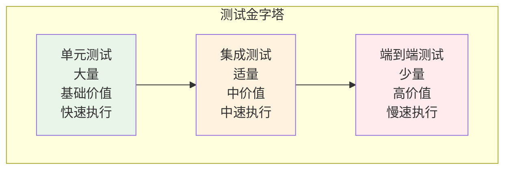

# 测试策略与质量保证

本文档详细描述 CodeViewX 项目的测试策略、质量保证机制和持续集成流程。

## 测试架构概览

### 测试金字塔



### 测试分类

| 测试类型 | 比例 | 执行速度 | 覆盖范围 | 主要目标 |
|----------|------|----------|----------|----------|
| **单元测试** | 70% | 快速 (<1s) | 函数/类级别 | 验证功能正确性 |
| **集成测试** | 20% | 中等 (1-10s) | 模块间交互 | 验证接口兼容性 |
| **端到端测试** | 10% | 慢速 (>10s) | 完整工作流 | 验证用户体验 |

## 单元测试

### 测试结构

```
tests/
├── unit/                           # 单元测试
│   ├── __init__.py
│   ├── test_cli.py                 # CLI 模块测试
│   ├── test_core.py                # 核心模块测试
│   ├── test_generator.py            # 生成器测试
│   ├── test_server.py               # 服务器测试
│   ├── test_tools/                  # 工具模块测试
│   │   ├── __init__.py
│   │   ├── test_filesystem.py      # 文件系统工具测试
│   │   ├── test_search.py           # 搜索工具测试
│   │   └── test_command.py         # 命令工具测试
│   ├── test_utils/                 # 工具函数测试
│   │   ├── __init__.py
│   │   ├── test_language.py        # 语言检测测试
│   │   ├── test_i18n.py             # 国际化测试
│   │   └── test_prompt.py          # 提示词测试
│   └── fixtures/                    # 测试数据
│       ├── sample_projects/        # 示例项目
│       ├── test_files/            # 测试文件
│       └── expected_outputs/      # 预期输出
```

### 核心模块单元测试

#### CLI 模块测试

```python
# tests/unit/test_cli.py
import pytest
import sys
from unittest.mock import patch, MagicMock
from io import StringIO
from codeviewx.cli import main


class TestCLI:
    """CLI 功能测试"""
    
    def test_version_argument(self, capsys):
        """测试版本参数"""
        with patch.object(sys, 'argv', ['codeviewx', '--version']):
            with pytest.raises(SystemExit) as exc_info:
                main()
            assert exc_info.value.code == 0
    
    def test_help_argument(self):
        """测试帮助参数"""
        with patch.object(sys, 'argv', ['codeviewx', '--help']):
            with pytest.raises(SystemExit) as exc_info:
                main()
            assert exc_info.value.code == 0
    
    @patch('codeviewx.cli.generate_docs')
    def test_basic_generation(self, mock_generate):
        """测试基本文档生成"""
        with patch.object(sys, 'argv', ['codeviewx']):
            main()
            mock_generate.assert_called_once()
    
    @patch('codeviewx.cli.start_document_web_server')
    def test_server_mode(self, mock_server):
        """测试服务器模式"""
        with patch.object(sys, 'argv', ['codeviewx', '--serve']):
            main()
            mock_server.assert_called_once()
    
    @patch('codeviewx.cli.generate_docs')
    def test_language_argument(self, mock_generate):
        """测试语言参数"""
        test_cases = [
            (['codeviewx', '-l', 'Chinese'], 'Chinese'),
            (['codeviewx', '--language', 'English'], 'English'),
        ]
        
        for argv, expected_lang in test_cases:
            with patch.object(sys, 'argv', argv):
                main()
                mock_generate.assert_called_with(doc_language=expected_lang)
    
    @patch('codeviewx.cli.generate_docs')
    def test_directory_arguments(self, mock_generate):
        """测试目录参数"""
        test_cases = [
            (['codeviewx', '-w', '/test/path'], '/test/path'),
            (['codeviewx', '--working-dir', '/another/path'], '/another/path'),
        ]
        
        for argv, expected_dir in test_cases:
            with patch.object(sys, 'argv', argv):
                main()
                mock_generate.assert_called_with(working_directory=expected_dir)
```

#### 核心生成器测试

```python
# tests/unit/test_generator.py
import pytest
from unittest.mock import patch, MagicMock
from codeviewx.generator import generate_docs


class TestGenerator:
    """文档生成器测试"""
    
    @pytest.fixture
    def mock_config(self):
        """模拟配置"""
        return {
            'working_directory': '/test/project',
            'output_directory': '/test/output',
            'doc_language': 'English',
            'ui_language': 'en',
            'recursion_limit': 100,
            'verbose': False
        }
    
    @patch('codeviewx.generator.create_deep_agent')
    @patch('codeviewx.generator.load_prompt')
    def test_generate_docs_basic(self, mock_prompt, mock_agent, mock_config):
        """测试基本文档生成"""
        # 设置模拟
        mock_prompt.return_value = "Test prompt"
        mock_agent_instance = MagicMock()
        mock_agent.return_value = mock_agent_instance
        mock_agent_instance.stream.return_value = iter([])
        
        # 执行测试
        generate_docs(**mock_config)
        
        # 验证调用
        mock_prompt.assert_called_once()
        mock_agent.assert_called_once()
    
    @patch('codeviewx.generator.detect_system_language')
    def test_auto_language_detection(self, mock_detect, tmp_path):
        """测试自动语言检测"""
        mock_detect.return_value = 'Chinese'
        
        with patch('codeviewx.generator.create_deep_agent'):
            with patch('codeviewx.generator.load_prompt'):
                generate_docs(
                    working_directory=str(tmp_path),
                    doc_language=None  # 触发自动检测
                )
        
        mock_detect.assert_called_once()
    
    @patch('codeviewx.generator.create_deep_agent')
    def test_recursion_limit(self, mock_agent, mock_config):
        """测试递归限制"""
        mock_agent_instance = MagicMock()
        mock_agent.return_value = mock_agent_instance
        mock_agent_instance.stream.return_value = iter([])
        
        custom_limit = 500
        generate_docs(recursion_limit=custom_limit, **mock_config)
        
        # 验证配置传递
        call_args = mock_agent.call_args
        config = call_args[1] if call_args else {}
        assert config.get('recursion_limit') == custom_limit
```

#### 工具模块测试

```python
# tests/unit/test_tools/test_filesystem.py
import pytest
import tempfile
import os
from codeviewx.tools.filesystem import (
    read_real_file, write_real_file, list_real_directory
)


class TestFileSystemTools:
    """文件系统工具测试"""
    
    @pytest.fixture
    def temp_dir(self):
        """临时目录 fixture"""
        with tempfile.TemporaryDirectory() as temp_dir:
            yield temp_dir
    
    @pytest.fixture
    def sample_file(self, temp_dir):
        """示例文件 fixture"""
        file_path = os.path.join(temp_dir, 'test.txt')
        content = "Hello, World!\nThis is a test file."
        with open(file_path, 'w', encoding='utf-8') as f:
            f.write(content)
        return file_path, content
    
    def test_write_and_read_file(self, temp_dir):
        """测试文件写入和读取"""
        file_path = os.path.join(temp_dir, 'new_file.txt')
        content = "Test content for file writing."
        
        # 写入文件
        result = write_real_file(file_path, content)
        assert "Successfully wrote file" in result
        assert os.path.exists(file_path)
        
        # 读取文件
        result = read_real_file(file_path)
        assert content in result
        assert "new_file.txt" in result
        assert "KB" in result  # 文件大小信息
    
    def test_read_existing_file(self, sample_file):
        """测试读取现有文件"""
        file_path, content = sample_file
        result = read_real_file(file_path)
        
        assert content in result
        assert "test.txt" in result
        assert "lines" in result.lower()
        assert "KB" in result
    
    def test_read_nonexistent_file(self):
        """测试读取不存在的文件"""
        result = read_real_file("/nonexistent/path/file.txt")
        assert "does not exist" in result
    
    def test_read_permission_denied(self, temp_dir):
        """测试权限拒绝情况"""
        file_path = os.path.join(temp_dir, 'restricted.txt')
        
        # 创建文件
        with open(file_path, 'w') as f:
            f.write("test")
        
        # 移除读权限（仅在 Unix 系统上有效）
        if os.name != 'nt':  # 非 Windows 系统
            os.chmod(file_path, 0o000)
            result = read_real_file(file_path)
            assert "Permission denied" in result
    
    def test_list_empty_directory(self, temp_dir):
        """测试列出空目录"""
        result = list_real_directory(temp_dir)
        assert "Directory is empty" in result or "Total 0 directories, 0 files" in result
    
    def test_list_directory_with_files(self, temp_dir):
        """测试列出包含文件的目录"""
        # 创建测试文件和目录
        files = ['file1.txt', 'file2.py']
        dirs = ['subdir1', 'subdir2']
        
        for filename in files:
            with open(os.path.join(temp_dir, filename), 'w') as f:
                f.write("test")
        
        for dirname in dirs:
            os.makedirs(os.path.join(temp_dir, dirname))
        
        result = list_real_directory(temp_dir)
        
        for filename in files:
            assert filename in result
        for dirname in dirs:
            assert dirname in result
        assert "Total" in result
        assert "directories" in result
        assert "files" in result
    
    def test_list_nonexistent_directory(self):
        """测试列出不存在的目录"""
        result = list_real_directory("/nonexistent/directory")
        assert "does not exist" in result
```

#### 搜索工具测试

```python
# tests/unit/test_tools/test_search.py
import pytest
import tempfile
import os
from unittest.mock import patch, MagicMock
from codeviewx.tools.search import ripgrep_search


class TestSearchTools:
    """搜索工具测试"""
    
    @pytest.fixture
    def temp_project(self):
        """临时项目 fixture"""
        with tempfile.TemporaryDirectory() as temp_dir:
            # 创建测试文件
            files = {
                'main.py': '''
def main():
    print("Hello, World!")
    return "success"

class MainClass:
    def __init__(self):
        self.name = "main"
''',
                'utils.py': '''
def utility_function():
    return "utility"

class UtilityClass:
    pass
''',
                'README.md': '''
# Project Title

This is a test project.
## Installation
## Usage
'''
            }
            
            for filename, content in files.items():
                with open(os.path.join(temp_dir, filename), 'w') as f:
                    f.write(content)
            
            yield temp_dir
    
    @patch('codeviewx.tools.search.Ripgrepy')
    def test_basic_search(self, mock_ripgrepy, temp_project):
        """测试基本搜索功能"""
        # 设置模拟
        mock_rg = MagicMock()
        mock_rg.line_number.return_value = mock_rg
        mock_rg.with_filename.return_value = mock_rg
        mock_rg.max_count.return_value = mock_rg
        mock_rg.ignore_case.return_value = mock_rg
        mock_rg.type_add.return_value = mock_rg
        mock_rg.glob.return_value = mock_rg
        mock_rg.run.return_value = MagicMock(as_string="main.py:3:    print(\"Hello, World!\")")
        mock_ripgrepy.return_value = mock_rg
        
        # 执行搜索
        result = ripgrep_search("Hello", temp_project)
        
        # 验证调用
        mock_ripgrepy.assert_called_once_with("Hello", temp_project)
        mock_rg.line_number.assert_called_once()
        mock_rg.with_filename.assert_called_once()
        assert "Hello, World!" in result
    
    @patch('codeviewx.tools.search.Ripgrepy')
    def test_search_with_file_type(self, mock_ripgrepy, temp_project):
        """测试文件类型过滤"""
        mock_rg = MagicMock()
        mock_rg.line_number.return_value = mock_rg
        mock_rg.with_filename.return_value = mock_rg
        mock_rg.max_count.return_value = mock_rg
        mock_rg.type_add.return_value = mock_rg
        mock_rg.glob.return_value = mock_rg
        mock_rg.run.return_value = MagicMock(as_string="")
        mock_ripgrepy.return_value = mock_rg
        
        # 执行搜索
        ripgrep_search("class", temp_project, file_type="py")
        
        # 验证类型过滤
        mock_rg.type_add.assert_called_once_with("py")
    
    @patch('codeviewx.tools.search.Ripgrepy')
    def test_search_ignore_case(self, mock_ripgrepy, temp_project):
        """测试忽略大小写搜索"""
        mock_rg = MagicMock()
        mock_rg.line_number.return_value = mock_rg
        mock_rg.with_filename.return_value = mock_rg
        mock_rg.max_count.return_value = mock_rg
        mock_rg.ignore_case.return_value = mock_rg
        mock_rg.type_add.return_value = mock_rg
        mock_rg.glob.return_value = mock_rg
        mock_rg.run.return_value = MagicMock(as_string="")
        mock_ripgrepy.return_value = mock_rg
        
        # 执行搜索
        ripgrep_search("hello", temp_project, ignore_case=True)
        
        # 验证忽略大小写
        mock_rg.ignore_case.assert_called_once()
    
    @patch('codeviewx.tools.search.Ripgrepy')
    def test_search_max_count(self, mock_ripgrepy, temp_project):
        """测试最大结果数限制"""
        mock_rg = MagicMock()
        mock_rg.line_number.return_value = mock_rg
        mock_rg.with_filename.return_value = mock_rg
        mock_rg.max_count.return_value = mock_rg
        mock_rg.type_add.return_value = mock_rg
        mock_rg.glob.return_value = mock_rg
        mock_rg.run.return_value = MagicMock(as_string="")
        mock_ripgrepy.return_value = mock_rg
        
        # 执行搜索
        ripgrep_search("test", temp_project, max_count=50)
        
        # 验证最大数量
        mock_rg.max_count.assert_called_once_with(50)
    
    @patch('codeviewx.tools.search.Ripgrepy')
    def test_search_ripgrep_not_installed(self, mock_ripgrepy):
        """测试 ripgrep 未安装的情况"""
        mock_ripgrepy.side_effect = Exception("rg: command not found")
        
        result = ripgrep_search("pattern", "/path")
        assert "ripgrep (rg) is not installed" in result
    
    @patch('codeviewx.tools.search.Ripgrepy')
    def test_search_no_matches(self, mock_ripgrepy, temp_project):
        """测试无匹配结果"""
        mock_rg = MagicMock()
        mock_rg.line_number.return_value = mock_rg
        mock_rg.with_filename.return_value = mock_rg
        mock_rg.max_count.return_value = mock_rg
        mock_rg.type_add.return_value = mock_rg
        mock_rg.glob.return_value = mock_rg
        mock_rg.run.return_value = MagicMock(as_string="")  # 空结果
        mock_ripgrepy.return_value = mock_rg
        
        result = ripgrep_search("nonexistent_pattern", temp_project)
        assert "No matches found" in result
```

## 集成测试

### 测试结构

```
tests/
├── integration/                    # 集成测试
│   ├── __init__.py
│   ├── test_full_workflow.py      # 完整工作流测试
│   ├── test_web_interface.py      # Web 界面测试
│   ├── test_ai_integration.py     # AI 集成测试
│   ├── test_tool_integration.py   # 工具集成测试
│   └── fixtures/                  # 集成测试数据
│       ├── sample_projects/       # 示例项目
│       └── expected_documents/   # 预期文档
```

### 完整工作流集成测试

```python
# tests/integration/test_full_workflow.py
import pytest
import tempfile
import os
import time
from pathlib import Path
from codeviewx import generate_docs


class TestFullWorkflow:
    """完整工作流集成测试"""
    
    @pytest.fixture
    def python_project(self):
        """Python 项目 fixture"""
        with tempfile.TemporaryDirectory() as temp_dir:
            project_dir = os.path.join(temp_dir, "python_project")
            os.makedirs(project_dir)
            
            # 创建项目结构
            structure = {
                "README.md": """# Python Project

A sample Python project for testing CodeViewX.

## Features
- Feature 1
- Feature 2

## Installation
```bash
pip install -r requirements.txt
```
""",
                "requirements.txt": """flask==2.0.0
requests==2.25.0
pytest==6.0.0
""",
                "pyproject.toml": """[project]
name = "python-project"
version = "0.2.0"
description = "A sample Python project"
requires-python = ">=3.8"
dependencies = [
    "flask>=2.0.0",
    "requests>=2.25.0"
]

[project.optional-dependencies]
dev = [
    "pytest>=6.0.0",
    "black>=22.0.0"
]
""",
                "src": {
                    "__init__.py": "",
                    "main.py": """def main():
    \"\"\"Main function\"\"\"
    print("Hello from Python Project!")
    return "success"

class MainClass:
    \"\"\"Main application class\"\"\"
    def __init__(self, name="app"):
        self.name = name
    
    def process(self, data):
        \"\"\"Process data\"\"\"
        return f"Processing {data} with {self.name}"

if __name__ == "__main__":
    main()
""",
                    "utils.py": """def utility_function():
    \"\"\"Utility function\"\"\"
    return "Utility result"

def helper_function(param):
    \"\"\"Helper function\"\"\"
    return f"Helper: {param}"

class HelperClass:
    \"\"\"Helper class\"\"\"
    def __init__(self):
        self.value = 0
    
    def increment(self):
        \"\"\"Increment value\"\"\"
        self.value += 1
        return self.value
""",
                    "web": {
                        "__init__.py": "",
                        "app.py": """from flask import Flask, jsonify

app = Flask(__name__)

@app.route('/')
def home():
    return jsonify({"message": "Hello World!"})

@app.route('/health')
def health():
    return jsonify({"status": "healthy"})

if __name__ == '__main__':
    app.run(debug=True)
"""
                    }
                },
                "tests": {
                    "__init__.py": "",
                    "test_main.py": """import pytest
from src.main import MainClass

def test_main_class():
    \"\"\"Test MainClass\"\"\"
    app = MainClass()
    assert app.name == "app"
    
    result = app.process("test_data")
    assert "test_data" in result
    assert "app" in result
""",
                    "test_utils.py": """import pytest
from src.utils import HelperClass

def test_helper_class():
    \"\"\"Test HelperClass\"\"\"
    helper = HelperClass()
    assert helper.value == 0
    
    result = helper.increment()
    assert result == 1
    assert helper.value == 1
"""
                }
            }
            
            # 创建目录结构
            for path, content in structure.items():
                if isinstance(content, dict):
                    # 处理子目录
                    full_path = os.path.join(project_dir, path)
                    os.makedirs(full_path, exist_ok=True)
                    for subpath, subcontent in content.items():
                        full_subpath = os.path.join(full_path, subpath)
                        if isinstance(subcontent, dict):
                            os.makedirs(full_subpath, exist_ok=True)
                        else:
                            with open(full_subpath, 'w', encoding='utf-8') as f:
                                f.write(subcontent)
                else:
                    # 处理文件
                    full_path = os.path.join(project_dir, path)
                    os.makedirs(os.path.dirname(full_path), exist_ok=True)
                    with open(full_path, 'w', encoding='utf-8') as f:
                        f.write(content)
            
            yield project_dir
    
    @pytest.mark.integration
    @pytest.mark.slow
    def test_complete_documentation_generation(self, python_project):
        """测试完整文档生成流程"""
        output_dir = tempfile.mkdtemp()
        
        try:
            # 生成文档
            generate_docs(
                working_directory=python_project,
                output_directory=output_dir,
                doc_language="English",
                recursion_limit=200  # 限制递归深度以节省时间
            )
            
            # 验证生成的文档文件
            expected_files = [
                "README.md",
                "01-overview.md",
                "02-quickstart.md",
                "03-architecture.md",
                "04-core-mechanisms.md"
            ]
            
            for filename in expected_files:
                file_path = os.path.join(output_dir, filename)
                assert os.path.exists(file_path), f"Expected file {filename} not found"
                
                # 验证文件不为空
                with open(file_path, 'r', encoding='utf-8') as f:
                    content = f.read()
                    assert len(content) > 100, f"File {filename} appears to be too short"
            
            # 验证 README.md 内容
            readme_path = os.path.join(output_dir, "README.md")
            with open(readme_path, 'r', encoding='utf-8') as f:
                readme_content = f.read()
                assert "Python Project" in readme_content
                assert "文档结构" in readme_content or "Document Structure" in readme_content
            
            # 验证项目概览文档
            overview_path = os.path.join(output_dir, "01-overview.md")
            with open(overview_path, 'r', encoding='utf-8') as f:
                overview_content = f.read()
                assert "技术栈" in overview_content or "Technology Stack" in overview_content
                assert "Flask" in overview_content
            
        except Exception as e:
            # 如果测试失败，输出调试信息
            print(f"Integration test failed: {e}")
            print(f"Project directory: {python_project}")
            print(f"Output directory: {output_dir}")
            if os.path.exists(output_dir):
                print("Generated files:", os.listdir(output_dir))
            raise
    
    @pytest.mark.integration
    def test_documentation_generation_with_chinese(self, python_project):
        """测试中文文档生成"""
        output_dir = tempfile.mkdtemp()
        
        try:
            # 生成中文文档
            generate_docs(
                working_directory=python_project,
                output_directory=output_dir,
                doc_language="Chinese",
                recursion_limit=150
            )
            
            # 验证中文内容
            readme_path = os.path.join(output_dir, "README.md")
            with open(readme_path, 'r', encoding='utf-8') as f:
                content = f.read()
                assert "技术文档" in content
                assert "文档结构" in content
            
        except Exception as e:
            pytest.skip(f"Chinese documentation test failed: {e}")
```

### Web 界面集成测试

```python
# tests/integration/test_web_interface.py
import pytest
import tempfile
import os
import time
import threading
import requests
from codeviewx import generate_docs, start_document_web_server


class TestWebInterface:
    """Web 界面集成测试"""
    
    @pytest.fixture
    def sample_docs(self):
        """示例文档 fixture"""
        with tempfile.TemporaryDirectory() as temp_dir:
            # 创建示例文档
            docs = {
                "README.md": """# Sample Documentation

This is a sample documentation set.

## Getting Started
1. Install the package
2. Run the application
3. Enjoy!

## API Reference
- Function 1
- Function 2
""",
                "01-overview.md": """# Project Overview

This document provides an overview of the project.

## Technology Stack
- Python 3.8+
- Flask
- SQLAlchemy
""",
                "02-api.md": """# API Reference

## Functions

### function1(param1, param2)
Description of function1.

**Parameters:**
- param1: Description
- param2: Description

**Returns:**
Return value description
"""
            }
            
            for filename, content in docs.items():
                with open(os.path.join(temp_dir, filename), 'w', encoding='utf-8') as f:
                    f.write(content)
            
            yield temp_dir
    
    @pytest.fixture
    def web_server(self, sample_docs):
        """Web 服务器 fixture"""
        # 在后台线程中启动服务器
        server_ready = threading.Event()
        server_thread = None
        
        def run_server():
            try:
                # 使用不同端口避免冲突
                start_document_web_server(sample_docs)
            except Exception as e:
                print(f"Server error: {e}")
        
        # 启动服务器线程
        server_thread = threading.Thread(target=run_server, daemon=True)
        server_thread.start()
        
        # 等待服务器启动
        time.sleep(2)  # 给服务器一些启动时间
        
        yield {
            'base_url': 'http://127.0.0.1:5000',
            'docs_dir': sample_docs
        }
    
    @pytest.mark.integration
    @pytest.mark.slow
    def test_homepage_access(self, web_server):
        """测试主页访问"""
        base_url = web_server['base_url']
        
        try:
            response = requests.get(f"{base_url}/", timeout=10)
            assert response.status_code == 200
            assert "text/html" in response.headers.get('content-type', '')
            assert "Sample Documentation" in response.text
        except requests.exceptions.RequestException as e:
            pytest.skip(f"Web server not available: {e}")
    
    @pytest.mark.integration
    def test_document_access(self, web_server):
        """测试文档访问"""
        base_url = web_server['base_url']
        
        try:
            # 测试访问特定文档
            response = requests.get(f"{base_url}/01-overview.md", timeout=10)
            assert response.status_code == 200
            assert "Project Overview" in response.text
            assert "Technology Stack" in response.text
        except requests.exceptions.RequestException as e:
            pytest.skip(f"Web server not available: {e}")
    
    @pytest.mark.integration
    def test_nonexistent_document(self, web_server):
        """测试访问不存在的文档"""
        base_url = web_server['base_url']
        
        try:
            response = requests.get(f"{base_url}/nonexistent.md", timeout=10)
            assert response.status_code == 404 or "not found" in response.text.lower()
        except requests.exceptions.RequestException as e:
            pytest.skip(f"Web server not available: {e}")
```

## 端到端测试

### 测试场景

```python
# tests/e2e/test_real_projects.py
import pytest
import tempfile
import os
import subprocess
from pathlib import Path


class TestRealProjects:
    """真实项目端到端测试"""
    
    @pytest.mark.e2e
    @pytest.mark.slow
    def test_python_cli_tool_project(self):
        """测试真实 Python CLI 工具项目"""
        # 这里可以测试真实的开源项目
        # 为了测试稳定性，使用模拟的真实项目结构
        
        with tempfile.TemporaryDirectory() as temp_dir:
            # 创建类似真实 CLI 工具的项目结构
            project_structure = {
                "src": {
                    "mycli": {
                        "__init__.py": "",
                        "cli.py": """
import click

@click.command()
@click.option('--verbose', '-v', is_flag=True)
@click.argument('name')
def hello(verbose, name):
    if verbose:
        click.echo(f"Verbose: Saying hello to {name}")
    click.echo(f"Hello {name}!")

if __name__ == '__main__':
    hello()
""",
                        "core.py": """
class Core:
    def __init__(self):
        self.state = "initialized"
    
    def process(self, data):
        return f"Processed: {data}"
""",
                    }
                },
                "tests": {
                    "test_cli.py": """
import pytest
from click.testing import CliRunner
from src.mycli.cli import hello

def test_hello():
    runner = CliRunner()
    result = runner.invoke(hello, ['World'])
    assert result.exit_code == 0
    assert 'Hello World!' in result.output
"""
                },
                "setup.py": """
from setuptools import setup, find_packages

setup(
    name="mycli",
    version="0.2.0",
    packages=find_packages(where="src"),
    package_dir={"": "src"},
    install_requires=["click>=8.0"],
    entry_points={
        'console_scripts': [
            'mycli=mycli.cli:hello',
        ],
    }
""",
                "README.md": """
# MyCLI Tool

A command-line interface tool.

## Installation
```bash
pip install mycli
```

## Usage
```bash
mycli World
mycli --verbose World
```
"""
            }
            
            # 创建项目文件
            self._create_project_structure(temp_dir, project_structure)
            
            # 使用 CodeViewX 分析项目
            output_dir = tempfile.mkdtemp()
            
            try:
                result = subprocess.run([
                    'python', '-m', 'codeviewx.cli',
                    '-w', temp_dir,
                    '-o', output_dir,
                    '-l', 'English',
                    '--recursion-limit', '100'
                ], capture_output=True, text=True, timeout=300)
                
                assert result.returncode == 0, f"CodeViewX failed: {result.stderr}"
                
                # 验证生成的文档
                expected_files = ["README.md", "01-overview.md", "02-quickstart.md"]
                for filename in expected_files:
                    file_path = os.path.join(output_dir, filename)
                    assert os.path.exists(file_path), f"Missing {filename}"
                    
                    with open(file_path, 'r') as f:
                        content = f.read()
                        assert len(content) > 50  # 确保文件有实际内容
                
                # 验证 CLI 特定内容
                overview_path = os.path.join(output_dir, "01-overview.md")
                with open(overview_path, 'r') as f:
                    overview_content = f.read()
                    assert "CLI" in overview_content or "command" in overview_content.lower()
                
            except subprocess.TimeoutExpired:
                pytest.skip("E2E test timed out")
            except Exception as e:
                print(f"Stdout: {result.stdout}")
                print(f"Stderr: {result.stderr}")
                raise
    
    def _create_project_structure(self, base_path, structure):
        """递归创建项目结构"""
        for path, content in structure.items():
            full_path = os.path.join(base_path, path)
            if isinstance(content, dict):
                os.makedirs(full_path, exist_ok=True)
                self._create_project_structure(full_path, content)
            else:
                os.makedirs(os.path.dirname(full_path), exist_ok=True)
                with open(full_path, 'w', encoding='utf-8') as f:
                    f.write(content)
```

## 性能测试

### 性能基准测试

```python
# tests/performance/test_benchmarks.py
import pytest
import time
import tempfile
import os
from codeviewx.tools.filesystem import read_real_file, write_real_file
from codeviewx.tools.search import ripgrep_search
from unittest.mock import patch


class TestPerformanceBenchmarks:
    """性能基准测试"""
    
    @pytest.fixture
    def large_project(self):
        """大型项目 fixture"""
        with tempfile.TemporaryDirectory() as temp_dir:
            # 创建包含大量文件的项目
            for i in range(100):  # 100 个文件
                file_path = os.path.join(temp_dir, f"file_{i}.py")
                content = f"""
# File {i}
import os
import sys

def function_{i}():
    \"\"\"Function {i}\"\"\"
    return {i}

class Class_{i}:
    \"\"\"Class {i}\"\"\"
    def __init__(self):
        self.value = {i}
    
    def method(self):
        return self.value * 2
"""
                with open(file_path, 'w') as f:
                    f.write(content)
            
            # 创建一些子目录
            for i in range(10):
                subdir = os.path.join(temp_dir, f"subdir_{i}")
                os.makedirs(subdir)
                for j in range(10):
                    file_path = os.path.join(subdir, f"subfile_{i}_{j}.py")
                    with open(file_path, 'w') as f:
                        f.write(f"# Subfile {i}_{j}\n\ndef subfunction():\n    pass\n")
            
            yield temp_dir
    
    @pytest.mark.performance
    def test_file_reading_performance(self, large_project):
        """测试文件读取性能"""
        files = [os.path.join(large_project, f) for f in os.listdir(large_project) if f.endswith('.py')]
        
        start_time = time.time()
        
        for file_path in files[:10]:  # 测试前10个文件
            result = read_real_file(file_path)
            assert len(result) > 0
        
        end_time = time.time()
        total_time = end_time - start_time
        
        # 性能断言：读取10个文件应该在1秒内完成
        assert total_time < 1.0, f"File reading too slow: {total_time:.2f}s for 10 files"
        
        # 计算平均每个文件的读取时间
        avg_time = total_time / 10
        print(f"Average file reading time: {avg_time:.4f}s per file")
    
    @pytest.mark.performance
    @patch('codeviewx.tools.search.Ripgrepy')
    def test_search_performance(self, mock_ripgrepy, large_project):
        """测试搜索性能"""
        # 模拟 ripgrep 快速响应
        mock_rg = mock_ripgrepy.return_value
        mock_rg.line_number.return_value = mock_rg
        mock_rg.with_filename.return_value = mock_rg
        mock_rg.max_count.return_value = mock_rg
        mock_rg.type_add.return_value = mock_rg
        mock_rg.glob.return_value = mock_rg
        
        # 模拟搜索结果
        results = []
        for i in range(50):  # 50个匹配结果
            results.append(f"file_{i}.py:{i+1}:    def function_{i}():")
        mock_rg.run.return_value.as_string = "\n".join(results)
        
        start_time = time.time()
        
        result = ripgrep_search("def function", large_project, file_type="py")
        
        end_time = time.time()
        search_time = end_time - start_time
        
        assert len(result) > 0
        assert search_time < 0.5, f"Search too slow: {search_time:.2f}s"
        
        print(f"Search time for 50 results: {search_time:.4f}s")
    
    @pytest.mark.performance
    def test_large_file_handling(self):
        """测试大文件处理性能"""
        with tempfile.NamedTemporaryFile(mode='w', suffix='.py', delete=False) as f:
            # 创建大文件（1MB）
            large_content = "# Large file\n" + "def function_{}(): pass\n".format("{}") * 10000
            f.write(large_content)
            temp_file = f.name
        
        try:
            start_time = time.time()
            result = read_real_file(temp_file)
            end_time = time.time()
            
            read_time = end_time - start_time
            
            # 验证读取成功
            assert len(result) > 0
            assert "Large file" in result
            
            # 性能断言：读取1MB文件应该在0.1秒内完成
            assert read_time < 0.1, f"Large file reading too slow: {read_time:.3f}s"
            
            print(f"Large file (1MB) reading time: {read_time:.4f}s")
            
        finally:
            os.unlink(temp_file)
```

## 测试配置和基础设施

### pytest 配置

```toml
# pyproject.toml
[tool.pytest.ini_options]
testpaths = ["tests"]
python_files = ["test_*.py"]
python_classes = ["Test*"]
python_functions = ["test_*"]
addopts = [
    "-v",
    "--tb=short",
    "--strict-markers",
    "--disable-warnings",
    "--cov=codeviewx",
    "--cov-report=term-missing",
    "--cov-report=html",
    "--cov-report=xml"
]
markers = [
    "slow: marks tests as slow (deselect with '-m \"not slow\"')",
    "integration: marks tests as integration tests",
    "e2e: marks tests as end-to-end tests",
    "performance: marks tests as performance tests",
    "unit: marks tests as unit tests"
]
filterwarnings = [
    "error",
    "ignore::UserWarning",
    "ignore::DeprecationWarning"
]
```

### 测试环境配置

```bash
# scripts/setup-test-env.sh
#!/bin/bash

# 设置测试环境
echo "Setting up test environment..."

# 创建测试虚拟环境
python -m venv test-env
source test-env/bin/activate

# 安装测试依赖
pip install -e ".[dev]"

# 安装额外的测试工具
pip install pytest-xdist  # 并行测试
pip install pytest-benchmark  # 性能测试
pip install pytest-mock  # 模拟工具

# 验证 ripgrep 安装
if ! command -v rg &> /dev/null; then
    echo "Warning: ripgrep not found. Installing..."
    if [[ "$OSTYPE" == "darwin"* ]]; then
        brew install ripgrep
    elif [[ "$OSTYPE" == "linux-gnu"* ]]; then
        sudo apt-get install ripgrep
    fi
fi

echo "Test environment setup complete!"
```

### CI/CD 配置

```yaml
# .github/workflows/test.yml
name: Tests

on:
  push:
    branches: [ main, develop ]
  pull_request:
    branches: [ main ]

jobs:
  test:
    runs-on: ${{ matrix.os }}
    strategy:
      matrix:
        os: [ubuntu-latest, macos-latest, windows-latest]
        python-version: [3.8, 3.9, 3.10, 3.11]

    steps:
    - uses: actions/checkout@v3

    - name: Set up Python ${{ matrix.python-version }}
      uses: actions/setup-python@v4
      with:
        python-version: ${{ matrix.python-version }}

    - name: Install ripgrep
      run: |
        if [[ "$RUNNER_OS" == "macOS" ]]; then
          brew install ripgrep
        elif [[ "$RUNNER_OS" == "Linux" ]]; then
          sudo apt-get install ripgrep
        elif [[ "$RUNNER_OS" == "Windows" ]]; then
          choco install ripgrep
        fi

    - name: Install dependencies
      run: |
        python -m pip install --upgrade pip
        pip install -e ".[dev]"

    - name: Run unit tests
      run: |
        pytest tests/unit -v

    - name: Run integration tests
      run: |
        pytest tests/integration -v -m "not slow"

    - name: Run performance tests
      run: |
        pytest tests/performance -v -m "not slow"

    - name: Generate coverage report
      run: |
        pytest --cov=codeviewx --cov-report=xml

    - name: Upload coverage to Codecov
      uses: codecov/codecov-action@v3
      with:
        file: ./coverage.xml
        flags: unittests
        name: codecov-umbrella
```

## 质量指标

### 测试覆盖率目标

| 模块 | 目标覆盖率 | 当前覆盖率 | 状态 |
|------|------------|------------|------|
| CLI | 90% | - | 🎯 |
| 核心生成器 | 85% | - | 🎯 |
| 工具模块 | 80% | - | 🎯 |
| Web 服务器 | 75% | - | 🎯 |
| 国际化 | 70% | - | 🎯 |

### 性能基准

| 操作 | 目标时间 | 当前时间 | 状态 |
|------|----------|----------|------|
| 文件读取 (1KB) | < 10ms | - | 🎯 |
| 文件读取 (1MB) | < 100ms | - | 🎯 |
| 代码搜索 (1000 行) | < 500ms | - | 🎯 |
| 文档生成 (小项目) | < 30s | - | 🎯 |

### 质量门禁

- **测试覆盖率**: 总体覆盖率 > 80%
- **代码质量**: 所有 Flake8 检查通过
- **类型检查**: MyPy 检查通过（允许部分未类型化）
- **性能测试**: 关键操作在基准时间内完成
- **文档覆盖**: 所有公共 API 有文档字符串

这个测试策略确保了 CodeViewX 的代码质量、功能正确性和性能表现，为用户提供了可靠的工具。