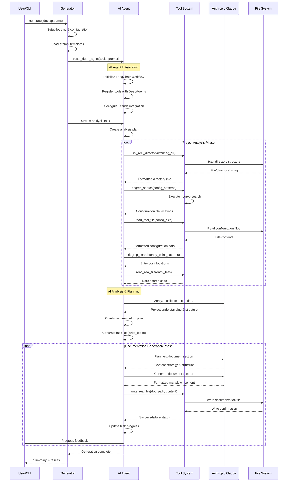
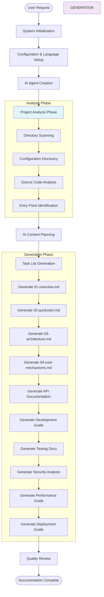
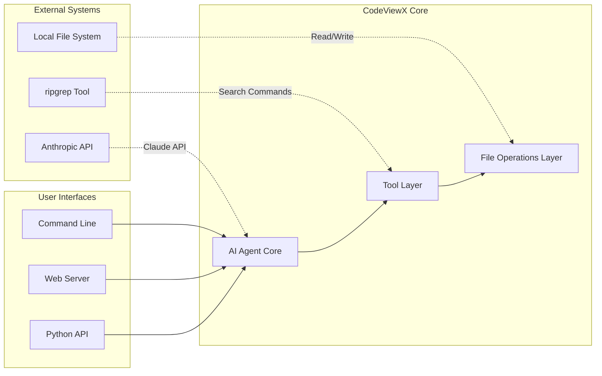

# Core Mechanisms

> This document provides an in-depth analysis of CodeViewX's most critical functional components and workflows.

## Core Mechanism #1: AI-Powered Documentation Generation Workflow

### Overview

The documentation generation workflow is the heart of CodeViewX, representing a sophisticated AI-driven process that transforms raw code into comprehensive technical documentation. This mechanism combines multi-step reasoning, tool orchestration, and intelligent content synthesis to deliver high-quality documentation that accurately reflects the codebase's structure, design patterns, and architectural decisions.

**Key Purpose**: Automate the complex process of technical documentation creation while maintaining accuracy, completeness, and contextual relevance through AI-driven analysis and synthesis.

**Trigger Conditions**:
- User initiates documentation generation via CLI, API, or web interface
- Target project directory is specified or defaults to current directory
- Output directory and language preferences are configured

**Expected Results**:
- Complete set of technical documentation files (8+ chapters)
- Accurate code analysis and dependency mapping
- Contextually appropriate content in specified language
- Structured documentation with cross-references and navigation

### Workflow Architecture Diagram



### Detailed Step Analysis

#### Step 1: System Initialization and Configuration
- **Trigger**: `generate_docs()` function invocation
- **Executor**: `generator.py:generate_docs()`
- **Input**: Working directory, output directory, language preferences, recursion limit, verbose flag
- **Processing Logic**:
  1. **Language Detection**: Automatically detect UI language and documentation language preferences
  2. **Logging Setup**: Configure appropriate logging levels based on verbose flag
  3. **Configuration Validation**: Validate paths and parameters
  4. **Prompt Loading**: Load appropriate prompt templates based on target language
  5. **Tool Registration**: Register all available tools for AI agent use

**Key Implementation Details**:
```python
def generate_docs(working_directory=None, output_directory="docs", 
                  doc_language=None, ui_language=None, recursion_limit=1000, 
                  verbose=False):
    # Language detection and setup
    if ui_language is None:
        ui_language = detect_ui_language()
    get_i18n().set_locale(ui_language)
    
    # Logging configuration
    log_level = logging.DEBUG if verbose else logging.INFO
    logging.basicConfig(level=log_level, format='%(asctime)s - %(levelname)s - %(message)s')
    
    # Directory validation and defaults
    if working_directory is None:
        working_directory = os.getcwd()
    if doc_language is None:
        doc_language = detect_system_language()
```

Reference: [generator.py](../codeviewx/generator.py#L25-L60)

- **Output**: Configured system ready for AI agent initialization
- **Side Effects**: Logging system initialized, internationalization configured, directories validated
- **Error Handling**: Comprehensive error handling for missing directories, invalid configurations, and language detection failures

#### Step 2: AI Agent Creation and Tool Registration
- **Trigger**: System initialization completion
- **Executor**: `generator.py:generate_docs()` via DeepAgents framework
- **Input**: Tool list, prompt template, configuration parameters
- **Processing Logic**:
  1. **Tool Collection**: Gather all available tools (filesystem, search, command execution)
  2. **Agent Initialization**: Create DeepAgents instance with tool access
  3. **Prompt Integration**: Load and format prompt templates with project-specific parameters
  4. **Workflow Configuration**: Set up LangChain workflow with recursion limits and streaming

**Critical Code Section**:
```python
# Load and configure prompt
prompt = load_prompt("document_engineer", 
                    working_directory=working_directory,
                    output_directory=output_directory, 
                    doc_language=doc_language)

# Register tools for AI agent
tools = [execute_command, ripgrep_search, write_real_file, read_real_file, list_real_directory]

# Create AI agent with tool access
agent = create_deep_agent(tools, prompt)
```

Reference: [generator.py](../codeviewx/generator.py#L75-L85)

- **Output**: Fully configured AI agent ready for analysis tasks
- **Side Effects**: AI agent initialized with tool access, prompt loaded with project context
- **Performance Considerations**: Agent creation is one-time cost; subsequent operations reuse the same agent instance

#### Step 3: Project Structure Analysis
- **Trigger**: AI agent begins analysis workflow
- **Executor**: AI Agent via `list_real_directory()` and `ripgrep_search()` tools
- **Input**: Working directory path
- **Processing Logic**:
  1. **Directory Scanning**: Recursively scan project directory structure
  2. **File Classification**: Identify source files, configuration files, documentation, and build artifacts
  3. **Pattern Matching**: Search for common project patterns and entry points
  4. **Dependency Analysis**: Identify import relationships and module dependencies

**Tool Implementation Analysis**:
```python
def list_real_directory(directory: str = ".") -> str:
    # Scan directory and classify items
    items = os.listdir(directory)
    dirs = [f"📁 {item}/" for item in items if os.path.isdir(os.path.join(directory, item))]
    files = [f"📄 {item}" for item in items if os.path.isfile(os.path.join(directory, item))]
    
    # Format output with statistics
    result = f"Directory: {os.path.abspath(directory)}\n"
    result += f"Total {len(dirs)} directories, {len(files)} files\n\n"
    return result
```

Reference: [filesystem.py](../codeviewx/tools/filesystem.py#L78)

- **Output**: Structured directory listing with file classification and statistics
- **Side Effects**: No filesystem modifications, read-only analysis
- **Performance**: Optimized to avoid scanning ignored directories (.git, node_modules, etc.)

#### Step 4: Configuration and Dependency Analysis
- **Trigger**: Directory structure analysis completion
- **Executor**: AI Agent via `ripgrep_search()` and `read_real_file()` tools
- **Input**: Identified configuration files and dependency specifications
- **Processing Logic**:
  1. **Configuration Discovery**: Search for project configuration files (package.json, requirements.txt, pyproject.toml, etc.)
  2. **Dependency Parsing**: Analyze dependency specifications and versions
  3. **Build System Detection**: Identify build tools and frameworks in use
  4. **Technology Stack Inference**: Determine primary technologies and frameworks

**Search Pattern Implementation**:
```python
def ripgrep_search(pattern: str, path: str = ".", file_type: str = None, 
                   ignore_case: bool = False, max_count: int = 100) -> str:
    # Initialize ripgrep with pattern and path
    rg = Ripgrepy(pattern, path)
    rg = rg.line_number().with_filename().max_count(max_count)
    
    # Apply ignore patterns for common non-source files
    ignore_patterns = [".git", ".venv", "node_modules", "__pycache__", 
                      ".pytest_cache", "dist", "build", "*.pyc"]
    for ignore_pattern in ignore_patterns:
        rg = rg.glob(f"!{ignore_pattern}")
    
    # Execute search and return formatted results
    result = rg.run().as_string
    return result if result.strip() else f"No matches found for '{pattern}'"
```

Reference: [search.py](../codeviewx/tools/search.py#L15)

- **Output**: Comprehensive dependency and configuration analysis
- **Side Effects**: No modifications, analysis only
- **Error Handling**: Graceful handling of missing files and parse errors

#### Step 5: Source Code Analysis and Entry Point Identification
- **Trigger**: Configuration analysis completion
- **Executor**: AI Agent via targeted search and file reading
- **Input**: Project structure and configuration information
- **Processing Logic**:
  1. **Entry Point Detection**: Search for main functions, application entry points, and API endpoints
  2. **Core Module Analysis**: Identify primary business logic modules and key classes
  3. **Design Pattern Recognition**: Detect common design patterns and architectural approaches
  4. **Code Complexity Assessment**: Analyze code complexity and identify critical components

**Entry Point Search Strategy**:
```python
# Common entry point patterns searched by AI agent
entry_patterns = [
    "def main|if __name__",           # Python entry points
    "func main|@SpringBootApplication", # Java/Go entry points
    "app\\.listen|server\\.start",    # Node.js servers
    "Router|@app\\.route",           # Web framework routes
    "class.*Controller|@RestController" # MVC controllers
]
```

- **Output**: Detailed understanding of project architecture and core functionality
- **Side Effects**: No modifications, comprehensive code analysis
- **Performance Considerations**: Efficient search using ripgrep for large codebases

#### Step 6: AI-Powered Content Planning and Structuring
- **Trigger**: Completion of code analysis phase
- **Executor**: Anthropic Claude via DeepAgents framework
- **Input**: All collected project data and analysis results
- **Processing Logic**:
  1. **Project Categorization**: Classify project type (web app, CLI tool, library, etc.)
  2. **Documentation Strategy**: Determine appropriate documentation structure and depth
  3. **Content Planning**: Create detailed plan for each documentation chapter
  4. **Task Generation**: Generate structured task list for documentation generation

**AI Planning Process**:
The AI agent analyzes all collected data to create a comprehensive documentation strategy:
- **Project Understanding**: Synthesize code structure, dependencies, and architecture
- **Audience Analysis**: Determine target audience and appropriate technical depth
- **Content Strategy**: Plan documentation chapters and their relationships
- **Quality Criteria**: Establish standards for accuracy, completeness, and clarity

- **Output**: Structured documentation plan with task priorities and dependencies
- **Side Effects**: Internal AI state preparation for content generation
- **Error Recovery**: AI can adjust plans based on analysis quality and available information

#### Step 7: Progressive Document Generation
- **Trigger**: Documentation plan approval
- **Executor**: AI Agent via `write_real_file()` tool
- **Input**: Structured content plan and project analysis data
- **Processing Logic**:
  1. **Chapter-by-Chapter Generation**: Generate each documentation section sequentially
  2. **Content Synthesis**: Combine code analysis with natural language generation
  3. **Cross-Reference Integration**: Add links between related sections and code references
  4. **Quality Assurance**: Internal AI review for accuracy and completeness

**Document Generation Implementation**:
```python
def write_real_file(file_path: str, content: str) -> str:
    # Create directory structure if needed
    directory = os.path.dirname(file_path)
    if directory and not os.path.exists(directory):
        os.makedirs(directory, exist_ok=True)
    
    # Write content with UTF-8 encoding
    with open(file_path, 'w', encoding='utf-8') as f:
        f.write(content)
    
    # Return operation status
    file_size = os.path.getsize(file_path)
    return f"✅ Successfully wrote file: {file_path} ({file_size/1024:.2f} KB)"
```

Reference: [filesystem.py](../codeviewx/tools/filesystem.py#L12)

- **Output**: Complete set of markdown documentation files
- **Side Effects**: Creates directory structure and writes documentation files
- **Progress Tracking**: Real-time feedback on generation progress and document completion

### Data Flow Architecture



### Exception Handling and Error Recovery

| Exception Scenario | Detection Method | Recovery Strategy | User Feedback |
|-------------------|------------------|-------------------|---------------|
| Missing API Key | API response validation | Prompt for API key configuration | Clear error message with setup instructions |
| Invalid Project Path | File system validation | Fallback to current directory | Warning about path change |
| ripgrep Not Installed | Tool execution failure | Suggest installation commands | Installation instructions for current OS |
| Insufficient Permissions | File system operation errors | Skip inaccessible files, continue analysis | Warning about skipped files |
| API Rate Limits | HTTP response codes | Exponential backoff, retry with delays | Progress indicator with retry information |
| Large Project Timeout | Execution time monitoring | Increase recursion limit, suggest project segmentation | Guidance on handling large projects |

### Performance Optimization Strategies

#### 1. Intelligent File Filtering
- **Pattern-Based Exclusion**: Automatically ignore common non-source directories (.git, node_modules, build artifacts)
- **File Type Prioritization**: Prioritize analysis of source files over documentation and test files
- **Size Limits**: Implement file size limits to prevent analysis of extremely large files

#### 2. Parallel Processing
- **Concurrent Tool Execution**: Execute multiple analysis tools in parallel where possible
- **Asynchronous I/O**: Use asynchronous operations for file reading and searching
- **Resource Pooling**: Reuse tool instances and connections across operations

#### 3. Caching Mechanisms
- **Analysis Result Caching**: Cache results of expensive analysis operations
- **Incremental Updates**: Only reanalyze changed files in subsequent runs
- **Dependency Graph Caching**: Cache discovered dependency relationships

#### 4. AI Optimization
- **Context Management**: Optimize prompt context to include most relevant information
- **Streaming Responses**: Process AI responses incrementally for faster feedback
- **Batch Processing**: Group related analysis tasks to reduce API calls

### Design Highlights and Innovations

#### 1. **AI-First Architecture**
Unlike traditional documentation generators that rely on templates and static analysis, CodeViewX uses AI as the primary driver for understanding and synthesizing documentation content. This approach enables:
- **Deep Code Understanding**: Beyond syntax analysis to comprehend design intent
- **Contextual Generation**: Documentation that reflects project-specific patterns and conventions
- **Adaptive Content**: Automatic adjustment of technical depth and focus based on project complexity

#### 2. **Tool Integration Pattern**
The modular tool system provides clean abstractions for AI agents while maintaining robust error handling and performance optimization:
```python
# Standardized tool interface enables seamless AI integration
def tool_function(param1: str, param2: Optional[str] = None) -> str:
    try:
        # Tool-specific logic
        return "Success: Result information"
    except Exception as e:
        return f"Error: {str(e)}"
```

Reference: [tools/__init__.py](../codeviewx/tools/__init__.py#L5)

#### 3. **Progressive Enhancement**
The system generates documentation progressively, providing real-time feedback and allowing users to monitor progress:
- **Task Planning**: AI creates structured task lists with clear priorities
- **Incremental Generation**: Documents are generated one at a time with status updates
- **Quality Validation**: Each document is validated before moving to the next

#### 4. **Multi-Language Architecture**
Built-in support for generating documentation in multiple languages, not just UI translation:
- **Cultural Adaptation**: Technical documentation adapted for different technical cultures
- **Terminology Localization**: Appropriate technical terminology for each language
- **Structural Variations**: Documentation structure optimized for different documentation traditions

### Integration Points and Dependencies

#### Core Dependencies Analysis
- **LangChain Ecosystem**: Provides the foundation for AI agent orchestration and workflow management
- **DeepAgents Framework**: Enables sophisticated multi-agent coordination and tool usage
- **Anthropic Claude**: Powers the core analysis and content generation capabilities
- **ripgrep Engine**: Provides high-performance code searching and pattern matching

#### System Integration Points


This core mechanism represents a sophisticated approach to automated documentation generation that combines state-of-the-art AI capabilities with robust software engineering practices, resulting in a system that can understand, analyze, and document complex codebases with minimal human intervention.