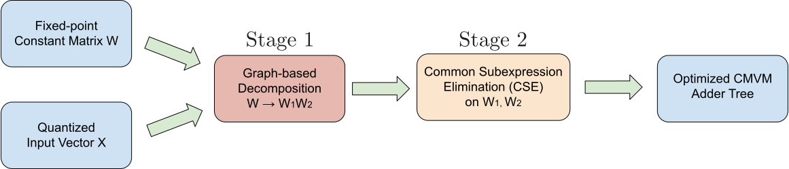
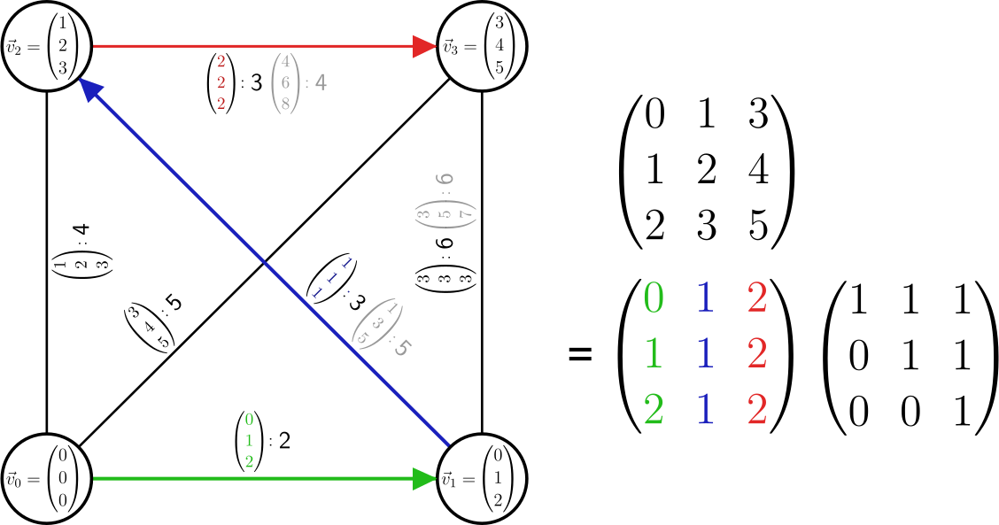
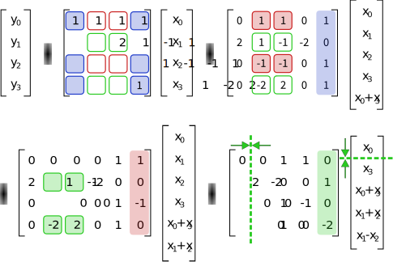
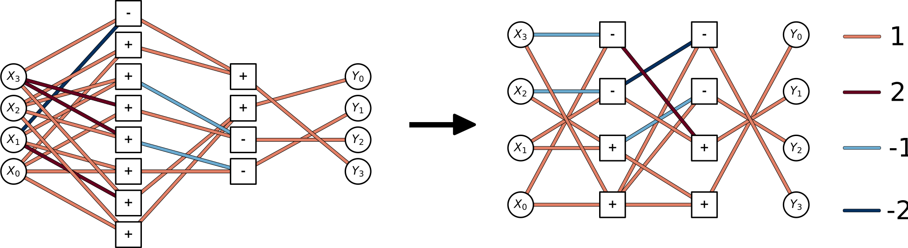

# CMVM Optimization Algorithm

The core of da4ml is a high-performance hybrid algorithm for optimizing Constant Matrix-Vector Multiplication (CMVM) operations. The goal is to implement the operation $y = Wx$, where $W$ is a constant matrix, as an efficient adder tree on an FPGA while minimizing resource usage (LUTs) and latency.

The algorithm operates in two main stages, as illustrated below.

## Stage 1: Graph-based Decomposition

The first stage aims to exploit high-level structural similarities between the columns of the constant matrix W.

1. Graph Construction: A graph is constructed where each column vector of the matrix W is treated as a vertex. An additional root vertex representing a zero vector is added. The "distance" between any two vertices is defined by the number of non-zero digits in their sum or difference (whichever is smaller).
2. Minimum Spanning Tree: An approximate Minimum Spanning Tree (MST) is found for this graph using Prim's algorithm. This tree connects the columns in a way that minimizes the "cost" of transforming one column into another.
3. Matrix Decomposition: The original matrix W is then decomposed into the product of two matrices, $W = W_1 W_2$. The edges of the MST form the columns of $W_1$, while $W_2$ records how these basis vectors are combined to reconstruct the original columns of W. This decomposition is particularly effective for matrices with highly correlated columns.

## Stage 2: Common Subexpression Elimination (CSE)

The second stage applies a greedy Common Subexpression Elimination (CSE) algorithm to the decomposed matrices W_1 and W_2 independently. This stage minimizes the number of adders required by finding and reusing common intermediate calculations.

1. CSD representation: The matrix elements are first converted into the Canonical Signed Digit (CSD) representation. CSD is a minimal representation that reduces the number of non-zero digits, which directly corresponds to the number of add/subtract operations needed.
2. Greedy subexpression finding: The algorithm iteratively identifies the most frequently occurring two-term subexpression of the form $a \pm (b << s)$ (shifted addition/subtraction).
3. Substitution: The found most common subexpression is implemented as a single operation. All occurrences of this pattern throughout the matrix are then replaced with a reference to this new, intermediate result.
4. Bitwidth weighting: The selection of the best subexpression to eliminate is weighted by the bitwidths of the operands to prioritize operations that offer the most significant hardware savings.

This process is repeated until no more common subexpressions exists, resulting in a highly optimized adder tree that implements the original CMVM operation with significantly fewer resources than a naive implementation in HLS or HDL.

An example of the stage 2 optimization is shown below. Without CSE, 12 adders/subtractors are required to implement the operation, while with CSE, only 8 are needed due to the elimination of common subexpressions.

