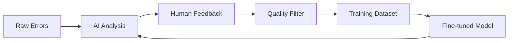

# DAGnostics Feedback System Architecture

## Overview

The DAGnostics feedback system provides a comprehensive solution for collecting, managing, and utilizing human feedback to improve AI error analysis. This document explains where data is stored, how to collect feedback, and how to use it for continuous model improvement.

## Data Storage Architecture

### 1. Storage Locations

```
data/
├── dagnostics_feedback.db          # SQLite database (main storage)
├── feedback_data.jsonl             # Legacy JSONL backup
├── training_data.jsonl              # Original training data
├── training/
│   ├── train_dataset.jsonl          # Generated training dataset
│   ├── validation_dataset.jsonl     # Generated validation dataset
│   └── feedback_export.jsonl       # Exported quality feedback
└── raw/                             # Raw Airflow logs (if ingested)
```

### 2. Database Schema

**SQLite Database (`data/dagnostics_feedback.db`)**:

```sql
-- Raw error logs from Airflow/ETL systems
error_logs (
    id, timestamp, date, dag_id, task_id, run_id,
    error_message, log_context, error_category, severity, resolved
)

-- AI analysis results
ai_analysis (
    id, error_log_id, analysis_timestamp, extracted_error,
    predicted_category, predicted_severity, confidence_score,
    reasoning, model_version
)

-- Human feedback and corrections
user_feedback (
    id, error_log_id, ai_analysis_id, user_id, feedback_timestamp,
    corrected_error, corrected_category, corrected_severity,
    corrected_confidence, corrected_reasoning, user_rating, comments
)

-- Training session tracking
training_sessions (
    id, session_timestamp, model_name, training_data_size,
    hyperparameters, training_metrics, model_path
)
```

## Feedback Collection Workflows

### 1. Daily Error Review

**Scenario**: Review today's errors and provide feedback on each

```bash
# Review today's errors interactively
uv run dagnostics feedback review-daily

# Review specific date
uv run dagnostics feedback review-daily --date 2025-08-13

# Limit number of errors to review
uv run dagnostics feedback review-daily --limit 5
```

**Interactive Flow**:
1. Shows error log context
2. Displays current AI analysis (if any)
3. Prompts for corrections:
   - Corrected error message
   - Category selection
   - Severity level
   - Confidence score
   - Reasoning
   - Rating of AI analysis (1-5)
   - Additional comments

### 2. Bulk Feedback Sessions

**Scenario**: Process multiple errors efficiently

```bash
# Start bulk feedback session
uv run dagnostics feedback bulk-feedback --days 7 --max-errors 20

# Focus on specific error category
uv run dagnostics feedback bulk-feedback --category configuration_error

# Only show errors that have been analyzed by AI
uv run dagnostics feedback bulk-feedback --require-analysis
```

**Features**:
- Side-by-side error and analysis comparison
- Progress tracking (5/20 reviewed, 3 feedback collected)
- Batch processing with continuation prompts

### 3. Web Interface Integration

**Scenario**: Users browse to web interface for specific errors

```python
# In production, integrate with your error monitoring
from dagnostics.web.feedback import FeedbackCollector
from dagnostics.storage.feedback_db import FeedbackDatabase

# When an error occurs and is analyzed:
db = FeedbackDatabase()
error_id = db.store_error_log(dag_id, task_id, run_id, error_msg, log_context)
analysis_id = db.store_ai_analysis(error_id, extracted_error, category, severity, confidence, reasoning)

# Generate feedback URL for users
feedback_url = f"https://your-dagnostics.com/feedback?error_id={error_id}"
```

## Feedback Management Commands

### 1. List and Filter Errors

```bash
# List recent errors with analysis/feedback status
uv run dagnostics feedback list-errors --days 7

# Filter by DAG
uv run dagnostics feedback list-errors --dag-id my_etl_dag

# Show only errors missing analysis
uv run dagnostics feedback list-errors --show-analyzed false

# Show only errors missing feedback
uv run dagnostics feedback list-errors --show-feedback false
```

### 2. Export and Statistics

```bash
# Show feedback statistics
uv run dagnostics feedback stats --days 30

# Export daily feedback
uv run dagnostics feedback export-daily --date 2025-08-13

# Export quality feedback for training (rating >= 4)
uv run dagnostics training export-feedback --min-rating 4
```

## Integration with Fine-tuning Pipeline

### 1. Training Data Flow



### 2. Continuous Improvement Cycle

```bash
# 1. Collect daily feedback
uv run dagnostics feedback review-daily

# 2. Check training data quality
uv run dagnostics feedback stats

# 3. Generate updated training dataset
uv run dagnostics training generate-dataset --include-feedback

# 4. Train improved model (on GPU machine)
uv run dagnostics training train-model

# 5. Deploy updated model
uv run dagnostics training deploy-ollama /path/to/model
```

## Production Deployment Scenarios

### 1. Small Team (Manual Review)

```bash
# Daily routine:
# 1. Check overnight errors
uv run dagnostics feedback list-errors --days 1

# 2. Review and provide feedback
uv run dagnostics feedback review-daily --limit 10

# 3. Weekly training update
uv run dagnostics training pipeline  # When enough feedback collected
```

### 2. Medium Team (Distributed Review)

```bash
# Team lead assigns error review
uv run dagnostics feedback list-errors --days 1 --dag-id team1_dags
uv run dagnostics feedback list-errors --days 1 --dag-id team2_dags

# Individual team members provide feedback
uv run dagnostics feedback bulk-feedback --dag-id team1_dags --max-errors 5

# Automated training trigger when feedback threshold reached
if [ $(uv run dagnostics feedback stats --days 7 | grep "Recent" | awk '{print $3}') -ge 20 ]; then
    uv run dagnostics training pipeline
fi
```

### 3. Large Organization (Automated + Web)

- **Web Interface**: Users click feedback links in error notifications
- **API Integration**: Automated error ingestion from Airflow webhooks
- **Scheduled Training**: Weekly model updates with collected feedback
- **A/B Testing**: Compare model versions with feedback quality metrics

## Data Privacy and Security

### 1. Data Sanitization

```python
# Before storing, sanitize sensitive data
sanitized_log = sanitize_sensitive_data(raw_log_context)
db.store_error_log(dag_id, task_id, run_id, error_msg, sanitized_log)
```

### 2. Access Control

```bash
# Feedback access by user role
uv run dagnostics feedback review-daily --user-id analyst1
uv run dagnostics feedback export-daily --user-id admin --date 2025-08-13
```

### 3. Data Retention

```python
# Automatic cleanup of old feedback
db.cleanup_old_data(retention_days=365)
```

## Monitoring and Analytics

### 1. Feedback Quality Metrics

```bash
# Track feedback collection progress
uv run dagnostics feedback stats

# Model improvement tracking
uv run dagnostics training feedback-stats
```

### 2. Error Pattern Analysis

```sql
-- Find most common error categories
SELECT corrected_category, COUNT(*) as count
FROM user_feedback
WHERE feedback_timestamp >= '2025-08-01'
GROUP BY corrected_category
ORDER BY count DESC;

-- Identify errors needing more analysis
SELECT dag_id, task_id, COUNT(*) as error_count
FROM error_logs e
LEFT JOIN ai_analysis a ON e.id = a.error_log_id
WHERE a.id IS NULL
GROUP BY dag_id, task_id
ORDER BY error_count DESC;
```

## Troubleshooting

### Common Issues

1. **No feedback collected**: Check database permissions and file paths
2. **Training dataset empty**: Ensure feedback has been exported with `export-feedback`
3. **Web interface not accessible**: Check FastAPI server configuration
4. **SQLite locks**: Use connection pooling for concurrent access

### Debugging Commands

```bash
# Check database status
sqlite3 data/dagnostics_feedback.db "SELECT COUNT(*) FROM user_feedback;"

# Validate training data
uv run dagnostics training generate-dataset --min-examples 5

# Test feedback collection
uv run dagnostics feedback review-daily --limit 1
```

This comprehensive feedback system enables continuous improvement of your error analysis accuracy through systematic collection and utilization of human expertise.
