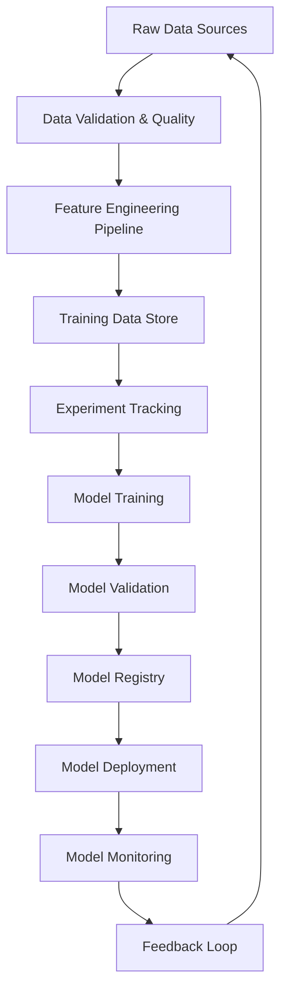

# DAGnostics MLOps Architecture

## 🎯 Vision
Transform DAGnostics into a production-grade AI/ML system with full MLOps capabilities, serving as a reference implementation for enterprise AI projects.

## 🏗️ Architecture Overview

## 🔧 Core Components

### 1. Data Management
- **Data Validation**: Schema validation, quality checks, anomaly detection
- **Data Versioning**: DVC for dataset versioning
- **Feature Store**: Centralized feature management
- **Data Lineage**: Track data flow and dependencies

### 2. Experiment Management
- **Experiment Tracking**: MLflow for experiment logging
- **Hyperparameter Optimization**: Optuna for automated tuning
- **Reproducibility**: Seed management, environment versioning
- **Resource Management**: GPU/CPU allocation, cost tracking

### 3. Model Management
- **Model Registry**: Centralized model versioning
- **Model Validation**: Automated testing pipeline
- **A/B Testing**: Gradual rollout capabilities
- **Model Governance**: Approval workflows, compliance

### 4. Training Infrastructure
- **Containerized Training**: Docker + Kubernetes
- **Distributed Training**: Multi-GPU, multi-node support
- **Auto-scaling**: Dynamic resource allocation
- **Spot Instance Management**: Cost optimization

### 5. Monitoring & Observability
- **Performance Metrics**: Accuracy, latency, throughput
- **Data Drift Detection**: Statistical drift monitoring
- **Model Drift Detection**: Performance degradation alerts
- **Infrastructure Monitoring**: Resource utilization, costs

### 6. CI/CD Pipeline
- **Automated Testing**: Unit, integration, performance tests
- **Model Validation**: Automated quality gates
- **Deployment Automation**: Blue/green, canary deployments
- **Rollback Capabilities**: Automated fallback mechanisms

## 📊 Technology Stack

### Data & Storage
- **Data Lake**: MinIO/S3 for raw data
- **Feature Store**: Feast for feature management
- **Metadata**: PostgreSQL for experiment/model metadata
- **Caching**: Redis for performance optimization

### ML Lifecycle
- **Experiment Tracking**: MLflow
- **Hyperparameter Tuning**: Optuna
- **Data Validation**: Great Expectations
- **Model Training**: PyTorch/Transformers with distributed training

### Infrastructure
- **Container Orchestration**: Kubernetes
- **Service Mesh**: Istio for microservices
- **Monitoring**: Prometheus + Grafana
- **Logging**: ELK Stack (Elasticsearch, Logstash, Kibana)

### Development
- **Version Control**: Git with DVC for data
- **Code Quality**: Pre-commit hooks, pytest, black
- **Documentation**: Automatic API docs, model cards
- **Security**: Secrets management, vulnerability scanning

## 🎯 Implementation Phases

### Phase 1: Foundation (Week 1-2)
- [x] Basic training pipeline
- [ ] Experiment tracking setup
- [ ] Data validation framework
- [ ] Model registry implementation

### Phase 2: Automation (Week 3-4)
- [ ] Hyperparameter optimization
- [ ] Automated training pipelines
- [ ] Model validation framework
- [ ] CI/CD pipeline setup

### Phase 3: Production (Week 5-6)
- [ ] Monitoring and alerting
- [ ] A/B testing framework
- [ ] Performance optimization
- [ ] Security hardening

### Phase 4: Advanced (Week 7-8)
- [ ] Data drift detection
- [ ] Automated retraining
- [ ] Multi-model serving
- [ ] Edge deployment support

## 📈 Success Metrics

### Technical Metrics
- Model Training Time: < 30 minutes for full dataset
- Deployment Time: < 5 minutes end-to-end
- Model Accuracy: > 95% for error classification
- System Uptime: 99.9% availability

### Operational Metrics
- Experiment Reproduction: 100% reproducible
- Model Rollback Time: < 2 minutes
- Alert Response Time: < 1 minute detection
- Cost Efficiency: 50% reduction in training costs

### Business Metrics
- Time to Market: 80% faster model iterations
- Error Resolution: 90% automated error classification
- Developer Productivity: 3x faster debugging workflows
- System Reliability: 50% reduction in false alerts
