# Developer Onboarding Guide

Welcome to the Django Academic Management System development team! This guide will help you get up and running with the codebase quickly and effectively.

## Table of Contents

1. [Prerequisites](#prerequisites)
2. [Project Overview](#project-overview)
3. [Development Environment Setup](#development-environment-setup)
4. [Codebase Architecture](#codebase-architecture)
5. [Development Workflow](#development-workflow)
6. [Key Components Deep Dive](#key-components-deep-dive)
7. [Testing Guidelines](#testing-guidelines)
8. [Deployment Process](#deployment-process)
9. [Common Tasks](#common-tasks)
10. [Troubleshooting](#troubleshooting)

## Prerequisites

Before starting development, ensure you have:

- **Python 3.8+** installed
- **Docker & Docker Compose** (recommended setup)
- **PostgreSQL** (if not using Docker)
- **Git** for version control
- **Code Editor** (VS Code recommended with Python extensions)
- Basic understanding of:
  - Django framework
  - PostgreSQL
  - REST API development
  - JWT authentication

## Project Overview

This is a Django-based academic management system designed for Indonesian higher education institutions. The system:

- **Manages academic data** (students, faculty, courses, grades)
- **Integrates with Indonesian Feeder system** for government reporting
- **Provides REST APIs** for frontend applications
- **Supports multiple user types** (students, faculty, administrators)
- **Handles external system authentication** (SIAKAD, SIADIN)

### Key Technologies


## Development Environment Setup

### Option 1: Docker Setup (Recommended)

1. **Clone the repository**

   ```bash
   git clone <repository-url>
   cd acad_feeder
   ```

2. **Set up environment variables**

   ```bash
   cp .env_template .env
   # Edit .env with your configurations
   ```

3. **Start services**

   ```bash
   docker-compose up -d
   ```

4. **Initialize database**
   ```bash
   docker-compose exec acad_web python manage.py makemigrations
   docker-compose exec acad_web python manage.py migrate
   docker-compose exec acad_web python manage.py create_superadmin
   ```

### Option 2: Local Setup

1. **Install dependencies**

   ```bash
   pip install -r requirements.txt
   ```

2. **Configure database**

   ```bash
   # Set up PostgreSQL and update .env
   python manage.py makemigrations
   python manage.py migrate
   ```

3. **Create superuser**

   ```bash
   python manage.py createsuperuser
   # Or use: python manage.py create_superadmin
   ```

4. **Run development server**
   ```bash
   python manage.py runserver
   ```

### Access Points

After setup, you can access:

- **Django Admin**: http://localhost:1122/admin/
- **API Documentation**: http://localhost:1122/docs/
- **Web Dashboard**: http://localhost:1122/
- **Database**: localhost:1122 (Docker) or localhost:5432 (local)

### Default Credentials

- **Username**: `superadmin`
- **Password**: `superadmin123`
- **Email**: `superadmin@example.com`

## Codebase Architecture

### Directory Structure

```
acad_feeder/
├── acad_feeder/          # Django project settings
├── feeder/               # Core academic models and admin
├── api_siakad/          # REST API implementation
├── base_ui/             # Frontend templates and UI
├── migrator/            # Data migration and sync
├── docs/                # Documentation
├── static/              # Static files
├── media/               # User uploads
└── requirements.txt     # Python dependencies
```

### Django Apps Overview

```mermaid
graph TB
    subgraph "Core Apps"
        Feeder[feeder<br/>📊 Academic Models<br/>👑 Admin Interface<br/>🔄 Feeder Integration]
        BaseUI[base_ui<br/>🎨 Templates<br/>🖼️ UI Components<br/>🔐 Auth Views]
    end

    subgraph "API Layer"
        APICore[api_siakad<br/>🌐 REST API<br/>🔑 Authentication<br/>🛡️ Permissions]
    end

    subgraph "Data Management"
        Migrator[migrator<br/>📥 Data Import<br/>🔄 Sync Services<br/>⚙️ ETL Processes]
    end

    Feeder --> APICore
    Feeder --> BaseUI
    Feeder --> Migrator
```



## Development Workflow

### Git Workflow

1. **Create feature branch**

   ```bash
   git checkout -b feature/your-feature-name
   ```

2. **Make changes and commit**

   ```bash
   git add .
   git commit -m "feat: add new feature description"
   ```

3. **Run tests**

   ```bash
   python manage.py test
   ```

4. **Push and create PR**
   ```bash
   git push origin feature/your-feature-name
   # Create pull request via Git platform
   ```

### Development Best Practices

#### Code Style

- Follow **PEP 8** Python style guidelines
- Use meaningful variable and function names
- Add docstrings to classes and complex functions
- Keep functions focused and small

#### Model Development

```python
# Example model following project patterns
class YourModel(BaseTable):  # Always inherit from BaseTable
    name = models.CharField(max_length=100)
    id_related = models.ForeignKey(
        RelatedModel,
        on_delete=models.RESTRICT  # Use RESTRICT for safety
    )

    def __str__(self):
        return self.name

    def validate(self):
        # Implement validation logic
        pass

    def feeder_push(self):
        # Implement feeder sync
        pass

    def feeder_pull(self):
        # Implement feeder sync
        pass
```

#### API Development

```python
# Example API view following project patterns
class YourAPIView(APIView):
    permission_classes = [UniversalRoleBasedPermission]
    authentication_classes = [CustomJWTAuthentication]

    @swagger_auto_schema(
        operation_summary="Brief description",
        responses={200: YourSerializer()},
        tags=["Category"]
    )
    def get(self, request):
        # Implement your logic
        queryset = YourModel.objects.select_related('id_related')
        serializer = YourSerializer(queryset, many=True)
        return create_response(data=serializer.data)
```

## Key Components Deep Dive

### 1. BaseTable Pattern

All models inherit from `BaseTable` which provides:

```python
# Common fields automatically added:
created_at = models.DateTimeField(auto_now_add=True)
updated_at = models.DateTimeField(auto_now=True)
status = models.CharField(max_length=20, default="uncheck")
sync = models.CharField(max_length=10, default="unsync")
deleted = models.BooleanField(default=False)

# Automatic soft delete
obj.delete()  # Sets deleted=True
obj.restore()  # Sets deleted=False
obj.purge()  # Actually deletes from database
```

### 2. Permission System

Understanding the permission hierarchy:


### 3. Feeder Integration

The system integrates with Indonesian government systems:

```python
# Feeder connection example
from feeder.utils.feeder_connect import FeederConn

fdr = FeederConn()
result = fdr.get(endpoint, offset=0, limit=1000)
fdr.insert(endpoint, data)
fdr.update(endpoint, key, data)
fdr.delete(endpoint, key)
```

### 4. API Response Format

All APIs return standardized responses:

```python
# Success response
{
    "message": "Success",
    "data": [...],
    "count": 10,
    "meta": {
        "page": 1,
        "page_size": 10,
        "total_pages": 5
    }
}

# Error response
{
    "error": {
        "code": "VALIDATION_ERROR",
        "message": "Validation failed",
        "details": [...]
    }
}
```

## Testing Guidelines

### Running Tests

```bash
# Run all tests
python manage.py test

# Run specific app tests
python manage.py test api_siakad

# Run with coverage
coverage run --source='.' manage.py test
coverage report
```

### Writing Tests

```python
from django.test import TestCase
from rest_framework.test import APITestCase

class YourModelTest(TestCase):
    def setUp(self):
        # Set up test data
        pass

    def test_model_functionality(self):
        # Test your model logic
        pass

class YourAPITest(APITestCase):
    def setUp(self):
        # Create test user and authenticate
        pass

    def test_api_endpoint(self):
        response = self.client.get('/api/v1/your-endpoint/')
        self.assertEqual(response.status_code, 200)
```

## Deployment Process

### Production Deployment

1. **Environment Configuration**

   ```bash
   # Set production environment variables
   DJANGO_SECRET_KEY=your-production-secret
   DEBUG=False
   DJANGO_ALLOWED_HOSTS=your-domain.com
   ```

2. **Database Migration**

   ```bash
   python manage.py migrate
   python manage.py collectstatic
   ```

3. **Docker Deployment**
   ```bash
   docker-compose -f docker-compose.prod.yml up -d
   ```

### Environment Variables

Key environment variables to configure:

```bash
# Database
POSTGRES_HOST=db
POSTGRES_USER=acad_admin
POSTGRES_PASSWORD=secure_password
POSTGRES_DB=acad_feeder
POSTGRES_PORT=5432

# Django
DJANGO_SECRET_KEY=your-secret-key
DJANGO_ALLOWED_HOSTS=localhost 127.0.0.1 your-domain.com
DEBUG=False

# Feeder Integration
FEEDER_URL=http://your-feeder-url/ws/live2.php
FEEDER_USERNAME=your-username
FEEDER_PASS=your-password
```

## Common Tasks

### Adding a New Model

1. **Create model in appropriate app**

   ```python
   # feeder/models/your_module.py
   class YourModel(BaseTable):
       # Your fields
       pass
   ```

2. **Add to models **init**.py**

   ```python
   # feeder/models/__init__.py
   from .your_module import *
   ```

3. **Create and run migration**

   ```bash
   python manage.py makemigrations
   python manage.py migrate
   ```

4. **Add admin interface**
   ```python
   # feeder/admin/your_admin.py
   @admin.register(YourModel)
   class YourModelAdmin(BaseAdmin):
       # Admin configuration
       pass
   ```

### Adding a New API Endpoint

1. **Create serializer**

   ```python
   # api_siakad/apps/your_app/serializers.py
   class YourSerializer(serializers.ModelSerializer):
       class Meta:
           model = YourModel
           fields = '__all__'
   ```

2. **Create view**

   ```python
   # api_siakad/apps/your_app/views.py
   class YourAPIView(APIView):
       # Implementation
       pass
   ```

3. **Add URL pattern**

   ```python
   # api_siakad/apps/your_app/urls.py
   urlpatterns = [
       path('your-endpoint/', YourAPIView.as_view()),
   ]
   ```

4. **Include in main URLs**
   ```python
   # api_siakad/api/v1/urls.py
   path('your-app/', include('api_siakad.apps.your_app.urls')),
   ```

### Data Migration from Feeder

```bash
# Import data from feeder system
python run-scripts.py

# Or specific imports
python manage.py shell_plus
from migrator.feeder_migrate.import_mahasiswa import import_mahasiswa
import_mahasiswa()
```

### Managing User Groups

```bash
# List user groups
python manage.py manage_user_groups --action list

# Add user to group
python manage.py manage_user_groups --action add --user username --group Kaprodi

# Remove user from group
python manage.py manage_user_groups --action remove --user username --group Dosen

# Clear all groups for user
python manage.py manage_user_groups --action clear --user username
```

## Troubleshooting

### Common Issues

#### Database Connection Issues

```bash
# Check database status
docker-compose logs acad_db

# Reset database
docker-compose down -v
docker-compose up -d
```

#### Permission Errors

```bash
# Fix group assignments
python manage.py fix_mahasiswa_groups
python manage.py fix_npp_groups
python manage.py setup_permissions
```

#### Feeder Integration Issues

```bash
# Check feeder connection
python manage.py shell_plus
from feeder.utils.feeder_connect import FeederConn
fdr = FeederConn()
# Test connection
```

#### Migration Issues

```bash
# Reset migrations (be careful!)
python manage.py migrate feeder zero
python manage.py migrate feeder

# Or specific migration
python manage.py migrate feeder 0017_dosen_npp
```

### Debug Tools

#### Django Shell Plus

```bash
python manage.py shell_plus
# Auto-imports all models
```

#### API Testing

```bash
# Use the provided REST client
# See docs/api-test/feeder.rest
```

#### Profiling

```bash
# Django Silk is enabled
# Visit /silk/ for profiling data
```

### Getting Help

1. **Check Documentation**
   - `docs/ARCHITECTURE.md` - System architecture
   - `docs/PERMISSIONS_GUIDE.md` - Permission system
   - `/docs/` - API documentation

2. **Code Examples**
   - Look at existing models in `feeder/models/`
   - Check API patterns in `api_siakad/apps/`
   - Review admin customizations in `feeder/admin/`

3. **Team Resources**
   - Code reviews for guidance
   - Team knowledge sharing sessions
   - Documentation updates

## Next Steps

After completing this onboarding:

1. **Explore the codebase** - Start with simple models and APIs
2. **Make a small contribution** - Fix a minor issue or add documentation
3. **Understand the domain** - Learn about Indonesian academic systems
4. **Join development discussions** - Participate in architecture decisions

Welcome to the team! Happy coding! 🚀
