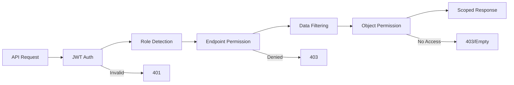

# 📚 API Documentation Suite

Enhanced API documentation dengan role-based access control untuk Sistem Akademik.

## 🎯 Overview

Dokumentasi ini menyediakan comprehensive guide untuk:
- **Role-based API access matrix**
- **Enhanced Swagger/OpenAPI documentation**
- **Security implementation guidelines**
- **Integration examples**

## 📋 Documentation Structure

### 1. **API Role Access Matrix** 📊
**File:** [`API_ROLE_ACCESS_MATRIX.md`](./API_ROLE_ACCESS_MATRIX.md)

Dokumentasi lengkap sistem permission dan akses role-based untuk setiap endpoint API.

**Includes:**
- ✅ Complete role matrix untuk semua endpoints
- ✅ Permission scope descriptions
- ✅ Data filtering logic per role
- ✅ Implementation details dan examples
- ✅ Testing scenarios
- ✅ Migration guide

**Key Sections:**
```
📊 Role Overview & Permission Logic
🏫 Academic Management APIs
📊 Assessment & Grading APIs
👥 Student Academic Services (SIADIN)
📚 Reference Data APIs
🔧 Backend Implementation Details
🚀 API Integration Examples
```

### 2. **Swagger Role Integration** 🔧
**File:** [`SWAGGER_ROLE_INTEGRATION_EXAMPLE.md`](./SWAGGER_ROLE_INTEGRATION_EXAMPLE.md)

Panduan implementasi enhanced API documentation dengan role matrix menggunakan custom utilities.

**Includes:**
- ✅ Custom Swagger decorators with role info
- ✅ Ready-to-use utilities di `core/utils/swagger_role_utils.py`
- ✅ Complete implementation examples
- ✅ OpenAPI schema configuration
- ✅ Migration scripts dan checklist

**Key Features:**
```python
@kaprodi_admin_only(
    operation_summary="List Dosen",
    operation_description="Administrative access only",
    tags=['👨‍🏫 Dosen Management']
)
def get(self, request):
    # Automatic role documentation in Swagger UI
```

### 3. **API Security Guide** 🔒
**File:** [`API_SECURITY_GUIDE.md`](./API_SECURITY_GUIDE.md)

Comprehensive security documentation covering authentication, authorization, dan best practices.

**Includes:**
- ✅ Multi-layer security architecture
- ✅ JWT authentication implementation
- ✅ Permission system detailed flow
- ✅ Security vulnerability mitigations
- ✅ Audit logging dan monitoring
- ✅ Development testing guidelines

**Key Sections:**
```
🔐 Security Overview & Architecture
🔑 JWT Authentication System
🛡️ Permission System Implementation
🚨 Security Vulnerabilities & Mitigations
📊 Security Monitoring & Auditing
🔧 Development & Testing Guidelines
```

## 🚀 Quick Start

### 1. **Implementing Role Documentation**

```python
# 1. Import utilities
from core.utils.swagger_role_utils import kaprodi_admin_only, staff_only

# 2. Replace existing decorators
@kaprodi_admin_only(
    operation_summary="Your Endpoint",
    operation_description="Enhanced with role info",
    tags=['Your API']
)
def your_view(self, request):
    pass
```

### 2. **Testing Role Matrix**

```bash
# Access enhanced Swagger UI
http://localhost:8000/swagger/

# Test with different role tokens
curl -H "Authorization: Bearer <kaprodi_token>" /api/v1/mata-kuliah/
curl -H "Authorization: Bearer <dosen_token>" /api/v1/mata-kuliah/
curl -H "Authorization: Bearer <mahasiswa_token>" /api/v1/siadin-mhs/jadwal/
```

### 3. **Verifying Permission Implementation**

```python
# Check automatic filtering
from core.utils.permission_utils import filter_queryset_by_permission

queryset = Model.objects.filter(deleted=False)
filtered_queryset = filter_queryset_by_permission(
    request.user, queryset, 'model_name'
)
```

## 📊 Implementation Status

| Component | Status | Location | Description |
|-----------|--------|----------|-------------|
| ✅ **Role Matrix Documentation** | Complete | `API_ROLE_ACCESS_MATRIX.md` | Comprehensive endpoint documentation |
| ✅ **Swagger Utilities** | Complete | `core/utils/swagger_role_utils.py` | Ready-to-use decorators |
| ✅ **Integration Examples** | Complete | `SWAGGER_ROLE_INTEGRATION_EXAMPLE.md` | Implementation guide |
| ✅ **Security Guide** | Complete | `API_SECURITY_GUIDE.md` | Security best practices |
| ⚠️ **View Integration** | Partial | Various view files | Needs decorator updates |
| ⚠️ **Unit Tests** | Pending | `tests/` directory | Role permission testing |

## 🎯 Role Access Summary

| Role | Access Scope | Key APIs | Restrictions |
|------|-------------|----------|-------------|
| **👨‍💼 Superuser** | All data | All endpoints | None |
| **🎓 Kaprodi** | Managed prodi | Administrative + Academic | Prodi-scoped data |
| **👨‍🏫 Dosen** | Taught classes | Academic + Teaching | Class/subject-scoped |
| **👨‍🎓 Mahasiswa** | Personal data | SIADIN services | Own data only |

## 🔍 Permission Architecture Flow



## 📚 Related Files

### Core Implementation
- `core/utils/permission_utils.py` - Permission logic
- `core/mixins/permission_mixins.py` - Reusable mixins
- `api/common/permissions.py` - Permission classes
- `core/utils/swagger_role_utils.py` - Swagger utilities

### Configuration
- `config/settings/base.py` - Security settings
- `config/urls.py` - API documentation URLs

### Examples
- `api/v1/academic/matakuliah/views.py` - Permission filtering example
- `api/v1/academic/mhs/views.py` - Role-based ViewSet example

## 🧪 Testing Role Permissions

### Test Scenarios
```python
# Test role isolation
def test_kaprodi_prodi_isolation():
    # Verify Kaprodi cannot access other prodi data

def test_dosen_class_isolation():
    # Verify Dosen cannot access other classes

def test_mahasiswa_data_isolation():
    # Verify students can only access own data
```

### Security Verification
```bash
# Permission testing with different tokens
./scripts/test_permissions.sh

# Security audit
./scripts/security_audit.sh

# Performance testing with large datasets
./scripts/performance_test.sh
```

## 🚀 Next Steps

### Implementation Priority

1. **🔴 High Priority**
   - Update remaining view decorators with role documentation
   - Complete unit tests for permission system
   - Security audit and penetration testing

2. **🟡 Medium Priority**
   - Performance optimization for permission checks
   - Enhanced audit logging
   - Role-based caching strategies

3. **🟢 Low Priority**
   - Advanced security monitoring
   - Permission analytics dashboard
   - Automated security testing integration

### Migration Checklist

- [ ] Update view decorators in all API files
- [ ] Test enhanced Swagger UI with role information
- [ ] Verify permission filtering in all endpoints
- [ ] Complete security testing suite
- [ ] Deploy and monitor in staging environment

## 📞 Support & Maintenance

### Documentation Maintenance
- **Review Cycle:** Monthly for accuracy
- **Update Triggers:** New features, security changes, role modifications
- **Version Control:** All changes tracked in git

### Security Updates
- **Security Reviews:** Quarterly
- **Vulnerability Assessment:** Bi-annually
- **Permission Audit:** Per major release

---

**Documentation Version:** 1.0
**Last Updated:** January 2025
**Maintained By:** Academic System Development Team
**Next Review:** February 2025