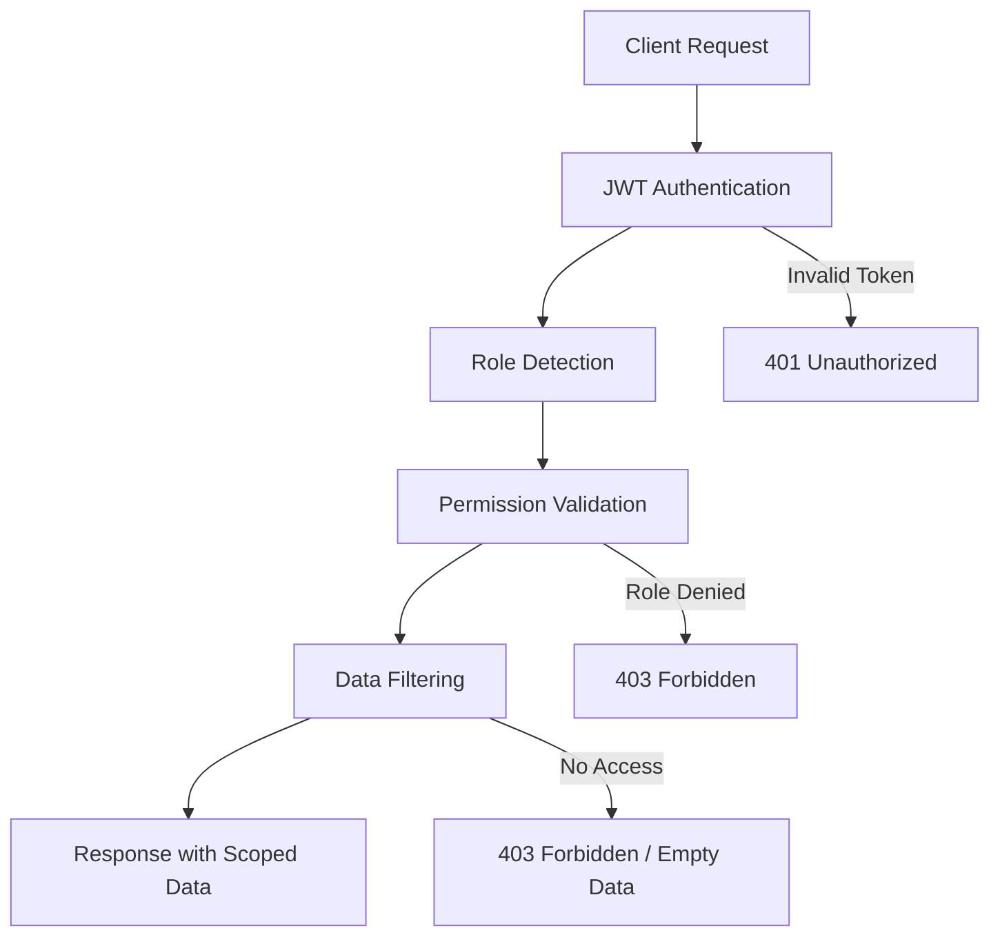
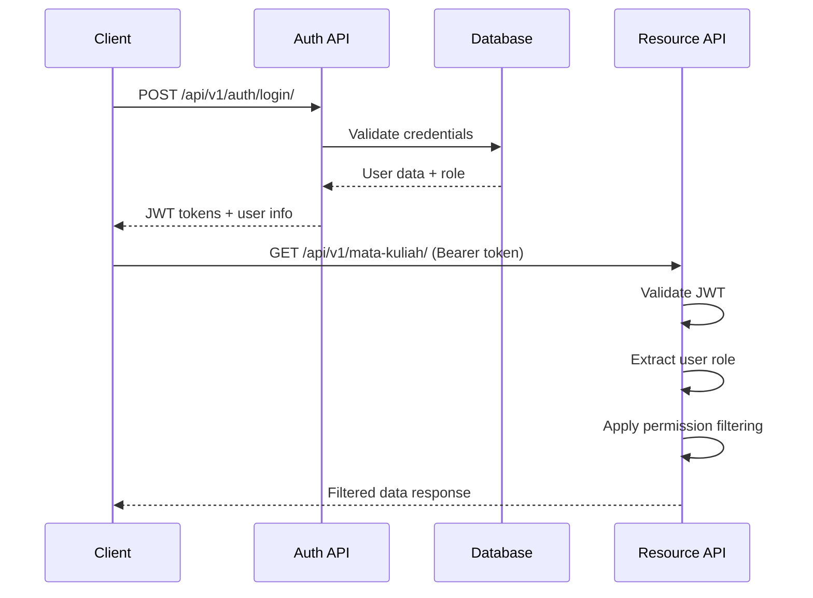
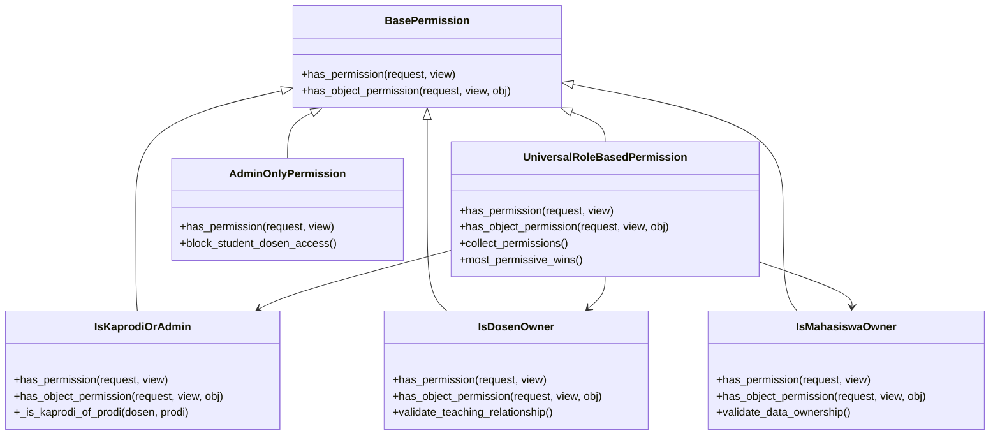
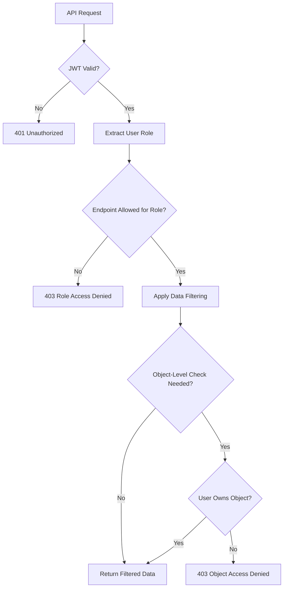

# API Security & Permission Guide

Comprehensive guide untuk keamanan API dan sistem permission pada Sistem Akademik.

## 🔐 Security Overview

Sistem menggunakan multi-layer security approach:



## 🔑 Authentication System

### JWT Token Authentication

#### Token Structure
```json
{
  "header": {
    "typ": "JWT",
    "alg": "HS256"
  },
  "payload": {
    "user_id": 123,
    "username": "kaprodi_ti",
    "exp": 1640995200,
    "iat": 1640908800,
    "jti": "unique-token-id"
  }
}
```

#### Token Lifecycle
| Stage | Duration | Action |
|-------|----------|--------|
| **Access Token** | 24 hours | Primary authentication |
| **Refresh Token** | 7 days | Renew access token |
| **Token Rotation** | Per refresh | New tokens issued |

#### Authentication Flow


### User-Role Mapping

#### Database Relations
```sql
-- User authentication (Django built-in)
auth_user (id, username, password, email, is_superuser)

-- Role assignment (Django groups)
auth_group (id, name) -- 'Kaprodi', 'Dosen', 'Mahasiswa'
auth_user_groups (user_id, group_id)

-- Profile mapping
-- Dosen: username = nip
feeder_dosen (id, nip, nama_dosen, ...)
feeder_penugasan (id, id_dosen, id_prodi, ...)

-- Mahasiswa: username = nim
feeder_riwayat_pendidikan (id, nim, id_mahasiswa, id_prodi, ...)
feeder_biodata (id, nama_mahasiswa, ...)
```

#### Role Detection Logic
```python
def get_user_role(user):
    """
    Role priority: superuser > kaprodi > dosen > mahasiswa > guest
    """
    if user.is_superuser:
        return 'superuser'

    # Check group membership with priority
    if user.groups.filter(name='Kaprodi').exists():
        return 'kaprodi'
    elif user.groups.filter(name='Dosen').exists():
        return 'dosen'
    elif user.groups.filter(name='Mahasiswa').exists():
        return 'mahasiswa'

    return 'guest'
```

## 🛡️ Permission System Architecture

### Permission Classes Hierarchy



### Data Access Patterns

#### 1. **Superuser/Admin Access**
```python
# Full system access - no restrictions
if user.is_superuser:
    return queryset  # All data
```

#### 2. **Kaprodi Access Pattern**
```python
# Access to managed program studies
accessible_prodi_ids = Penugasan.objects.filter(
    id_dosen__nip=user.username,
    deleted=False
).values_list('id_prodi_id', flat=True)

# Filter data by prodi scope
queryset = queryset.filter(id_prodi_id__in=accessible_prodi_ids)
```

#### 3. **Dosen Access Pattern**
```python
# Access to taught classes/subjects
accessible_kelas_ids = Pengajar.objects.filter(
    id_dosen__nip=user.username,
    deleted=False
).values_list('id_kelas_kuliah_id', flat=True)

# Filter data by teaching scope
queryset = queryset.filter(id_kelas_kuliah_id__in=accessible_kelas_ids)
```

#### 4. **Mahasiswa Access Pattern**
```python
# Access to personal data only
mahasiswa_profile = RiwayatPendidikan.objects.get(
    nim=user.username,
    deleted=False
)

# Filter to personal data
queryset = queryset.filter(id_mahasiswa=mahasiswa_profile.id_mahasiswa)
```

## 🔒 Security Implementation Details

### API Endpoint Security Matrix

| Security Level | Implementation | Use Cases |
|----------------|---------------|-----------|
| **Public** | No authentication | Health checks, public info |
| **Authenticated** | JWT required | Basic logged-in access |
| **Role-Based** | JWT + Role validation | Feature-specific access |
| **Object-Level** | JWT + Ownership check | Individual record access |
| **Admin-Only** | JWT + Admin/Kaprodi | Administrative functions |

### Permission Validation Flow



### Data Filtering Implementation

#### Automatic Queryset Filtering
```python
def filter_queryset_by_permission(user, queryset, model_name):
    """
    Central filtering function for all models

    Models supported:
    - kurikulum: Filter by accessible prodi
    - matakuliah: Role-based subject access
    - kelas: Filter by teaching/enrollment
    - nilai: Grade access by role
    - komponen_evaluasi: Assessment component access
    """

    if user.is_superuser:
        return queryset

    role = get_user_role(user)

    if model_name == 'kurikulum':
        accessible_prodi_ids = get_accessible_prodi_ids(user)
        if accessible_prodi_ids:
            return queryset.filter(id_prodi_id__in=accessible_prodi_ids)
        return queryset.none()

    elif model_name == 'matakuliah':
        if role == 'kaprodi':
            return queryset  # Kaprodi sees all subjects
        elif role == 'dosen':
            profile = get_user_profile(user)
            return queryset.filter(
                pengajar__id_dosen=profile,
                pengajar__deleted=False
            )
        return queryset.none()

    # ... other model filtering logic
```

### Object-Level Permission Examples

#### Kaprodi Object Access
```python
def has_object_permission(self, request, view, obj):
    if request.user.is_superuser:
        return True

    if request.user.groups.filter(name='Kaprodi').exists():
        dosen = Dosen.objects.get(nip=request.user.username)

        # Check if object belongs to managed prodi
        if hasattr(obj, 'id_prodi'):
            return Penugasan.objects.filter(
                id_dosen=dosen,
                id_prodi=obj.id_prodi,
                deleted=False
            ).exists()

        # Check nested prodi relationships
        if hasattr(obj, 'id_matkul') and hasattr(obj.id_matkul, 'id_prodi'):
            return Penugasan.objects.filter(
                id_dosen=dosen,
                id_prodi=obj.id_matkul.id_prodi,
                deleted=False
            ).exists()

    return False
```

#### Dosen Object Access
```python
def has_object_permission(self, request, view, obj):
    if request.user.groups.filter(name='Dosen').exists():
        dosen = Dosen.objects.get(nip=request.user.username)

        # Check teaching relationship
        if hasattr(obj, 'id_matkul'):
            return Pengajar.objects.filter(
                id_matkul=obj.id_matkul,
                id_dosen=dosen,
                deleted=False
            ).exists()

        # Check class ownership
        if hasattr(obj, 'id_kelas_kuliah'):
            return Pengajar.objects.filter(
                id_kelas_kuliah=obj.id_kelas_kuliah,
                id_dosen=dosen,
                deleted=False
            ).exists()

        # Check direct ownership
        if hasattr(obj, 'id_dosen'):
            return obj.id_dosen == dosen

    return False
```

## 🚨 Security Vulnerabilities & Mitigations

### Common Security Risks

#### 1. **Privilege Escalation**
**Risk:** User accessing data outside their role scope

**Mitigation:**
```python
# Always validate both endpoint and object level permissions
class SecureView(APIView):
    permission_classes = [UniversalRoleBasedPermission]

    def get_object(self, pk):
        obj = get_object_or_404(Model, pk=pk)
        self.check_object_permissions(self.request, obj)
        return obj
```

#### 2. **Data Leakage through Relationships**
**Risk:** Accessing restricted data through model relationships

**Mitigation:**
```python
# Use select_related/prefetch_related carefully
# Apply filtering before relationship access
queryset = Model.objects.filter(
    # Apply permission filter first
    id_prodi_id__in=accessible_prodi_ids
).select_related(
    # Only then add relationships
    'id_prodi', 'id_matkul'
)
```

#### 3. **JWT Token Security**
**Risks:** Token theft, replay attacks, long-lived tokens

**Mitigations:**
```python
# Token settings
JWT_AUTH = {
    'JWT_EXPIRATION_DELTA': timedelta(hours=24),
    'JWT_REFRESH_EXPIRATION_DELTA': timedelta(days=7),
    'JWT_ALLOW_REFRESH': True,
    'JWT_AUTH_HEADER_PREFIX': 'Bearer',
    'JWT_ROTATION': True,  # Rotate tokens on refresh
    'JWT_BLACKLIST_ENABLED': True,  # Enable token blacklisting
}

# HTTPS enforcement
SECURE_SSL_REDIRECT = True
SECURE_PROXY_SSL_HEADER = ('HTTP_X_FORWARDED_PROTO', 'https')
```

#### 4. **SQL Injection via Dynamic Filtering**
**Risk:** User input in database queries

**Mitigation:**
```python
# Always use Django ORM - never raw SQL with user input
# Validate filter parameters
allowed_sort_fields = ['nama_dosen', 'nidn', 'nip']
if sort_param not in allowed_sort_fields:
    return error_response("INVALID_SORT_FIELD", ...)

# Use parameterized queries
queryset = Model.objects.filter(
    nama__icontains=search_query  # Safe - ORM handles escaping
)
```

### Security Headers & Middleware

#### Required Security Headers
```python
# config/settings/production.py

SECURE_BROWSER_XSS_FILTER = True
SECURE_CONTENT_TYPE_NOSNIFF = True
SECURE_HSTS_SECONDS = 31536000
SECURE_HSTS_INCLUDE_SUBDOMAINS = True
SECURE_HSTS_PRELOAD = True
X_FRAME_OPTIONS = 'DENY'

# CORS settings for API
CORS_ALLOW_CREDENTIALS = True
CORS_ALLOWED_ORIGINS = [
    "https://academic-system.edu",
    "https://app.academic-system.edu",
]

# CSP for additional protection
CSP_DEFAULT_SRC = ("'self'",)
CSP_SCRIPT_SRC = ("'self'", "'unsafe-inline'")
CSP_STYLE_SRC = ("'self'", "'unsafe-inline'")
```

## 📊 Security Monitoring & Auditing

### Audit Logging

#### Security Events to Log
```python
import logging

security_logger = logging.getLogger('security')

def log_permission_denied(request, resource, reason):
    security_logger.warning(
        f"Permission denied: user={request.user.username}, "
        f"role={get_user_role(request.user)}, "
        f"resource={resource}, reason={reason}, "
        f"ip={get_client_ip(request)}"
    )

def log_data_access(request, model_name, count):
    security_logger.info(
        f"Data access: user={request.user.username}, "
        f"role={get_user_role(request.user)}, "
        f"model={model_name}, records={count}"
    )
```

#### Audit Log Structure
```json
{
  "timestamp": "2025-01-01T10:00:00Z",
  "event_type": "permission_denied",
  "user_id": 123,
  "username": "dosen_001",
  "user_role": "dosen",
  "resource": "/api/v1/kurikulum/5/",
  "method": "GET",
  "ip_address": "192.168.1.100",
  "user_agent": "Mozilla/5.0...",
  "reason": "object_permission_denied",
  "additional_context": {
    "requested_prodi": 5,
    "user_accessible_prodi": [1, 2]
  }
}
```

### Security Metrics

#### Key Performance Indicators
```python
# Monitor these metrics for security health

class SecurityMetrics:
    def get_permission_denied_rate(self):
        """Track 403 errors - high rate may indicate attack"""
        pass

    def get_invalid_token_attempts(self):
        """Track 401 errors - brute force detection"""
        pass

    def get_role_distribution(self):
        """Monitor user role distribution"""
        pass

    def get_unusual_access_patterns(self):
        """Detect abnormal data access patterns"""
        pass
```

## 🔧 Development & Testing

### Security Testing Checklist

#### Authentication Tests
```python
class AuthenticationSecurityTests(TestCase):
    def test_jwt_token_expiration(self):
        """Verify tokens expire correctly"""
        pass

    def test_invalid_token_rejection(self):
        """Verify invalid tokens are rejected"""
        pass

    def test_token_refresh_rotation(self):
        """Verify token rotation on refresh"""
        pass
```

#### Authorization Tests
```python
class AuthorizationSecurityTests(TestCase):
    def test_kaprodi_prodi_isolation(self):
        """Verify Kaprodi cannot access other prodi data"""
        pass

    def test_dosen_class_isolation(self):
        """Verify Dosen cannot access other classes"""
        pass

    def test_mahasiswa_data_isolation(self):
        """Verify students can only access own data"""
        pass
```

#### Data Filtering Tests
```python
class DataFilteringSecurityTests(TestCase):
    def test_queryset_filtering_by_role(self):
        """Verify automatic data filtering works"""
        pass

    def test_object_level_permissions(self):
        """Verify object-level access control"""
        pass

    def test_relationship_access_security(self):
        """Verify no data leakage through relationships"""
        pass
```

### Security Configuration Checklist

#### Development Environment
- [ ] Debug mode disabled in production
- [ ] Secret keys properly managed
- [ ] Database credentials secured
- [ ] JWT secrets rotated regularly

#### Production Environment
- [ ] HTTPS enforced
- [ ] Security headers configured
- [ ] CORS properly configured
- [ ] Rate limiting enabled
- [ ] Audit logging enabled
- [ ] Security monitoring active

## 📚 Security References

### Related Documentation
- [API Role Access Matrix](./API_ROLE_ACCESS_MATRIX.md)
- [Swagger Role Integration](./SWAGGER_ROLE_INTEGRATION_EXAMPLE.md)
- [Permission Implementation Guide](../core/utils/permission_utils.py)

### External Security Standards
- [OWASP API Security Top 10](https://owasp.org/www-project-api-security/)
- [JWT Security Best Practices](https://auth0.com/blog/a-look-at-the-latest-draft-for-jwt-bcp/)
- [Django Security Guidelines](https://docs.djangoproject.com/en/stable/topics/security/)

### Security Contact
For security issues or vulnerabilities:
- **Email:** security@academic-system.edu
- **Response Time:** 24 hours for critical issues
- **Encryption:** Use PGP key for sensitive reports

---

**Last Updated:** January 2025
**Version:** 1.0
**Classification:** Internal Use
**Review Cycle:** Quarterly