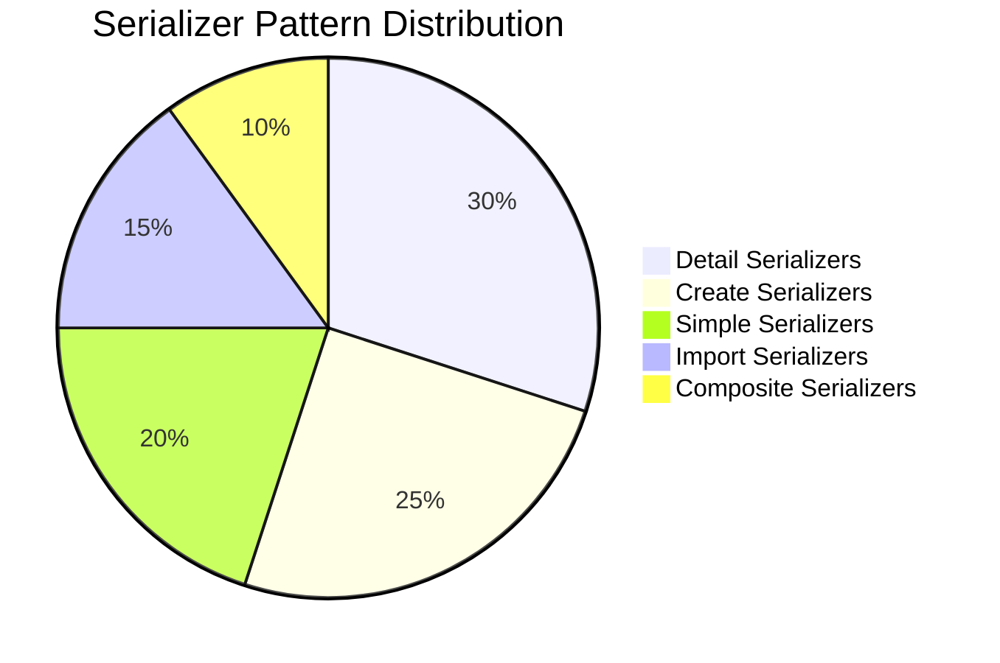
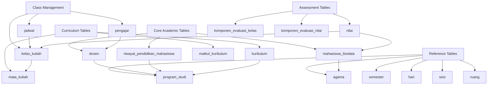

# 📚 **API Documentation Hub**

Pusat dokumentasi lengkap untuk API Academic Management System - mapping tabel, serializer, dan requirements.

## 📋 **Dokumentasi Yang Tersedia**

### 🗺️ **[Table-Serializer Mapping](./table-serializer-mapping.md)**
**Mapping komprehensif tabel database ke serializer dan API endpoints**
- Relationship mapping antar tabel
- Serializer pattern analysis
- Database coverage dan statistics
- API endpoint organization

### 🎨 **[Serializer Patterns Guide](./serializer-patterns-guide.md)**
**Panduan lengkap pattern implementasi serializer**
- Basic patterns (Detail, Create, Simple)
- Advanced patterns (Composite, Dual-Mode)
- Import/Export patterns
- Validation strategies
- Performance optimization patterns

### 📊 **[API Requirements Matrix](./api-requirements-matrix.md)**
**Matrix detail kebutuhan tabel untuk setiap API endpoint**
- Dependency level per endpoint (Critical/Important/Optional)
- Complex dependency analysis
- Performance optimization recommendations
- Validation requirements mapping

---

## 🚀 **Quick Navigation**

### **By Domain**
- **👨‍🏫 Dosen Management**: [Table Mapping](./table-serializer-mapping.md#1-dosen-domain) | [Requirements](./api-requirements-matrix.md#1-dosen-api-apiv1academicdosen)
- **👨‍🎓 Mahasiswa Management**: [Table Mapping](./table-serializer-mapping.md#2-mahasiswa-domain) | [Requirements](./api-requirements-matrix.md#2-mahasiswa-api-apiv1academicmhs)
- **📚 Kurikulum Management**: [Table Mapping](./table-serializer-mapping.md#3-kurikulum-domain) | [Requirements](./api-requirements-matrix.md#3-kurikulum-api-apiv1academickurikulum)
- **🏫 Kuliah Management**: [Table Mapping](./table-serializer-mapping.md#4-kuliah-domain) | [Requirements](./api-requirements-matrix.md#4-kuliah-api-apiv1academickuliah)
- **📅 Jadwal Management**: [Table Mapping](./table-serializer-mapping.md#5-jadwal-domain) | [Requirements](./api-requirements-matrix.md#5-jadwal-api-apiv1academicjadwal)
- **📊 Nilai Management**: [Table Mapping](./table-serializer-mapping.md#6-nilai-domain) | [Requirements](./api-requirements-matrix.md#6-nilai-api-apiv1academicnilai)

### **By Pattern Type**
- **Detail Serializers**: [Pattern Guide](./serializer-patterns-guide.md#1-detail-serializer-pattern)
- **Create Serializers**: [Pattern Guide](./serializer-patterns-guide.md#2-create-serializer-pattern)
- **Import Serializers**: [Pattern Guide](./serializer-patterns-guide.md#6-import-serializer-pattern)
- **Validation Patterns**: [Pattern Guide](./serializer-patterns-guide.md#7-complex-validation-pattern)

### **By Development Need**
- **New API Endpoint**: Start with [Requirements Matrix](./api-requirements-matrix.md)
- **Database Optimization**: Check [Table Mapping](./table-serializer-mapping.md#relationship-mapping)
- **Serializer Implementation**: Use [Pattern Guide](./serializer-patterns-guide.md)
- **Performance Issues**: See [Optimization Recommendations](./api-requirements-matrix.md#optimization-recommendations)

---

## 📊 **System Overview**

### **Database Statistics**
- **Total Tables**: 25+ academic tables
- **Primary Entities**: 15 core tables
- **Reference Tables**: 10+ lookup tables
- **Relationship Tables**: 5 junction tables

### **API Coverage**
- **REST Endpoints**: 50+ endpoints
- **Serializer Classes**: 45+ serializers
- **CRUD Operations**: 90% coverage
- **Import/Export**: 80% coverage

### **Serializer Distribution**

### **Table Relationship Overview**

---

## 🔧 **Development Guidelines**

### **When Creating New API Endpoints**

1. **📋 Planning Phase**
   - Check [Requirements Matrix](./api-requirements-matrix.md) untuk similar endpoints
   - Identify required tables dan dependencies
   - Plan optimization strategy

2. **🎨 Implementation Phase**
   - Use [Pattern Guide](./serializer-patterns-guide.md) untuk serializer selection
   - Follow naming conventions
   - Implement proper validation

3. **✅ Testing Phase**
   - Test all dependency levels (Critical/Important/Optional)
   - Validate performance dengan realistic data volumes
   - Check error handling untuk all validation scenarios

### **When Modifying Existing Endpoints**

1. **📊 Impact Analysis**
   - Check [Table Mapping](./table-serializer-mapping.md) untuk affected relationships
   - Review dependent endpoints
   - Plan migration strategy jika diperlukan

2. **🔄 Update Documentation**
   - Update relevant documentation files
   - Add new patterns jika applicable
   - Document breaking changes

---

## 🎯 **Best Practices Summary**

### **Database Design**
- ✅ Always use foreign key constraints
- ✅ Add appropriate indexes untuk performance
- ✅ Use consistent naming conventions
- ✅ Document complex relationships

### **Serializer Implementation**
- ✅ Choose appropriate pattern berdasarkan use case
- ✅ Implement comprehensive validation
- ✅ Use consistent field naming
- ✅ Optimize queries dengan select_related/prefetch_related

### **API Design**
- ✅ Follow RESTful conventions
- ✅ Provide consistent error responses
- ✅ Implement proper pagination
- ✅ Document all endpoints thoroughly

### **Performance Optimization**
- ✅ Monitor query counts dan execution time
- ✅ Use caching untuk reference data
- ✅ Implement lazy loading untuk expensive operations
- ✅ Regular performance profiling

---

## 📞 **Support & Contribution**

### **Getting Help**
1. **Documentation**: Check relevant documentation files first
2. **Code Examples**: Look at existing similar implementations
3. **Pattern Reference**: Use pattern guide untuk consistent implementation

### **Contributing**
1. **Update Documentation**: Keep documentation current dengan code changes
2. **Add Examples**: Provide clear examples untuk new patterns
3. **Performance Notes**: Document performance implications
4. **Migration Guides**: Provide upgrade paths untuk breaking changes

---

**🚀 This documentation hub provides complete guidance untuk developing, maintaining, dan optimizing the Academic Management System API.**

*Last Updated: 2025-01-21*