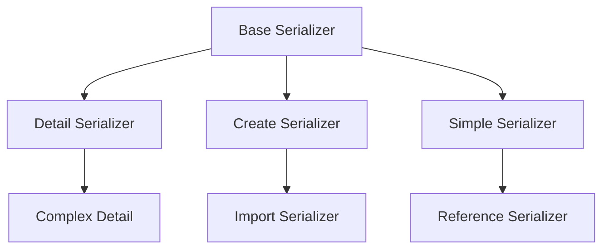

# 🎨 **Serializer Patterns Guide**

Panduan lengkap untuk memahami dan mengimplementasikan pattern serializer dalam Academic Management System.

## 📋 **Daftar Isi**

1. [Overview Pattern Serializer](#overview-pattern-serializer)
2. [Basic Patterns](#basic-patterns)
3. [Advanced Patterns](#advanced-patterns)
4. [Import/Export Patterns](#importexport-patterns)
5. [Validation Patterns](#validation-patterns)
6. [Performance Patterns](#performance-patterns)

---

## 🏗️ **Overview Pattern Serializer**

### **Hierarchy Pattern Serializer**


### **Naming Convention**
| Pattern | Convention | Example |
|---------|------------|---------|
| **Detail** | `{Entity}Serializer` | `DosenSerializer` |
| **Create** | `{Entity}CreateSerializer` | `KurikulumCreateSerializer` |
| **Simple** | `{Entity}SimpleSerializer` | `SimpleKelasSerializer` |
| **Import** | `{Entity}ImportSerializer` | `MahasiswaImportDataSerializer` |

---

## 🔧 **Basic Patterns**

### **1. Detail Serializer Pattern**

#### **Purpose**: Complete object representation dengan nested relations

#### **Structure**:
```python
class EntityDetailSerializer(serializers.ModelSerializer):
    # Nested read-only fields
    relation_detail = RelatedSerializer(source='relation', read_only=True)

    # Write-only foreign key fields
    relation_id = serializers.PrimaryKeyRelatedField(
        queryset=Related.objects.all(),
        write_only=True
    )

    class Meta:
        model = Entity
        fields = [
            'id', 'field1', 'field2',
            'relation_detail', 'relation_id'
        ]

    def to_representation(self, instance):
        # Custom representation logic
        rep = super().to_representation(instance)
        rep['custom_field'] = self.get_custom_data(instance)
        return rep
```

#### **Examples**:
- `DosenSerializer` (api/v1/academic/dosen/serializers.py:26)
- `BiodataDetailSerializer` (api/v1/academic/mhs/serializers.py:129)
- `KurikulumSerializer` (api/v1/academic/kurikulum/serializers.py:10)

#### **Key Features**:
- ✅ Nested object expansion
- ✅ Bidirectional field mapping (read/write)
- ✅ Custom representation logic
- ✅ Denormalized data inclusion

---

### **2. Create Serializer Pattern**

#### **Purpose**: Input validation untuk object creation

#### **Structure**:
```python
class EntityCreateSerializer(serializers.ModelSerializer):
    # Required fields dengan custom validation
    field1 = serializers.CharField(required=True, max_length=100)
    relation_id = serializers.PrimaryKeyRelatedField(
        queryset=Related.objects.all(),
        required=True
    )

    class Meta:
        model = Entity
        fields = ['field1', 'field2', 'relation_id']

    def validate(self, data):
        # Field presence validation
        missing_fields = []
        required_fields = ['field1', 'field2', 'relation_id']

        for field in required_fields:
            if data.get(field) in [None, ""]:
                missing_fields.append(field)

        if missing_fields:
            raise serializers.ValidationError({
                "missing_fields": f"Field berikut wajib diisi: {', '.join(missing_fields)}"
            })

        # Business logic validation
        if self.instance is None:  # Create mode
            if Entity.objects.filter(unique_field=data['field1']).exists():
                raise serializers.ValidationError({
                    "duplicate": "Data dengan field ini sudah ada."
                })

        return data

    def create(self, validated_data):
        # Custom creation logic
        validated_data['status'] = 'active'
        return super().create(validated_data)
```

#### **Examples**:
- `KurikulumCreateSerializer` (api/v1/academic/kurikulum/serializers.py:34)
- `PengajarCreateSerializer` (api/v1/academic/kuliah/serializers.py:199)

---

### **3. Simple Serializer Pattern**

#### **Purpose**: Lightweight representation untuk references

#### **Structure**:
```python
class EntitySimpleSerializer(serializers.ModelSerializer):
    class Meta:
        model = Entity
        fields = ['id', 'name', 'code']  # Minimal fields only
```

#### **Examples**:
- `SimpleKelasSerializer` (api/v1/academic/jadwal/serializers.py:8)
- `RuangSimpleSerializer` (api/v1/academic/jadwal/serializers.py:30)

---

## 🚀 **Advanced Patterns**

### **4. Composite Serializer Pattern**

#### **Purpose**: Aggregate data dari multiple tables

#### **Structure**:
```python
class CompositeSerializer(serializers.ModelSerializer):
    # Fields from related tables
    related_field = serializers.CharField(source='relation.field')

    # Computed fields
    computed_field = serializers.SerializerMethodField()

    # Nested collections
    nested_collection = serializers.SerializerMethodField()

    class Meta:
        model = PrimaryEntity
        fields = [
            'primary_fields', 'related_field',
            'computed_field', 'nested_collection'
        ]

    def get_computed_field(self, obj):
        # Complex computation logic
        return calculate_value(obj)

    def get_nested_collection(self, obj):
        # Query related data
        related_data = RelatedModel.objects.filter(parent=obj)
        return RelatedSerializer(related_data, many=True).data
```

#### **Examples**:
- `PesertaKelasKomponenSerializer` (api/v1/academic/nilai/serializers.py:179)
- `KrsMahasiswaSerializer` (api/v1/academic/krs/serializers.py:67)

---

### **5. Dual-Mode Serializer Pattern**

#### **Purpose**: Single serializer untuk read dan write operations

#### **Structure**:
```python
class DualModeSerializer(serializers.ModelSerializer):
    # Read-only nested fields
    relation_detail = RelatedSerializer(source='relation', read_only=True)

    # Write-only ID fields
    relation_id = serializers.PrimaryKeyRelatedField(
        queryset=Related.objects.all(),
        write_only=True,
        source='relation'
    )

    class Meta:
        model = Entity
        fields = [
            'id', 'field1', 'field2',
            'relation_detail',  # GET
            'relation_id'       # POST/PUT
        ]

    def create(self, validated_data):
        # Map write-only fields to actual FK fields
        if 'relation' in validated_data:
            validated_data['relation'] = validated_data['relation']
        return super().create(validated_data)
```

#### **Examples**:
- `MatkulKurikulumSerializer` (api/v1/academic/kurikulum/serializers.py:67)
- `JadwalSerializer` (api/v1/academic/jadwal/serializers.py:36)

---

## 📥 **Import/Export Patterns**

### **6. Import Serializer Pattern**

#### **Purpose**: Flexible data import dengan multiple input formats

#### **Structure**:
```python
class EntityImportSerializer(serializers.Serializer):
    # Support multiple input formats
    # Nested format
    entity_data = EntityNestedSerializer(required=False)

    # Flat format
    field1 = serializers.CharField(required=False)
    field2 = serializers.CharField(required=False)
    relation_code = serializers.CharField(required=False)

    # Mixed format
    relation_nested = RelatedNestedSerializer(required=False)

    def validate(self, data):
        # Determine input format
        if 'entity_data' in data:
            # Nested format validation
            return self.validate_nested_format(data)
        else:
            # Flat format validation
            return self.validate_flat_format(data)

    def validate_nested_format(self, data):
        # Validate nested structure
        entity_data = data['entity_data']
        # Custom validation logic
        return data

    def validate_flat_format(self, data):
        # Validate flat structure
        # Resolve references by codes/names
        if 'relation_code' in data:
            try:
                relation = Related.objects.get(code=data['relation_code'])
                data['relation_id'] = relation.id
            except Related.DoesNotExist:
                raise serializers.ValidationError({
                    'relation_code': 'Relation not found'
                })
        return data

    def create(self, validated_data):
        # Handle different input formats
        if 'entity_data' in validated_data:
            return self.create_from_nested(validated_data['entity_data'])
        else:
            return self.create_from_flat(validated_data)
```

#### **Examples**:
- `MahasiswaImportDataSerializer` (api/v1/academic/mhs/serializers.py:370)
- `BiodataImportSerializer` (api/v1/academic/mhs/serializers.py:420)

---

## ✅ **Validation Patterns**

### **7. Complex Validation Pattern**

#### **Purpose**: Multi-layer validation dengan business rules

#### **Structure**:
```python
class ComplexValidationSerializer(serializers.ModelSerializer):
    def validate(self, data):
        # 1. Field presence validation
        self.validate_required_fields(data)

        # 2. Business rule validation
        self.validate_business_rules(data)

        # 3. Cross-table validation
        self.validate_relationships(data)

        # 4. Conflict detection
        self.validate_conflicts(data)

        return data

    def validate_required_fields(self, data):
        missing_fields = []
        required_fields = ['field1', 'field2', 'relation_id']

        for field in required_fields:
            if field not in data or data.get(field) in [None, ""]:
                missing_fields.append(field)

        if missing_fields:
            raise serializers.ValidationError({
                "missing_fields": f"Field berikut wajib diisi: {', '.join(missing_fields)}"
            })

    def validate_business_rules(self, data):
        # Custom business logic
        if data.get('field1') == 'invalid_value':
            raise serializers.ValidationError({
                'field1': 'Value tidak diperbolehkan'
            })

    def validate_relationships(self, data):
        # Validate foreign key relationships
        try:
            related_obj = Related.objects.get(id=data['relation_id'])
            if not related_obj.is_active:
                raise serializers.ValidationError({
                    'relation_id': 'Related object tidak aktif'
                })
        except Related.DoesNotExist:
            raise serializers.ValidationError({
                'relation_id': 'Related object tidak ditemukan'
            })

    def validate_conflicts(self, data):
        # Check for conflicts/duplicates
        if self.instance is None:  # Create mode
            conflicts = Entity.objects.filter(
                field1=data['field1'],
                relation_id=data['relation_id']
            )
            if conflicts.exists():
                raise serializers.ValidationError({
                    'non_field_errors': 'Kombinasi data sudah ada'
                })
```

#### **Examples**:
- `JadwalSerializer` (api/v1/academic/jadwal/serializers.py:57)
- `KomponenEvaluasiNilaiSerializer` (api/v1/academic/nilai/serializers.py:82)

---

### **8. Conditional Validation Pattern**

#### **Purpose**: Context-dependent validation rules

#### **Structure**:
```python
class ConditionalValidationSerializer(serializers.ModelSerializer):
    def validate(self, data):
        # Get validation context
        context = self.context
        user = context.get('request').user if context.get('request') else None

        # Apply different validation rules based on context
        if user and user.is_superuser:
            return self.validate_superuser_mode(data)
        elif user and hasattr(user, 'profile'):
            return self.validate_user_mode(data, user)
        else:
            return self.validate_anonymous_mode(data)

    def validate_superuser_mode(self, data):
        # Relaxed validation for superusers
        return data

    def validate_user_mode(self, data, user):
        # Restricted validation based on user permissions
        if not user.profile.can_edit_entity:
            raise serializers.ValidationError({
                'permission': 'User tidak memiliki permission'
            })
        return data

    def validate_anonymous_mode(self, data):
        # Strict validation for anonymous users
        raise serializers.ValidationError({
            'authentication': 'Authentication required'
        })
```

---

## ⚡ **Performance Patterns**

### **9. Optimized Query Pattern**

#### **Purpose**: Minimize database queries dengan select_related/prefetch_related

#### **Structure**:
```python
class OptimizedSerializer(serializers.ModelSerializer):
    # Use SerializerMethodField untuk optimized queries
    related_data = serializers.SerializerMethodField()

    class Meta:
        model = Entity
        fields = ['id', 'field1', 'related_data']

    def get_related_data(self, obj):
        # Assume queryset sudah optimized di view level
        # dengan select_related() atau prefetch_related()

        if hasattr(obj, '_prefetched_objects_cache'):
            # Use prefetched data
            related_objects = obj.prefetched_related_objects
        else:
            # Fallback ke database query
            related_objects = obj.related_set.all()

        return RelatedSerializer(related_objects, many=True).data

# View level optimization
class OptimizedViewSet(viewsets.ModelViewSet):
    def get_queryset(self):
        return Entity.objects.select_related(
            'relation1', 'relation2'
        ).prefetch_related(
            'related_set', 'another_related_set'
        )
```

---

### **10. Lazy Loading Pattern**

#### **Purpose**: Load data on-demand untuk large datasets

#### **Structure**:
```python
class LazyLoadingSerializer(serializers.ModelSerializer):
    # Essential fields only
    essential_field = serializers.CharField()

    # Optional expensive fields
    expensive_data = serializers.SerializerMethodField()

    class Meta:
        model = Entity
        fields = ['id', 'essential_field', 'expensive_data']

    def get_expensive_data(self, obj):
        # Check if expensive data is requested
        request = self.context.get('request')
        if request and request.query_params.get('include_expensive'):
            return self.calculate_expensive_data(obj)
        return None

    def calculate_expensive_data(self, obj):
        # Expensive computation or database query
        return perform_complex_calculation(obj)
```

---

## 📊 **Pattern Usage Statistics**

### **Pattern Distribution in Codebase**

| Pattern | Usage Count | Complexity | Performance Impact |
|---------|-------------|------------|-------------------|
| **Detail Serializer** | 15+ | Medium | Medium |
| **Create Serializer** | 10+ | Low | Low |
| **Simple Serializer** | 8+ | Low | High (Positive) |
| **Import Serializer** | 5+ | High | Medium |
| **Composite Serializer** | 6+ | High | Medium |
| **Dual-Mode Serializer** | 8+ | Medium | Medium |

### **Recommended Usage**

#### **When to use each pattern:**

1. **Detail Serializer**: API endpoints yang perlu full object representation
2. **Create Serializer**: Form input validation, data creation
3. **Simple Serializer**: Dropdown lists, references, autocomplete
4. **Import Serializer**: Bulk data import, migration scripts
5. **Composite Serializer**: Dashboard views, reporting
6. **Dual-Mode Serializer**: CRUD operations dengan complex relations

---

## 🎯 **Best Practices**

### **1. Naming Consistency**
- Gunakan suffix yang konsisten (`Serializer`, `CreateSerializer`, `SimpleSerializer`)
- Prefix sesuai domain (`Dosen`, `Mahasiswa`, `Kurikulum`)

### **2. Field Organization**
- Group fields logically (metadata, core data, relations)
- Use consistent field ordering across similar serializers

### **3. Validation Strategy**
- Implement validation di level serializer, bukan di model
- Use custom validation methods untuk complex rules
- Provide clear error messages dengan field context

### **4. Performance Optimization**
- Use `select_related()` untuk FK relationships
- Use `prefetch_related()` untuk reverse FK dan M2M
- Implement lazy loading untuk expensive computations

### **5. Documentation**
- Comment complex validation logic
- Document expected input formats untuk import serializers
- Provide examples untuk each serializer pattern

---

**🚀 This guide provides comprehensive patterns for implementing robust and performant serializers in the Academic Management System.**