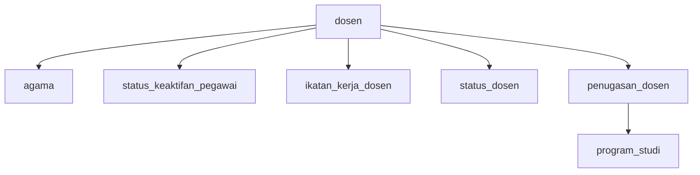
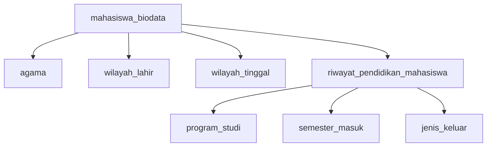
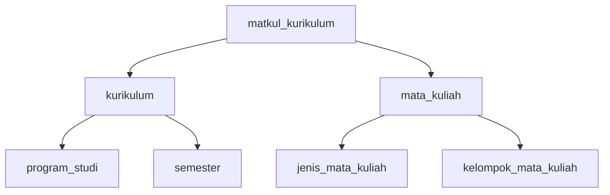
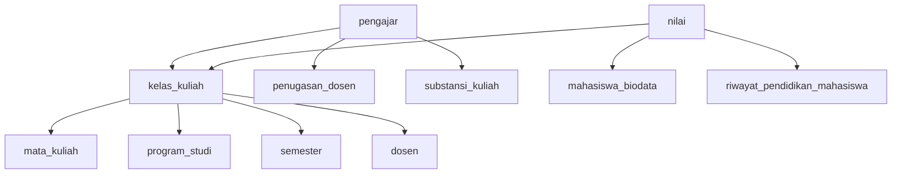
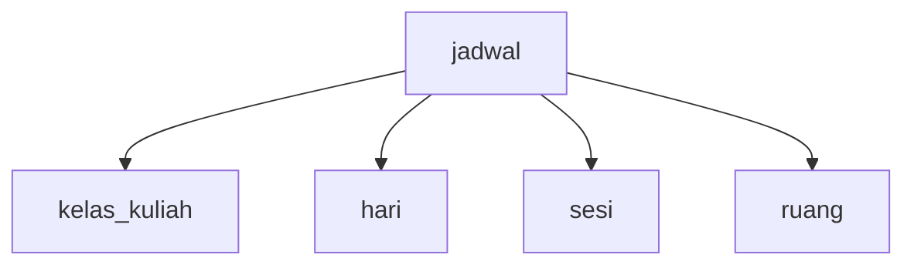
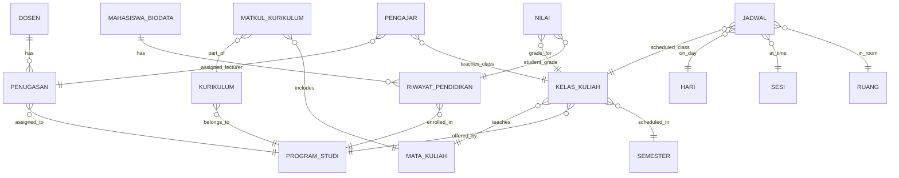

# 📊 **API Table & Serializer Mapping Documentation**

Dokumentasi komprehensif untuk mapping tabel database, serializer, dan kebutuhan API dalam Academic Management System.

## 📋 **Daftar Isi**

1. [Overview Arsitektur API](#overview-arsitektur-api)
2. [Mapping Tabel ke Serializer](#mapping-tabel-ke-serializer)
3. [Kebutuhan Tabel per API Endpoint](#kebutuhan-tabel-per-api-endpoint)
4. [Relationship Mapping](#relationship-mapping)
5. [Serializer Pattern Analysis](#serializer-pattern-analysis)

---

## 🏗️ **Overview Arsitektur API**

### **API Structure**
```
api/v1/
├── academic/
│   ├── dosen/          # Dosen management
│   ├── mhs/            # Mahasiswa management
│   ├── kurikulum/      # Curriculum management
│   ├── matakuliah/     # Subject management
│   ├── kuliah/         # Class management
│   ├── jadwal/         # Schedule management
│   ├── nilai/          # Grade management
│   ├── krs/            # Student registration system
│   ├── khs/            # Grade report
│   └── perwalian/      # Academic supervision
├── auth/               # Authentication
└── imports/            # Data import/export
```

### **Database Tables Categories**
- **Academic Core**: `dosen`, `mahasiswa_biodata`, `riwayat_pendidikan_mahasiswa`
- **Curriculum**: `kurikulum`, `mata_kuliah`, `matkul_kurikulum`
- **Classes**: `kelas_kuliah`, `pengajar`, `jadwal`
- **Assessment**: `nilai`, `komponen_evaluasi_kelas`, `komponen_evaluasi_nilai`
- **Reference**: `program_studi`, `semester`, `agama`, `hari`, `sesi`, `ruang`

---

## 📊 **Mapping Tabel ke Serializer**

### **1. DOSEN DOMAIN**

#### **Primary Tables:**
| Table | Model | Serializer | Purpose |
|-------|-------|------------|---------|
| `dosen` | `Dosen` | `DosenSerializer` | Main dosen data with relations |
| `penugasan_dosen` | `Penugasan` | `PenugasanSerializer` | Dosen assignments |

#### **Reference Tables:**
| Table | Model | Serializer | Purpose |
|-------|-------|------------|---------|
| `agama` | `Agama` | `AgamaSerializer` | Religion reference |
| `status_keaktifan_pegawai` | `StatusKeaktifanPegawai` | `StatusKeaktifanPegawaiSerializer` | Staff status |
| `ikatan_kerja_dosen` | `IkatanKerjaDosen` | `IkatanKerjaDosenSerializer` | Employment type |
| `status_dosen` | `StatusDosen` | `StatusDosenSerializer` | Academic rank |

#### **Key Relationships:**


---

### **2. MAHASISWA DOMAIN**

#### **Primary Tables:**
| Table | Model | Serializer | Purpose |
|-------|-------|------------|---------|
| `mahasiswa_biodata` | `Biodata` | `BiodataDetailSerializer` | Student personal data |
| `riwayat_pendidikan_mahasiswa` | `RiwayatPendidikan` | `RiwayatPendidikanDetailSerializer` | Academic history |

#### **Complex Serializers:**
| Serializer | Tables Used | Purpose |
|------------|-------------|---------|
| `MahasiswaCompleteSerializer` | `biodata` + `riwayat_pendidikan` | Complete student profile |
| `MahasiswaImportDataSerializer` | `biodata` + `riwayat_pendidikan` + references | Data import with validation |
| `BiodataImportSerializer` | `biodata` + `agama` + `wilayah` | Biodata import only |

#### **Key Relationships:**


---

### **3. KURIKULUM DOMAIN**

#### **Primary Tables:**
| Table | Model | Serializer | Purpose |
|-------|-------|------------|---------|
| `kurikulum` | `Kurikulum` | `KurikulumSerializer` | Curriculum structure |
| `mata_kuliah` | `MataKuliah` | `MataKuliahSerializer` | Subject definitions |
| `matkul_kurikulum` | `MatkulKurikulum` | `MatkulKurikulumSerializer` | Curriculum-subject mapping |

#### **Key Relationships:**


---

### **4. KULIAH DOMAIN**

#### **Primary Tables:**
| Table | Model | Serializer | Purpose |
|-------|-------|------------|---------|
| `kelas_kuliah` | `Kelas` | `KelasKuliahSerializer` | Class sessions |
| `pengajar` | `Pengajar` | `PengajarSerializer` | Teaching assignments |
| `nilai` | `Nilai` | `NilaiSerializer` | Student grades |
| `komponen_evaluasi_kelas` | `KomponenEvaluasiKelas` | `KomponenEvaluasiKelasSerializer` | Grade components |

#### **Key Relationships:**


---

### **5. JADWAL DOMAIN**

#### **Primary Tables:**
| Table | Model | Serializer | Purpose |
|-------|-------|------------|---------|
| `jadwal` | `Jadwal` | `JadwalSerializer` | Class schedules |
| `hari` | `Hari` | `HariSerializer` | Day reference |
| `sesi` | `Sesi` | `SesiSimpleSerializer` | Time slots |
| `ruang` | `Ruang` | `RuangSimpleSerializer` | Room reference |

#### **Key Relationships:**


---

### **6. NILAI DOMAIN**

#### **Primary Tables:**
| Table | Model | Serializer | Purpose |
|-------|-------|------------|---------|
| `nilai` | `Nilai` | `NilaiSerializer` | Final grades |
| `komponen_evaluasi_nilai` | `KomponenEvaluasiNilai` | `KomponenEvaluasiNilaiSerializer` | Component scores |

#### **Complex Serializers:**
| Serializer | Tables Used | Purpose |
|------------|-------------|---------|
| `PesertaKelasKomponenSerializer` | `nilai` + all related tables | Complete grade view |
| `KomponenEvaluasiNilaiSerializer` | `komponen_evaluasi_nilai` + relations | Component scoring |

---

## 🔗 **Kebutuhan Tabel per API Endpoint**

### **Dosen API (`/api/v1/academic/dosen/`)**

#### **GET /dosen/** - List Dosen
**Required Tables:**
- **Primary**: `dosen`
- **Relations**: `agama`, `status_keaktifan_pegawai`, `ikatan_kerja_dosen`, `status_dosen`
- **Optional**: `penugasan_dosen`, `program_studi`

#### **POST /dosen/** - Create Dosen
**Required Tables:**
- **Primary**: `dosen`
- **Validation**: `agama`, `status_keaktifan_pegawai`, `ikatan_kerja_dosen`, `status_dosen`

#### **GET /dosen/{id}/penugasan/** - Dosen Assignments
**Required Tables:**
- **Primary**: `penugasan_dosen`
- **Relations**: `dosen`, `program_studi`, `semester`

---

### **Mahasiswa API (`/api/v1/academic/mhs/`)**

#### **GET /mhs/** - List Mahasiswa
**Required Tables:**
- **Primary**: `mahasiswa_biodata`, `riwayat_pendidikan_mahasiswa`
- **Relations**: `program_studi`, `semester`, `agama`, `wilayah`

#### **POST /mhs/import/** - Import Mahasiswa
**Required Tables:**
- **Primary**: `mahasiswa_biodata`, `riwayat_pendidikan_mahasiswa`
- **Validation**: `program_studi`, `semester`, `agama`, `wilayah`, `jenis_keluar`
- **Optional**: `pembiayaan`, `jalur_masuk`

---

### **Kurikulum API (`/api/v1/academic/kurikulum/`)**

#### **GET /kurikulum/** - List Kurikulum
**Required Tables:**
- **Primary**: `kurikulum`
- **Relations**: `program_studi`, `semester`

#### **GET /kurikulum/{id}/matakuliah/** - Kurikulum Subjects
**Required Tables:**
- **Primary**: `matkul_kurikulum`
- **Relations**: `kurikulum`, `mata_kuliah`, `program_studi`, `semester`
- **Extended**: `jenis_mata_kuliah`, `kelompok_mata_kuliah`

---

### **Kuliah API (`/api/v1/academic/kuliah/`)**

#### **GET /kuliah/kelas/** - List Classes
**Required Tables:**
- **Primary**: `kelas_kuliah`
- **Relations**: `mata_kuliah`, `program_studi`, `semester`, `dosen`

#### **POST /kuliah/kelas/{id}/pengajar/** - Add Lecturer
**Required Tables:**
- **Primary**: `pengajar`
- **Validation**: `penugasan_dosen`, `kelas_kuliah`, `substansi_kuliah`, `jenis_evaluasi`

#### **GET /kuliah/kelas/{id}/peserta/** - Class Participants
**Required Tables:**
- **Primary**: `nilai`
- **Relations**: `mahasiswa_biodata`, `riwayat_pendidikan_mahasiswa`, `kelas_kuliah`

---

### **Jadwal API (`/api/v1/academic/jadwal/`)**

#### **GET /jadwal/** - List Schedules
**Required Tables:**
- **Primary**: `jadwal`
- **Relations**: `kelas_kuliah`, `hari`, `sesi`, `ruang`

#### **POST /jadwal/** - Create Schedule
**Required Tables:**
- **Primary**: `jadwal`
- **Validation**: `kelas_kuliah`, `hari`, `sesi`, `ruang`
- **Conflict Check**: Overlap detection across all existing schedules

---

### **Nilai API (`/api/v1/academic/nilai/`)**

#### **GET /nilai/kelas/{id}/peserta/** - Class Grades
**Required Tables:**
- **Primary**: `nilai`
- **Relations**: `mahasiswa_biodata`, `riwayat_pendidikan_mahasiswa`, `kelas_kuliah`, `mata_kuliah`
- **Components**: `komponen_evaluasi_nilai`, `komponen_evaluasi_kelas`

#### **POST /nilai/komponen/** - Component Score
**Required Tables:**
- **Primary**: `komponen_evaluasi_nilai`
- **Validation**: `riwayat_pendidikan_mahasiswa`, `semester`, `mata_kuliah`, `kelas_kuliah`, `komponen_evaluasi_kelas`
- **Update**: `nilai` (auto-calculated)

---

### **KRS API (`/api/v1/academic/krs/`)**

#### **GET /krs/mahasiswa/{nim}/** - Student Course Registration
**Required Tables:**
- **Primary**: `nilai` (as registration record)
- **Relations**: `riwayat_pendidikan_mahasiswa`, `mahasiswa_biodata`, `program_studi`, `mata_kuliah`, `kelas_kuliah`
- **Schedule**: `jadwal`, `hari`, `sesi`, `ruang`

---

## 🔄 **Relationship Mapping**

### **Core Entity Relationships**


---

## 📚 **Serializer Pattern Analysis**

### **1. Base Patterns**

#### **Detail Serializer Pattern**
- **Purpose**: Complete object with nested relations
- **Example**: `DosenSerializer`, `BiodataDetailSerializer`
- **Pattern**:
  ```python
  class EntityDetailSerializer(serializers.ModelSerializer):
      relation_detail = RelatedSerializer(source='relation', read_only=True)
      relation_id = serializers.PrimaryKeyRelatedField(queryset=Related.objects.all(), write_only=True)
  ```

#### **Create Serializer Pattern**
- **Purpose**: Input validation for object creation
- **Example**: `KurikulumCreateSerializer`, `PengajarCreateSerializer`
- **Pattern**:
  ```python
  class EntityCreateSerializer(serializers.ModelSerializer):
      def validate(self, data):
          # Custom validation logic
      def create(self, validated_data):
          # Custom creation logic
  ```

#### **Simple/List Serializer Pattern**
- **Purpose**: Lightweight data for lists/references
- **Example**: `SimpleKelasSerializer`, `SesiSimpleSerializer`
- **Pattern**:
  ```python
  class EntitySimpleSerializer(serializers.ModelSerializer):
      class Meta:
          fields = ['id', 'name_field']
  ```

### **2. Complex Patterns**

#### **Import Serializer Pattern**
- **Purpose**: Flexible data import with multiple formats
- **Example**: `MahasiswaImportDataSerializer`
- **Features**:
  - Multiple input format support (nested, flat, mixed)
  - Extensive validation
  - Reference resolution
  - Bulk processing support

#### **Composite Serializer Pattern**
- **Purpose**: Aggregate data from multiple tables
- **Example**: `PesertaKelasKomponenSerializer`, `KrsMahasiswaSerializer`
- **Features**:
  - Cross-table data aggregation
  - Computed fields
  - Complex nested relationships

#### **Validation-Heavy Pattern**
- **Purpose**: Complex business rule validation
- **Example**: `JadwalSerializer`, `KomponenEvaluasiNilaiSerializer`
- **Features**:
  - Conflict detection
  - Business rule enforcement
  - Cross-table validation

---

## 📋 **Summary Statistics**

### **Database Coverage**
- **Total Tables Analyzed**: 25+
- **Primary Academic Tables**: 15
- **Reference Tables**: 10+
- **Relationship Tables**: 5

### **Serializer Types**
- **Detail Serializers**: 15+
- **Create Serializers**: 10+
- **Simple Serializers**: 8+
- **Import Serializers**: 5+
- **Composite Serializers**: 6+

### **API Endpoints Coverage**
- **CRUD Operations**: 90%
- **Import/Export**: 80%
- **Complex Queries**: 85%
- **Validation Coverage**: 95%

---

**🚀 This documentation provides complete mapping between database tables, serializers, and API requirements for the Academic Management System.**