# 🍪 Session Management Guide

Comprehensive guide untuk implementasi session-based authentication sebagai complement untuk JWT dalam Sistem Akademik.

## 🎯 Overview

Sistem sekarang mendukung **Hybrid Authentication** yang mengkombinasikan:
- **JWT Authentication** - Untuk API clients, mobile apps, dan SPA
- **Session Authentication** - Untuk traditional web applications dan admin interfaces

## 🏗️ Architecture Overview

```mermaid
graph TD
    A[Client Request] --> B{Authentication Method?}

    B -->|Bearer Token| C[JWT Authentication]
    B -->|Session Cookie| D[Session Authentication]
    B -->|Both Present| E[Hybrid Authentication]

    C --> F[JWT Validation]
    D --> G[Session Validation]
    E --> H[Priority: JWT → Session]

    F --> I[User Profile + Role]
    G --> I
    H --> I

    I --> J[Permission Validation]
    J --> K[Data Filtering]
    K --> L[Response]
```



## 📂 Implementation Structure

### **Core Components**

| Component | Location | Purpose |
|-----------|----------|---------|
| **Session Authentication** | `api/common/session_authentication.py` | Core session auth logic |
| **Hybrid Authentication** | `api/common/hybrid_authentication.py` | JWT + Session combination |
| **Session Views** | `api/v1/session/views.py` | Session endpoints |
| **Session Settings** | `config/settings/session_settings.py` | Configuration |
| **Session Utils** | `core/utils/session_utils.py` | Utilities & analytics |
| **Management Commands** | `core/management/commands/cleanup_sessions.py` | Maintenance |

### **API Endpoints**

| Endpoint | Method | Purpose | Auth Required |
|----------|--------|---------|---------------|
| `/api/v1/session/login/` | POST | Session login | No |
| `/api/v1/session/logout/` | POST | Session logout | Session |
| `/api/v1/session/status/` | GET | Session status | Session |
| `/api/v1/session/sessions/` | GET | List user sessions | Session |
| `/api/v1/session/sessions/` | DELETE | Revoke specific session | Session |
| `/api/v1/session/sessions/revoke-all/` | POST | Revoke all sessions | Session |
| `/api/v1/session/auth-status/` | GET | Hybrid auth status | JWT or Session |

## 🔐 Authentication Methods

### **1. JWT Authentication (Existing)**

#### **Use Cases:**
- Mobile applications
- API clients
- Single Page Applications (SPA)
- Microservices communication

#### **Implementation:**
```python
# Existing JWT authentication
from api.common.authentication import CustomJWTAuthentication

class MyAPIView(APIView):
    authentication_classes = [CustomJWTAuthentication]
    permission_classes = [IsAuthenticated]
```

#### **Client Usage:**
```javascript
// JavaScript example
const response = await fetch('/api/v1/mata-kuliah/', {
    headers: {
        'Authorization': 'Bearer ' + jwt_token,
        'Content-Type': 'application/json'
    }
});
```

### **2. Session Authentication (New)**

#### **Use Cases:**
- Traditional web applications
- Django admin interface
- Browser-based applications
- CSRF-protected forms

#### **Implementation:**
```python
# New session authentication
from api.common.session_authentication import CustomSessionAuthentication

class MyWebView(APIView):
    authentication_classes = [CustomSessionAuthentication]
    permission_classes = [IsAuthenticated]
```

#### **Client Usage:**
```javascript
// JavaScript example with CSRF
const response = await fetch('/api/v1/session/login/', {
    method: 'POST',
    headers: {
        'Content-Type': 'application/json',
        'X-CSRFToken': getCookie('csrftoken')
    },
    credentials: 'include',  // Include cookies
    body: JSON.stringify({
        username: 'user123',
        password: 'password123'
    })
});
```

### **3. Hybrid Authentication (New)**

#### **Use Cases:**
- Applications supporting multiple client types
- Progressive Web Apps (PWA)
- Flexible API endpoints

#### **Implementation:**
```python
# Hybrid authentication - supports both JWT and Session
from api.common.hybrid_authentication import HybridAuthentication

class FlexibleView(APIView):
    authentication_classes = [HybridAuthentication]
    permission_classes = [IsAuthenticated]

    def get(self, request):
        # Works with both JWT and session authentication
        user = request.user
        auth_method = getattr(request, 'auth_method', 'unknown')

        return Response({
            'user': user.username,
            'auth_method': auth_method,
            'data': 'your_data_here'
        })
```

## 🛠️ Configuration

### **Environment Variables**

Add to your `.env` file:

```bash
# Session Configuration
SESSION_COOKIE_AGE=86400                    # 24 hours
SESSION_TIMEOUT_SECONDS=3600                # 1 hour activity timeout
SESSION_IP_VALIDATION=false                 # IP consistency validation
SESSION_USER_AGENT_VALIDATION=false        # User-Agent consistency validation
MAX_CONCURRENT_SESSIONS=3                   # Max sessions per user

# Security Settings
SESSION_COOKIE_DOMAIN=                      # Leave empty for default
CSRF_COOKIE_DOMAIN=                         # Leave empty for default
CORS_ALLOWED_ORIGINS=http://localhost:3000,https://yourdomain.com

# Rate Limiting
LOGIN_RATE_LIMIT=5                          # 5 login attempts
LOGIN_RATE_PERIOD=900                       # per 15 minutes
```

### **Django Settings Integration**

Update your `config/settings/base.py`:

```python
# Import session settings
from .session_settings import *

# Add session authentication to REST framework
REST_FRAMEWORK = {
    'DEFAULT_AUTHENTICATION_CLASSES': [
        'api.common.hybrid_authentication.HybridAuthentication',  # Hybrid support
        'rest_framework_simplejwt.authentication.JWTAuthentication',  # JWT fallback
        'api.common.session_authentication.CustomSessionAuthentication',  # Session fallback
    ],
    'DEFAULT_PERMISSION_CLASSES': [
        'rest_framework.permissions.IsAuthenticated',
    ],
    'EXCEPTION_HANDLER': 'core.exceptions.api_exceptions.custom_exception_handler',
}

# Add session middleware if not already present
MIDDLEWARE = [
    'django.middleware.security.SecurityMiddleware',
    'django.contrib.sessions.middleware.SessionMiddleware',  # Required for sessions
    'corsheaders.middleware.CorsMiddleware',
    'django.middleware.common.CommonMiddleware',
    'django.middleware.csrf.CsrfViewMiddleware',            # Required for CSRF protection
    'django.contrib.auth.middleware.AuthenticationMiddleware',
    'django.contrib.messages.middleware.MessageMiddleware',
    'api.common.session_authentication.SessionSecurityMiddleware',  # New session security
    # ... other middleware
]

# Update URL patterns
# In your main urls.py, add:
urlpatterns = [
    # ... existing patterns
    path('api/v1/session/', include('api.v1.session.urls')),
    # ... other patterns
]
```

## 🔒 Security Features

### **Session Security Enhancements**

#### **1. IP Address Validation**
```python
# Validate IP consistency across requests
SESSION_IP_VALIDATION = True  # Enable in production
```

#### **2. User Agent Validation**
```python
# Detect session hijacking attempts
SESSION_USER_AGENT_VALIDATION = True  # Enable if needed
```

#### **3. Session Timeout**
```python
# Automatic session timeout after inactivity
SESSION_TIMEOUT_SECONDS = 3600  # 1 hour
```

#### **4. Concurrent Session Limiting**
```python
# Limit number of concurrent sessions per user
MAX_CONCURRENT_SESSIONS = 3
```

#### **5. Security Headers**
```python
# Enhanced cookie security
SESSION_COOKIE_SECURE = True      # HTTPS only (production)
SESSION_COOKIE_HTTPONLY = True    # Prevent JavaScript access
SESSION_COOKIE_SAMESITE = 'Lax'   # CSRF protection
```

### **CSRF Protection**

For session-based authentication, CSRF protection is automatically enabled:

```python
# CSRF settings
CSRF_USE_SESSIONS = True
CSRF_COOKIE_HTTPONLY = True
CSRF_COOKIE_SECURE = True  # Production only
```

#### **Frontend CSRF Usage:**
```javascript
// Get CSRF token from cookie
function getCookie(name) {
    let cookieValue = null;
    if (document.cookie && document.cookie !== '') {
        const cookies = document.cookie.split(';');
        for (let i = 0; i < cookies.length; i++) {
            const cookie = cookies[i].trim();
            if (cookie.substring(0, name.length + 1) === (name + '=')) {
                cookieValue = decodeURIComponent(cookie.substring(name.length + 1));
                break;
            }
        }
    }
    return cookieValue;
}

// Use in requests
const csrftoken = getCookie('csrftoken');
fetch('/api/v1/session/login/', {
    method: 'POST',
    headers: {
        'X-CSRFToken': csrftoken,
        'Content-Type': 'application/json'
    },
    // ... rest of request
});
```

## 📊 Session Management

### **User Session Management**

#### **View Active Sessions**
```python
# Get all active sessions for a user
from core.utils.session_utils import UserSessionManager

user_sessions = UserSessionManager.get_user_active_sessions(user)
# Returns list of session info with metadata
```

#### **Revoke Specific Session**
```python
# Revoke a specific session
success = UserSessionManager.revoke_user_session(user, session_key)
```

#### **Revoke All Sessions**
```python
# Revoke all sessions except current (useful for password changes)
revoked_count = UserSessionManager.revoke_all_user_sessions(
    user,
    except_session_key=current_session_key
)
```

#### **Limit Concurrent Sessions**
```python
# Automatically limit user to N concurrent sessions
removed_count = UserSessionManager.limit_user_sessions(user, max_sessions=3)
```

### **Session Analytics**

#### **System-wide Analytics**
```python
from core.utils.session_utils import SessionAnalytics

# Get comprehensive session summary
summary = SessionAnalytics.get_session_summary()
# Returns: total, active, expired sessions + age distribution

# User session analysis
user_analysis = SessionAnalytics.get_user_session_analysis()
# Returns: user counts, multiple sessions, averages

# Security metrics
security_metrics = SessionAnalytics.get_security_metrics()
# Returns: security issues, IP distribution, suspicious patterns
```

### **Session Cleanup**

#### **Manual Cleanup**
```bash
# Clean expired sessions
python manage.py cleanup_sessions

# Dry run to see what would be deleted
python manage.py cleanup_sessions --dry-run

# Clean sessions older than 30 days
python manage.py cleanup_sessions --days 30

# Clean with verbose output
python manage.py cleanup_sessions --verbose
```

#### **Automated Cleanup**
```python
# Add to your periodic tasks (Celery/cron)
from core.utils.session_utils import SessionCleanupUtils

# Clean expired sessions
expired_count = SessionCleanupUtils.cleanup_expired_sessions()

# Clean old sessions (30+ days)
old_count = SessionCleanupUtils.cleanup_old_sessions(days_threshold=30)

# Remove corrupted sessions
corrupted_count = SessionCleanupUtils.remove_corrupted_sessions()
```

## 🚀 Usage Examples

### **Web Application Login Flow**

#### **1. Login Page**
```html
<!-- login.html -->
<form id="loginForm">
    
    <input type="text" name="username" placeholder="Username/NIP/NIM" required>
    <input type="password" name="password" placeholder="Password" required>
    <button type="submit">Login</button>
</form>

<script>
document.getElementById('loginForm').addEventListener('submit', async (e) => {
    e.preventDefault();

    const formData = new FormData(e.target);
    const response = await fetch('/api/v1/session/login/', {
        method: 'POST',
        headers: {
            'X-CSRFToken': formData.get('csrfmiddlewaretoken'),
            'Content-Type': 'application/json'
        },
        credentials: 'include',
        body: JSON.stringify({
            username: formData.get('username'),
            password: formData.get('password')
        })
    });

    const result = await response.json();

    if (result.success) {
        window.location.href = '/dashboard/';
    } else {
        alert('Login failed: ' + result.message);
    }
});
</script>
```

#### **2. Dashboard with Session Status**
```javascript
// dashboard.js
async function checkSessionStatus() {
    try {
        const response = await fetch('/api/v1/session/status/', {
            credentials: 'include'
        });

        const data = await response.json();

        if (data.success) {
            updateUserInfo(data.data.user);
            updateSessionInfo(data.data.session);
        } else {
            // Session expired, redirect to login
            window.location.href = '/login/';
        }
    } catch (error) {
        console.error('Session check failed:', error);
    }
}

function updateUserInfo(user) {
    document.getElementById('username').textContent = user.username;
    document.getElementById('userRole').textContent = user.role;
}

function updateSessionInfo(session) {
    document.getElementById('sessionExpiry').textContent =
        new Date(session.expires_at).toLocaleString();
}

// Check session status on page load
document.addEventListener('DOMContentLoaded', checkSessionStatus);

// Periodic session check (every 5 minutes)
setInterval(checkSessionStatus, 5 * 60 * 1000);
```

#### **3. Session Management Interface**
```javascript
// session-management.js
async function loadUserSessions() {
    const response = await fetch('/api/v1/session/sessions/', {
        credentials: 'include'
    });

    const data = await response.json();

    if (data.success) {
        displaySessions(data.data.sessions);
    }
}

function displaySessions(sessions) {
    const container = document.getElementById('sessionsContainer');
    container.innerHTML = '';

    sessions.forEach(session => {
        const sessionEl = document.createElement('div');
        sessionEl.className = 'session-item';
        sessionEl.innerHTML = `
            <div class="session-info">
                <strong>${session.is_current ? 'Current Session' : 'Other Session'}</strong>
                <p>IP: ${session.ip_address}</p>
                <p>Login: ${new Date(session.login_time).toLocaleString()}</p>
                <p>Last Activity: ${new Date(session.last_activity).toLocaleString()}</p>
            </div>
            ${!session.is_current ? `
                <button onclick="revokeSession('${session.session_key}')">
                    Revoke
                </button>
            ` : ''}
        `;
        container.appendChild(sessionEl);
    });
}

async function revokeSession(sessionKey) {
    const response = await fetch('/api/v1/session/sessions/', {
        method: 'DELETE',
        headers: {
            'Content-Type': 'application/json'
        },
        credentials: 'include',
        body: JSON.stringify({ session_key: sessionKey })
    });

    const result = await response.json();

    if (result.success) {
        loadUserSessions(); // Refresh list
    } else {
        alert('Failed to revoke session: ' + result.message);
    }
}

async function revokeAllSessions() {
    if (confirm('Revoke all other sessions? This will log out all other devices.')) {
        const response = await fetch('/api/v1/session/sessions/revoke-all/', {
            method: 'POST',
            credentials: 'include'
        });

        const result = await response.json();

        if (result.success) {
            alert(`${result.data.revoked_count} sessions revoked`);
            loadUserSessions();
        }
    }
}
```

### **Mobile App with Hybrid Authentication**

```javascript
// mobile-app.js
class AuthManager {
    constructor() {
        this.jwt_token = localStorage.getItem('jwt_token');
        this.preferred_method = 'jwt'; // Mobile prefers JWT
    }

    async login(username, password) {
        // Try JWT login first for mobile
        try {
            const jwtResponse = await fetch('/api/v1/auth/login/', {
                method: 'POST',
                headers: { 'Content-Type': 'application/json' },
                body: JSON.stringify({ username, password })
            });

            if (jwtResponse.ok) {
                const data = await jwtResponse.json();
                this.jwt_token = data.access;
                localStorage.setItem('jwt_token', this.jwt_token);
                return { success: true, method: 'jwt' };
            }
        } catch (error) {
            console.log('JWT login failed, trying session...');
        }

        // Fallback to session authentication
        try {
            const sessionResponse = await fetch('/api/v1/session/login/', {
                method: 'POST',
                headers: { 'Content-Type': 'application/json' },
                credentials: 'include',
                body: JSON.stringify({ username, password })
            });

            if (sessionResponse.ok) {
                return { success: true, method: 'session' };
            }
        } catch (error) {
            console.error('Session login failed:', error);
        }

        return { success: false };
    }

    async apiCall(url, options = {}) {
        // Prepare headers for hybrid auth
        const headers = { ...options.headers };

        if (this.jwt_token) {
            headers['Authorization'] = `Bearer ${this.jwt_token}`;
        }

        const response = await fetch(url, {
            ...options,
            headers,
            credentials: 'include' // Include session cookies
        });

        // Check auth method used
        const authMethod = response.headers.get('X-Auth-Method');
        console.log('Authenticated via:', authMethod);

        return response;
    }

    async checkAuthStatus() {
        const response = await this.apiCall('/api/v1/session/auth-status/');

        if (response.ok) {
            const data = await response.json();
            return data.data;
        }

        return null;
    }
}

// Usage
const auth = new AuthManager();

// Login
const loginResult = await auth.login('user123', 'password123');
if (loginResult.success) {
    console.log('Logged in via:', loginResult.method);
}

// Make API calls (automatically uses best available auth)
const response = await auth.apiCall('/api/v1/mata-kuliah/');
const data = await response.json();
```

## 🔧 Maintenance & Monitoring

### **Health Checks**

#### **Session Health Endpoint**
```python
# Add to your health check endpoint
from core.utils.session_utils import SessionAnalytics

def session_health_check():
    summary = SessionAnalytics.get_session_summary()
    security_metrics = SessionAnalytics.get_security_metrics()

    health = {
        'status': 'healthy',
        'issues': []
    }

    # Check for issues
    if summary['active_sessions'] > 10000:
        health['issues'].append('High number of active sessions')

    if security_metrics['sessions_without_ip'] > 100:
        health['issues'].append('Many sessions without IP tracking')

    if len(security_metrics['suspicious_patterns']) > 0:
        health['issues'].append('Suspicious session patterns detected')

    if health['issues']:
        health['status'] = 'warning'

    return health
```

#### **Monitoring Metrics**
```python
# Key metrics to monitor
metrics_to_track = [
    'total_active_sessions',
    'sessions_created_per_hour',
    'average_session_duration',
    'concurrent_sessions_per_user',
    'session_security_violations',
    'expired_sessions_cleaned_per_day'
]
```

### **Automated Maintenance**

#### **Cron Job Setup**
```bash
# Add to crontab for daily cleanup
0 2 * * * cd /path/to/project && python manage.py cleanup_sessions
```

#### **Celery Periodic Task**
```python
# tasks.py
from celery import shared_task
from core.utils.session_utils import SessionCleanupUtils, SessionAnalytics

@shared_task
def daily_session_cleanup():
    """Daily session cleanup task"""

    # Cleanup expired sessions
    expired_count = SessionCleanupUtils.cleanup_expired_sessions()

    # Cleanup old sessions (30+ days)
    old_count = SessionCleanupUtils.cleanup_old_sessions(days_threshold=30)

    # Remove corrupted sessions
    corrupted_count = SessionCleanupUtils.remove_corrupted_sessions()

    # Log summary
    logger.info(f"Session cleanup completed: {expired_count + old_count + corrupted_count} sessions removed")

    return {
        'expired_removed': expired_count,
        'old_removed': old_count,
        'corrupted_removed': corrupted_count
    }

@shared_task
def session_security_audit():
    """Weekly security audit of sessions"""

    security_metrics = SessionAnalytics.get_security_metrics()

    # Alert if suspicious patterns found
    if security_metrics['suspicious_patterns']:
        # Send alert to administrators
        send_security_alert(security_metrics)

    return security_metrics

# Schedule in celery beat
from celery.schedules import crontab

CELERY_BEAT_SCHEDULE = {
    'daily-session-cleanup': {
        'task': 'tasks.daily_session_cleanup',
        'schedule': crontab(hour=2, minute=0),  # 2 AM daily
    },
    'weekly-session-audit': {
        'task': 'tasks.session_security_audit',
        'schedule': crontab(hour=3, minute=0, day_of_week=0),  # Sunday 3 AM
    },
}
```

## 📋 Migration Guide

### **From JWT-Only to Hybrid Authentication**

#### **Step 1: Update Settings**
```python
# Add session settings to your configuration
from config.settings.session_settings import *

# Update authentication classes
REST_FRAMEWORK['DEFAULT_AUTHENTICATION_CLASSES'] = [
    'api.common.hybrid_authentication.HybridAuthentication',
    # Keep existing JWT as fallback
    'rest_framework_simplejwt.authentication.JWTAuthentication',
]
```

#### **Step 2: Update URL Configuration**
```python
# urls.py
urlpatterns = [
    # ... existing patterns
    path('api/v1/session/', include('api.v1.session.urls')),
    # ... other patterns
]
```

#### **Step 3: Migrate Views (Optional)**
```python
# Option 1: Keep existing JWT-only views unchanged
class ExistingAPIView(APIView):
    authentication_classes = [CustomJWTAuthentication]  # No change needed

# Option 2: Update to hybrid for new flexibility
class NewAPIView(APIView):
    authentication_classes = [HybridAuthentication]  # Supports both JWT and Session

# Option 3: Specific method only
class SpecificView(APIView):
    authentication_classes = [CustomSessionAuthentication]  # Session only
```

#### **Step 4: Frontend Updates**
```javascript
// Existing JWT clients continue to work unchanged
const response = await fetch('/api/v1/endpoint/', {
    headers: { 'Authorization': 'Bearer ' + jwt_token }
});

// New session-based clients can use cookies
const response = await fetch('/api/v1/endpoint/', {
    credentials: 'include'  // Include session cookies
});

// Hybrid clients can use both
const response = await fetch('/api/v1/endpoint/', {
    headers: { 'Authorization': 'Bearer ' + jwt_token },
    credentials: 'include'  // Fallback to session if JWT fails
});
```

## 🔍 Troubleshooting

### **Common Issues**

#### **1. CSRF Token Errors**
```
Error: CSRF token missing or incorrect
```

**Solution:**
```javascript
// Ensure CSRF token is included in requests
const csrftoken = getCookie('csrftoken');
fetch('/api/v1/session/endpoint/', {
    method: 'POST',
    headers: {
        'X-CSRFToken': csrftoken,
        'Content-Type': 'application/json'
    },
    credentials: 'include'
});
```

#### **2. CORS Issues with Credentials**
```
Error: Access to fetch blocked by CORS policy
```

**Solution:**
```python
# settings.py
CORS_ALLOW_CREDENTIALS = True
CORS_ALLOWED_ORIGINS = [
    "http://localhost:3000",
    "https://yourdomain.com"
]
```

#### **3. Session Not Persisting**
```
Sessions not saving between requests
```

**Solutions:**
```python
# Check session configuration
SESSION_SAVE_EVERY_REQUEST = True
SESSION_EXPIRE_AT_BROWSER_CLOSE = False

# Ensure session middleware is enabled
MIDDLEWARE = [
    # ...
    'django.contrib.sessions.middleware.SessionMiddleware',
    # ...
]

# Check cookie settings
SESSION_COOKIE_SECURE = False  # For development
```

#### **4. Multiple Authentication Methods Conflict**
```
Authentication inconsistent between requests
```

**Solution:**
```python
# Use HybridAuthentication for consistent behavior
class MyView(APIView):
    authentication_classes = [HybridAuthentication]

    def get(self, request):
        # Check which method was used
        auth_method = getattr(request, 'auth_method', 'unknown')
        # Handle accordingly
```

### **Debugging Tools**

#### **Session Debug View**
```python
# Add temporary debug endpoint
from django.http import JsonResponse
from django.views.decorators.csrf import csrf_exempt

@csrf_exempt
def debug_session(request):
    return JsonResponse({
        'session_key': request.session.session_key,
        'session_data': dict(request.session),
        'cookies': dict(request.COOKIES),
        'auth_headers': request.META.get('HTTP_AUTHORIZATION'),
        'user_authenticated': request.user.is_authenticated,
        'user_id': request.user.id if request.user.is_authenticated else None
    })
```

#### **Command Line Session Inspection**
```bash
# Check active sessions
python manage.py shell
>>> from django.contrib.sessions.models import Session
>>> Session.objects.filter(expire_date__gte=timezone.now()).count()

# Inspect session data
>>> session = Session.objects.first()
>>> session.get_decoded()

# Session cleanup dry run
python manage.py cleanup_sessions --dry-run --verbose
```

## 📚 Best Practices

### **Security Best Practices**

1. **Always use HTTPS in production**
2. **Enable CSRF protection for session-based views**
3. **Implement session timeout for sensitive applications**
4. **Monitor session patterns for suspicious activity**
5. **Regular session cleanup to prevent storage bloat**
6. **Limit concurrent sessions per user**
7. **Use secure cookie settings in production**

### **Performance Best Practices**

1. **Use Redis for session storage in production**
2. **Implement session cleanup automation**
3. **Monitor session database growth**
4. **Cache session validation results when possible**
5. **Use appropriate session timeout values**

### **Development Best Practices**

1. **Test both authentication methods in development**
2. **Use hybrid authentication for maximum flexibility**
3. **Implement proper error handling for auth failures**
4. **Log authentication events for debugging**
5. **Provide clear documentation for frontend developers**

---

**Documentation Version:** 1.0
**Last Updated:** January 2025
**Author:** Academic System Development Team
**Next Review:** February 2025