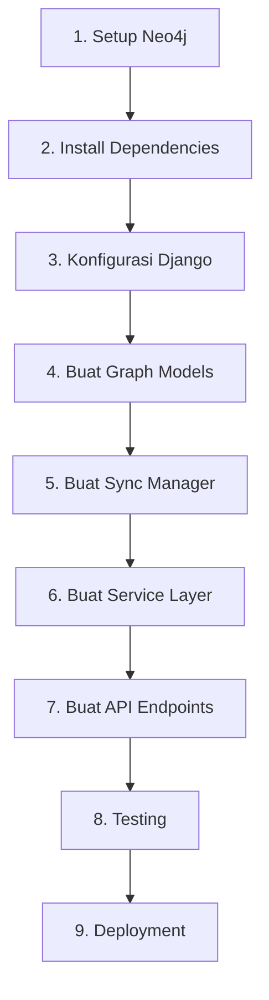

# 🛠️ Langkah-Langkah Implementasi Graph Database

## 📋 Overview Tahapan



---

## Step 1: Setup Neo4j Database

### **1.1 Install Neo4j (Pilih Salah Satu)**

#### **Option A: Neo4j Desktop (Recommended untuk Learning)**

1. Download dari: https://neo4j.com/download/
2. Install Neo4j Desktop
3. Buat project baru
4. Add database:
   - Name: `nakula-graph`
   - Password: `neo4jpassword`
   - Version: 5.x Community
5. Install plugins: APOC, Graph Data Science
6. Start database

#### **Option B: Docker**

```bash
docker run \
  --name nakula-neo4j \
  -p 7474:7474 -p 7687:7687 \
  -e NEO4J_AUTH=neo4j/neo4jpassword \
  -e NEO4J_PLUGINS='["apoc", "graph-data-science"]' \
  -v neo4j_data:/data \
  -v neo4j_logs:/logs \
  neo4j:5-community
```

#### **Option C: Native Installation**

**Linux:**
```bash
wget -O - https://debian.neo4j.com/neotechnology.gpg.key | sudo apt-key add -
echo 'deb https://debian.neo4j.com stable latest' | sudo tee /etc/apt/sources.list.d/neo4j.list
sudo apt-get update
sudo apt-get install neo4j
sudo systemctl start neo4j
```

**Mac:**
```bash
brew install neo4j
neo4j start
```

**Windows:**
Download installer dari neo4j.com

### **1.2 Verifikasi Neo4j Running**

1. Buka browser: http://localhost:7474
2. Login:
   - Username: `neo4j`
   - Password: `neo4j` (akan diminta ganti)
3. Ganti password menjadi: `neo4jpassword`
4. Test query:
```cypher
RETURN "Hello Graph Database!" as message
```

---

## Step 2: Install Python Dependencies

### **2.1 Tambahkan ke requirements.txt**

```bash
cd apps/backend
nano requirements.txt
```

Tambahkan di akhir file:
```txt
# Neo4j Graph Database
neomodel==5.3.0
neo4j==5.14.1
py2neo==2021.2.4
```

### **2.2 Install Dependencies**

```bash
# Dengan virtual environment
source venv/bin/activate  # Linux/Mac
venv\Scripts\activate     # Windows

# Install
pip install neomodel==5.3.0 neo4j==5.14.1 py2neo==2021.2.4

# Atau install dari requirements.txt
pip install -r requirements.txt
```

### **2.3 Verifikasi Installation**

```bash
python -c "import neomodel; print('✓ neomodel installed')"
python -c "import neo4j; print('✓ neo4j installed')"
python -c "import py2neo; print('✓ py2neo installed')"
```

---

## Step 3: Konfigurasi Django Settings

### **3.1 Update .env**

```bash
nano .env
```

Tambahkan:
```bash
# Neo4j Graph Database
NEO4J_URI=bolt://localhost:7687
NEO4J_USER=neo4j
NEO4J_PASSWORD=neo4jpassword
NEO4J_ENABLE_SYNC=True
```

### **3.2 Update config/settings/base.py**

```python
# Di bagian akhir file, tambahkan:

# ============================================
# NEO4J GRAPH DATABASE CONFIGURATION
# ============================================
NEO4J_URI = os.getenv("NEO4J_URI", "bolt://localhost:7687")
NEO4J_USER = os.getenv("NEO4J_USER", "neo4j")
NEO4J_PASSWORD = os.getenv("NEO4J_PASSWORD", "password")
NEO4J_ENABLE_SYNC = os.getenv("NEO4J_ENABLE_SYNC", "True").lower() == "true"

# Neo4j database URL for neomodel
NEOMODEL_NEO4J_BOLT_URL = f"{NEO4J_URI}"
```

### **3.3 Test Connection**

```bash
python manage.py shell
```

```python
from django.conf import settings
from neo4j import GraphDatabase

# Test connection
driver = GraphDatabase.driver(
    settings.NEO4J_URI,
    auth=(settings.NEO4J_USER, settings.NEO4J_PASSWORD)
)

with driver.session() as session:
    result = session.run("RETURN 'Connection successful!' as message")
    print(result.single()["message"])

driver.close()
```

Output yang diharapkan: `Connection successful!`

---

## Step 4: Buat Graph Models

### **4.1 Create apps/academic/graph_models.py**

```python
"""
Graph Database Models using neomodel
"""
from neomodel import (
    StructuredNode, StringProperty, IntegerProperty, FloatProperty,
    RelationshipTo, RelationshipFrom, Relationship
)


class MahasiswaNode(StructuredNode):
    """Mahasiswa node in graph database"""
    nim = StringProperty(unique_index=True, required=True)
    nama = StringProperty(index=True)
    email = StringProperty()
    angkatan = IntegerProperty(index=True)
    ipk = FloatProperty()
    status = StringProperty(index=True)

    # Relationships
    mengambil_kelas = RelationshipTo('KelasNode', 'MENGAMBIL')
    lulus_matkul = RelationshipTo('MataKuliahNode', 'LULUS')
    dibimbing_oleh = RelationshipTo('DosenNode', 'DIBIMBING_OLEH')
    kuliah_di_prodi = RelationshipTo('ProdiNode', 'KULIAH_DI')
    teman_sekelas = Relationship('MahasiswaNode', 'TEMAN_SEKELAS')


class DosenNode(StructuredNode):
    """Dosen node in graph database"""
    nip = StringProperty(unique_index=True, required=True)
    nama = StringProperty(index=True)
    email = StringProperty()
    nidn = StringProperty()
    jabatan = StringProperty()

    # Relationships
    mengajar_kelas = RelationshipTo('KelasNode', 'MENGAJAR')
    mengajar_matkul = RelationshipTo('MataKuliahNode', 'MENGAJAR')
    membimbing = RelationshipFrom('MahasiswaNode', 'DIBIMBING_OLEH')
    bertugas_di = RelationshipTo('ProdiNode', 'BERTUGAS_DI')


class MataKuliahNode(StructuredNode):
    """Mata Kuliah node in graph database"""
    kode = StringProperty(unique_index=True, required=True)
    nama = StringProperty(index=True)
    sks = IntegerProperty()
    semester = IntegerProperty()

    # Relationships
    prerequisite = RelationshipTo('MataKuliahNode', 'PREREQUISITE')
    bagian_dari_prodi = RelationshipTo('ProdiNode', 'BAGIAN_DARI')


class KelasNode(StructuredNode):
    """Kelas Kuliah node in graph database"""
    id_kelas = StringProperty(unique_index=True, required=True)
    nama_kelas = StringProperty(index=True)
    semester = StringProperty(index=True)
    kapasitas = IntegerProperty()

    # Relationships
    untuk_matkul = RelationshipTo('MataKuliahNode', 'UNTUK_MATKUL')
    di_prodi = RelationshipTo('ProdiNode', 'DI_PRODI')


class ProdiNode(StructuredNode):
    """Program Studi node in graph database"""
    kode_prodi = StringProperty(unique_index=True, required=True)
    nama_prodi = StringProperty(index=True)
    jenjang = StringProperty()

    # Relationships
    memiliki_mahasiswa = RelationshipFrom('MahasiswaNode', 'KULIAH_DI')
    memiliki_dosen = RelationshipFrom('DosenNode', 'BERTUGAS_DI')
```

### **4.2 Test Graph Models**

```bash
python manage.py shell
```

```python
from apps.academic.graph_models import MahasiswaNode, ProdiNode

# Buat node test
mhs = MahasiswaNode(
    nim='TEST001',
    nama='Test Student',
    angkatan=2024,
    ipk=3.5,
    status='Aktif'
).save()

print(f"Created: {mhs.nama} - {mhs.nim}")

# Query
mhs_found = MahasiswaNode.nodes.get(nim='TEST001')
print(f"Found: {mhs_found.nama}")

# Delete test node
mhs.delete()
print("Test node deleted")
```

---

## Step 5: Buat Sync Manager

### **5.1 Create apps/academic/graph_sync.py**

```python
"""
Graph Database Sync Manager
"""
import logging
from neomodel import db
from neo4j import GraphDatabase
from django.conf import settings

from .graph_models import MahasiswaNode, DosenNode, MataKuliahNode, KelasNode, ProdiNode
from apps.feeder.models.mahasiswa import RiwayatPendidikan
from apps.feeder.models.dosen import Dosen
from apps.feeder.models.kurikulum import MataKuliah
from apps.feeder.models.kuliah import Kelas

logger = logging.getLogger(__name__)


class GraphSyncManager:
    """Manager for syncing data from PostgreSQL to Neo4j"""

    def __init__(self):
        self.neo4j_uri = settings.NEO4J_URI
        self.neo4j_user = settings.NEO4J_USER
        self.neo4j_password = settings.NEO4J_PASSWORD

        self.driver = GraphDatabase.driver(
            self.neo4j_uri,
            auth=(self.neo4j_user, self.neo4j_password)
        )

    def close(self):
        if self.driver:
            self.driver.close()

    def sync_mahasiswa_node(self, riwayat_pendidikan):
        """Sync single mahasiswa to Neo4j"""
        try:
            biodata = riwayat_pendidikan.id_mahasiswa

            # Get or create
            try:
                node = MahasiswaNode.nodes.get(nim=riwayat_pendidikan.nim)
                node.nama = biodata.nama_mahasiswa
                node.email = getattr(riwayat_pendidikan, 'email', '')
                node.angkatan = getattr(riwayat_pendidikan, 'angkatan', 0)
                node.ipk = getattr(riwayat_pendidikan, 'ipk', 0.0)
                node.status = riwayat_pendidikan.nama_status_mahasiswa or 'Aktif'
                node.save()
            except MahasiswaNode.DoesNotExist:
                node = MahasiswaNode(
                    nim=riwayat_pendidikan.nim,
                    nama=biodata.nama_mahasiswa,
                    email=getattr(riwayat_pendidikan, 'email', ''),
                    angkatan=getattr(riwayat_pendidikan, 'angkatan', 0),
                    ipk=getattr(riwayat_pendidikan, 'ipk', 0.0),
                    status=riwayat_pendidikan.nama_status_mahasiswa or 'Aktif'
                ).save()

            logger.info(f"Synced mahasiswa: {riwayat_pendidikan.nim}")
            return node

        except Exception as e:
            logger.error(f"Error syncing mahasiswa {riwayat_pendidikan.nim}: {e}")
            return None

    def sync_all_mahasiswa(self, limit=None):
        """Sync all mahasiswa"""
        qs = RiwayatPendidikan.objects.filter(deleted=False)
        if limit:
            qs = qs[:limit]

        count = 0
        for riwayat in qs:
            if self.sync_mahasiswa_node(riwayat):
                count += 1

        logger.info(f"Synced {count} mahasiswa nodes")
        return count

    # Tambahkan method serupa untuk Dosen, MataKuliah, Kelas, dst
```

### **5.2 Test Sync Manager**

```bash
python manage.py shell
```

```python
from apps.academic.graph_sync import GraphSyncManager

manager = GraphSyncManager()

# Sync 10 mahasiswa pertama
count = manager.sync_all_mahasiswa(limit=10)
print(f"Synced {count} mahasiswa")

manager.close()
```

---

## Step 6: Buat Service Layer

### **6.1 Create apps/academic/services/graph_service.py**

```python
"""
Graph Service Layer
"""
import logging
from typing import List, Dict, Any
from neomodel import db

logger = logging.getLogger(__name__)


class AcademicGraphService:
    """Service class for graph-based queries"""

    @staticmethod
    def get_classmates(nim: str, limit: int = 50) -> List[Dict[str, Any]]:
        """Get all classmates of a student"""
        query = """
        MATCH (m1:MahasiswaNode {nim: $nim})
              -[:MENGAMBIL]->(k:KelasNode)
              <-[:MENGAMBIL]-(m2:MahasiswaNode)
        WHERE m1 <> m2
        WITH m2, COUNT(DISTINCT k) as kelas_bersama
        ORDER BY kelas_bersama DESC
        LIMIT $limit
        RETURN m2.nim as nim, m2.nama as nama,
               m2.angkatan as angkatan, kelas_bersama
        """

        try:
            results, meta = db.cypher_query(query, {'nim': nim, 'limit': limit})
            return [
                {
                    'nim': row[0],
                    'nama': row[1],
                    'angkatan': row[2],
                    'kelas_bersama': row[3]
                }
                for row in results
            ]
        except Exception as e:
            logger.error(f"Error getting classmates: {e}")
            return []

    @staticmethod
    def recommend_courses(nim: str, limit: int = 10) -> List[Dict[str, Any]]:
        """Recommend courses based on what friends are taking"""
        query = """
        MATCH (m:MahasiswaNode {nim: $nim})
              -[:MENGAMBIL]->(:KelasNode)
              <-[:MENGAMBIL]-(teman)
              -[:MENGAMBIL]->(k2:KelasNode)
              -[:UNTUK_MATKUL]->(mk:MataKuliahNode)
        WHERE NOT (m)-[:MENGAMBIL]->(:KelasNode)-[:UNTUK_MATKUL]->(mk)
        WITH mk, COUNT(DISTINCT teman) as friends_count
        ORDER BY friends_count DESC
        LIMIT $limit
        RETURN mk.kode as kode, mk.nama as nama,
               mk.sks as sks, friends_count
        """

        try:
            results, meta = db.cypher_query(query, {'nim': nim, 'limit': limit})
            return [
                {
                    'kode': row[0],
                    'nama': row[1],
                    'sks': row[2],
                    'teman_ambil': row[3]
                }
                for row in results
            ]
        except Exception as e:
            logger.error(f"Error recommending courses: {e}")
            return []
```

### **6.2 Test Service Layer**

```bash
python manage.py shell
```

```python
from apps.academic.services.graph_service import AcademicGraphService

# Get classmates
classmates = AcademicGraphService.get_classmates('11201800001')
for mate in classmates:
    print(f"{mate['nama']} - {mate['kelas_bersama']} kelas bersama")

# Get recommendations
recommendations = AcademicGraphService.recommend_courses('11201800001')
for rec in recommendations:
    print(f"{rec['kode']} - {rec['nama']} ({rec['teman_ambil']} teman)")
```

---

## Step 7: Buat API Endpoints

### **7.1 Create api/v1/academic/graph/views.py**

```python
"""
Graph API Views
"""
from rest_framework.views import APIView
from rest_framework.response import Response
from rest_framework.permissions import IsAuthenticated
from api.common.authentication import CustomJWTAuthentication
from apps.academic.services.graph_service import AcademicGraphService


class ClassmatesView(APIView):
    """Get classmates API"""
    authentication_classes = [CustomJWTAuthentication]
    permission_classes = [IsAuthenticated]

    def get(self, request):
        nim = request.user.username
        limit = int(request.GET.get('limit', 50))

        classmates = AcademicGraphService.get_classmates(nim, limit)

        return Response({
            'success': True,
            'data': classmates,
            'count': len(classmates)
        })


class RecommendCoursesView(APIView):
    """Get course recommendations API"""
    authentication_classes = [CustomJWTAuthentication]
    permission_classes = [IsAuthenticated]

    def get(self, request):
        nim = request.user.username
        limit = int(request.GET.get('limit', 10))

        recommendations = AcademicGraphService.recommend_courses(nim, limit)

        return Response({
            'success': True,
            'data': recommendations,
            'count': len(recommendations)
        })
```

### **7.2 Create api/v1/academic/graph/urls.py**

```python
"""
Graph API URLs
"""
from django.urls import path
from . import views

urlpatterns = [
    path('classmates/', views.ClassmatesView.as_view(), name='graph-classmates'),
    path('recommend-courses/', views.RecommendCoursesView.as_view(), name='graph-recommend-courses'),
]
```

### **7.3 Register URLs di api/v1/urls.py**

```python
# Tambahkan di urlpatterns
path('graph/', include('api.v1.academic.graph.urls')),
```

---

## Step 8: Testing

### **8.1 Test via Postman/cURL**

**1. Get JWT Token:**
```bash
curl -X POST http://localhost:8000/api/v1/auth/login/ \
  -H "Content-Type: application/json" \
  -d '{"username": "superadmin", "password": "superadmin123"}'
```

**2. Test Classmates API:**
```bash
TOKEN="your-token-here"

curl -X GET "http://localhost:8000/api/v1/graph/classmates/?limit=10" \
  -H "Authorization: Bearer $TOKEN"
```

**3. Test Recommendations API:**
```bash
curl -X GET "http://localhost:8000/api/v1/graph/recommend-courses/?limit=5" \
  -H "Authorization: Bearer $TOKEN"
```

### **8.2 Test di Neo4j Browser**

Buka http://localhost:7474 dan run:

```cypher
// Lihat semua nodes
MATCH (n) RETURN COUNT(n)

// Lihat mahasiswa
MATCH (m:MahasiswaNode) RETURN m LIMIT 10

// Test query classmates
MATCH (m1:MahasiswaNode {nim: '11201800001'})
      -[:MENGAMBIL]->(k:KelasNode)
      <-[:MENGAMBIL]-(m2:MahasiswaNode)
WHERE m1 <> m2
RETURN m2.nama, COUNT(k) as kelas_bersama
ORDER BY kelas_bersama DESC
```

---

## Step 9: Management Command untuk Sync

### **9.1 Create apps/academic/management/commands/sync_to_neo4j.py**

```python
"""
Management command to sync data to Neo4j
"""
from django.core.management.base import BaseCommand
from apps.academic.graph_sync import GraphSyncManager


class Command(BaseCommand):
    help = 'Sync data from PostgreSQL to Neo4j'

    def add_arguments(self, parser):
        parser.add_argument('--mahasiswa', action='store_true', help='Sync mahasiswa')
        parser.add_argument('--limit', type=int, default=None, help='Limit records')

    def handle(self, *args, **options):
        manager = GraphSyncManager()

        try:
            if options['mahasiswa']:
                count = manager.sync_all_mahasiswa(limit=options['limit'])
                self.stdout.write(
                    self.style.SUCCESS(f'Synced {count} mahasiswa nodes')
                )
        finally:
            manager.close()
```

### **9.2 Run Management Command**

```bash
# Sync 100 mahasiswa
python manage.py sync_to_neo4j --mahasiswa --limit 100

# Sync all mahasiswa
python manage.py sync_to_neo4j --mahasiswa
```

---

## ✅ Checklist Implementasi

- [ ] Neo4j terinstall dan running
- [ ] Python packages terinstall (neomodel, neo4j, py2neo)
- [ ] Django settings dikonfigurasi
- [ ] Graph models dibuat (graph_models.py)
- [ ] Sync manager dibuat (graph_sync.py)
- [ ] Service layer dibuat (graph_service.py)
- [ ] API endpoints dibuat (views.py, urls.py)
- [ ] Management command dibuat
- [ ] Testing berhasil
- [ ] Data ter-sync ke Neo4j

---

**Next:** [03-ADVANCED-FEATURES.md](./03-ADVANCED-FEATURES.md) - Fitur lanjutan dan optimisasi
