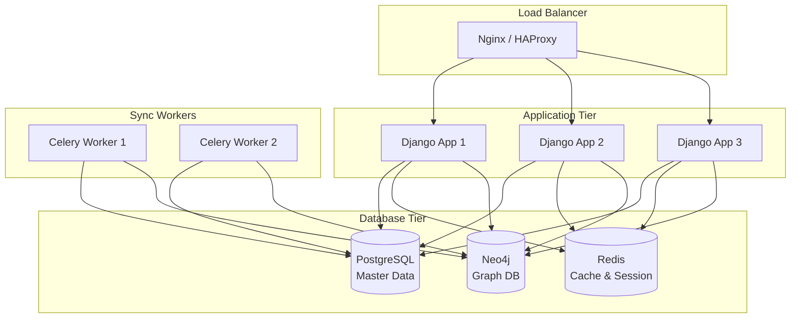

# 🚀 Production Deployment - Graph Database

## 📋 Overview

Panduan deploy Neo4j Graph Database ke production environment dengan best practices untuk security, performance, dan reliability.

---

## 1. Production Architecture

### **Recommended Setup**



### **Component Responsibilities**

| Component | Purpose | Scaling |
|-----------|---------|---------|
| **Django Apps** | API servers | Horizontal (3+ instances) |
| **PostgreSQL** | Master data | Vertical + Read replicas |
| **Redis** | Cache & sessions | Master-Slave |
| **Neo4j** | Graph queries | Cluster (Enterprise) |
| **Celery Workers** | Async sync jobs | Horizontal |

---

## 2. Neo4j Production Setup

### **2.1 System Requirements**

**Minimum (Small deployment):**
- CPU: 4 cores
- RAM: 8 GB
- Storage: 50 GB SSD
- Network: 1 Gbps

**Recommended (Medium deployment):**
- CPU: 8-16 cores
- RAM: 32 GB
- Storage: 500 GB NVMe SSD
- Network: 10 Gbps

**Large Deployment:**
- CPU: 32+ cores
- RAM: 128+ GB
- Storage: 2+ TB NVMe SSD
- Cluster: 3-5 nodes

### **2.2 Memory Configuration**

Neo4j is **memory-intensive**. Configure appropriately:

```bash
# neo4j.conf
# Heap size (JVM)
server.memory.heap.initial_size=4G
server.memory.heap.max_size=8G

# Page cache (for graph storage)
server.memory.pagecache.size=16G

# Off-heap memory
server.memory.off_heap.max_size=4G
```

**Rule of Thumb:**
- **Heap**: 25-30% of total RAM
- **Page Cache**: 50-60% of total RAM
- **OS**: Remaining 10-20%

### **2.3 Docker Compose Production**

```yaml
# docker-compose.prod.yml
version: '3.8'

services:
  neo4j:
    image: neo4j:5-enterprise  # atau :5-community
    container_name: nakula-neo4j-prod
    restart: always

    ports:
      - "7474:7474"  # HTTP (close in firewall)
      - "7473:7473"  # HTTPS
      - "7687:7687"  # Bolt

    environment:
      # Authentication
      - NEO4J_AUTH=neo4j/${NEO4J_PASSWORD}

      # Memory settings
      - NEO4J_server_memory_heap_initial__size=4G
      - NEO4J_server_memory_heap_max__size=8G
      - NEO4J_server_memory_pagecache_size=16G

      # Performance
      - NEO4J_dbms_memory_transaction_total_max=1G
      - NEO4J_dbms_checkpoint_interval_time=15m

      # Security
      - NEO4J_dbms_connector_bolt_enabled=true
      - NEO4J_dbms_connector_http_enabled=false  # Disable HTTP in prod
      - NEO4J_dbms_connector_https_enabled=true

      # SSL/TLS
      - NEO4J_dbms_ssl_policy_bolt_enabled=true
      - NEO4J_dbms_ssl_policy_bolt_base__directory=/ssl

      # Logging
      - NEO4J_dbms_logs_query_enabled=true
      - NEO4J_dbms_logs_query_threshold=1s

    volumes:
      - neo4j_data:/data
      - neo4j_logs:/logs
      - neo4j_import:/import
      - neo4j_plugins:/plugins
      - ./ssl:/ssl:ro  # SSL certificates

    networks:
      - nakula-network

    healthcheck:
      test: ["CMD-SHELL", "cypher-shell -u neo4j -p ${NEO4J_PASSWORD} 'RETURN 1'"]
      interval: 30s
      timeout: 10s
      retries: 5
      start_period: 60s

    deploy:
      resources:
        limits:
          cpus: '8'
          memory: 32G
        reservations:
          cpus: '4'
          memory: 16G

volumes:
  neo4j_data:
    driver: local
  neo4j_logs:
    driver: local
  neo4j_import:
    driver: local
  neo4j_plugins:
    driver: local

networks:
  nakula-network:
    external: true
```

### **2.4 Native Installation (Ubuntu)**

```bash
# Add Neo4j repository
wget -O - https://debian.neo4j.com/neotechnology.gpg.key | sudo apt-key add -
echo 'deb https://debian.neo4j.com stable latest' | sudo tee /etc/apt/sources.list.d/neo4j.list

# Install
sudo apt-get update
sudo apt-get install neo4j-enterprise  # atau neo4j

# Configure
sudo nano /etc/neo4j/neo4j.conf

# Start service
sudo systemctl enable neo4j
sudo systemctl start neo4j

# Check status
sudo systemctl status neo4j
```

---

## 3. Security Hardening

### **3.1 Change Default Password**

```bash
# Via cypher-shell
cypher-shell -u neo4j -p neo4j

# Change password
ALTER CURRENT USER SET PASSWORD FROM 'neo4j' TO 'your-very-strong-password-here';
```

### **3.2 Create Read-Only User**

```cypher
// Create read-only user for analytics
CREATE USER analytics SET PASSWORD 'analytics-password' CHANGE NOT REQUIRED;
GRANT ROLE reader TO analytics;
```

### **3.3 Enable SSL/TLS**

**Generate Self-Signed Certificate (for testing):**
```bash
mkdir -p /var/lib/neo4j/certificates/bolt
cd /var/lib/neo4j/certificates/bolt

openssl req -x509 -newkey rsa:4096 \
  -keyout private.key -out public.crt \
  -days 365 -nodes \
  -subj "/CN=your-domain.com"

chown -R neo4j:neo4j /var/lib/neo4j/certificates
chmod 600 private.key
```

**Configure neo4j.conf:**
```conf
# SSL/TLS
dbms.ssl.policy.bolt.enabled=true
dbms.ssl.policy.bolt.base_directory=/var/lib/neo4j/certificates/bolt
dbms.ssl.policy.bolt.private_key=private.key
dbms.ssl.policy.bolt.public_certificate=public.crt
dbms.ssl.policy.bolt.client_auth=NONE
```

**Django Connection String:**
```python
NEO4J_URI = os.getenv("NEO4J_URI", "bolt+s://neo4j.yourdomain.com:7687")
```

### **3.4 Firewall Rules**

```bash
# Allow only specific IPs to Neo4j ports
sudo ufw allow from 10.0.0.0/24 to any port 7687 proto tcp  # Bolt
sudo ufw deny 7474  # Block HTTP from outside
sudo ufw deny 7473  # Block HTTPS from outside (use internal network only)

# Enable firewall
sudo ufw enable
```

### **3.5 Network Isolation**

```yaml
# docker-compose.prod.yml
networks:
  nakula-network:
    driver: bridge
    internal: true  # No external access

  # Separate network for external access
  public-network:
    driver: bridge
```

---

## 4. Performance Optimization

### **4.1 Query Optimization**

**Use EXPLAIN to analyze queries:**
```cypher
EXPLAIN
MATCH (m:MahasiswaNode {nim: '11201800001'})
      -[:MENGAMBIL]->(k:KelasNode)
      <-[:MENGAMBIL]-(m2:MahasiswaNode)
RETURN m2
```

**Use PROFILE for detailed metrics:**
```cypher
PROFILE
MATCH (m:MahasiswaNode {nim: '11201800001'})
      -[:MENGAMBIL]->(k:KelasNode)
      <-[:MENGAMBIL]-(m2:MahasiswaNode)
RETURN m2
```

### **4.2 Create Strategic Indexes**

```cypher
// Unique constraints (automatically creates index)
CREATE CONSTRAINT mahasiswa_nim IF NOT EXISTS
FOR (m:MahasiswaNode) REQUIRE m.nim IS UNIQUE;

CREATE CONSTRAINT dosen_nip IF NOT EXISTS
FOR (d:DosenNode) REQUIRE d.nip IS UNIQUE;

CREATE CONSTRAINT matkul_kode IF NOT EXISTS
FOR (mk:MataKuliahNode) REQUIRE mk.kode IS UNIQUE;

// Regular indexes for frequent queries
CREATE INDEX mahasiswa_angkatan IF NOT EXISTS
FOR (m:MahasiswaNode) ON (m.angkatan);

CREATE INDEX mahasiswa_status IF NOT EXISTS
FOR (m:MahasiswaNode) ON (m.status);

CREATE INDEX kelas_semester IF NOT EXISTS
FOR (k:KelasNode) ON (k.semester);
```

### **4.3 Connection Pooling**

```python
# config/settings/production.py
from neo4j import GraphDatabase

# Configure connection pool
NEO4J_DRIVER_CONFIG = {
    'max_connection_lifetime': 3600,  # 1 hour
    'max_connection_pool_size': 50,
    'connection_acquisition_timeout': 60,
}

# Initialize driver with pooling
neo4j_driver = GraphDatabase.driver(
    NEO4J_URI,
    auth=(NEO4J_USER, NEO4J_PASSWORD),
    **NEO4J_DRIVER_CONFIG
)
```

### **4.4 Query Caching Strategy**

```python
from django.core.cache import cache
from functools import wraps

def cache_graph_query(timeout=3600):
    """Decorator for caching graph queries"""
    def decorator(func):
        @wraps(func)
        def wrapper(*args, **kwargs):
            # Create cache key from function name and args
            cache_key = f"graph:{func.__name__}:{hash(str(args))}{hash(str(kwargs))}"

            # Try cache first
            result = cache.get(cache_key)
            if result is not None:
                return result

            # Execute query
            result = func(*args, **kwargs)

            # Cache result
            cache.set(cache_key, result, timeout)

            return result
        return wrapper
    return decorator

# Usage
@cache_graph_query(timeout=1800)  # 30 minutes
def get_classmates(nim: str, limit: int = 50):
    # ... query implementation
    pass
```

---

## 5. Backup & Recovery

### **5.1 Automated Backup Script**

```bash
#!/bin/bash
# /opt/scripts/neo4j-backup.sh

BACKUP_DIR="/backup/neo4j"
DATE=$(date +%Y%m%d_%H%M%S)
BACKUP_FILE="neo4j_backup_${DATE}.dump"

# Create backup directory
mkdir -p ${BACKUP_DIR}

# Stop Neo4j (offline backup - safest)
sudo systemctl stop neo4j

# Backup using neo4j-admin
neo4j-admin database dump neo4j \
  --to-path=${BACKUP_DIR}/${BACKUP_FILE}

# Start Neo4j
sudo systemctl start neo4j

# Compress backup
gzip ${BACKUP_DIR}/${BACKUP_FILE}

# Delete backups older than 7 days
find ${BACKUP_DIR} -name "*.dump.gz" -mtime +7 -delete

echo "Backup completed: ${BACKUP_FILE}.gz"
```

**Cron Job:**
```bash
# Daily backup at 2 AM
0 2 * * * /opt/scripts/neo4j-backup.sh >> /var/log/neo4j-backup.log 2>&1
```

### **5.2 Online Backup (Enterprise Edition)**

```bash
# Online backup (requires Enterprise Edition)
neo4j-admin backup \
  --from=bolt://localhost:7687 \
  --backup-dir=/backup/neo4j \
  --database=neo4j \
  --fallback-to-full=true
```

### **5.3 Restore from Backup**

```bash
# Stop Neo4j
sudo systemctl stop neo4j

# Remove old database
rm -rf /var/lib/neo4j/data/databases/neo4j

# Restore from backup
neo4j-admin database load neo4j \
  --from-path=/backup/neo4j/neo4j_backup_20241001.dump

# Fix permissions
chown -R neo4j:neo4j /var/lib/neo4j/data

# Start Neo4j
sudo systemctl start neo4j
```

---

## 6. Monitoring & Alerting

### **6.1 Prometheus + Grafana Setup**

**Enable Neo4j metrics:**
```conf
# neo4j.conf
metrics.enabled=true
metrics.prometheus.enabled=true
metrics.prometheus.endpoint=localhost:2004
```

**Prometheus config:**
```yaml
# prometheus.yml
scrape_configs:
  - job_name: 'neo4j'
    static_configs:
      - targets: ['neo4j-host:2004']
```

### **6.2 Key Metrics to Monitor**

| Metric | Warning | Critical |
|--------|---------|----------|
| **Heap Usage** | > 80% | > 95% |
| **Page Cache Hit Ratio** | < 90% | < 80% |
| **Transaction Count** | > 1000/s | > 2000/s |
| **Query Duration** | > 1s | > 5s |
| **Connection Pool** | > 80% | > 95% |
| **Disk Space** | > 80% | > 90% |

### **6.3 Health Check Endpoint**

```python
# api/v1/health/views.py
from rest_framework.views import APIView
from rest_framework.response import Response
from apps.academic.services.graph_service import AcademicGraphService

class GraphHealthView(APIView):
    """Neo4j health check endpoint"""

    def get(self, request):
        health = AcademicGraphService.health_check()

        status_code = 200 if health['status'] == 'healthy' else 503

        return Response(health, status=status_code)
```

**Monitor with Uptime Robot / Pingdom:**
- Endpoint: `https://api.yourdomain.com/health/graph/`
- Interval: 5 minutes
- Alert when down for 2 consecutive checks

---

## 7. Sync Strategy for Production

### **7.1 Celery Task for Async Sync**

```python
# apps/academic/tasks.py
from celery import shared_task
from apps.academic.graph_sync import GraphSyncManager
import logging

logger = logging.getLogger(__name__)

@shared_task(bind=True, max_retries=3)
def sync_mahasiswa_to_neo4j(self, riwayat_id):
    """Async task to sync single mahasiswa"""
    try:
        from apps.feeder.models.mahasiswa import RiwayatPendidikan

        riwayat = RiwayatPendidikan.objects.get(id=riwayat_id)
        manager = GraphSyncManager()
        manager.sync_mahasiswa_node(riwayat)
        manager.close()

    except Exception as exc:
        logger.error(f"Failed to sync mahasiswa {riwayat_id}: {exc}")
        raise self.retry(exc=exc, countdown=60)  # Retry after 1 minute

@shared_task
def full_sync_neo4j():
    """Full sync task (run via cron)"""
    manager = GraphSyncManager()
    try:
        manager.bulk_sync_all()
    finally:
        manager.close()
```

### **7.2 Django Signal with Celery**

```python
# apps/academic/signals.py
from django.db.models.signals import post_save
from django.dispatch import receiver
from apps.feeder.models.mahasiswa import RiwayatPendidikan
from .tasks import sync_mahasiswa_to_neo4j

@receiver(post_save, sender=RiwayatPendidikan)
def async_sync_mahasiswa(sender, instance, created, **kwargs):
    """Trigger async sync on save"""
    from django.conf import settings

    if not settings.NEO4J_ENABLE_SYNC:
        return

    # Delay task by 5 seconds to batch updates
    sync_mahasiswa_to_neo4j.apply_async(
        args=[instance.id],
        countdown=5
    )
```

### **7.3 Scheduled Full Sync (Celery Beat)**

```python
# config/celery.py
from celery.schedules import crontab

app.conf.beat_schedule = {
    'full-sync-neo4j-daily': {
        'task': 'apps.academic.tasks.full_sync_neo4j',
        'schedule': crontab(hour=2, minute=0),  # 2 AM daily
    },
}
```

---

## 8. Disaster Recovery Plan

### **8.1 Recovery Scenarios**

| Scenario | Recovery Method | RTO | RPO |
|----------|----------------|-----|-----|
| **Node failure** | Restore from backup | 30 min | 24 hrs |
| **Data corruption** | Restore + re-sync | 1 hr | 24 hrs |
| **Complete loss** | Rebuild from PostgreSQL | 4 hrs | 0 (rebuilt) |
| **Cluster failure** | Failover to standby | 5 min | 0 |

### **8.2 Rebuild from PostgreSQL**

```python
# Management command: rebuild_neo4j.py
from django.core.management.base import BaseCommand
from apps.academic.graph_sync import GraphSyncManager

class Command(BaseCommand):
    help = 'Rebuild entire Neo4j database from PostgreSQL'

    def handle(self, *args, **options):
        self.stdout.write('WARNING: This will clear all Neo4j data!')
        confirm = input('Type "CONFIRM" to proceed: ')

        if confirm != 'CONFIRM':
            self.stdout.write('Aborted.')
            return

        manager = GraphSyncManager()

        try:
            # Clear existing data
            self.stdout.write('Clearing Neo4j data...')
            manager.clear_all_data()

            # Full sync
            self.stdout.write('Starting full sync...')
            manager.bulk_sync_all()

            self.stdout.write(self.style.SUCCESS('Rebuild completed!'))

        finally:
            manager.close()
```

---

## 9. Cost Optimization

### **9.1 Community vs Enterprise**

| Feature | Community | Enterprise |
|---------|-----------|------------|
| **Cost** | Free | $$$$ |
| **Clustering** | No | Yes |
| **Hot Backup** | No | Yes |
| **Advanced Security** | Basic | Full RBAC |
| **Support** | Community | Official |

**Recommendation:** Start with Community, upgrade when needed.

### **9.2 Resource Optimization**

```conf
# For budget-conscious deployments
server.memory.heap.max_size=2G
server.memory.pagecache.size=4G

# Limit transactions
dbms.memory.transaction.total_max=512m

# Reduce logging
dbms.logs.query.enabled=false
```

---

## 10. Deployment Checklist

### **Pre-Deployment**

- [ ] Neo4j installed and configured
- [ ] SSL/TLS certificates generated
- [ ] Strong passwords set
- [ ] Firewall rules configured
- [ ] Backup script created and tested
- [ ] Monitoring setup (Prometheus/Grafana)
- [ ] Health check endpoint implemented
- [ ] Load testing completed
- [ ] Documentation updated

### **Deployment**

- [ ] Deploy Neo4j container/service
- [ ] Verify connectivity
- [ ] Create indexes and constraints
- [ ] Run initial data sync
- [ ] Verify data consistency
- [ ] Test API endpoints
- [ ] Monitor performance metrics
- [ ] Configure alerting

### **Post-Deployment**

- [ ] Daily backup verification
- [ ] Weekly consistency checks
- [ ] Monthly performance reviews
- [ ] Quarterly security audits
- [ ] Update documentation

---

## 11. Troubleshooting

### **Common Issues**

**Issue: Out of Memory**
```bash
# Check logs
tail -f /var/log/neo4j/neo4j.log | grep OutOfMemory

# Solution: Increase heap size
server.memory.heap.max_size=16G
```

**Issue: Slow Queries**
```cypher
// Find slow queries in logs
CALL dbms.listQueries() YIELD queryId, elapsedTimeMillis, query
WHERE elapsedTimeMillis > 1000
RETURN queryId, elapsedTimeMillis, query
ORDER BY elapsedTimeMillis DESC
```

**Issue: Connection Pool Exhausted**
```python
# Increase pool size
NEO4J_DRIVER_CONFIG = {
    'max_connection_pool_size': 100,  # Increase from 50
}
```

---

**Implementation complete!** Neo4j Graph Database siap production. 🚀
