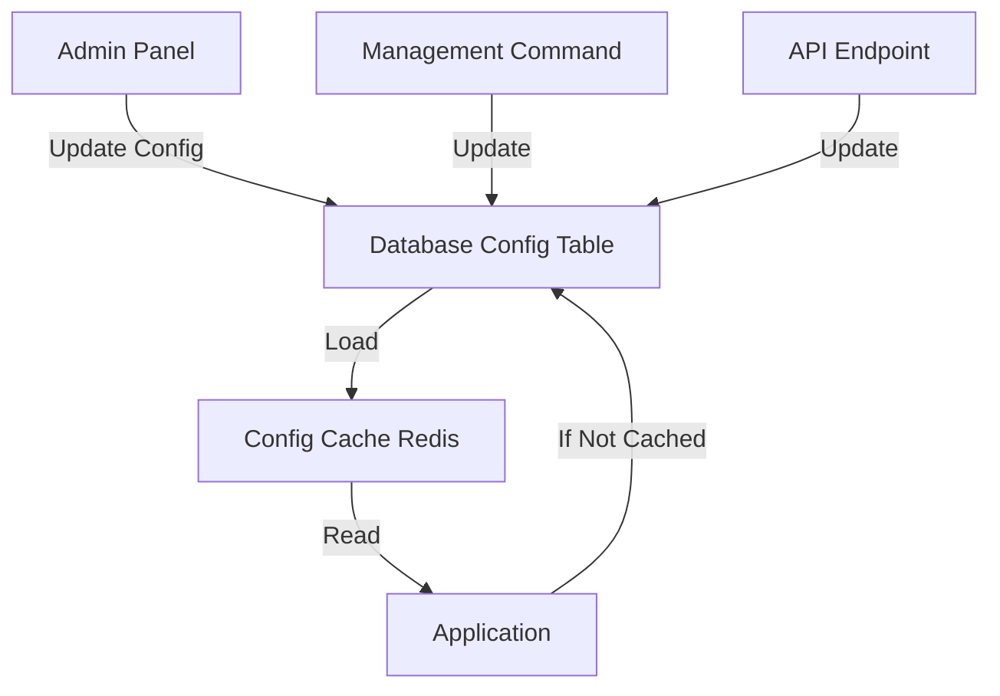

# 🔧 Dynamic Configuration Pattern untuk Graph Database

## 📋 Masalah: Hardcoded Configuration

### **Contoh Config yang Di-Hardcode (BAD ❌)**

```python
# config/settings/base.py
NEO4J_URI = "bolt://localhost:7687"
NEO4J_USER = "neo4j"
NEO4J_PASSWORD = "neo4jpassword"
NEO4J_ENABLE_SYNC = True

# Graph query limits (hardcoded)
GRAPH_CLASSMATES_LIMIT = 50
GRAPH_RECOMMENDATIONS_LIMIT = 10
GRAPH_FRIENDS_OF_FRIENDS_LIMIT = 20

# Sync settings (hardcoded)
SYNC_BATCH_SIZE = 1000
SYNC_TIMEOUT = 3600
```

### **Masalah:**
- ❌ Tidak bisa diubah tanpa restart aplikasi
- ❌ Tidak bisa berbeda per environment
- ❌ Sulit untuk A/B testing
- ❌ Tidak ada audit trail perubahan config
- ❌ Tim non-technical tidak bisa adjust settings

---

## ✅ Solusi: Dynamic Configuration System

### **Konsep:**



---

## 1. Database Model untuk Config

### **1.1 Model Design**

```python
# apps/core/models/dynamic_config.py
from django.db import models
from django.core.cache import cache
import json

class DynamicConfig(models.Model):
    """
    Dynamic configuration that can be changed without restart
    """

    # Config categories
    CATEGORY_CHOICES = [
        ('neo4j', 'Neo4j Database'),
        ('graph_query', 'Graph Query Limits'),
        ('sync', 'Sync Settings'),
        ('performance', 'Performance Tuning'),
        ('feature_flag', 'Feature Flags'),
    ]

    # Data types
    TYPE_CHOICES = [
        ('string', 'String'),
        ('integer', 'Integer'),
        ('float', 'Float'),
        ('boolean', 'Boolean'),
        ('json', 'JSON Object'),
    ]

    category = models.CharField(max_length=50, choices=CATEGORY_CHOICES, db_index=True)
    key = models.CharField(max_length=100, unique=True, db_index=True)
    value = models.TextField()
    data_type = models.CharField(max_length=20, choices=TYPE_CHOICES, default='string')

    description = models.TextField(blank=True)
    default_value = models.TextField(blank=True)

    # Metadata
    is_active = models.BooleanField(default=True)
    is_sensitive = models.BooleanField(default=False)  # untuk password, dll
    requires_restart = models.BooleanField(default=False)  # beberapa config butuh restart

    created_at = models.DateTimeField(auto_now_add=True)
    updated_at = models.DateTimeField(auto_now=True)
    updated_by = models.ForeignKey('users.User', null=True, on_delete=models.SET_NULL)

    class Meta:
        db_table = 'core_dynamic_config'
        ordering = ['category', 'key']
        verbose_name = 'Dynamic Configuration'
        verbose_name_plural = 'Dynamic Configurations'

    def __str__(self):
        return f"{self.category}.{self.key}"

    def get_typed_value(self):
        """Convert string value to appropriate type"""
        if not self.is_active:
            return self.get_default_value()

        try:
            if self.data_type == 'integer':
                return int(self.value)
            elif self.data_type == 'float':
                return float(self.value)
            elif self.data_type == 'boolean':
                return self.value.lower() in ('true', '1', 'yes', 'on')
            elif self.data_type == 'json':
                return json.loads(self.value)
            else:
                return self.value
        except (ValueError, json.JSONDecodeError):
            return self.get_default_value()

    def get_default_value(self):
        """Get default value with type conversion"""
        if not self.default_value:
            return None

        try:
            if self.data_type == 'integer':
                return int(self.default_value)
            elif self.data_type == 'float':
                return float(self.default_value)
            elif self.data_type == 'boolean':
                return self.default_value.lower() in ('true', '1', 'yes', 'on')
            elif self.data_type == 'json':
                return json.loads(self.default_value)
            else:
                return self.default_value
        except (ValueError, json.JSONDecodeError):
            return None

    def save(self, *args, **kwargs):
        super().save(*args, **kwargs)
        # Clear cache when config is updated
        self.clear_cache()

    def clear_cache(self):
        """Clear cached config value"""
        cache_key = f"dynamic_config:{self.key}"
        cache.delete(cache_key)
        # Also clear category cache
        cache.delete(f"dynamic_config:category:{self.category}")


class ConfigChangeLog(models.Model):
    """
    Audit log for configuration changes
    """
    config = models.ForeignKey(DynamicConfig, on_delete=models.CASCADE, related_name='change_logs')
    old_value = models.TextField(blank=True)
    new_value = models.TextField()
    changed_by = models.ForeignKey('users.User', on_delete=models.SET_NULL, null=True)
    changed_at = models.DateTimeField(auto_now_add=True)
    reason = models.TextField(blank=True)

    class Meta:
        db_table = 'core_config_change_log'
        ordering = ['-changed_at']
```

---

## 2. Config Manager Service

### **2.1 Config Manager Class**

```python
# apps/core/services/config_manager.py
from django.core.cache import cache
from apps.core.models import DynamicConfig, ConfigChangeLog
import logging

logger = logging.getLogger(__name__)


class ConfigManager:
    """
    Centralized configuration manager with caching
    """

    CACHE_TIMEOUT = 300  # 5 minutes
    CACHE_PREFIX = "dynamic_config"

    @classmethod
    def get(cls, key: str, default=None, use_cache=True):
        """
        Get configuration value by key

        Args:
            key: Config key (e.g., 'neo4j.uri' or 'GRAPH_CLASSMATES_LIMIT')
            default: Default value if not found
            use_cache: Whether to use cache

        Returns:
            Typed configuration value
        """
        # Try cache first
        if use_cache:
            cache_key = f"{cls.CACHE_PREFIX}:{key}"
            cached_value = cache.get(cache_key)
            if cached_value is not None:
                return cached_value

        # Query database
        try:
            config = DynamicConfig.objects.get(key=key, is_active=True)
            value = config.get_typed_value()

            # Cache it
            if use_cache:
                cache.set(cache_key, value, cls.CACHE_TIMEOUT)

            return value

        except DynamicConfig.DoesNotExist:
            logger.warning(f"Config '{key}' not found, using default: {default}")
            return default

    @classmethod
    def get_category(cls, category: str, use_cache=True):
        """
        Get all configs in a category as dict

        Args:
            category: Config category (e.g., 'neo4j', 'graph_query')

        Returns:
            Dict of key-value pairs
        """
        cache_key = f"{cls.CACHE_PREFIX}:category:{category}"

        # Try cache
        if use_cache:
            cached = cache.get(cache_key)
            if cached:
                return cached

        # Query database
        configs = DynamicConfig.objects.filter(
            category=category,
            is_active=True
        )

        result = {
            config.key: config.get_typed_value()
            for config in configs
        }

        # Cache it
        if use_cache:
            cache.set(cache_key, result, cls.CACHE_TIMEOUT)

        return result

    @classmethod
    def set(cls, key: str, value, user=None, reason=""):
        """
        Set configuration value

        Args:
            key: Config key
            value: New value (will be converted to string)
            user: User making the change
            reason: Reason for change
        """
        try:
            config = DynamicConfig.objects.get(key=key)
            old_value = config.value

            # Update value
            config.value = str(value)
            config.updated_by = user
            config.save()

            # Log change
            ConfigChangeLog.objects.create(
                config=config,
                old_value=old_value,
                new_value=str(value),
                changed_by=user,
                reason=reason
            )

            logger.info(f"Config '{key}' changed from '{old_value}' to '{value}' by {user}")

        except DynamicConfig.DoesNotExist:
            logger.error(f"Config '{key}' not found")
            raise

    @classmethod
    def bulk_set(cls, configs: dict, user=None, reason=""):
        """
        Set multiple configs at once

        Args:
            configs: Dict of key-value pairs
            user: User making changes
            reason: Reason for changes
        """
        for key, value in configs.items():
            cls.set(key, value, user, reason)

    @classmethod
    def reload(cls, key: str = None):
        """
        Force reload config from database (clear cache)

        Args:
            key: Specific key to reload, or None for all
        """
        if key:
            cache_key = f"{cls.CACHE_PREFIX}:{key}"
            cache.delete(cache_key)
        else:
            # Clear all config cache
            cache.delete_pattern(f"{cls.CACHE_PREFIX}:*")

    @classmethod
    def get_all(cls):
        """Get all active configurations"""
        configs = DynamicConfig.objects.filter(is_active=True)
        return {
            config.key: {
                'value': config.get_typed_value(),
                'category': config.category,
                'data_type': config.data_type,
                'description': config.description,
                'requires_restart': config.requires_restart,
            }
            for config in configs
        }
```

---

## 3. Usage Examples

### **3.1 Graph Service dengan Dynamic Config**

```python
# apps/academic/services/graph_service.py
from apps.core.services.config_manager import ConfigManager


class AcademicGraphService:
    """Service with dynamic configuration"""

    @staticmethod
    def get_classmates(nim: str, limit: int = None):
        """
        Get classmates with dynamic limit
        """
        # Get limit from dynamic config if not provided
        if limit is None:
            limit = ConfigManager.get('GRAPH_CLASSMATES_LIMIT', default=50)

        # Check if feature is enabled
        if not ConfigManager.get('GRAPH_FEATURE_ENABLED', default=True):
            return {
                'success': False,
                'message': 'Graph features are currently disabled'
            }

        # Get query timeout from config
        timeout = ConfigManager.get('GRAPH_QUERY_TIMEOUT', default=30)

        query = """
        MATCH (m1:MahasiswaNode {nim: $nim})
              -[:MENGAMBIL]->(k:KelasNode)
              <-[:MENGAMBIL]-(m2:MahasiswaNode)
        WHERE m1 <> m2
        WITH m2, COUNT(DISTINCT k) as kelas_bersama
        ORDER BY kelas_bersama DESC
        LIMIT $limit
        RETURN m2.nim, m2.nama, kelas_bersama
        """

        # Execute with timeout from config
        results, meta = db.cypher_query(
            query,
            {'nim': nim, 'limit': limit},
            timeout=timeout
        )

        return [/* ... */]

    @staticmethod
    def recommend_courses(nim: str, limit: int = None):
        """
        Recommend courses with configurable algorithm
        """
        if limit is None:
            limit = ConfigManager.get('GRAPH_RECOMMENDATIONS_LIMIT', default=10)

        # Get recommendation algorithm from config
        algorithm = ConfigManager.get('GRAPH_RECOMMENDATION_ALGORITHM', default='collaborative')

        if algorithm == 'collaborative':
            return cls._collaborative_filtering(nim, limit)
        elif algorithm == 'similarity':
            return cls._similarity_based(nim, limit)
        elif algorithm == 'hybrid':
            return cls._hybrid_recommendation(nim, limit)
        else:
            raise ValueError(f"Unknown algorithm: {algorithm}")
```

### **3.2 Sync Manager dengan Dynamic Config**

```python
# apps/academic/graph_sync.py
from apps.core.services.config_manager import ConfigManager


class GraphSyncManager:
    """Sync manager with dynamic settings"""

    def __init__(self):
        # Load connection settings from config
        neo4j_config = ConfigManager.get_category('neo4j')

        self.neo4j_uri = neo4j_config.get('NEO4J_URI', 'bolt://localhost:7687')
        self.neo4j_user = neo4j_config.get('NEO4J_USER', 'neo4j')
        self.neo4j_password = neo4j_config.get('NEO4J_PASSWORD', 'password')

        # Get sync settings
        self.batch_size = ConfigManager.get('SYNC_BATCH_SIZE', default=1000)
        self.timeout = ConfigManager.get('SYNC_TIMEOUT', default=3600)
        self.retry_attempts = ConfigManager.get('SYNC_RETRY_ATTEMPTS', default=3)

        self.driver = GraphDatabase.driver(
            self.neo4j_uri,
            auth=(self.neo4j_user, self.neo4j_password)
        )

    def sync_mahasiswa_batch(self):
        """Sync with dynamic batch size"""
        # Get batch size from config (can be changed without restart)
        batch_size = ConfigManager.get('SYNC_BATCH_SIZE', default=1000)

        total = RiwayatPendidikan.objects.filter(deleted=False).count()

        for offset in range(0, total, batch_size):
            # Check if sync is paused (feature flag)
            if ConfigManager.get('SYNC_PAUSED', default=False):
                logger.info("Sync paused by configuration")
                break

            # Get records
            batch = RiwayatPendidikan.objects.filter(
                deleted=False
            )[offset:offset+batch_size]

            # Sync batch
            for riwayat in batch:
                self.sync_mahasiswa_node(riwayat)
```

---

## 4. Admin Interface

### **4.1 Django Admin**

```python
# apps/core/admin/dynamic_config_admin.py
from django.contrib import admin
from apps.core.models import DynamicConfig, ConfigChangeLog


@admin.register(DynamicConfig)
class DynamicConfigAdmin(admin.ModelAdmin):
    list_display = [
        'key', 'category', 'value', 'data_type',
        'is_active', 'requires_restart', 'updated_at'
    ]
    list_filter = ['category', 'data_type', 'is_active', 'requires_restart']
    search_fields = ['key', 'description']
    readonly_fields = ['created_at', 'updated_at', 'updated_by']

    fieldsets = (
        ('Basic Info', {
            'fields': ('category', 'key', 'description')
        }),
        ('Value', {
            'fields': ('value', 'data_type', 'default_value')
        }),
        ('Settings', {
            'fields': ('is_active', 'is_sensitive', 'requires_restart')
        }),
        ('Metadata', {
            'fields': ('created_at', 'updated_at', 'updated_by')
        }),
    )

    def save_model(self, request, obj, form, change):
        if change:
            # Log old value
            old_obj = DynamicConfig.objects.get(pk=obj.pk)
            if old_obj.value != obj.value:
                ConfigChangeLog.objects.create(
                    config=obj,
                    old_value=old_obj.value,
                    new_value=obj.value,
                    changed_by=request.user,
                    reason="Changed via admin"
                )

        obj.updated_by = request.user
        super().save_model(request, obj, form, change)

    actions = ['clear_cache', 'export_configs']

    def clear_cache(self, request, queryset):
        """Clear cache for selected configs"""
        for config in queryset:
            config.clear_cache()
        self.message_user(request, f"Cache cleared for {queryset.count()} configs")
    clear_cache.short_description = "Clear cache"


@admin.register(ConfigChangeLog)
class ConfigChangeLogAdmin(admin.ModelAdmin):
    list_display = ['config', 'changed_by', 'changed_at', 'old_value', 'new_value']
    list_filter = ['changed_at', 'changed_by']
    search_fields = ['config__key', 'reason']
    readonly_fields = ['config', 'old_value', 'new_value', 'changed_by', 'changed_at']

    def has_add_permission(self, request):
        return False

    def has_delete_permission(self, request, obj=None):
        return False
```

### **4.2 Custom Admin Page (Optional)**

```python
# apps/core/views/config_admin_view.py
from django.views.generic import TemplateView
from django.contrib.auth.mixins import LoginRequiredMixin
from apps.core.models import DynamicConfig


class ConfigDashboardView(LoginRequiredMixin, TemplateView):
    """Custom dashboard for config management"""
    template_name = 'core/config_dashboard.html'

    def get_context_data(self, **kwargs):
        context = super().get_context_data(**kwargs)

        # Group configs by category
        configs_by_category = {}
        for category, _ in DynamicConfig.CATEGORY_CHOICES:
            configs_by_category[category] = DynamicConfig.objects.filter(
                category=category,
                is_active=True
            )

        context['configs_by_category'] = configs_by_category
        context['total_configs'] = DynamicConfig.objects.filter(is_active=True).count()
        context['recent_changes'] = ConfigChangeLog.objects.select_related(
            'config', 'changed_by'
        )[:10]

        return context
```

---

## 5. API Endpoints untuk Config Management

### **5.1 Config API Views**

```python
# api/v1/admin/config/views.py
from rest_framework.views import APIView
from rest_framework.response import Response
from rest_framework.permissions import IsAdminUser
from apps.core.services.config_manager import ConfigManager
from apps.core.models import DynamicConfig


class ConfigListView(APIView):
    """Get all configurations"""
    permission_classes = [IsAdminUser]

    def get(self, request):
        category = request.GET.get('category')

        if category:
            configs = ConfigManager.get_category(category, use_cache=False)
        else:
            configs = ConfigManager.get_all()

        return Response({
            'success': True,
            'data': configs
        })


class ConfigUpdateView(APIView):
    """Update configuration"""
    permission_classes = [IsAdminUser]

    def post(self, request):
        key = request.data.get('key')
        value = request.data.get('value')
        reason = request.data.get('reason', '')

        try:
            ConfigManager.set(key, value, user=request.user, reason=reason)

            # Check if restart required
            config = DynamicConfig.objects.get(key=key)

            return Response({
                'success': True,
                'message': 'Configuration updated',
                'requires_restart': config.requires_restart
            })

        except DynamicConfig.DoesNotExist:
            return Response({
                'success': False,
                'message': f"Config '{key}' not found"
            }, status=404)


class ConfigBulkUpdateView(APIView):
    """Bulk update configurations"""
    permission_classes = [IsAdminUser]

    def post(self, request):
        configs = request.data.get('configs', {})
        reason = request.data.get('reason', '')

        try:
            ConfigManager.bulk_set(configs, user=request.user, reason=reason)

            return Response({
                'success': True,
                'message': f'Updated {len(configs)} configurations'
            })

        except Exception as e:
            return Response({
                'success': False,
                'message': str(e)
            }, status=400)


class ConfigReloadView(APIView):
    """Force reload config from database"""
    permission_classes = [IsAdminUser]

    def post(self, request):
        key = request.data.get('key')

        ConfigManager.reload(key)

        return Response({
            'success': True,
            'message': 'Configuration cache cleared'
        })
```

---

## 6. Initial Config Setup

### **6.1 Management Command untuk Setup**

```python
# apps/core/management/commands/setup_dynamic_config.py
from django.core.management.base import BaseCommand
from apps.core.models import DynamicConfig


class Command(BaseCommand):
    help = 'Setup initial dynamic configurations'

    def handle(self, *args, **options):
        configs = [
            # Neo4j Configs
            {
                'category': 'neo4j',
                'key': 'NEO4J_URI',
                'value': 'bolt://localhost:7687',
                'data_type': 'string',
                'description': 'Neo4j connection URI',
                'requires_restart': True,
                'is_sensitive': False,
            },
            {
                'category': 'neo4j',
                'key': 'NEO4J_USER',
                'value': 'neo4j',
                'data_type': 'string',
                'description': 'Neo4j username',
                'requires_restart': True,
                'is_sensitive': False,
            },
            {
                'category': 'neo4j',
                'key': 'NEO4J_PASSWORD',
                'value': 'neo4jpassword',
                'data_type': 'string',
                'description': 'Neo4j password',
                'requires_restart': True,
                'is_sensitive': True,
            },

            # Graph Query Limits
            {
                'category': 'graph_query',
                'key': 'GRAPH_CLASSMATES_LIMIT',
                'value': '50',
                'data_type': 'integer',
                'description': 'Maximum classmates to return',
                'default_value': '50',
                'requires_restart': False,
            },
            {
                'category': 'graph_query',
                'key': 'GRAPH_RECOMMENDATIONS_LIMIT',
                'value': '10',
                'data_type': 'integer',
                'description': 'Maximum course recommendations',
                'default_value': '10',
                'requires_restart': False,
            },
            {
                'category': 'graph_query',
                'key': 'GRAPH_QUERY_TIMEOUT',
                'value': '30',
                'data_type': 'integer',
                'description': 'Query timeout in seconds',
                'default_value': '30',
                'requires_restart': False,
            },
            {
                'category': 'graph_query',
                'key': 'GRAPH_RECOMMENDATION_ALGORITHM',
                'value': 'collaborative',
                'data_type': 'string',
                'description': 'Recommendation algorithm: collaborative, similarity, hybrid',
                'default_value': 'collaborative',
                'requires_restart': False,
            },

            # Sync Settings
            {
                'category': 'sync',
                'key': 'SYNC_BATCH_SIZE',
                'value': '1000',
                'data_type': 'integer',
                'description': 'Number of records per batch',
                'default_value': '1000',
                'requires_restart': False,
            },
            {
                'category': 'sync',
                'key': 'SYNC_TIMEOUT',
                'value': '3600',
                'data_type': 'integer',
                'description': 'Sync timeout in seconds',
                'default_value': '3600',
                'requires_restart': False,
            },
            {
                'category': 'sync',
                'key': 'SYNC_RETRY_ATTEMPTS',
                'value': '3',
                'data_type': 'integer',
                'description': 'Number of retry attempts',
                'default_value': '3',
                'requires_restart': False,
            },

            # Feature Flags
            {
                'category': 'feature_flag',
                'key': 'GRAPH_FEATURE_ENABLED',
                'value': 'true',
                'data_type': 'boolean',
                'description': 'Enable/disable graph features',
                'default_value': 'true',
                'requires_restart': False,
            },
            {
                'category': 'feature_flag',
                'key': 'SYNC_PAUSED',
                'value': 'false',
                'data_type': 'boolean',
                'description': 'Pause all sync operations',
                'default_value': 'false',
                'requires_restart': False,
            },
            {
                'category': 'feature_flag',
                'key': 'GRAPH_CACHE_ENABLED',
                'value': 'true',
                'data_type': 'boolean',
                'description': 'Enable query result caching',
                'default_value': 'true',
                'requires_restart': False,
            },
        ]

        created = 0
        updated = 0

        for config_data in configs:
            obj, created_flag = DynamicConfig.objects.update_or_create(
                key=config_data['key'],
                defaults=config_data
            )

            if created_flag:
                created += 1
            else:
                updated += 1

        self.stdout.write(
            self.style.SUCCESS(
                f'Setup complete: {created} created, {updated} updated'
            )
        )
```

**Run:**
```bash
python manage.py setup_dynamic_config
```

---

## 7. Frontend UI Example (React)

### **7.1 Config Management Component**

```typescript
// components/ConfigManagement.tsx
import React, { useState, useEffect } from 'react';
import { Card, Table, Button, Input, Switch, message } from 'antd';
import { configApi } from '@/services/api';

interface Config {
  key: string;
  value: any;
  category: string;
  data_type: string;
  description: string;
  requires_restart: boolean;
}

export const ConfigManagement: React.FC = () => {
  const [configs, setConfigs] = useState<Record<string, Config>>({});
  const [loading, setLoading] = useState(false);
  const [category, setCategory] = useState<string>('all');

  useEffect(() => {
    fetchConfigs();
  }, [category]);

  const fetchConfigs = async () => {
    setLoading(true);
    try {
      const response = await configApi.getAll(category !== 'all' ? category : undefined);
      setConfigs(response.data);
    } catch (error) {
      message.error('Failed to load configurations');
    }
    setLoading(false);
  };

  const updateConfig = async (key: string, value: any) => {
    try {
      const response = await configApi.update(key, value);

      if (response.requires_restart) {
        message.warning('Configuration updated. Server restart required.');
      } else {
        message.success('Configuration updated successfully');
      }

      fetchConfigs();
    } catch (error) {
      message.error('Failed to update configuration');
    }
  };

  const columns = [
    {
      title: 'Key',
      dataIndex: 'key',
      key: 'key',
    },
    {
      title: 'Value',
      dataIndex: 'value',
      key: 'value',
      render: (value: any, record: Config) => {
        if (record.data_type === 'boolean') {
          return (
            <Switch
              checked={value}
              onChange={(checked) => updateConfig(record.key, checked)}
            />
          );
        }
        return (
          <Input
            value={value}
            onBlur={(e) => {
              if (e.target.value !== value) {
                updateConfig(record.key, e.target.value);
              }
            }}
          />
        );
      },
    },
    {
      title: 'Description',
      dataIndex: 'description',
      key: 'description',
    },
    {
      title: 'Restart Required',
      dataIndex: 'requires_restart',
      key: 'requires_restart',
      render: (value: boolean) => (value ? 'Yes' : 'No'),
    },
  ];

  return (
    <Card title="Dynamic Configuration">
      <Table
        dataSource={Object.values(configs)}
        columns={columns}
        loading={loading}
        rowKey="key"
      />
    </Card>
  );
};
```

---

## 8. Benefits & Use Cases

### **8.1 Benefits**

✅ **No Restart Required** (untuk most configs)
- Ubah limits, timeouts, feature flags tanpa restart
- A/B testing dengan feature flags
- Emergency disable features

✅ **Audit Trail**
- Track siapa yang mengubah apa
- History lengkap perubahan
- Rollback mudah

✅ **Multi-Environment**
- Config berbeda untuk dev/staging/prod
- Easy deployment tanpa hardcode

✅ **Non-Technical Access**
- PM/PO bisa adjust limits
- Customer success bisa enable/disable features
- No code deployment needed

✅ **Performance Tuning**
- Adjust cache timeout, batch size real-time
- Fine-tune berdasarkan monitoring

### **8.2 Use Cases**

**1. Feature Flags**
```python
# Enable/disable features tanpa deploy
if ConfigManager.get('GRAPH_RECOMMENDATIONS_ENABLED'):
    return recommend_courses()
else:
    return fallback_recommendations()
```

**2. Rate Limiting**
```python
# Adjust rate limits based on load
rate_limit = ConfigManager.get('API_RATE_LIMIT', default=100)
```

**3. A/B Testing**
```python
# Test different algorithms
algorithm = ConfigManager.get('RECOMMENDATION_ALGORITHM')
if algorithm == 'v1':
    return algorithm_v1()
elif algorithm == 'v2':
    return algorithm_v2()
```

**4. Emergency Response**
```python
# Pause sync when system overloaded
if ConfigManager.get('SYNC_PAUSED'):
    return  # Skip sync
```

**5. Performance Tuning**
```python
# Adjust based on monitoring
batch_size = ConfigManager.get('OPTIMAL_BATCH_SIZE', default=1000)
cache_ttl = ConfigManager.get('CACHE_TTL', default=300)
```

---

## 9. Best Practices

### ✅ **DO:**
1. Cache config values (with reasonable TTL)
2. Use typed values (integer, boolean, json)
3. Set sensible defaults
4. Log all changes with audit trail
5. Validate values before saving
6. Document each config thoroughly
7. Group related configs by category

### ❌ **DON'T:**
1. Store passwords in plain text (use encryption)
2. Make everything dynamic (some need restart)
3. Cache too long (balance freshness vs performance)
4. Allow arbitrary config keys
5. Skip validation
6. Forget to document

---

## 10. Migration Strategy

### **From Hardcoded to Dynamic:**

```python
# Step 1: Keep existing code working
# config/settings/base.py
NEO4J_URI = ConfigManager.get('NEO4J_URI', default=os.getenv('NEO4J_URI', 'bolt://localhost:7687'))

# Step 2: Gradual migration
# Old code still works with env vars
# New deployments use dynamic config

# Step 3: Eventually remove hardcoded values
# All config from database
```

---

**Ini adalah pattern yang sangat powerful untuk production systems!** 🎯
