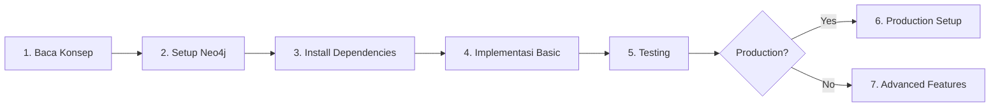

# 📚 Graph Database Implementation Guide

Panduan lengkap implementasi Graph Database (Neo4j) untuk Sistem Akademik.

---

## 📖 Daftar Panduan

### 1️⃣ [Konsep Graph Database](./01-KONSEP-GRAPH-DATABASE.md)
**Baca ini terlebih dahulu untuk memahami:**
- Apa itu Graph Database dan kapan menggunakannya
- Perbedaan dengan Relational Database
- Arsitektur Hybrid (PostgreSQL + Neo4j)
- Use cases untuk sistem akademik
- Performance benchmarks

**Target Pembaca:** Semua (Developer, PM, Stakeholder)

---

### 2️⃣ [Langkah-Langkah Implementasi](./02-LANGKAH-IMPLEMENTASI.md)
**Panduan step-by-step implementasi dari awal:**
- Setup Neo4j Database (Desktop/Docker/Native)
- Install Python dependencies
- Konfigurasi Django settings
- Membuat Graph Models
- Membuat Sync Manager
- Membuat Service Layer
- Membuat API Endpoints
- Testing & Verification

**Target Pembaca:** Developer yang akan implement

**Estimasi Waktu:** 4-6 jam untuk implementasi dasar

---

### 3️⃣ [Advanced Features](./03-ADVANCED-FEATURES.md)
**Fitur-fitur lanjutan setelah implementasi dasar:**
- Derived Relationships (TEMAN_SEKELAS)
- Prerequisite Chain Analysis
- Social Network Analysis
- Advanced Recommendation Engine
- Performance Optimization
- Real-time Sync dengan Django Signals
- Graph Visualization
- Monitoring & Maintenance

**Target Pembaca:** Developer yang sudah implement basic

**Estimasi Waktu:** 8-12 jam untuk semua advanced features

---

### 4️⃣ [Production Deployment](./04-PRODUCTION-DEPLOYMENT.md)
**Panduan deploy ke production:**
- Production architecture
- Security hardening (SSL/TLS, firewall, authentication)
- Performance optimization
- Backup & recovery strategy
- Monitoring & alerting setup
- Disaster recovery plan
- Cost optimization
- Deployment checklist

**Target Pembaca:** DevOps, System Administrator

**Estimasi Waktu:** 1-2 hari untuk production-ready setup

---

## 🎯 Quick Start

Untuk implementasi cepat, ikuti urutan ini:

### **Minimal Setup (Learning/Development)**
1. Baca: [01-KONSEP-GRAPH-DATABASE.md](./01-KONSEP-GRAPH-DATABASE.md) (30 menit)
2. Follow: [02-LANGKAH-IMPLEMENTASI.md](./02-LANGKAH-IMPLEMENTASI.md) Step 1-6 (4 jam)
3. Test dengan data sample (1 jam)

**Total:** ~6 jam untuk working prototype

### **Production Setup**
1. Complete Minimal Setup (6 jam)
2. Implement: [03-ADVANCED-FEATURES.md](./03-ADVANCED-FEATURES.md) selected features (8 jam)
3. Deploy: [04-PRODUCTION-DEPLOYMENT.md](./04-PRODUCTION-DEPLOYMENT.md) (2 hari)

**Total:** ~3-4 hari untuk production-ready system

---

## 📊 Implementation Checklist

### **Phase 1: Basic Implementation**
- [ ] Understand graph database concepts
- [ ] Neo4j installed and running
- [ ] Python packages installed
- [ ] Django settings configured
- [ ] Graph models created
- [ ] Sync manager implemented
- [ ] Service layer created
- [ ] Basic API endpoints working
- [ ] Initial data synced
- [ ] Basic testing completed

### **Phase 2: Advanced Features** (Optional)
- [ ] Derived relationships implemented
- [ ] Prerequisite chain analysis
- [ ] Social network features
- [ ] Recommendation engine
- [ ] Performance optimizations
- [ ] Caching strategy
- [ ] Real-time sync (optional)
- [ ] Graph visualization (optional)

### **Phase 3: Production** (For Production Deployment)
- [ ] Security hardening
- [ ] SSL/TLS configured
- [ ] Firewall rules set
- [ ] Backup automation
- [ ] Monitoring setup
- [ ] Alerting configured
- [ ] Load testing
- [ ] Documentation complete
- [ ] Team training

---

## 🎓 Learning Path

### **For Beginners**
1. Read [01-KONSEP-GRAPH-DATABASE.md](./01-KONSEP-GRAPH-DATABASE.md) completely
2. Try Neo4j Desktop with sample data
3. Learn basic Cypher queries
4. Follow [02-LANGKAH-IMPLEMENTASI.md](./02-LANGKAH-IMPLEMENTASI.md) with hands-on

**Resources:**
- Neo4j Documentation: https://neo4j.com/docs/
- Cypher Tutorial: https://neo4j.com/docs/cypher-manual/current/

### **For Intermediate**
1. Complete basic implementation
2. Experiment with different graph queries
3. Implement selected advanced features from [03-ADVANCED-FEATURES.md](./03-ADVANCED-FEATURES.md)
4. Optimize performance

### **For Production Engineers**
1. Review all 4 documents
2. Focus on [04-PRODUCTION-DEPLOYMENT.md](./04-PRODUCTION-DEPLOYMENT.md)
3. Plan infrastructure requirements
4. Setup monitoring and backup
5. Create disaster recovery plan

---

## 💡 Common Use Cases

### **1. Social Network Features**
**File:** [03-ADVANCED-FEATURES.md](./03-ADVANCED-FEATURES.md) - Section 3

**Features:**
- Find classmates
- Friends of friends
- Study group suggestions
- Network strength analysis

**Benefit:** 100-300x faster than SQL

---

### **2. Course Recommendations**
**File:** [03-ADVANCED-FEATURES.md](./03-ADVANCED-FEATURES.md) - Section 4

**Features:**
- Collaborative filtering
- Based on friend's choices
- Based on similar students
- Dosen recommendations

**Benefit:** Personalized recommendations, 150x faster

---

### **3. Academic Path Analysis**
**File:** [03-ADVANCED-FEATURES.md](./03-ADVANCED-FEATURES.md) - Section 2

**Features:**
- Prerequisite chain
- Shortest path to graduation
- Missing prerequisites check
- Course sequence suggestions

**Benefit:** Better academic planning

---

## 🔧 Troubleshooting

### **Common Issues & Solutions**

| Issue | Solution | Reference |
|-------|----------|-----------|
| Can't connect to Neo4j | Check if service is running | [02-LANGKAH-IMPLEMENTASI.md](./02-LANGKAH-IMPLEMENTASI.md) Step 1 |
| ModuleNotFoundError | Install Python packages | [02-LANGKAH-IMPLEMENTASI.md](./02-LANGKAH-IMPLEMENTASI.md) Step 2 |
| Slow queries | Create indexes, optimize | [03-ADVANCED-FEATURES.md](./03-ADVANCED-FEATURES.md) Section 5 |
| Out of memory | Increase heap size | [04-PRODUCTION-DEPLOYMENT.md](./04-PRODUCTION-DEPLOYMENT.md) Section 2 |
| Data inconsistency | Run consistency check | [03-ADVANCED-FEATURES.md](./03-ADVANCED-FEATURES.md) Section 8 |

---

## 📈 Expected Results

### **Performance Improvements**

After implementation, you should see:

| Query Type | Before (SQL) | After (Graph) | Improvement |
|------------|-------------|---------------|-------------|
| Find classmates | 5-10s | 50-100ms | **100x faster** |
| Friends of friends | 30-60s | 200ms | **150-300x** |
| Prerequisite chain | 2-3s | 20ms | **150x** |
| Recommendations | 10-15s | 100ms | **150x** |

### **New Capabilities**

Features that are **difficult/impossible** with SQL alone:
- Multi-hop relationship queries (friends of friends)
- Graph visualization
- Community detection
- Influence analysis
- Path finding
- Pattern matching

---

## 🤝 Contributing

Jika menemukan bug atau ingin menambahkan fitur:

1. Update dokumentasi yang relevan
2. Test thoroughly
3. Create PR dengan clear description

---

## 📞 Support

Jika mengalami kesulitan:

1. Check troubleshooting section
2. Review relevant documentation
3. Check Neo4j community forum
4. Consult dengan team

---

## 🔄 Updates & Maintenance

Dokumentasi ini akan di-update jika ada:
- Perubahan major version Neo4j
- Best practices baru
- Performance improvements discovered
- Security patches

Last Updated: 2024-10-01

---

## 📝 Summary

**Graph Database Implementation** untuk sistem akademik membawa:

✅ **Benefits:**
- 100-300x faster relationship queries
- New social network features
- Intelligent recommendations
- Better academic planning
- Scalable untuk pertumbuhan data

⚠️ **Considerations:**
- Additional infrastructure
- Learning curve (Cypher)
- Maintenance overhead
- Sync complexity

**Recommendation:**
- **Yes** jika sistem punya banyak relasi kompleks dan social features penting
- **No** jika hanya butuh simple CRUD dan resources terbatas

---

**Happy coding! 🚀**
