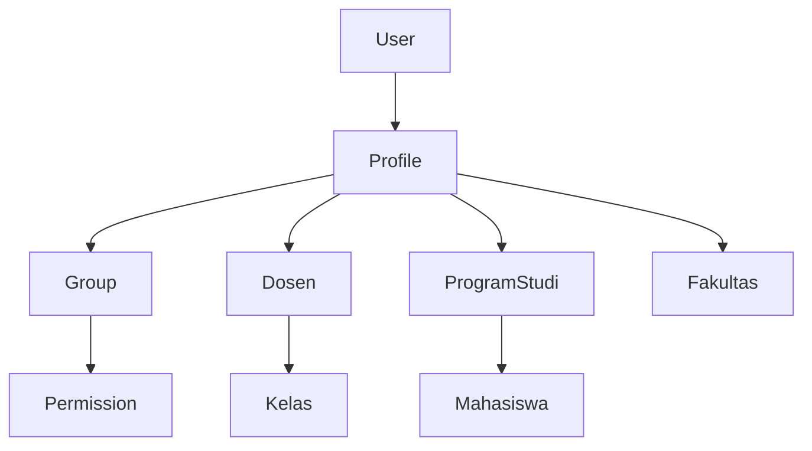

# 📋 **Panduan Lengkap Sistem Permission**

Sistem permission untuk Academic Management System dengan integrasi Role-Based Access Control (RBAC) dan object-level permissions.

## 🏗️ **Arsitektur Sistem Permission**

### **Konsep Dasar:**
```
User → Profile → Group → Permission → Object
```

### **Hierarki Role:**
```
Superuser (100)     → Akses semua
AdminFakultas (80)  → Akses fakultas dan semua prodi di bawahnya
Kaprodi (60)        → Akses prodi tertentu
Dosen (40)          → Akses kelas yang diajar
Mahasiswa (20)      → Akses data pribadi
Guest (10)          → Akses terbatas
```

### **Model Relationship:**


## 🚀 **Setup Awal Sistem Permission**

### **1. Jalankan Script Setup Permission:**
```bash
# Setup groups dan permissions
python manage.py setup_permissions

# Atau gunakan script otomatis (recommended)
python scripts/auto_permission_setup.py

# Untuk setup fresh install
python scripts/auto_permission_setup.py --reset
```

### **2. Validasi Setup:**
```bash
# Validasi permission system
python scripts/permission_validator.py

# Check specific user
python scripts/permission_validator.py --user username

# Detailed report
python scripts/permission_validator.py --detailed
```

### **3. Apply Profile Migrations:**
```bash
# Apply Profile model migrations
python manage.py migrate

# Or use helper script
python apply_profile_migrations.py
```

## 👤 **Mengelola User dan Profile**

### **1. Membuat Profile untuk Dosen:**
```python
from apps.academic.models import Profile
from apps.feeder.models.dosen import Dosen
from core.utils.profile_utils import create_profile_for_dosen

# Ambil data dosen
dosen = Dosen.objects.get(nip='123456789')

# Buat profile otomatis
result = create_profile_for_dosen(dosen)
print(f"Created: {result['profile_created']}")
print(f"Changes: {result['changes_made']}")

# Dengan user existing
from django.contrib.auth.models import User
user = User.objects.get(username='dosen123')
result = create_profile_for_dosen(dosen, user=user)
```

### **2. Membuat Profile untuk Mahasiswa:**
```python
from core.utils.profile_utils import create_profile_for_mahasiswa
from apps.feeder.models.mahasiswa import RiwayatPendidikan

# Ambil data mahasiswa
mahasiswa = RiwayatPendidikan.objects.get(nim='11201800001')

# Buat profile otomatis
result = create_profile_for_mahasiswa(mahasiswa)
print(f"Success: {result['success']}")
print(f"User created: {result['user_created']}")
```

### **3. Bulk Profile Creation:**
```python
from core.utils.profile_utils import bulk_sync_profiles_with_permissions
from django.contrib.auth.models import User

# Sync semua user yang belum punya profile
users_without_profile = User.objects.filter(academic_profile__isnull=True)
result = bulk_sync_profiles_with_permissions(users_without_profile)

print(f"Successful syncs: {result['successful_syncs']}")
print(f"Failed syncs: {result['failed_syncs']}")
```

### **4. Manual Profile Creation via Django Admin:**
1. Buka `/admin/academic/profile/`
2. Klik "Add Profile"
3. Pilih user, role, prodi, fakultas
4. Save
5. Profile akan otomatis sync dengan group permissions

## 🔐 **Menggunakan Permission di Views**

### **1. Decorator-based Permission:**
```python
from core.decorators.permission_decorators import (
    require_academic_role, require_prodi_access,
    require_fakultas_access, require_dosen_access
)

# Hanya dosen yang bisa akses
@require_academic_role(['dosen', 'kaprodi'])
def dosen_dashboard(request):
    return render(request, 'dashboard.html')

# Hanya yang punya akses ke prodi tertentu
@require_prodi_access
def prodi_data(request, prodi_id):
    # prodi_id akan divalidasi otomatis
    return render(request, 'prodi.html')

# Hanya admin fakultas yang bisa akses
@require_fakultas_access
def fakultas_management(request, fakultas_id):
    return render(request, 'fakultas.html')

# Multiple role requirement
@require_academic_role(['kaprodi', 'admin_fakultas'], operator='OR')
def management_dashboard(request):
    return render(request, 'management.html')

# Chain decorators for complex permission
@require_academic_role(['dosen'])
@require_prodi_access
def dosen_prodi_specific(request, prodi_id):
    return render(request, 'dosen_prodi.html')
```

### **2. Permission dalam Class-based Views:**
```python
from core.mixins.permission_mixins import (
    AcademicRoleRequiredMixin, ProdiAccessMixin, FakultasAccessMixin
)

class DosenListView(AcademicRoleRequiredMixin, ListView):
    required_roles = ['kaprodi', 'admin_fakultas']
    model = Dosen
    template_name = 'dosen_list.html'

    def get_queryset(self):
        # Auto-filter berdasarkan accessible prodi
        return super().get_queryset().filter_by_user_access(self.request.user)

class ProdiDetailView(ProdiAccessMixin, DetailView):
    model = ProgramStudi
    template_name = 'prodi_detail.html'
    prodi_id_field = 'pk'  # Field yang digunakan untuk check akses

class FakultasManagementView(FakultasAccessMixin, AcademicRoleRequiredMixin, TemplateView):
    required_roles = ['admin_fakultas', 'dekan']
    template_name = 'fakultas_management.html'
    fakultas_id_field = 'fakultas_id'  # From URL parameter
```

### **3. Manual Permission Check:**
```python
from core.utils.permission_utils import (
    check_user_academic_role, check_prodi_access,
    check_fakultas_access, get_user_accessible_objects,
    get_user_accessible_prodi_ids
)

def my_view(request):
    user = request.user

    # Check role
    if not check_user_academic_role(user, ['dosen', 'kaprodi']):
        return HttpResponseForbidden("Akses ditolak: Role tidak sesuai")

    # Check prodi access
    prodi_id = request.GET.get('prodi_id')
    if prodi_id and not check_prodi_access(user, prodi_id):
        return HttpResponseForbidden("Tidak punya akses ke prodi ini")

    # Get accessible objects for filtering
    accessible_prodi = get_user_accessible_objects(
        user, 'feeder.ProgramStudi'
    )

    # Get accessible prodi IDs
    prodi_ids = get_user_accessible_prodi_ids(user)
    if prodi_ids is None:
        # User bisa akses semua prodi (superuser/admin_fakultas)
        dosen_qs = Dosen.objects.all()
    else:
        # Filter by accessible prodi
        dosen_qs = Dosen.objects.filter(
            penugasan__id_prodi__id_prodi__in=prodi_ids
        )

    context = {
        'dosen_list': dosen_qs,
        'accessible_prodi': accessible_prodi,
        'user_role': get_profile_role(user)
    }
    return render(request, 'my_template.html', context)
```

## 🔧 **Menambah Permission Baru**

### **1. Tambah Permission ke Script Setup:**
Edit `scripts/auto_permission_setup.py`:

```python
# Tambah ke PERMISSION_MATRIX
PERMISSION_MATRIX = {
    'feeder.Dosen': {
        'Superuser': ['add', 'change', 'delete', 'view'],
        'AdminFakultas': ['change', 'view', 'add'],
        'Kaprodi': ['view', 'change'],  # Tambah 'change' jika perlu
        'Dosen': ['view'],
        'Mahasiswa': [],  # Tidak ada akses
    },

    # Tambah model baru
    'academic.Penelitian': {
        'Superuser': ['add', 'change', 'delete', 'view'],
        'AdminFakultas': ['view', 'change'],
        'Kaprodi': ['view', 'change', 'add'],
        'Dosen': ['view', 'add', 'change'],  # Dosen bisa kelola penelitian
        'Mahasiswa': [],  # Tidak ada akses
    },

    # Model dengan permission khusus
    'feeder.Nilai': {
        'Superuser': ['add', 'change', 'delete', 'view'],
        'AdminFakultas': ['view', 'change'],
        'Kaprodi': ['view', 'change'],
        'Dosen': ['view', 'add', 'change'],  # Dosen input nilai
        'Mahasiswa': ['view'],  # Mahasiswa hanya lihat nilai sendiri
    }
}

# Tambah custom permission groups
CUSTOM_PERMISSIONS = {
    'academic.Penelitian': [
        ('approve_penelitian', 'Can approve penelitian'),
        ('publish_penelitian', 'Can publish penelitian'),
        ('review_penelitian', 'Can review penelitian'),
    ]
}

# Assign custom permissions ke groups
CUSTOM_GROUP_PERMISSIONS = {
    'Kaprodi': [
        'academic.approve_penelitian',
        'academic.review_penelitian',
    ],
    'AdminFakultas': [
        'academic.approve_penelitian',
        'academic.publish_penelitian',
        'academic.review_penelitian',
    ]
}
```

### **2. Jalankan Update Permission:**
```bash
# Update permission system
python scripts/auto_permission_setup.py

# Force reset semua permissions
python scripts/auto_permission_setup.py --reset

# Hanya update permissions tanpa groups
python scripts/auto_permission_setup.py --permissions-only
```

### **3. Tambah Custom Permission di Model:**
```python
class Penelitian(models.Model):
    judul = models.CharField(max_length=200)
    dosen = models.ForeignKey('feeder.Dosen', on_delete=models.CASCADE)
    status = models.CharField(max_length=20, default='draft')

    class Meta:
        verbose_name = 'Penelitian'
        verbose_name_plural = 'Penelitian'
        permissions = [
            ('approve_penelitian', 'Can approve penelitian'),
            ('publish_penelitian', 'Can publish penelitian'),
            ('review_penelitian', 'Can review penelitian'),
            ('export_penelitian', 'Can export penelitian data'),
        ]

class NilaiMahasiswa(models.Model):
    mahasiswa = models.ForeignKey('feeder.RiwayatPendidikan', on_delete=models.CASCADE)
    nilai = models.DecimalField(max_digits=5, decimal_places=2)

    class Meta:
        permissions = [
            ('input_nilai', 'Can input nilai mahasiswa'),
            ('finalize_nilai', 'Can finalize nilai'),
            ('export_nilai', 'Can export nilai'),
        ]
```

### **4. Assign Custom Permission via Code:**
```python
from django.contrib.auth.models import Group, Permission
from django.contrib.contenttypes.models import ContentType

# Get content type
penelitian_ct = ContentType.objects.get_for_model(Penelitian)

# Create custom permission if not exists
approve_perm, created = Permission.objects.get_or_create(
    codename='approve_penelitian',
    name='Can approve penelitian',
    content_type=penelitian_ct,
)

# Assign to group
kaprodi_group = Group.objects.get(name='Kaprodi')
kaprodi_group.permissions.add(approve_perm)

# Bulk assign multiple permissions
permissions = Permission.objects.filter(
    codename__in=['approve_penelitian', 'review_penelitian']
)
kaprodi_group.permissions.add(*permissions)
```

## 🔍 **Filtering Data Berdasarkan Permission**

### **1. Filter di QuerySet Manager:**
```python
# Custom manager untuk auto-filtering
class DosenManager(models.Manager):
    def accessible_by_user(self, user):
        """Filter dosen berdasarkan user access"""
        if user.is_superuser:
            return self.all()

        profile = get_user_profile(user)
        if not profile:
            return self.none()

        if profile.academic_role in ['admin_fakultas', 'dekan']:
            # Akses semua dosen di fakultas
            return self.filter(
                penugasan__id_prodi__id_fakultas=profile.id_fakultas
            )
        elif profile.academic_role == 'kaprodi':
            # Akses dosen di prodi
            return self.filter(
                penugasan__id_prodi=profile.id_prodi
            )
        elif profile.academic_role == 'dosen':
            # Hanya data diri sendiri
            return self.filter(id_dosen=profile.id_dosen.id_dosen)

        return self.none()

# Tambah ke model
class Dosen(BaseTable):
    # ... fields ...
    objects = DosenManager()
```

### **2. Filter di Views:**
```python
from core.utils.permission_utils import get_user_accessible_prodi_ids

def get_filtered_dosen(request):
    user = request.user

    if user.is_superuser:
        # Superuser lihat semua
        dosen_qs = Dosen.objects.all()
    else:
        # Filter berdasarkan prodi yang accessible
        accessible_prodi_ids = get_user_accessible_prodi_ids(user)

        if accessible_prodi_ids is None:
            # Semua prodi (untuk admin fakultas)
            profile = get_user_profile(user)
            if profile and profile.id_fakultas:
                # Filter by fakultas
                dosen_qs = Dosen.objects.filter(
                    penugasan__id_prodi__id_fakultas=profile.id_fakultas
                )
            else:
                dosen_qs = Dosen.objects.all()
        else:
            # Prodi tertentu
            dosen_qs = Dosen.objects.filter(
                penugasan__id_prodi__id_prodi__in=accessible_prodi_ids
            ).distinct()

    return dosen_qs

# Usage in view
def dosen_list_view(request):
    dosen_queryset = get_filtered_dosen(request)
    context = {
        'dosen_list': dosen_queryset,
        'user_role': get_profile_role(request.user)
    }
    return render(request, 'dosen_list.html', context)
```

### **3. Filter di Serializer (untuk API):**
```python
from core.mixins.serializer_mixins import FilterByPermissionMixin

class DosenSerializer(FilterByPermissionMixin, serializers.ModelSerializer):
    class Meta:
        model = Dosen
        fields = '__all__'

    def get_filtered_queryset(self, queryset):
        user = self.context['request'].user
        return self.filter_by_user_access(user, queryset)

    def to_representation(self, instance):
        # Check if user can view this specific object
        user = self.context['request'].user
        if not self.can_view_object(user, instance):
            raise PermissionDenied("Tidak dapat mengakses data ini")

        return super().to_representation(instance)

# Custom filtering method
class MahasiswaSerializer(serializers.ModelSerializer):
    class Meta:
        model = RiwayatPendidikan
        fields = '__all__'

    def get_queryset(self):
        user = self.context['request'].user
        profile = get_user_profile(user)

        if not profile:
            return RiwayatPendidikan.objects.none()

        if profile.academic_role == 'mahasiswa':
            # Mahasiswa hanya lihat data sendiri
            return RiwayatPendidikan.objects.filter(nim=user.username)
        elif profile.academic_role in ['dosen', 'kaprodi']:
            # Dosen/Kaprodi lihat mahasiswa di prodi mereka
            return RiwayatPendidikan.objects.filter(
                id_prodi=profile.id_prodi
            )
        elif profile.academic_role in ['admin_fakultas', 'dekan']:
            # Admin fakultas lihat semua di fakultas
            return RiwayatPendidikan.objects.filter(
                id_prodi__id_fakultas=profile.id_fakultas
            )

        return RiwayatPendidikan.objects.all()
```

## 🔒 **Permission di API (REST Framework)**

### **1. Custom Permission Classes:**
```python
from rest_framework.permissions import BasePermission
from core.utils.permission_utils import check_user_academic_role, check_prodi_access

class AcademicPermission(BasePermission):
    """
    Custom permission untuk sistem akademik
    """
    required_roles = []

    def has_permission(self, request, view):
        if not request.user.is_authenticated:
            return False

        # Check academic role if specified
        if self.required_roles:
            return check_user_academic_role(request.user, self.required_roles)

        return True

    def has_object_permission(self, request, view, obj):
        # Check object-level permission
        if hasattr(obj, 'id_prodi') and obj.id_prodi:
            return check_prodi_access(request.user, obj.id_prodi.id_prodi)

        return True

class DosenPermission(AcademicPermission):
    required_roles = ['dosen', 'kaprodi', 'admin_fakultas']

class KaprodiPermission(AcademicPermission):
    required_roles = ['kaprodi', 'admin_fakultas', 'dekan']

class AdminFakultasPermission(AcademicPermission):
    required_roles = ['admin_fakultas', 'dekan']
```

### **2. Menggunakan Permission Classes di ViewSet:**
```python
from rest_framework.viewsets import ModelViewSet
from rest_framework.decorators import action
from rest_framework.response import Response

class DosenViewSet(ModelViewSet):
    queryset = Dosen.objects.all()
    serializer_class = DosenSerializer
    permission_classes = [DosenPermission]

    def get_queryset(self):
        # Auto-filter berdasarkan user permission
        return Dosen.objects.accessible_by_user(self.request.user)

    @action(detail=True, methods=['post'], permission_classes=[KaprodiPermission])
    def approve_data(self, request, pk=None):
        dosen = self.get_object()

        # Additional check
        if not check_prodi_access(request.user, dosen.prodi_id):
            return Response(
                {'error': 'Tidak punya akses untuk approve data ini'},
                status=403
            )

        dosen.status = 'approved'
        dosen.save()
        return Response({'status': 'approved'})

    @action(detail=False, methods=['get'])
    def my_data(self, request):
        """Endpoint untuk dosen melihat data sendiri"""
        profile = get_user_profile(request.user)
        if not profile or not profile.id_dosen:
            return Response({'error': 'Profile dosen tidak ditemukan'}, status=404)

        serializer = self.get_serializer(profile.id_dosen)
        return Response(serializer.data)

class MahasiswaViewSet(ModelViewSet):
    queryset = RiwayatPendidikan.objects.all()
    serializer_class = MahasiswaSerializer

    def get_permissions(self):
        """Dynamic permissions based on action"""
        if self.action in ['create', 'update', 'partial_update', 'destroy']:
            permission_classes = [AdminFakultasPermission]
        else:
            permission_classes = [AcademicPermission]

        return [permission() for permission in permission_classes]

    def get_queryset(self):
        user = self.request.user
        profile = get_user_profile(user)

        if not profile:
            return self.queryset.none()

        # Filter berdasarkan role
        if profile.academic_role == 'mahasiswa':
            return self.queryset.filter(nim=user.username)
        elif profile.academic_role in ['dosen', 'kaprodi']:
            return self.queryset.filter(id_prodi=profile.id_prodi)
        elif profile.academic_role in ['admin_fakultas', 'dekan']:
            return self.queryset.filter(id_prodi__id_fakultas=profile.id_fakultas)

        return self.queryset.all()
```

### **3. Permission di Function-based API Views:**
```python
from rest_framework.decorators import api_view, permission_classes
from rest_framework.permissions import IsAuthenticated

@api_view(['GET'])
@permission_classes([IsAuthenticated])
def get_user_dashboard_data(request):
    """API untuk mendapatkan data dashboard sesuai role user"""
    profile = get_user_profile(request.user)

    if not profile:
        return Response({'error': 'Profile tidak ditemukan'}, status=404)

    # Build response berdasarkan role
    response_data = {
        'user_info': {
            'username': request.user.username,
            'role': profile.academic_role,
            'display_name': profile.display_name,
        }
    }

    if profile.academic_role == 'dosen':
        # Data untuk dosen
        teaching_classes = list(profile.teaching_classes)
        response_data.update({
            'teaching_classes': teaching_classes,
            'dosen_info': {
                'nip': profile.id_dosen.nip if profile.id_dosen else None,
                'nama': profile.id_dosen.nama_dosen if profile.id_dosen else None,
            }
        })

    elif profile.academic_role == 'kaprodi':
        # Data untuk kaprodi
        prodi_data = {
            'id_prodi': profile.id_prodi.id_prodi if profile.id_prodi else None,
            'nama_prodi': profile.id_prodi.nama_program_studi if profile.id_prodi else None,
        }
        response_data.update({
            'prodi_info': prodi_data,
            'accessible_prodi': [profile.id_prodi.id_prodi] if profile.id_prodi else []
        })

    elif profile.academic_role in ['admin_fakultas', 'dekan']:
        # Data untuk admin fakultas
        accessible_prodi = get_user_accessible_prodi_ids(request.user)
        response_data.update({
            'fakultas_info': {
                'id_fakultas': profile.id_fakultas.id if profile.id_fakultas else None,
                'nama_fakultas': getattr(profile.id_fakultas, 'nama_fakultas', None),
            },
            'accessible_prodi': accessible_prodi
        })

    return Response(response_data)

@api_view(['POST'])
@permission_classes([IsAuthenticated])
def input_nilai_mahasiswa(request):
    """API untuk input nilai mahasiswa - hanya dosen yang mengajar"""
    # Validate permissions
    if not check_user_academic_role(request.user, ['dosen', 'kaprodi']):
        return Response({'error': 'Hanya dosen yang dapat input nilai'}, status=403)

    kelas_id = request.data.get('kelas_id')
    mahasiswa_id = request.data.get('mahasiswa_id')
    nilai = request.data.get('nilai')

    # Check if dosen mengajar di kelas ini
    profile = get_user_profile(request.user)
    if profile.academic_role == 'dosen':
        teaching_classes = list(profile.teaching_classes)
        if kelas_id not in teaching_classes:
            return Response(
                {'error': 'Anda tidak mengajar di kelas ini'},
                status=403
            )

    # Process nilai input
    # ... logic untuk save nilai ...

    return Response({'status': 'success', 'message': 'Nilai berhasil disimpan'})
```

## 🎯 **Best Practices**

### **1. Selalu Validasi Permission:**
```python
# BAD - Tidak ada validasi
def delete_dosen(request, dosen_id):
    dosen = Dosen.objects.get(id=dosen_id)
    dosen.delete()
    return redirect('dosen_list')

# GOOD - Ada validasi lengkap
@require_academic_role(['admin_fakultas'])
def delete_dosen(request, dosen_id):
    dosen = get_object_or_404(Dosen, id=dosen_id)

    # Double check prodi access
    if not check_prodi_access(request.user, dosen.prodi_id):
        messages.error(request, 'Anda tidak memiliki akses untuk menghapus data ini.')
        return redirect('dosen_list')

    # Log action
    logger.info(f"User {request.user.username} deleted dosen {dosen.nama_dosen}")

    dosen.delete()
    messages.success(request, f'Data dosen {dosen.nama_dosen} berhasil dihapus.')
    return redirect('dosen_list')
```

### **2. Gunakan Profile untuk Context:**
```python
from core.utils.profile_utils import get_profile_context_for_api

def get_user_context(request):
    """Helper untuk mendapatkan context user yang lengkap"""
    context = get_profile_context_for_api(request.user)

    # Add additional context
    additional_context = {
        'accessible_prodi': context['profile']['accessible_prodi_ids'] if context.get('profile') else [],
        'is_dosen': context['profile']['is_dosen'] if context.get('profile') else False,
        'is_admin': context['profile']['is_admin'] if context.get('profile') else False,
        'academic_role': context['profile']['academic_role'] if context.get('profile') else 'guest',
        'can_manage_users': context['is_superuser'] or context['profile']['academic_role'] in ['admin_fakultas'] if context.get('profile') else False,
    }

    context.update(additional_context)
    return context

# Usage in views
def dashboard_view(request):
    user_context = get_user_context(request)

    # Build dashboard based on role
    dashboard_data = {}

    if user_context['is_dosen']:
        dashboard_data['teaching_classes'] = get_teaching_classes(request.user)
        dashboard_data['recent_grades'] = get_recent_grades(request.user)

    if user_context['is_admin']:
        dashboard_data['pending_approvals'] = get_pending_approvals(request.user)
        dashboard_data['recent_activities'] = get_recent_activities(request.user)

    context = {
        'user_context': user_context,
        'dashboard_data': dashboard_data,
    }
    return render(request, 'dashboard.html', context)
```

### **3. Logging Permission Events:**
```python
import logging

logger = logging.getLogger('permission')

def check_and_log_permission(user, action, object_type, object_id=None, extra_info=None):
    """Check permission with logging"""
    has_permission = check_user_permission(user, action, object_type)

    log_data = {
        'user': user.username,
        'action': action,
        'object_type': object_type,
        'object_id': object_id,
        'result': 'ALLOWED' if has_permission else 'DENIED',
        'extra_info': extra_info,
    }

    if has_permission:
        logger.info(f"Permission check: {log_data}")
    else:
        logger.warning(f"Permission denied: {log_data}")

    return has_permission

# Usage
def sensitive_action_view(request, object_id):
    if not check_and_log_permission(
        request.user,
        'delete',
        'feeder.Dosen',
        object_id,
        extra_info={'ip': request.META.get('REMOTE_ADDR')}
    ):
        return HttpResponseForbidden("Access denied")

    # Process action
    pass
```

### **4. Permission Caching:**
```python
from django.core.cache import cache
from django.utils.hashlib import hashlib

def cached_permission_check(user, permission_key, cache_timeout=300):
    """Cache permission check results"""
    cache_key = f"perm_{user.id}_{hashlib.md5(permission_key.encode()).hexdigest()}"

    result = cache.get(cache_key)
    if result is not None:
        return result

    # Perform actual permission check
    result = check_user_permission(user, permission_key)

    # Cache result
    cache.set(cache_key, result, cache_timeout)
    return result

def invalidate_user_permission_cache(user):
    """Invalidate all permission cache for user"""
    cache_pattern = f"perm_{user.id}_*"
    # Implementation depends on cache backend
    pass
```

### **5. Error Handling yang Proper:**
```python
from django.http import JsonResponse
from django.contrib import messages

def safe_permission_check(request, required_roles, prodi_id=None):
    """Safe permission check dengan error handling"""
    try:
        # Check authentication
        if not request.user.is_authenticated:
            if request.headers.get('accept') == 'application/json':
                return JsonResponse({'error': 'Authentication required'}, status=401)
            else:
                return redirect('login')

        # Check role
        if not check_user_academic_role(request.user, required_roles):
            error_msg = f"Akses ditolak. Diperlukan role: {', '.join(required_roles)}"
            if request.headers.get('accept') == 'application/json':
                return JsonResponse({'error': error_msg}, status=403)
            else:
                messages.error(request, error_msg)
                return redirect('dashboard')

        # Check prodi access if needed
        if prodi_id and not check_prodi_access(request.user, prodi_id):
            error_msg = "Anda tidak memiliki akses ke program studi ini"
            if request.headers.get('accept') == 'application/json':
                return JsonResponse({'error': error_msg}, status=403)
            else:
                messages.error(request, error_msg)
                return redirect('dashboard')

        return None  # Permission OK

    except Exception as e:
        logger.error(f"Permission check error for user {request.user.username}: {e}")
        error_msg = "Terjadi kesalahan sistem"
        if request.headers.get('accept') == 'application/json':
            return JsonResponse({'error': error_msg}, status=500)
        else:
            messages.error(request, error_msg)
            return redirect('dashboard')

# Usage in views
def my_protected_view(request, prodi_id=None):
    # Check permissions
    permission_error = safe_permission_check(
        request,
        ['dosen', 'kaprodi'],
        prodi_id
    )
    if permission_error:
        return permission_error

    # Continue with normal view logic
    pass
```

## 🚨 **Troubleshooting**

### **1. User Tidak Punya Permission:**

**Check user groups dan permissions:**
```bash
python manage.py shell -c "
from django.contrib.auth.models import User
from core.utils.profile_utils import get_profile_context_for_api

user = User.objects.get(username='username_here')
print('=== USER INFO ===')
print(f'Username: {user.username}')
print(f'Is active: {user.is_active}')
print(f'Is superuser: {user.is_superuser}')
print(f'Groups: {list(user.groups.values_list(\"name\", flat=True))}')
print(f'Direct permissions: {list(user.user_permissions.values_list(\"codename\", flat=True))}')

print('\n=== PROFILE INFO ===')
context = get_profile_context_for_api(user)
if context.get('profile'):
    profile = context['profile']
    print(f'Academic role: {profile[\"academic_role\"]}')
    print(f'Is verified: {profile[\"is_verified\"]}')
    print(f'Accessible prodi IDs: {profile[\"accessible_prodi_ids\"]}')
    print(f'Is dosen: {profile[\"is_dosen\"]}')
    print(f'Is admin: {profile[\"is_admin\"]}')
else:
    print('No profile found')
"
```

**Fix permissions:**
```bash
# Sync ulang semua permissions
python scripts/auto_permission_setup.py

# Sync specific user
python manage.py shell -c "
from core.utils.profile_utils import sync_profile_with_permissions
from django.contrib.auth.models import User

user = User.objects.get(username='username_here')
result = sync_profile_with_permissions(user)
print('Sync result:', result)
"
```

### **2. Profile Tidak Ter-sync:**

**Manual sync profile:**
```bash
python manage.py shell -c "
from core.utils.profile_utils import sync_profile_with_permissions
from django.contrib.auth.models import User

# Single user sync
user = User.objects.get(username='username_here')
result = sync_profile_with_permissions(user)
print('Changes made:', result['changes_made'])
print('Errors:', result['errors'])
print('Success:', result['success'])
"
```

**Create missing profile:**
```bash
python manage.py shell -c "
from apps.academic.models import Profile
from django.contrib.auth.models import User

user = User.objects.get(username='username_here')
if not hasattr(user, 'academic_profile'):
    profile = Profile.objects.create(
        user=user,
        academic_role='guest',
        is_verified=False
    )
    print(f'Created profile for {user.username}')
else:
    print(f'Profile already exists for {user.username}')
"
```

### **3. Bulk Fix Permission:**

**Bulk sync all users:**
```python
from core.utils.profile_utils import bulk_sync_profiles_with_permissions
from django.contrib.auth.models import User

# Sync semua active users
active_users = User.objects.filter(is_active=True)
result = bulk_sync_profiles_with_permissions(active_users)

print(f"Total users: {result['total_users']}")
print(f"Successful syncs: {result['successful_syncs']}")
print(f"Failed syncs: {result['failed_syncs']}")
print(f"Changes summary: {result['changes_summary']}")

if result['errors']:
    print("Errors:")
    for error in result['errors'][:10]:  # Show first 10 errors
        print(f"  - {error}")
```

**Create profiles for dosen without profiles:**
```bash
python manage.py shell -c "
from apps.feeder.models.dosen import Dosen
from core.utils.profile_utils import create_profile_for_dosen

# Get dosen without profiles
dosen_without_profiles = Dosen.objects.filter(
    deleted=False,
    nip__isnull=False,
    academic_profiles__isnull=True
)

print(f'Found {dosen_without_profiles.count()} dosen without profiles')

created_count = 0
for dosen in dosen_without_profiles[:10]:  # Process first 10
    result = create_profile_for_dosen(dosen)
    if result['success']:
        created_count += 1
        print(f'Created profile for {dosen.nama_dosen}')
    else:
        print(f'Failed to create profile for {dosen.nama_dosen}: {result[\"errors\"]}')

print(f'Created {created_count} profiles')
"
```

### **4. Migration Issues:**

**Reset migrations if needed:**
```bash
# DANGER: This will delete data!
# Backup first!

# Reset academic app migrations
python manage.py migrate academic zero

# Remove migration files (keep backup)
mv apps/academic/migrations/ apps/academic/migrations_backup/

# Recreate migrations directory
mkdir apps/academic/migrations/
touch apps/academic/migrations/__init__.py

# Create new migrations
python manage.py makemigrations academic

# Apply migrations
python manage.py migrate academic
```

**Fix migration dependencies:**
```bash
# If migration dependency issues
python manage.py migrate --fake feeder 0004_remove_dosen_email_dsn
python manage.py migrate
```

### **5. Performance Issues:**

**Optimize permission queries:**
```python
# BAD - N+1 queries
for user in User.objects.all():
    profile = get_user_profile(user)  # Each call hits DB

# GOOD - Use select_related
users_with_profiles = User.objects.select_related('academic_profile').all()
for user in users_with_profiles:
    profile = user.academic_profile  # No additional DB hit
```

**Add database indexes:**
```python
# In models.py
class Profile(BaseTable):
    # ... fields ...

    class Meta:
        indexes = [
            models.Index(fields=['user']),
            models.Index(fields=['academic_role']),
            models.Index(fields=['id_prodi']),
            models.Index(fields=['id_fakultas']),
            models.Index(fields=['is_verified']),
        ]
```

## 📊 **Monitoring dan Reporting**

### **1. Permission Audit Script:**
```python
# Create file: scripts/permission_audit.py
from django.contrib.auth.models import User, Group, Permission
from apps.academic.models import Profile

def generate_permission_report():
    """Generate comprehensive permission report"""

    print("=== PERMISSION AUDIT REPORT ===\n")

    # Groups summary
    print("1. GROUPS SUMMARY:")
    for group in Group.objects.all():
        user_count = group.user_set.count()
        perm_count = group.permissions.count()
        print(f"  {group.name}: {user_count} users, {perm_count} permissions")

    # Users without profiles
    print("\n2. USERS WITHOUT PROFILES:")
    users_no_profile = User.objects.filter(academic_profile__isnull=True, is_active=True)
    for user in users_no_profile:
        print(f"  {user.username} ({user.email})")

    # Profiles without proper groups
    print("\n3. PROFILES WITH MISSING GROUPS:")
    for profile in Profile.objects.select_related('user').all():
        expected_groups = get_expected_groups_for_role(profile.academic_role)
        current_groups = set(profile.user.groups.values_list('name', flat=True))
        missing_groups = expected_groups - current_groups

        if missing_groups:
            print(f"  {profile.user.username}: missing {', '.join(missing_groups)}")

    # Permission distribution
    print("\n4. PERMISSION DISTRIBUTION:")
    role_counts = {}
    for profile in Profile.objects.all():
        role = profile.academic_role
        role_counts[role] = role_counts.get(role, 0) + 1

    for role, count in role_counts.items():
        print(f"  {role}: {count} users")

def get_expected_groups_for_role(role):
    """Get expected groups for academic role"""
    role_mapping = {
        'dosen': {'Dosen'},
        'kaprodi': {'Kaprodi'},
        'admin_fakultas': {'AdminFakultas'},
        'dekan': {'AdminFakultas'},
        'mahasiswa': {'Mahasiswa'},
        'staff': {'Dosen'},
        'guest': set(),
    }
    return role_mapping.get(role, set())

if __name__ == '__main__':
    generate_permission_report()
```

### **2. Usage Analytics:**
```python
# Create middleware to track permission usage
class PermissionTrackingMiddleware:
    def __init__(self, get_response):
        self.get_response = get_response

    def __call__(self, request):
        # Track permission checks
        if hasattr(request, 'user') and request.user.is_authenticated:
            profile = get_user_profile(request.user)
            if profile:
                # Log access patterns
                logger.info(f"Access: {request.user.username} ({profile.academic_role}) -> {request.path}")

        response = self.get_response(request)
        return response
```

Sistem permission ini memberikan kontrol akses yang granular dan fleksibel untuk sistem akademik Anda! 🎉

---

**File terkait:**
- `scripts/auto_permission_setup.py` - Setup otomatis permission
- `scripts/permission_validator.py` - Validasi sistem permission
- `core/utils/profile_utils.py` - Utilities untuk profile management
- `core/decorators/permission_decorators.py` - Decorators untuk permission
- `core/mixins/permission_mixins.py` - Mixins untuk views dan serializers
- `apps/academic/models.py` - Model Profile dan integrasi
- `apps/academic/admin.py` - Interface admin untuk profile management