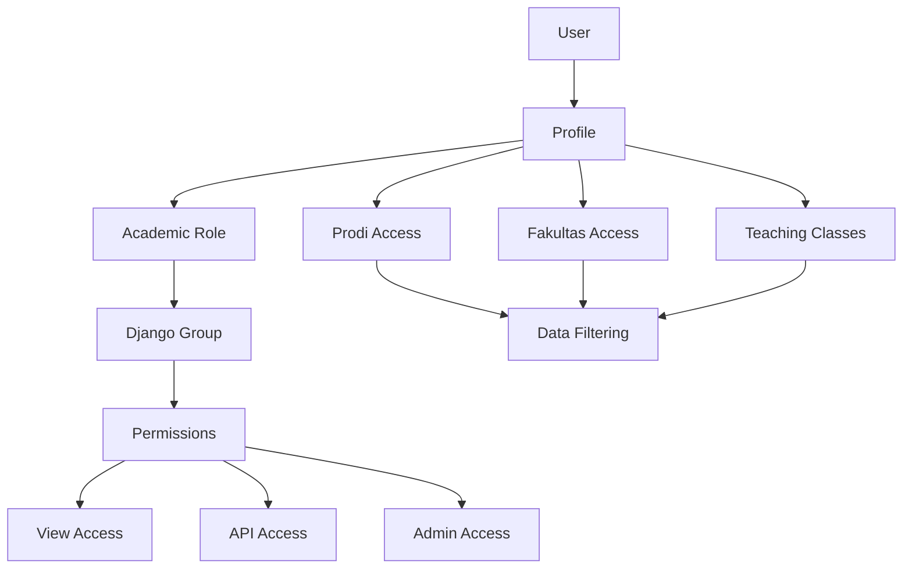

# 📚 **Permission System Documentation**

Selamat datang di dokumentasi lengkap sistem permission untuk Academic Management System.

## 📋 **Daftar Dokumentasi**

### 🏗️ **[PERMISSION_SYSTEM_GUIDE.md](./PERMISSION_SYSTEM_GUIDE.md)**
**Panduan utama dan lengkap sistem permission**
- Setup awal sistem permission
- Arsitektur dan konsep dasar
- Penggunaan permission di views dan API
- Menambah permission baru
- Best practices dan troubleshooting

### 🔗 **[API_PERMISSION_EXAMPLES.md](./API_PERMISSION_EXAMPLES.md)**
**Contoh implementasi permission di API**
- Basic API permission patterns
- Role-based API access
- Object-level permission checks
- Dynamic permission checking
- Real-world API examples

### 🔧 **[TROUBLESHOOTING_GUIDE.md](./TROUBLESHOOTING_GUIDE.md)**
**Panduan troubleshooting masalah permission**
- User tidak bisa login
- Permission denied errors
- Profile sync issues
- Migration problems
- Performance optimization

## 🚀 **Quick Start**

### **1. Setup Sistem Permission:**
```bash
# Install dependencies dan migrate
python manage.py migrate

# Setup groups dan permissions
python scripts/auto_permission_setup.py

# Validasi setup
python scripts/permission_validator.py
```

### **2. Buat Profile untuk User:**
```python
from core.utils.profile_utils import create_profile_for_dosen
from apps.feeder.models.dosen import Dosen

# Buat profile untuk dosen
dosen = Dosen.objects.get(nip='123456789')
result = create_profile_for_dosen(dosen)
```

### **3. Gunakan Permission di Views:**
```python
from core.decorators.permission_decorators import require_academic_role

@require_academic_role(['dosen', 'kaprodi'])
def my_view(request):
    return render(request, 'template.html')
```

### **4. Permission di API:**
```python
from core.utils.permission_utils import check_user_academic_role

@api_view(['GET'])
def api_view(request):
    if not check_user_academic_role(request.user, ['dosen']):
        return Response({'error': 'Access denied'}, status=403)
    # ... rest of API logic
```

## 🏛️ **Arsitektur Sistem**



## 🎯 **Role Hierarchy**

| Role | Level | Access Scope |
|------|-------|--------------|
| **Superuser** | 100 | Akses ke semua data dan fitur |
| **Admin Fakultas** | 80 | Akses ke semua data di fakultas |
| **Kaprodi** | 60 | Akses ke data program studi |
| **Dosen** | 40 | Akses ke kelas yang diajar |
| **Mahasiswa** | 20 | Akses ke data pribadi |
| **Guest** | 10 | Akses terbatas |

## 🔐 **Permission Matrix**

| Model | Superuser | Admin Fakultas | Kaprodi | Dosen | Mahasiswa |
|-------|-----------|----------------|---------|-------|-----------|
| **Dosen** | CRUD | CRU | RU | R | - |
| **Mahasiswa** | CRUD | CRU | RU | R | R (own) |
| **Kelas** | CRUD | CRU | CRU | RU | R |
| **Nilai** | CRUD | RU | RU | CRU | R (own) |
| **Kurikulum** | CRUD | CRU | CRU | R | R |

*Legend: C=Create, R=Read, U=Update, D=Delete*

## 📁 **File Structure**

```
apps/backend/
├── core/
│   ├── utils/
│   │   └── profile_utils.py          # Profile management utilities
│   ├── decorators/
│   │   └── permission_decorators.py  # Permission decorators
│   ├── mixins/
│   │   └── permission_mixins.py      # View dan serializer mixins
│   └── validators/
│       └── academic_validators.py    # Custom validators
├── apps/
│   └── academic/
│       ├── models.py                 # Profile model
│       ├── admin.py                  # Admin interface
│       └── migrations/               # Database migrations
├── scripts/
│   ├── auto_permission_setup.py     # Setup automation
│   └── permission_validator.py      # Validation tools
└── docs/
    └── permissions/                  # Documentation ini
```

## 🛠️ **Tools dan Scripts**

### **Setup Scripts:**
- `scripts/auto_permission_setup.py` - Setup otomatis groups dan permissions
- `scripts/permission_validator.py` - Validasi sistem permission
- `apply_profile_migrations.py` - Helper untuk apply migrations

### **Management Commands:**
```bash
python manage.py setup_permissions        # Setup groups dan permissions
python manage.py fix_mahasiswa_groups     # Fix group assignments
python manage.py manage_user_groups       # Manage user groups
```

### **Debugging Tools:**
```bash
# Check user permissions
python scripts/permission_validator.py --user username

# Bulk sync profiles
python scripts/auto_permission_setup.py --sync-only

# System diagnosis
python scripts/system_diagnosis.py
```

## 📊 **Monitoring dan Logging**

### **Permission Events Logging:**
```python
import logging
logger = logging.getLogger('permission')

def check_and_log_permission(user, action, object_type):
    has_permission = check_permission(user, action, object_type)
    logger.info(f"Permission: {user.username} - {action} on {object_type} - {'OK' if has_permission else 'DENIED'}")
    return has_permission
```

### **Performance Monitoring:**
- Query optimization untuk permission checks
- Caching strategies untuk frequent checks
- Database indexes untuk fast lookups

## 🔄 **Integration Points**

### **Django Integration:**
- Custom User model dengan Profile relationship
- Django Groups dan Permissions system
- Admin interface dengan custom actions
- Middleware untuk automatic permission checking

### **DRF Integration:**
- Custom permission classes
- Serializer field filtering
- ViewSet dengan automatic filtering
- Token-based authentication

### **Frontend Integration:**
- User context API endpoints
- Permission-based menu rendering
- Role-based component visibility
- Error handling untuk permission denials

## 📈 **Best Practices**

1. **Always validate permissions** pada setiap endpoint
2. **Use decorators** untuk consistent permission checking
3. **Filter data** berdasarkan user access level
4. **Log permission events** untuk audit trail
5. **Cache permission results** untuk performance
6. **Test permission logic** dengan unit tests
7. **Document permission requirements** untuk setiap endpoint

## 🆘 **Getting Help**

1. **Check documentation** di folder ini terlebih dahulu
2. **Run diagnostic scripts** untuk identify issues
3. **Use troubleshooting guide** untuk common problems
4. **Check logs** untuk detailed error information
5. **Test in shell** untuk debug permission logic

## 📞 **Support**

Jika menemukan issues atau butuh bantuan:

1. **Documentation**: Baca panduan lengkap di folder ini
2. **Scripts**: Gunakan tools yang tersedia untuk diagnosis
3. **Testing**: Test permission logic di Django shell
4. **Logging**: Check application logs untuk error details

---

**Happy coding! 🚀**

*Sistem permission ini dirancang untuk memberikan kontrol akses yang granular dan fleksibel untuk sistem akademik Anda.*