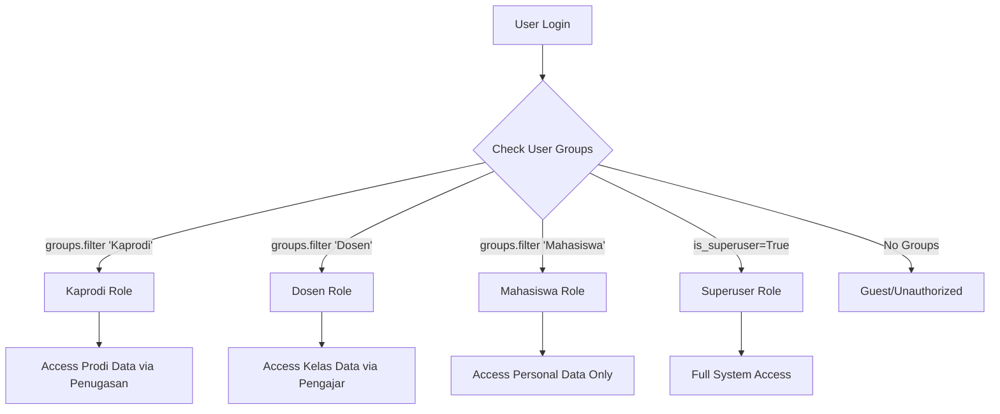

# API Role Access Matrix

Dokumentasi lengkap sistem permission dan akses role-based untuk API akademik.

## Overview Sistem Permission

Sistem menggunakan **Role-Based Access Control (RBAC)** dengan 4 level akses:

| Role | Scope Akses | Data Filter |
|------|-------------|-------------|
| **Superuser/Admin** | Semua data tanpa batasan | None (full access) |
| **Kaprodi** | Data program studi yang dipimpin | `id_prodi` dari tabel `Penugasan` |
| **Dosen** | Kelas/mata kuliah yang diajar | `id_dosen` dari tabel `Pengajar` |
| **Mahasiswa** | Data pribadi saja | `nim` atau `id_mahasiswa` |

## Authentication & Authorization

### JWT Token Requirements
Semua endpoint memerlukan JWT Bearer token di header:
```http
Authorization: Bearer <jwt_token>
```

### Role Mapping Logic


## API Endpoints Role Matrix

### 🏫 **Academic Management APIs**

#### **Mata Kuliah (Subjects)**
| Endpoint | Method | Superuser | Kaprodi | Dosen | Mahasiswa | Scope Filter |
|----------|--------|-----------|---------|-------|-----------|--------------|
| `/api/v1/mata-kuliah/` | GET | ✅ Full | ✅ All subjects | ✅ Taught subjects | ❌ | Kaprodi: all, Dosen: via `Pengajar` table |
| `/api/v1/mata-kuliah/` | POST | ✅ | ✅ | ❌ | ❌ | Kaprodi can create for their prodi |
| `/api/v1/mata-kuliah/{id}/` | GET | ✅ | ✅ | ✅ | ❌ | Ownership validation |
| `/api/v1/mata-kuliah/{id}/` | PUT/PATCH | ✅ | ✅ | ❌ | ❌ | Kaprodi: own prodi subjects |
| `/api/v1/mata-kuliah/{id}/` | DELETE | ✅ | ✅ | ❌ | ❌ | Kaprodi: own prodi subjects |

#### **Kurikulum (Curriculum)**
| Endpoint | Method | Superuser | Kaprodi | Dosen | Mahasiswa | Scope Filter |
|----------|--------|-----------|---------|-------|-----------|--------------|
| `/api/v1/kurikulum/` | GET | ✅ Full | ✅ Own prodi | ❌ | ❌ | `id_prodi` from `Penugasan` |
| `/api/v1/kurikulum/` | POST | ✅ | ✅ | ❌ | ❌ | Can create for managed prodi |
| `/api/v1/kurikulum/{id}/` | GET | ✅ | ✅ | ❌ | ❌ | Prodi ownership check |
| `/api/v1/kurikulum/{id}/` | PUT/PATCH | ✅ | ✅ | ❌ | ❌ | Prodi ownership check |
| `/api/v1/kurikulum/{id}/` | DELETE | ✅ | ✅ | ❌ | ❌ | Prodi ownership check |

#### **Kelas (Classes)**
| Endpoint | Method | Superuser | Kaprodi | Dosen | Mahasiswa | Scope Filter |
|----------|--------|-----------|---------|-------|-----------|--------------|
| `/api/v1/kuliah/` | GET | ✅ Full | ✅ Prodi classes | ✅ Taught classes | ❌ | Kaprodi: `id_prodi`, Dosen: `Pengajar.id_kelas_kuliah` |
| `/api/v1/kuliah/` | POST | ✅ | ✅ | ❌ | ❌ | Can create for managed prodi |
| `/api/v1/kuliah/{id}/` | GET | ✅ | ✅ | ✅ | ❌ | Ownership validation |
| `/api/v1/kuliah/{id}/` | PUT/PATCH | ✅ | ✅ | ✅ | ❌ | Kaprodi: prodi classes, Dosen: taught classes |
| `/api/v1/kuliah/{id}/` | DELETE | ✅ | ✅ | ❌ | ❌ | Kaprodi only |

#### **Dosen (Lecturers)**
| Endpoint | Method | Superuser | Kaprodi | Dosen | Mahasiswa | Scope Filter |
|----------|--------|-----------|---------|-------|-----------|--------------|
| `/api/v1/dosen/` | GET | ✅ Full | ✅ Prodi lecturers | ❌ | ❌ | Kaprodi: lecturers in managed prodi |
| `/api/v1/dosen/` | POST | ✅ | ✅ | ❌ | ❌ | Can create for managed prodi |
| `/api/v1/dosen/{id}/` | GET | ✅ | ✅ | ✅ Self only | ❌ | Dosen: own profile only |
| `/api/v1/dosen/{id}/` | PUT/PATCH | ✅ | ✅ | ✅ Self only | ❌ | Dosen: own profile only |
| `/api/v1/dosen/{id}/` | DELETE | ✅ | ✅ | ❌ | ❌ | Kaprodi only |

#### **Mahasiswa (Students)**
| Endpoint | Method | Superuser | Kaprodi | Dosen | Mahasiswa | Scope Filter |
|----------|--------|-----------|---------|-------|-----------|--------------|
| `/api/v1/mhs/` | GET | ✅ Full | ✅ Prodi students | ✅ Class students | ✅ Self only | Complex filtering by role |
| `/api/v1/mhs/` | POST | ✅ | ✅ | ❌ | ❌ | Can create for managed prodi |
| `/api/v1/mhs/{id}/` | GET | ✅ | ✅ | ✅ Class student | ✅ Self only | Multi-level ownership check |
| `/api/v1/mhs/{id}/` | PUT/PATCH | ✅ | ✅ | ❌ | ✅ Self only | Mahasiswa: own profile only |
| `/api/v1/mhs/{id}/` | DELETE | ✅ | ✅ | ❌ | ❌ | Admin/Kaprodi only |

### 📊 **Assessment & Grading APIs**

#### **Nilai (Grades)**
| Endpoint | Method | Superuser | Kaprodi | Dosen | Mahasiswa | Scope Filter |
|----------|--------|-----------|---------|-------|-----------|--------------|
| `/api/v1/nilai/` | GET | ✅ Full | ✅ Prodi grades | ✅ Class grades | ✅ Own grades | `id_mahasiswa` for students |
| `/api/v1/nilai/` | POST | ✅ | ✅ | ✅ | ❌ | Dosen: can input for taught classes |
| `/api/v1/nilai/{id}/` | GET | ✅ | ✅ | ✅ | ✅ Self only | Ownership validation by role |
| `/api/v1/nilai/{id}/` | PUT/PATCH | ✅ | ✅ | ✅ | ❌ | Dosen: taught classes only |
| `/api/v1/nilai/{id}/` | DELETE | ✅ | ✅ | ❌ | ❌ | Admin/Kaprodi only |

#### **Komponen Evaluasi (Assessment Components)**
| Endpoint | Method | Superuser | Kaprodi | Dosen | Mahasiswa | Scope Filter |
|----------|--------|-----------|---------|-------|-----------|--------------|
| `/api/v1/komponen-evaluasi/` | GET | ✅ Full | ✅ All | ✅ Taught subjects | ❌ | Dosen: subjects they teach |
| `/api/v1/komponen-evaluasi/` | POST | ✅ | ✅ | ✅ | ❌ | Can create for accessible subjects |
| `/api/v1/komponen-evaluasi/{id}/` | GET | ✅ | ✅ | ✅ | ❌ | Ownership by subject teaching |
| `/api/v1/komponen-evaluasi/{id}/` | PUT/PATCH | ✅ | ✅ | ✅ | ❌ | Can modify for taught subjects |
| `/api/v1/komponen-evaluasi/{id}/` | DELETE | ✅ | ✅ | ❌ | ❌ | Admin/Kaprodi only |

### 👥 **Student Academic Services (SIADIN)**

#### **SIADIN Mahasiswa**
| Endpoint | Method | Superuser | Kaprodi | Dosen | Mahasiswa | Scope Filter |
|----------|--------|-----------|---------|-------|-----------|--------------|
| `/api/v1/siadin-mhs/jadwal/` | GET | ✅ | ❌ | ❌ | ✅ Own schedule | `nim=user.username` |
| `/api/v1/siadin-mhs/kelas/` | GET | ✅ | ❌ | ❌ | ✅ Own classes | Student's enrolled classes |
| `/api/v1/siadin-mhs/sisa-masa-studi/` | GET | ✅ | ❌ | ❌ | ✅ Own data | Personal academic timeline |

#### **SIADIN Dosen**
| Endpoint | Method | Superuser | Kaprodi | Dosen | Mahasiswa | Scope Filter |
|----------|--------|-----------|---------|-------|-----------|--------------|
| `/api/v1/siadin-dsn/kelas/` | GET | ✅ | ✅ | ✅ Taught classes | ❌ | Dosen: `Pengajar.id_kelas_kuliah` |
| `/api/v1/siadin-dsn/perwalian/` | GET | ✅ | ✅ | ✅ Supervised students | ❌ | Academic advisory relationships |

### 📚 **Reference Data APIs**

#### **Program Studi (Study Programs)**
| Endpoint | Method | Superuser | Kaprodi | Dosen | Mahasiswa | Scope Filter |
|----------|--------|-----------|---------|-------|-----------|--------------|
| `/api/v1/prodi/` | GET | ✅ Full | ✅ Managed prodi | ✅ Associated prodi | ✅ Own prodi | Role-based filtering |
| `/api/v1/prodi/{id}/` | GET | ✅ | ✅ Managed | ✅ Associated | ✅ Own | Ownership validation |

#### **Semester & Schedule**
| Endpoint | Method | Superuser | Kaprodi | Dosen | Mahasiswa | Scope Filter |
|----------|--------|-----------|---------|-------|-----------|--------------|
| `/api/v1/semester/` | GET | ✅ | ✅ | ✅ | ✅ | Read-only reference data |
| `/api/v1/ruang/` | GET | ✅ | ✅ | ✅ | ❌ | Academic staff only |
| `/api/v1/sesi/` | GET | ✅ | ✅ | ✅ | ❌ | Academic staff only |

## Permission Implementation Details

### 🔧 **Backend Permission Classes**

#### Core Permission Classes Location: `api/common/permissions.py`

1. **`UniversalRoleBasedPermission`** - Universal permission handler
   - Combines all role permissions with "most permissive wins"
   - Used in ViewSets for automatic role detection

2. **`IsKaprodiOrAdmin`** - Kaprodi-specific permissions
   - Validates prodi ownership via `Penugasan` table
   - Object-level permission checking

3. **`IsDosenOwner`** - Dosen-specific permissions
   - Validates teaching relationship via `Pengajar` table
   - Class and subject ownership validation

4. **`IsMahasiswaOwner`** - Mahasiswa-specific permissions
   - Validates data ownership via NIM matching
   - Personal data access only

5. **`AdminOnlyPermission`** - Administrative endpoints
   - Blocks student and lecturer access
   - Allows Kaprodi and Admin only

### 🔍 **Data Filtering Logic**

#### Location: `core/utils/permission_utils.py`

```python
def filter_queryset_by_permission(user, queryset, model_name):
    """
    Automatic queryset filtering based on user role and permissions

    Args:
        user: Authenticated Django user
        queryset: Base queryset to filter
        model_name: Model type for specific filtering logic

    Returns:
        Filtered queryset based on user's role and accessible data
    """
```

#### Filtering Strategies by Model:

| Model | Superuser | Kaprodi | Dosen | Mahasiswa |
|-------|-----------|---------|-------|-----------|
| **kurikulum** | All | `id_prodi__in=accessible_prodi_ids` | Blocked | Blocked |
| **matakuliah** | All | All subjects | `pengajar__id_dosen=profile` | Blocked |
| **kelas** | All | `id_prodi__in=accessible_prodi_ids` | `id__in=accessible_kelas_ids` | Enrolled classes |
| **nilai** | All | Prodi students | Taught classes | `id_mahasiswa=profile.id_mahasiswa` |
| **komponen_evaluasi** | All | All | `id_matkul__pengajar__id_dosen=profile` | Blocked |

### 🚀 **API Integration Examples**

#### Example 1: Mata Kuliah List with Role Filtering
```python
# api/v1/academic/matakuliah/views.py
class MataKuliahListView(APIView):
    permission_classes = [IsReadOnlyOrAuthorized]
    authentication_classes = [CustomJWTAuthentication]

    def get(self, request):
        queryset = MataKuliah.objects.filter(deleted=False)

        # Automatic permission-based filtering
        queryset = filter_queryset_by_permission(
            request.user, queryset, 'matakuliah'
        )

        # Result:
        # - Superuser: All subjects
        # - Kaprodi: All subjects (no prodi restriction for subjects)
        # - Dosen: Only subjects they teach
        # - Mahasiswa: Access denied
```

#### Example 2: Student Data with Complex Filtering
```python
# api/v1/academic/mhs/views.py
class MahasiswaViewSet(viewsets.ReadOnlyModelViewSet):
    permission_classes = [UniversalRoleBasedPermission]

    def get_queryset(self):
        # Automatic role-based filtering applied
        # - Superuser: All students
        # - Kaprodi: Students in managed prodi
        # - Dosen: Students in taught classes
        # - Mahasiswa: Own profile only
```

### 🔐 **Security Features**

#### 1. **Object-Level Permission Validation**
```python
def has_object_permission(self, request, view, obj):
    # Validates specific object access based on:
    # - Ownership relationships
    # - Teaching assignments
    # - Program management roles
    # - Personal data ownership
```

#### 2. **Automatic Scope Determination**
```python
def get_accessible_prodi_ids(user):
    # Returns: None (all prodi) or List[int] (restricted prodi)
    # Based on: Penugasan table for academic staff
    #          RiwayatPendidikan table for students
```

#### 3. **Multi-Role Support**
- Users can have multiple roles (e.g., Dosen + Kaprodi)
- "Most permissive wins" principle applied
- Automatic role detection and permission combining

## Error Responses

### Authentication Errors
```json
{
  "error": "AUTHENTICATION_REQUIRED",
  "message": "Authentication credentials were not provided.",
  "http_code": 401
}
```

### Permission Denied
```json
{
  "error": "PERMISSION_DENIED",
  "message": "You do not have permission to access this resource.",
  "http_code": 403
}
```

### Role-Specific Access Denied
```json
{
  "error": "ROLE_ACCESS_DENIED",
  "message": "Your role does not have access to this endpoint.",
  "details": {
    "user_role": "mahasiswa",
    "required_roles": ["admin", "kaprodi"],
    "endpoint": "/api/v1/dosen/"
  },
  "http_code": 403
}
```

## Testing Role Permissions

### Test Scenarios by Role

#### Superuser/Admin Tests
```bash
# Should have full access to all endpoints
curl -H "Authorization: Bearer <admin_token>" /api/v1/mata-kuliah/
curl -H "Authorization: Bearer <admin_token>" /api/v1/dosen/
curl -H "Authorization: Bearer <admin_token>" /api/v1/mhs/
```

#### Kaprodi Tests
```bash
# Should see only prodi-scoped data
curl -H "Authorization: Bearer <kaprodi_token>" /api/v1/mata-kuliah/
# Returns: Subjects for managed prodi only

curl -H "Authorization: Bearer <kaprodi_token>" /api/v1/kurikulum/
# Returns: Curriculum for managed prodi only
```

#### Dosen Tests
```bash
# Should see only taught classes/subjects
curl -H "Authorization: Bearer <dosen_token>" /api/v1/mata-kuliah/
# Returns: Only subjects they teach

curl -H "Authorization: Bearer <dosen_token>" /api/v1/dosen/
# Returns: 403 Forbidden (cannot access other lecturers)
```

#### Mahasiswa Tests
```bash
# Should see only personal data
curl -H "Authorization: Bearer <mahasiswa_token>" /api/v1/siadin-mhs/jadwal/
# Returns: Own schedule only

curl -H "Authorization: Bearer <mahasiswa_token>" /api/v1/mata-kuliah/
# Returns: 403 Forbidden (no access to subject management)
```

## Migration Guide

### Upgrading Existing APIs to Role-Based Permissions

1. **Add Permission Class to View**
```python
# Before
class MyView(APIView):
    permission_classes = [IsAuthenticated]

# After
class MyView(APIView):
    permission_classes = [UniversalRoleBasedPermission]
```

2. **Apply Automatic Filtering**
```python
# Add to get_queryset() or get() method
queryset = filter_queryset_by_permission(
    request.user, queryset, 'model_name'
)
```

3. **Update Swagger Documentation**
```python
@swagger_auto_schema(
    operation_description="Role-based access: Kaprodi (managed prodi), Dosen (taught subjects)",
    # ... other parameters
)
```

## Implementation Status

| Component | Status | Implementation Location |
|-----------|--------|------------------------|
| ✅ Role Detection | Complete | `core/utils/permission_utils.py:7-36` |
| ✅ Permission Classes | Complete | `api/common/permissions.py` |
| ✅ Data Filtering | Complete | `core/utils/permission_utils.py:451-544` |
| ✅ API Integration | Partial | Various view files |
| ⚠️ Unit Tests | Pending | `tests/` (needs creation) |
| ✅ Documentation | Complete | This document |

---

**Last Updated:** January 2025
**Version:** 1.0
**Author:** Sistema Akademik Development Team