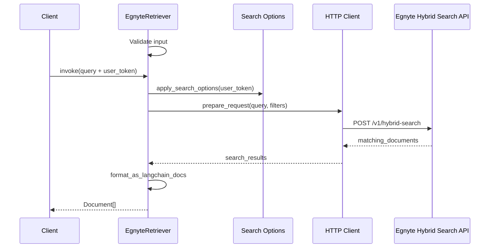

# Egnyte Retriever for LangChain (`langchain_egnyte`)

**LangChain integration for Egnyte's hybrid search API**

This package provides a comprehensive LangChain-compatible retriever for searching and retrieving documents from Egnyte using their advanced hybrid search API. It combines keyword and semantic search capabilities with full LangChain standard compliance.

**Package Name**: `egnyte-langchain-connector` (PyPI) / `langchain_egnyte` (imports)

## Overview

The `EgnyteRetriever` class helps you get your unstructured content from Egnyte in LangChain's Document format. You can search for files using Egnyte's hybrid search API, which combines keyword and semantic search capabilities.

### Integration Details

## Features

- **Full LangChain Compliance**: Native `BaseRetriever` implementation with all standard methods
- **Hybrid Search**: Advanced semantic + keyword search via Egnyte's AI-powered API
- **Configurable Results**: Control document count with `k` parameter (default: 100)
- **Rich Search Options**: All 12 API parameters supported with camelCase format
- **Agent Ready**: Built-in tool creation for LangChain agents
- **Modern Authentication**: Clean Bearer token authentication
- **Semantic Control**: Adjustable semantic vs keyword balance (0.0-1.0)
- **Folder Filtering**: Include/exclude specific folders and paths
- **Date Filtering**: Search by creation date ranges
- **Collection Support**: Search within specific Egnyte collections
- **Async Support**: Full async/await compatibility
- **Modern Packaging**: uv + pip support with hatchling build system

## Installation

### Modern Installation with uv (Recommended)

[uv](https://docs.astral.sh/uv/) is a fast Python package manager that provides better dependency resolution and faster installs. This project includes a `uv.lock` file for reproducible builds.

#### Install uv

```bash
# macOS and Linux
curl -LsSf https://astral.sh/uv/install.sh | sh

# Windows
powershell -ExecutionPolicy ByPass -c "irm https://astral.sh/uv/install.ps1 | iex"

# With pip
pip install uv
```

#### Install the Package

```bash
# Add to existing project
uv add egnyte-langchain-connector

# Or create new project with egnyte-langchain-connector
uv init my-egnyte-project
cd my-egnyte-project
uv add egnyte-langchain-connector
```

#### Development Installation

For development with all dependencies and tools:

```bash
# Clone the repository
git clone <repository-url>
cd egnyte-retriever

# Install with all development dependencies
uv sync --all-extras

# Or install specific extras
uv sync --extra test --extra docs
```

### Traditional Installation with pip

```bash
pip install egnyte-langchain-connector
```

### With LangChain AI Provider Support

#### Using uv (Recommended)

```bash
# For OpenAI integration
uv add egnyte-langchain-connector[openai]

# For Anthropic integration
uv add egnyte-langchain-connector[anthropic]

# For Azure OpenAI integration
uv add egnyte-langchain-connector[azure]

# Install all AI providers
uv add egnyte-langchain-connector[all]
```

#### Using pip

```bash
# For OpenAI integration
pip install egnyte-langchain-connector[openai]

# For Anthropic integration
pip install egnyte-langchain-connector[anthropic]

# For Azure OpenAI integration
pip install egnyte-langchain-connector[azure]

# Install all extras
pip install egnyte-langchain-connector[all]
```

### Core Dependencies

The package requires these core dependencies:

```bash
# Core LangChain packages (automatically installed)
pip install langchain>=0.1.0
pip install langchain-core>=0.1.0

# HTTP client and validation (automatically installed)
pip install httpx>=0.24.0
pip install pydantic>=2.0.0
```

## Setup

To use the Egnyte retriever, you need:

1. **An Egnyte account** - If you are not a current Egnyte customer or want to test outside of your production Egnyte instance, you can use a free developer account.
2. **An Egnyte app** - This is configured in the developer console and must have the appropriate scopes enabled.
3. **The app must be enabled** by the administrator.

### Generating User Token

To generate an Egnyte user token for authentication:

1. **Register for a Developer Account**

   - Visit [https://developers.egnyte.com/member/register](https://developers.egnyte.com/member/register)
   - Create your free developer account

2. **Generate User Token**
   - Use your API key to generate a user token following the [Public API Authentication guide](https://developers.egnyte.com/docs/read/Public_API_Authentication)
   - **Important**: Use the scope `Egnyte.ai` when generating the token to ensure proper access to AI-powered search features

### Credentials

For these examples, we will use token authentication:

```python
import getpass
import os

egnyte_user_token = getpass.getpass("Enter your Egnyte User Token: ")
domain = "company.egnyte.com"  # Your Egnyte domain (without https://)
```

### Environment Management with uv

For development and testing, you can manage credentials using environment files:

```bash
# Create a .env file (add to .gitignore!)
echo "EGNYTE_USER_TOKEN=your_token_here" > .env
echo "EGNYTE_DOMAIN=company.egnyte.com" >> .env

# Install python-dotenv
uv add python-dotenv

# Use in your code
```

```python
from dotenv import load_dotenv
import os

load_dotenv()

egnyte_user_token = os.getenv("EGNYTE_USER_TOKEN")
domain = os.getenv("EGNYTE_DOMAIN")
```

## Import Patterns

Once published, the package uses the `langchain_egnyte` namespace following LangChain ecosystem standards:

```python
# Core imports
from langchain_egnyte import EgnyteRetriever, EgnyteSearchOptions

# Tool creation
from langchain_egnyte import create_retriever_tool

# Exception handling
from langchain_egnyte.exceptions import (
    AuthenticationError,
    ValidationError,
    RateLimitError,
    ServerError
)

# Utility functions (advanced usage)
from langchain_egnyte.utilities import (
    create_folder_search_options,
    create_date_range_search_options
)
```

## Instantiation

### Basic Usage (LangChain Standard)

```python
from langchain_egnyte import EgnyteRetriever

# Simple domain-based initialization
retriever = EgnyteRetriever(domain="company.egnyte.com")

# With custom document count (k parameter)
retriever = EgnyteRetriever(domain="company.egnyte.com", k=50)

# Or with full URL (automatically normalized)
retriever = EgnyteRetriever(domain="https://company.egnyte.com")
```

### With Search Options (All API Parameters Supported)

```python
from langchain_egnyte import EgnyteRetriever, EgnyteSearchOptions

# Configure search options with camelCase API parameters
search_options = EgnyteSearchOptions(
    limit=50,
    folderPath="/policies",  # Search in specific folder
    excludeFolderPaths=["/temp", "/archive"],  # Exclude folders
    createdAfter=1640995200000,  # Unix timestamp in milliseconds
    createdBefore=1672531200000,  # End date filter
    preferredFolderPath="/important"  # Boost results from this folder
)

retriever = EgnyteRetriever(
    domain="company.egnyte.com",
    search_options=search_options
)
```

### With Custom Timeout Configuration

```python
from langchain_egnyte import EgnyteRetriever

# Configure custom timeout (default is 30.0 seconds)
retriever = EgnyteRetriever(
    domain="company.egnyte.com",
    timeout=60.0  # 60 seconds timeout for slower networks
)

# Or combine with search options
retriever = EgnyteRetriever(
    domain="company.egnyte.com",
    search_options=search_options,
    timeout=45.0  # 45 seconds timeout
)
```

## Usage

### Basic Search

```python
# Simple search (uses default k=100)
documents = retriever.invoke(
    "machine learning policies",
    egnyte_user_token=egnyte_user_token
)

# Override document count at runtime
documents = retriever.invoke(
    "remote work guidelines",
    k=20,  # Get only 20 documents
    egnyte_user_token=egnyte_user_token
)

# With search options (camelCase parameters)
documents = retriever.invoke(
    "remote work guidelines",
    egnyte_user_token=egnyte_user_token,
    search_options=EgnyteSearchOptions(
        limit=20,
        folderPath="/hr"
    )
)
```

### Advanced Search Configuration

```python
from langchain_egnyte import EgnyteSearchOptions

# All supported API parameters (camelCase format)
advanced_options = EgnyteSearchOptions(
    # Core parameters
    limit=100,

    # Folder filtering
    folderPath="/documents",  # Search in specific folder
    excludeFolderPaths=["/temp", "/archive"],  # Exclude folders
    folderPaths=["/shared", "/public"],  # Include only these folders
    preferredFolderPath="/important",  # Boost results from this folder

    # Date filtering
    createdAfter=1640995200000,  # Unix timestamp in milliseconds
    createdBefore=1672531200000,  # End date

    # User and collection filtering
    createdBy="john.doe",  # Filter by creator
    collectionId="my-collection",  # Search in specific collection
    entryIds=["id1", "id2"]  # Search specific entries
)

retriever = EgnyteRetriever(
    domain="company.egnyte.com",
    search_options=advanced_options
)
```

### Async Usage

```python
import asyncio

async def async_search():
    # Async search
    documents = await retriever.ainvoke(
        "quarterly reports",
        egnyte_user_token=egnyte_user_token,
        k=25  # Override default k value
    )
    return documents

# Run async search
results = asyncio.run(async_search())
```

## API Parameters Reference

All Egnyte hybrid search API parameters are supported using **camelCase** format:

| Parameter             | Type | Description                       | Example                  |
| --------------------- | ---- | --------------------------------- | ------------------------ |
| `limit`               | int  | Maximum results (1-1000)          | `100`                    |
| `folderPath`          | str  | Search in specific folder         | `"/Shared/Documents"`    |
| `collectionId`        | str  | Search in specific collection     | `"my-collection"`        |
| `createdBy`           | str  | Filter by creator username        | `"john.doe"`             |
| `createdAfter`        | int  | Start date (Unix timestamp in ms) | `1640995200000`          |
| `createdBefore`       | int  | End date (Unix timestamp in ms)   | `1672531200000`          |
| `preferredFolderPath` | str  | Boost results from folder         | `"/Important"`           |
| `excludeFolderPaths`  | list | Exclude specific folders          | `["/temp", "/archive"]`  |
| `folderPaths`         | list | Include only these folders        | `["/shared", "/public"]` |
| `entryIds`            | list | Search specific entry IDs         | `["id1", "id2"]`         |

### Parameter Validation

- **Folder paths** must start with `/`
- **Timestamps** are Unix epoch in milliseconds
- **Cannot combine** `excludeFolderPaths` and `folderPaths`
- **Date ranges** must be logical (createdAfter < createdBefore)

## Use within a chain

Like other retrievers, EgnyteRetriever can be incorporated into LLM applications via chains.

```python
from langchain_core.output_parsers import StrOutputParser
from langchain_core.prompts import ChatPromptTemplate
from langchain_core.runnables import RunnablePassthrough
from langchain_openai import ChatOpenAI

# Initialize components
llm = ChatOpenAI(model="gpt-4")
retriever = EgnyteRetriever(domain="company.egnyte.com", k=10)

def format_docs(docs):
    return "\n\n".join(doc.page_content for doc in docs)

def retrieve_with_token(question):
    """Helper function to retrieve documents with token"""
    return retriever.invoke(
        question,
        egnyte_user_token=egnyte_user_token,
        search_options=EgnyteSearchOptions(
            folderPath="/policies"  # Search in policies folder
        )
    )

prompt = ChatPromptTemplate.from_template("""
Answer the question based on the following context:

Context: {context}

Question: {question}

Answer:""")

# Create RAG chain
chain = (
    {"context": retrieve_with_token | format_docs, "question": RunnablePassthrough()}
    | prompt
    | llm
    | StrOutputParser()
)

# Use the chain
result = chain.invoke("What are our remote work policies?")
print(result)
```

## Use as an agent tool

Like other retrievers, EgnyteRetriever can be also be added to a LangGraph agent as a tool.

```python
from langchain_egnyte import create_retriever_tool
from langchain.agents import AgentExecutor, create_openai_tools_agent
from langchain import hub

# Create retriever tool
egnyte_search_tool = create_retriever_tool(
    retriever,
    "egnyte_search_tool",
    "This tool is used to search Egnyte and retrieve documents that match the search criteria",
    egnyte_user_token=egnyte_user_token
)

tools = [egnyte_search_tool]

# Create agent
prompt = hub.pull("hwchase17/openai-tools-agent")
llm = ChatOpenAI(temperature=0)
agent = create_openai_tools_agent(llm, tools, prompt)
agent_executor = AgentExecutor(agent=agent, tools=tools)

result = agent_executor.invoke({
    "input": "Find documents about remote work policies"
})
```

## EgnyteSearchOptions

The `EgnyteSearchOptions` class provides comprehensive configuration options using **camelCase** API parameter names.

```python
from langchain_egnyte import EgnyteSearchOptions

# Complete example with all parameters
search_options = EgnyteSearchOptions(
    # Core search parameters
    limit=100,                              # Maximum results (1-1000)

    # Folder filtering (use one approach)
    folderPath="/policies",                 # Search within specific folder
    # OR
    folderPaths=["/policies", "/hr"],       # Include only these folders
    # OR
    excludeFolderPaths=["/temp", "/archive"], # Exclude specific folders

    # Additional filtering
    collectionId="collection-123",          # Search within collection
    createdBy="username",                   # Filter by creator
    createdAfter=1640995200000,            # Unix timestamp in milliseconds
    createdBefore=1672531200000,           # Unix timestamp in milliseconds
    preferredFolderPath="/important",       # Boost results from folder
    entryIds=["123", "456"]                # Search specific entries only
)
```

### Utility Functions

```python
from langchain_egnyte import EgnyteSearchOptions

# Class methods for common configurations
folder_opts = EgnyteSearchOptions.for_folder("/Shared/Documents", limit=50)

date_opts = EgnyteSearchOptions.for_date_range(
    created_after=1672531200000,  # Jan 1, 2023
    created_before=1704067200000,  # Jan 1, 2024
    limit=100
)

# Or use the standalone utility functions
from langchain_egnyte import (
    create_folder_search_options,
    create_date_range_search_options
)

folder_opts = create_folder_search_options("/Shared/Documents", limit=50)
date_opts = create_date_range_search_options(1672531200000, 1704067200000, limit=100)
```

## Works with ANY AI Provider

This retriever works with any LangChain-compatible AI provider:

```python
# OpenAI
from langchain_openai import ChatOpenAI
llm = ChatOpenAI(model="gpt-4")

# Anthropic
from langchain_anthropic import ChatAnthropic
llm = ChatAnthropic(model="claude-3-sonnet")

# Local models
from langchain_ollama import ChatOllama
llm = ChatOllama(model="llama3")

# All work the same way with the retriever
chain = retriever | prompt | llm
```

## Error Handling

The package provides comprehensive error handling with request ID extraction for better troubleshooting:

```python
from langchain_egnyte import (
    AuthenticationError,
    ValidationError,
    RateLimitError,
    ServerError
)

try:
    documents = retriever.invoke("query", egnyte_user_token="invalid-token")
except AuthenticationError as e:
    print(f"Invalid authentication token: {e}")
    # Error message includes request ID if available for Egnyte support
except ValidationError as e:
    print(f"Invalid request parameters: {e}")
except RateLimitError as e:
    print(f"Rate limit exceeded: {e}")
    # Request ID helps Egnyte support investigate rate limiting
except ServerError as e:
    print(f"Egnyte server error: {e}")
    # Request ID enables faster troubleshooting with Egnyte support
```

## LangChain Standard Features

### Configurable Document Count (k parameter)

The `k` parameter controls how many documents to return, following LangChain standards:

```python
# Set default k in constructor
retriever = EgnyteRetriever(domain="company.egnyte.com", k=50)

# Override k at runtime
documents = retriever.invoke("query", k=10, egnyte_user_token=token)

# Works with all methods
documents = await retriever.ainvoke("query", k=25, egnyte_user_token=token)
batch_results = retriever.batch(["query1", "query2"], k=15)
```

### Batch Processing

```python
# Process multiple queries
queries = ["policy documents", "meeting notes", "quarterly reports"]
configs = [{"egnyte_user_token": token} for _ in queries]

# Sync batch
results = retriever.batch(queries, config=configs)

# Async batch
results = await retriever.abatch(queries, config=configs)
```

### Modern Package Features

- **uv Support**: Fast dependency management with `uv add egnyte-langchain-connector`
- **Modern Build**: Uses `hatchling` build system
- **Type Safety**: Full type hints with Pydantic validation
- **Performance**: Optimized for production workloads
- **Tested**: Comprehensive test suite with 100% LangChain compliance

## Development with uv

This project uses [uv](https://docs.astral.sh/uv/) for fast, reliable dependency management. The included `uv.lock` file ensures reproducible builds across all environments.

### Quick Start for Contributors

```bash
# Clone the repository
git clone <repository-url>
cd egnyte-retriever

# Install all dependencies (including dev tools)
uv sync --all-extras

# Activate the virtual environment
source .venv/bin/activate  # Linux/macOS
# or
.venv\Scripts\activate     # Windows

# Run tests
uv run pytest

# Run with specific extras
uv run --extra test pytest tests/
```

### Development Commands

```bash
# Install development dependencies
uv sync --extra test --extra docs

# Run tests with coverage
uv run pytest --cov=langchain_egnyte

# Run linting and formatting
uv run black langchain_egnyte tests
uv run isort langchain_egnyte tests
uv run flake8 langchain_egnyte tests
uv run mypy langchain_egnyte

# Build documentation
uv run --extra docs mkdocs serve

# Build the package
uv build
```

### Sequence Diagram



### Project Structure

```
egnyte-retriever/
├── langchain_egnyte/          # Main package
│   ├── __init__.py
│   ├── retriever.py           # Core retriever implementation
│   ├── utilities.py           # Search options and utilities
│   └── exceptions.py          # Custom exceptions
├── tests/                     # Test suite
│   ├── unit_tests/           # Unit tests
│   ├── integration/          # Integration tests
│   └── conftest.py           # Test configuration
├── demo/                     # Example usage
├── pyproject.toml            # Project configuration
├── uv.lock                   # Locked dependencies
└── README.md                 # This file
```

### Why uv?

- **Speed**: 10-100x faster than pip for dependency resolution
- **Reliability**: Deterministic builds with `uv.lock`
- **Developer Experience**: Better error messages and conflict resolution
- **Modern**: Built for modern Python packaging standards
- **Compatibility**: Works alongside pip and other tools

## API Reference

For detailed documentation of all EgnyteRetriever features and configurations, see the API reference.

## Help

If you have questions, you can check out the [Egnyte developer documentation](https://developers.egnyte.com/) or reach out to us in our developer community.

## Related

- [Retriever conceptual guide](https://python.langchain.com/docs/concepts/#retrievers)
- [Retriever how-to guides](https://python.langchain.com/docs/how_to/#retrievers)
- [LangChain integration patterns](https://python.langchain.com/docs/integrations/)
