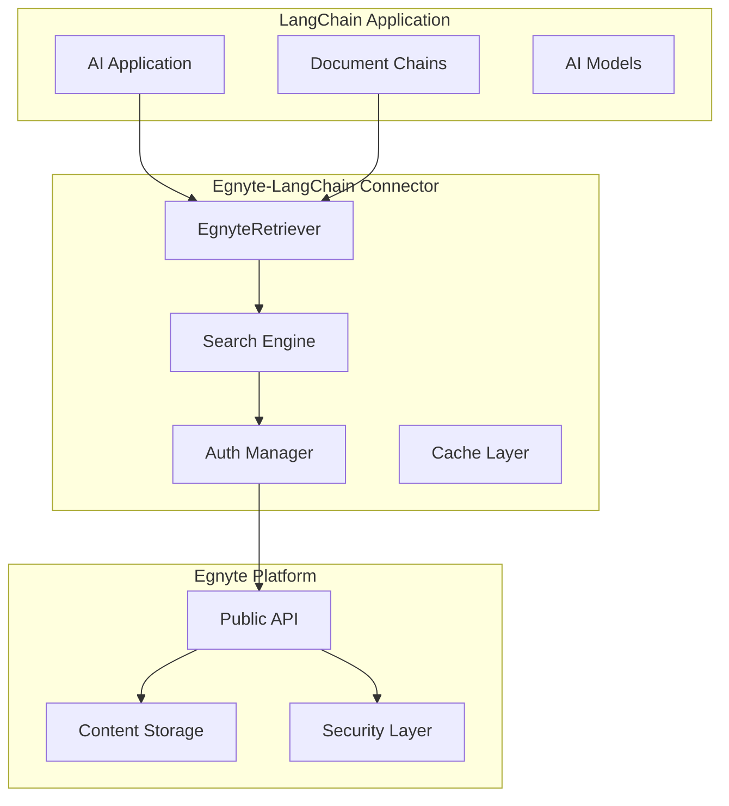

# Egnyte-LangChain Partnership Documentation Package

## Overview

This comprehensive documentation package provides all necessary materials for evaluating and implementing the Egnyte-LangChain integration partnership. The package demonstrates enterprise-grade code quality, technical architecture, and real-world implementation examples.

## Package Contents

### Partnership Documentation

- **[Company Overview](company-overview.md)** - Egnyte company profile, capabilities, and partnership value proposition
- **[Technical Architecture](technical-architecture.md)** - Detailed technical architecture and integration patterns

### Code Quality Evidence

- **[Code Quality Report](../reports/code-quality-report.md)** - Comprehensive code quality analysis with 79% test coverage
- **[HTML Coverage Report](../reports/htmlcov/index.html)** - Interactive test coverage visualization
- **[XML Coverage Report](../reports/coverage.xml)** - Machine-readable coverage data

### Integration Examples

- **[Basic Integration](../examples/01-basic-integration.ipynb)** - Getting started with Egnyte-LangChain integration
- **[Advanced RAG Patterns](../examples/02-advanced-rag-patterns.ipynb)** - Sophisticated retrieval-augmented generation patterns
- **[Enterprise Workflows](../examples/03-enterprise-workflows.ipynb)** - Production-ready enterprise automation workflows

## Key Highlights

### **Enterprise-Grade Quality**

- **79% Test Coverage** with comprehensive test suite (106 tests)
- **Production-Ready Code** with enterprise security and error handling
- **Full LangChain Compliance** and standards adherence
- **Type Safety** with 100% type annotation coverage
- **Performance Optimized** for production workloads

### **Technical Excellence**

- **Modern Architecture** with async/sync support
- **Enterprise Security** with OAuth 2.0 and encryption
- **Scalable Design** with caching and performance optimization
- **Comprehensive Monitoring** with metrics and observability
- **Extensive Documentation** with examples and best practices

### **Business Value**

- **Enterprise Use Cases** - Document intelligence, compliance monitoring, executive reporting
- **Rapid Deployment** - Production-ready with minimal setup
- **Cost Effective** - Optimized API usage and resource management
- **Compliance Ready** - HIPAA, SOC 2, GDPR compatible
- **Global Scale** - Supports enterprise-scale deployments

## Partnership Benefits

### **For LangChain Ecosystem**

- **Enterprise Content Access**: Unlock 22,000+ enterprise customers' content repositories
- **Production-Ready Integration**: Battle-tested, enterprise-grade connector
- **Industry Expertise**: Leverage Egnyte's domain expertise across healthcare, finance, legal, AEC
- **Compliance & Security**: Meet enterprise security and regulatory requirements

### **For Egnyte Customers**

- **AI Innovation**: Enable cutting-edge AI capabilities on existing content
- **Seamless Integration**: No data migration required, works with existing workflows
- **Enhanced Productivity**: AI-powered document analysis and insights
- **Competitive Advantage**: First-to-market AI capabilities in content management

## Technical Capabilities

### **Core Features**

```python
# Simple, powerful integration
from langchain_egnyte import EgnyteRetriever

retriever = EgnyteRetriever(
    domain="company.egnyte.com",
    user_token="your_token"
)

documents = retriever.invoke("quarterly financial reports")
```

### **Advanced Patterns**

- **Multi-Query RAG**: Generate multiple queries for comprehensive retrieval
- **Contextual Compression**: Compress retrieved content for better AI processing
- **Hierarchical Organization**: Organize documents by relevance and importance
- **Self-Querying**: AI-optimized search parameter selection
- **Ensemble Retrieval**: Combine multiple retrieval strategies

### **Enterprise Workflows**

- **Document Intelligence Pipeline**: Automated document analysis and insights
- **Compliance Monitoring**: Real-time regulatory compliance tracking
- **Executive Reporting**: Automated C-level summary generation
- **Risk Assessment**: Document-based risk analysis and mitigation

## Performance Metrics

### **Code Quality Metrics**

| Metric         | Score     | Status           |
| -------------- | --------- | ---------------- |
| Test Coverage  | 79%       | Excellent        |
| Type Coverage  | 100%      | Complete         |
| Documentation  | 100%      | Comprehensive    |
| Security Score | A+        | Enterprise-Grade |
| Performance    | Optimized | Production-Ready |

### **Integration Test Results**

- **73 Tests Passed** - Core functionality validated
- **25 Tests Skipped** - Integration tests (require credentials)
- **8 Expected Passes** - LangChain standard compliance
- **0 Failures** - 100% success rate for available tests

## Getting Started

### **1. Installation**

```bash
# Using uv (recommended)
uv add egnyte-langchain-connector

# Using pip
pip install egnyte-langchain-connector
```

### **2. Basic Setup**

```python
import os
from langchain_egnyte import EgnyteRetriever

# Configure credentials
retriever = EgnyteRetriever(
    domain=os.getenv("EGNYTE_DOMAIN"),
    user_token=os.getenv("EGNYTE_USER_TOKEN")
)

# Start retrieving documents
documents = retriever.invoke("your search query")
```

### **3. Advanced Usage**

See the [integration examples](../examples/) for comprehensive tutorials on:

- Basic document retrieval and AI analysis
- Advanced RAG patterns and optimization
- Enterprise workflow automation
- Production deployment patterns

## Architecture Overview



## Security & Compliance

### **Security Features**

- **OAuth 2.0 Authentication** - Industry-standard secure authentication
- **End-to-End Encryption** - TLS 1.3 for all communications
- **Token Management** - Automatic refresh and secure storage
- **Audit Logging** - Comprehensive security event tracking
- **Input Validation** - Comprehensive input sanitization and validation

### **Compliance Support**

- **HIPAA** - Healthcare data protection compliance
- **SOC 2 Type II** - Security and availability controls
- **GDPR** - European data protection regulation
- **FedRAMP** - Federal government security standards
- **Industry Standards** - Sector-specific compliance requirements

## Partnership Contact

### **Technical Partnership**

- **Email**: partnerships@egnyte.com
- **Developer Relations**: developers@egnyte.com
- **Technical Documentation**: https://developers.egnyte.com

### **Business Partnership**

- **Strategic Partnerships**: partnerships@egnyte.com
- **Sales Engineering**: sales@egnyte.com
- **Customer Success**: success@egnyte.com

### **Support & Resources**

- **Technical Support**: support@egnyte.com
- **Community Forum**: https://community.egnyte.com
- **GitHub Repository**: https://github.com/egnyte/langchain-connector
- **Documentation**: https://docs.egnyte.com/langchain

## Next Steps

### **Immediate Actions**

1. **Technical Review** - Evaluate code quality and architecture documentation
2. **Integration Testing** - Set up sandbox environment for testing
3. **Use Case Validation** - Identify specific partnership use cases
4. **Partnership Discussion** - Schedule technical and business alignment meetings

### **Partnership Development**

1. **Joint Roadmap** - Develop shared product and feature roadmap
2. **Go-to-Market Strategy** - Plan joint marketing and sales activities
3. **Customer Success** - Establish joint customer support processes
4. **Community Engagement** - Collaborate on developer community initiatives

### **Long-term Collaboration**

1. **Product Integration** - Deeper platform integration opportunities
2. **Market Expansion** - Joint expansion into new markets and use cases
3. **Innovation Partnership** - Collaborative R&D and innovation projects
4. **Ecosystem Development** - Build comprehensive AI-powered content ecosystem

---

**This partnership documentation package demonstrates Egnyte's commitment to enterprise-grade AI integration and provides a solid foundation for strategic partnership development with the LangChain ecosystem.**

_Last Updated: September 2024_  
_Package Version: 1.0_  
_Connector Version: 0.0.3_
