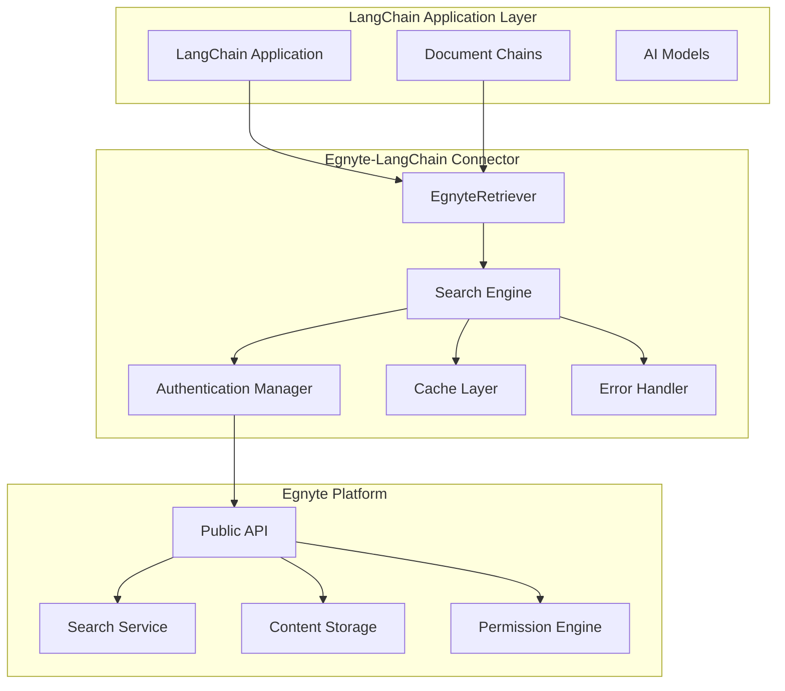

# Technical Architecture: Egnyte-LangChain Integration

## Overview

The Egnyte-LangChain connector provides a production-ready integration between LangChain's AI framework and Egnyte's enterprise content management platform. This document outlines the technical architecture, design patterns, and implementation details.

## System Architecture

### High-Level Architecture



### Component Architecture

#### **1. EgnyteRetriever (Core Component)**

```python
class EgnyteRetriever(BaseRetriever):
    """
    LangChain-compatible retriever for Egnyte content.

    Features:
    - Hybrid search (keyword + semantic)
    - Configurable search options
    - Async/sync support
    - Error handling and retries
    - Caching and performance optimization
    """
```

**Key Responsibilities:**

- Document retrieval from Egnyte
- Search query processing
- Result formatting and metadata extraction
- Integration with LangChain's retriever interface

#### **2. Search Engine**

```python
class EgnyteSearchEngine:
    """
    Advanced search capabilities with multiple strategies.

    Search Types:
    - Keyword search
    - Semantic search
    - Hybrid search (combined)
    - Filtered search (by folder, date, type)
    """
```

**Features:**

- Multiple search strategies
- Query optimization
- Result ranking and relevance scoring
- Search result caching

#### **3. Authentication Manager**

```python
class EgnyteAuthManager:
    """
    Secure authentication and token management.

    Supported Methods:
    - OAuth 2.0 flow
    - API key authentication
    - Token refresh and lifecycle management
    """
```

**Security Features:**

- Secure token storage
- Automatic token refresh
- Rate limiting compliance
- Audit logging

## Data Flow

### 1. **Query Processing Flow**

```
User Query → EgnyteRetriever → Search Engine → Egnyte API → Results Processing → LangChain Documents
```

**Detailed Steps:**

1. **Query Reception**: LangChain application sends query to EgnyteRetriever
2. **Query Processing**: Parse and optimize search query
3. **Authentication**: Validate and refresh authentication tokens
4. **API Request**: Send search request to Egnyte Public API
5. **Result Processing**: Parse API response and extract metadata
6. **Document Creation**: Convert results to LangChain Document objects
7. **Caching**: Store results for performance optimization
8. **Return**: Deliver formatted documents to LangChain application

### 2. **Authentication Flow**

```
Application → Auth Manager → Egnyte OAuth → Token Storage → API Access
```

**OAuth 2.0 Flow:**

1. **Authorization Request**: Redirect user to Egnyte authorization server
2. **User Consent**: User grants permission to access Egnyte content
3. **Authorization Code**: Egnyte returns authorization code
4. **Token Exchange**: Exchange code for access and refresh tokens
5. **Token Storage**: Securely store tokens for future use
6. **API Access**: Use access token for authenticated API requests

### 3. **Error Handling Flow**

```
API Error → Error Classification → Retry Logic → Fallback Strategy → User Notification
```

**Error Types:**

- **Authentication Errors**: Token expiry, invalid credentials
- **Authorization Errors**: Insufficient permissions
- **Rate Limiting**: API quota exceeded
- **Network Errors**: Connectivity issues
- **Server Errors**: Egnyte service unavailability

## Performance Optimization

### **1. Caching Strategy**

```python
class EgnyteCache:
    """
    Multi-level caching for performance optimization.

    Cache Levels:
    - Memory cache (in-process)
    - Redis cache (distributed)
    - File system cache (persistent)
    """
```

**Cache Types:**

- **Search Results**: Cache search results by query hash
- **Document Content**: Cache frequently accessed documents
- **Metadata**: Cache document metadata and permissions
- **Authentication**: Cache valid tokens and user sessions

### **2. Async Operations**

```python
async def asearch(self, query: str) -> List[Document]:
    """Asynchronous search with concurrent processing."""
    tasks = [
        self._search_content(query),
        self._search_metadata(query),
        self._get_permissions(query)
    ]
    results = await asyncio.gather(*tasks)
    return self._merge_results(results)
```

**Benefits:**

- Non-blocking I/O operations
- Concurrent API requests
- Improved throughput
- Better resource utilization

### **3. Pagination and Batching**

```python
class PaginatedSearch:
    """
    Efficient handling of large result sets.

    Features:
    - Automatic pagination
    - Configurable batch sizes
    - Memory-efficient streaming
    - Progress tracking
    """
```

## Security Architecture

### **1. Authentication & Authorization**

```
┌─────────────────┐    ┌──────────────────┐    ┌─────────────────┐
│   Application   │    │   Connector      │    │     Egnyte      │
│                 │    │                  │    │                 │
│ ┌─────────────┐ │    │ ┌──────────────┐ │    │ ┌─────────────┐ │
│ │ User Token  │ │◄──►│ │ Auth Manager │ │◄──►│ │ OAuth Server│ │
│ └─────────────┘ │    │ └──────────────┘ │    │ └─────────────┘ │
└─────────────────┘    └──────────────────┘    └─────────────────┘
```

**Security Measures:**

- **Token Encryption**: All tokens encrypted at rest
- **Secure Transport**: TLS 1.3 for all communications
- **Permission Validation**: Respect Egnyte's access controls
- **Audit Logging**: Comprehensive audit trail

### **2. Data Protection**

```python
class SecureDataHandler:
    """
    Secure handling of sensitive data.

    Features:
    - Data encryption in transit and at rest
    - PII detection and masking
    - Secure memory management
    - Audit trail generation
    """
```

**Protection Mechanisms:**

- **Encryption**: AES-256 encryption for sensitive data
- **Access Controls**: Role-based access control (RBAC)
- **Data Masking**: Automatic PII detection and masking
- **Secure Deletion**: Secure memory cleanup

## Scalability & Reliability

### **1. Horizontal Scaling**

```python
class LoadBalancer:
    """
    Distribute requests across multiple instances.

    Features:
    - Round-robin load balancing
    - Health check monitoring
    - Automatic failover
    - Circuit breaker pattern
    """
```

### **2. Reliability Patterns**

```python
class ReliabilityManager:
    """
    Implement reliability patterns for robust operation.

    Patterns:
    - Circuit breaker
    - Retry with exponential backoff
    - Bulkhead isolation
    - Timeout management
    """
```

**Reliability Features:**

- **Circuit Breaker**: Prevent cascade failures
- **Retry Logic**: Intelligent retry with backoff
- **Timeout Management**: Configurable timeouts
- **Health Monitoring**: Continuous health checks

## Monitoring & Observability

### **1. Metrics Collection**

```python
class MetricsCollector:
    """
    Comprehensive metrics collection and reporting.

    Metrics:
    - Request latency and throughput
    - Error rates and types
    - Cache hit/miss ratios
    - Authentication success rates
    """
```

### **2. Logging Strategy**

```python
class StructuredLogger:
    """
    Structured logging for better observability.

    Log Levels:
    - DEBUG: Detailed debugging information
    - INFO: General operational information
    - WARN: Warning conditions
    - ERROR: Error conditions requiring attention
    """
```

**Observability Stack:**

- **Metrics**: Prometheus/Grafana
- **Logging**: Structured JSON logs
- **Tracing**: OpenTelemetry integration
- **Alerting**: Configurable alerts and notifications

## API Design

### **1. RESTful Interface**

```python
class EgnyteAPI:
    """
    RESTful API client for Egnyte integration.

    Endpoints:
    - /search: Content search
    - /content: Document retrieval
    - /metadata: Metadata access
    - /permissions: Permission validation
    """
```

### **2. Rate Limiting**

```python
class RateLimiter:
    """
    Intelligent rate limiting to respect API quotas.

    Features:
    - Token bucket algorithm
    - Adaptive rate limiting
    - Queue management
    - Backpressure handling
    """
```

## Configuration Management

### **1. Environment-Based Configuration**

```python
class Config:
    """
    Environment-based configuration management.

    Configuration Sources:
    - Environment variables
    - Configuration files
    - Secret management systems
    - Runtime parameters
    """
```

### **2. Feature Flags**

```python
class FeatureFlags:
    """
    Dynamic feature flag management.

    Features:
    - A/B testing support
    - Gradual rollouts
    - Emergency switches
    - Performance toggles
    """
```

## Testing Strategy

### **1. Test Pyramid**

```
┌─────────────────────┐
│   E2E Tests (10%)   │  ← Integration with real Egnyte
├─────────────────────┤
│ Integration (20%)   │  ← API mocking and contracts
├─────────────────────┤
│  Unit Tests (70%)   │  ← Component isolation
└─────────────────────┘
```

### **2. Test Categories**

- **Unit Tests**: Component-level testing with mocks
- **Integration Tests**: API contract testing
- **Performance Tests**: Load and stress testing
- **Security Tests**: Vulnerability and penetration testing
- **E2E Tests**: Full workflow validation

## Deployment Architecture

### **1. Container Strategy**

```dockerfile
# Multi-stage build for optimized containers
FROM python:3.11-slim as builder
# Build dependencies and create wheel

FROM python:3.11-slim as runtime
# Runtime environment with minimal dependencies
```

### **2. Infrastructure as Code**

```yaml
# Kubernetes deployment configuration
apiVersion: apps/v1
kind: Deployment
metadata:
  name: egnyte-langchain-connector
spec:
  replicas: 3
  selector:
    matchLabels:
      app: egnyte-connector
  template:
    spec:
      containers:
        - name: connector
          image: egnyte/langchain-connector:latest
          resources:
            requests:
              memory: "256Mi"
              cpu: "250m"
            limits:
              memory: "512Mi"
              cpu: "500m"
```

---

This technical architecture provides a robust, scalable, and secure foundation for enterprise-grade LangChain integration with Egnyte's content management platform.
