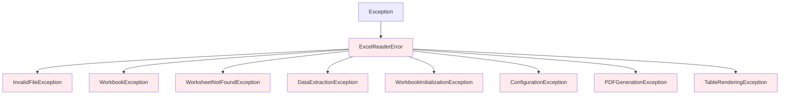

# Exceptions

This page documents the complete exception hierarchy for exc-to-pdf, including error types, causes, and handling strategies.

## 🏗️ Exception Hierarchy



## 📋 Base Exception

### ExcelReaderError

The base exception for all exc-to-pdf errors.

```python
class ExcelReaderError(Exception):
    """Base exception for all Excel reading operations."""

    def __init__(self, message: str, file_path: Optional[str] = None, context: Optional[Dict[str, Any]] = None):
        """
        Initialize ExcelReader error.

        Args:
            message: Human-readable error message
            file_path: Path to the Excel file being processed
            context: Additional context information for debugging
        """
        super().__init__(message)
        self.message = message
        self.file_path = file_path
        self.context = context or {}
```

**Attributes:**
* `message` (str): Human-readable error message
* `file_path` (Optional[str]): Path to the Excel file being processed
* `context` (Dict[str, Any]): Additional debugging context

**Example Usage:**
```python
from exc_to_pdf.exceptions import ExcelReaderError

try:
    # Some operation that might fail
    pass
except ExcelReaderError as e:
    print(f"Error: {e.message}")
    if e.file_path:
        print(f"File: {e.file_path}")
    if e.context:
        print(f"Context: {e.context}")
```

## 📄 File Exceptions

### InvalidFileException

Raised when the file is not a valid Excel file or doesn't exist.

```python
class InvalidFileException(ExcelReaderError):
    """Exception raised when the file is not a valid Excel file or doesn't exist."""
    pass
```

**Common Causes:**
* File doesn't exist
* File is not an Excel file (.xlsx, .xls)
* File is corrupted
* Insufficient permissions to read file

**Example:**
```python
from exc_to_pdf.exceptions import InvalidFileException

try:
    generator.convert_excel_to_pdf("nonexistent.xlsx", "output.pdf")
except InvalidFileException as e:
    print(f"File error: {e.message}")
    print(f"File path: {e.file_path}")
```

### WorkbookInitializationException

Raised when workbook initialization fails.

```python
class WorkbookInitializationException(ExcelReaderError):
    """Exception raised when workbook initialization fails."""
    pass
```

**Common Causes:**
* Password-protected Excel files
* Corrupted workbook structure
* Unsupported Excel version
* Invalid file format

## 📊 Data Exceptions

### DataExtractionException

Raised when data extraction from worksheet fails.

```python
class DataExtractionException(ExcelReaderError):
    """Exception raised when data extraction from worksheet fails."""
    pass
```

**Common Causes:**
* Malformed data structures
* Corrupted worksheet data
 Unsupported cell types
* Memory limitations during extraction

### WorksheetNotFoundException

Raised when a requested worksheet doesn't exist.

```python
class WorksheetNotFoundException(ExcelReaderError):
    """Exception raised when a requested worksheet doesn't exist."""
    pass
```

**Common Causes:**
* Worksheet name doesn't exist
* Worksheet was deleted
* Case sensitivity issues
* Leading/trailing whitespace in name

**Example:**
```python
from exc_to_pdf.exceptions import WorksheetNotFoundException

try:
    generator.convert_excel_to_pdf(
        input_file="data.xlsx",
        output_file="output.pdf",
        worksheet_name="NonExistentSheet"
    )
except WorksheetNotFoundException as e:
    print(f"Worksheet not found: {e.message}")
```

## 🏢 Workbook Exceptions

### WorkbookException

Raised when workbook operations fail.

```python
class WorkbookException(ExcelReaderError):
    """Exception raised when workbook operations fail."""
    pass
```

**Common Causes:**
* Invalid workbook structure
* Corrupted workbook
* Unsupported features
* Resource limitations

## ⚙️ Configuration Exceptions

### ConfigurationException

Raised when configuration is invalid.

```python
class ConfigurationException(ExcelReaderError):
    """Exception raised when configuration is invalid."""
    pass
```

**Common Causes:**
* Invalid configuration values
* Missing required configuration
* Configuration file parse errors
* Incompatible configuration options

**Example:**
```python
from exc_to_pdf.config import PDFConfig
from exc_to_pdf.exceptions import ConfigurationException

try:
    config = PDFConfig()
    config.margin_top = -10  # Invalid negative margin
    generator = PDFGenerator(config)
except ConfigurationException as e:
    print(f"Configuration error: {e.message}")
    if e.context:
        print(f"Invalid setting: {e.context.get('setting', 'unknown')}")
```

## 📄 PDF Generation Exceptions

### PDFGenerationException

Raised when PDF generation operations fail.

```python
class PDFGenerationException(ExcelReaderError):
    """Exception raised when PDF generation operations fail."""
    pass
```

**Common Causes:**
* Insufficient disk space
* Permission denied for output file
* PDF rendering errors
* Font or resource issues

**Example:**
```python
from exc_to_pdf.exceptions import PDFGenerationException

try:
    generator.convert_excel_to_pdf("large_file.xlsx", "/protected/output.pdf")
except PDFGenerationException as e:
    print(f"PDF generation failed: {e.message}")
    if e.file_path:
        print(f"Output file: {e.file_path}")
```

### TableRenderingException

Raised when table rendering for PDF fails.

```python
class TableRenderingException(ExcelReaderError):
    """Exception raised when table rendering for PDF fails."""
    pass
```

**Common Causes:**
* Complex table structures
* Unsupported formatting
* Memory limitations during rendering
* Invalid table data

## 🔧 Error Handling Patterns

### Pattern 1: Specific Exception Handling

```python
from exc_to_pdf import PDFGenerator
from exc_to_pdf.exceptions import (
    InvalidFileException,
    WorksheetNotFoundException,
    PDFGenerationException,
    ConfigurationException
)

def convert_with_specific_handling(input_path, output_path, worksheet_name=None):
    """Convert with specific exception handling"""
    generator = PDFGenerator()

    try:
        generator.convert_excel_to_pdf(
            input_file=input_path,
            output_file=output_path,
            worksheet_name=worksheet_name
        )
        return True, "Conversion successful"

    except InvalidFileException as e:
        return False, f"Invalid file: {e.message}"

    except WorksheetNotFoundException as e:
        return False, f"Worksheet not found: {e.message}"

    except PDFGenerationException as e:
        return False, f"PDF generation failed: {e.message}"

    except ConfigurationException as e:
        return False, f"Configuration error: {e.message}"

    except Exception as e:
        return False, f"Unexpected error: {str(e)}"
```

### Pattern 2: Contextual Error Handling

```python
from exc_to_pdf import PDFGenerator
from exc_to_pdf.exceptions import ExcelReaderError

def convert_with_context(input_path, output_path):
    """Convert with contextual error information"""
    generator = PDFGenerator()

    try:
        generator.convert_excel_to_pdf(input_path, output_path)
        return True, None

    except ExcelReaderError as e:
        # Extract detailed error information
        error_info = {
            'type': e.__class__.__name__,
            'message': e.message,
            'file_path': e.file_path,
            'context': e.context
        }

        # Provide user-friendly messages
        user_messages = {
            'InvalidFileException': "The file is not a valid Excel file or doesn't exist",
            'WorksheetNotFoundException': "The specified worksheet doesn't exist",
            'PDFGenerationException': "Failed to generate PDF output",
            'ConfigurationException': "Invalid configuration settings"
        }

        user_message = user_messages.get(e.__class__.__name__, "An unexpected error occurred")
        return False, {'error': error_info, 'user_message': user_message}
```

### Pattern 3: Retry Logic

```python
import time
from exc_to_pdf import PDFGenerator
from exc_to_pdf.exceptions import PDFGenerationException

def convert_with_retry(input_path, output_path, max_retries=3, delay=1):
    """Convert with retry logic for transient errors"""
    generator = PDFGenerator()

    for attempt in range(max_retries):
        try:
            generator.convert_excel_to_pdf(input_path, output_path)
            return True, f"Conversion successful on attempt {attempt + 1}"

        except PDFGenerationException as e:
            if attempt == max_retries - 1:
                return False, f"Failed after {max_retries} attempts: {e.message}"

            print(f"Attempt {attempt + 1} failed, retrying in {delay} seconds...")
            time.sleep(delay)
            delay *= 2  # Exponential backoff

        except Exception as e:
            # Don't retry on non-transient errors
            return False, f"Non-retryable error: {str(e)}"
```

### Pattern 4: Validation Before Processing

```python
import os
from exc_to_pdf import PDFGenerator
from exc_to_pdf.exceptions import (
    InvalidFileException,
    ConfigurationException
)

def validate_before_conversion(input_path, output_path, config=None):
    """Validate inputs before attempting conversion"""
    errors = []

    # Check input file
    if not os.path.exists(input_path):
        errors.append(f"Input file doesn't exist: {input_path}")
    elif not input_path.lower().endswith(('.xlsx', '.xls')):
        errors.append(f"Invalid file extension: {input_path}")

    # Check output directory
    output_dir = os.path.dirname(output_path)
    if output_dir and not os.path.exists(output_dir):
        try:
            os.makedirs(output_dir, exist_ok=True)
        except Exception as e:
            errors.append(f"Cannot create output directory: {e}")

    # Check output permissions
    if os.path.exists(output_path) and not os.access(output_path, os.W_OK):
        errors.append(f"Cannot write to output file: {output_path}")

    # Validate configuration
    if config:
        try:
            generator = PDFGenerator(config)
        except ConfigurationException as e:
            errors.append(f"Configuration error: {e.message}")

    if errors:
        return False, errors

    return True, None

def safe_convert(input_path, output_path, config=None):
    """Safe conversion with pre-validation"""
    # Validate first
    valid, errors = validate_before_conversion(input_path, output_path, config)
    if not valid:
        return False, errors

    # Perform conversion
    generator = PDFGenerator(config)
    try:
        generator.convert_excel_to_pdf(input_path, output_path)
        return True, "Conversion successful"
    except Exception as e:
        return False, [f"Conversion failed: {str(e)}"]
```

## 📊 Error Statistics and Monitoring

### Error Tracking

```python
from collections import defaultdict
from exc_to_pdf.exceptions import ExcelReaderError

class ErrorTracker:
    """Track and analyze conversion errors"""

    def __init__(self):
        self.error_counts = defaultdict(int)
        self.error_details = []

    def track_error(self, error: ExcelReaderError):
        """Track an error occurrence"""
        error_type = error.__class__.__name__
        self.error_counts[error_type] += 1

        self.error_details.append({
            'type': error_type,
            'message': error.message,
            'file_path': error.file_path,
            'context': error.context,
            'timestamp': time.time()
        })

    def get_summary(self):
        """Get error summary statistics"""
        total_errors = sum(self.error_counts.values())
        return {
            'total_errors': total_errors,
            'error_counts': dict(self.error_counts),
            'most_common': max(self.error_counts.items(), key=lambda x: x[1])[0] if self.error_counts else None
        }

# Usage
tracker = ErrorTracker()

try:
    generator.convert_excel_to_pdf("data.xlsx", "output.pdf")
except ExcelReaderError as e:
    tracker.track_error(e)
    print(f"Error tracked: {e.message}")
```

### Error Reporting

```python
import json
from datetime import datetime
from exc_to_pdf.exceptions import ExcelReaderError

class ErrorReporter:
    """Generate error reports for analysis"""

    def __init__(self, output_file="error_report.json"):
        self.output_file = output_file
        self.errors = []

    def add_error(self, error: ExcelReaderError, context=None):
        """Add error to report"""
        error_data = {
            'timestamp': datetime.now().isoformat(),
            'type': error.__class__.__name__,
            'message': error.message,
            'file_path': error.file_path,
            'context': error.context,
            'additional_context': context or {}
        }
        self.errors.append(error_data)

    def generate_report(self):
        """Generate error report"""
        report = {
            'generated_at': datetime.now().isoformat(),
            'total_errors': len(self.errors),
            'error_types': list(set(error['type'] for error in self.errors)),
            'errors': self.errors
        }

        with open(self.output_file, 'w') as f:
            json.dump(report, f, indent=2)

        return report

# Usage
reporter = ErrorReporter()

try:
    generator.convert_excel_to_pdf("data.xlsx", "output.pdf")
except ExcelReaderError as e:
    reporter.add_error(e, context={'user_id': 123, 'conversion_id': 'abc123'})

# Generate report at end of processing
report = reporter.generate_report()
print(f"Error report generated: {len(report['errors'])} errors")
```

## 🎯 Best Practices

### 1. Specific Exception Handling

Always catch the most specific exception type first:

```python
# Good
try:
    generator.convert_excel_to_pdf(input_path, output_path)
except InvalidFileException as e:
    handle_file_error(e)
except WorksheetNotFoundException as e:
    handle_worksheet_error(e)
except PDFGenerationException as e:
    handle_pdf_error(e)

# Avoid
try:
    generator.convert_excel_to_pdf(input_path, output_path)
except Exception as e:
    handle_all_errors(e)  # Too generic
```

### 2. Context Preservation

Preserve and use exception context for debugging:

```python
try:
    generator.convert_excel_to_pdf(input_path, output_path)
except ExcelReaderError as e:
    log_error(e, context={
        'input_path': input_path,
        'output_path': output_path,
        'user_id': current_user.id,
        'timestamp': datetime.now()
    })
```

### 3. User-Friendly Messages

Provide user-friendly error messages while logging technical details:

```python
except ExcelReaderError as e:
    # Log technical details
    logger.error(f"Conversion failed: {e.message}", extra={
        'file_path': e.file_path,
        'context': e.context
    })

    # Return user-friendly message
    return get_user_friendly_message(e)
```

### 4. Graceful Degradation

Handle errors gracefully when possible:

```python
try:
    generator.convert_excel_to_pdf(input_path, output_path, include_bookmarks=True)
except PDFGenerationException as e:
    if "bookmarks" in e.message.lower():
        # Retry without bookmarks
        logger.warning("Bookmarks failed, retrying without")
        generator.convert_excel_to_pdf(input_path, output_path, include_bookmarks=False)
    else:
        raise
```

---

!!! tip "Error Handling Checklist"
    * [ ] Catch specific exceptions before generic ones
    * [ ] Preserve error context for debugging
    * [ ] Provide user-friendly error messages
    * [ ] Log technical details separately
    * [ ] Implement retry logic for transient errors
    * [ ] Validate inputs before processing
    * [ ] Track and monitor error patterns