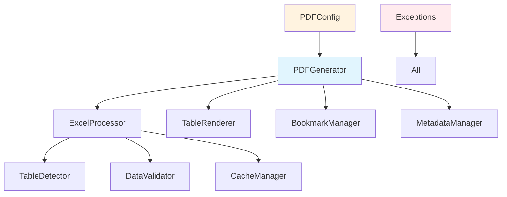

# API Reference

This section provides comprehensive documentation for the exc-to-pdf Python API, including all classes, methods, and usage examples.

## 🏗️ Architecture Overview

The exc-to-pdf API is organized into several key components:



## 📦 Package Structure

```
exc_to_pdf/
├── PDFGenerator          # Main PDF generation engine
├── ExcelProcessor        # Excel file processing
├── PDFConfig            # Configuration management
├── TableDetector        # Table structure detection
├── TableRenderer        # PDF table rendering
├── BookmarkManager      # PDF bookmark generation
├── MetadataManager      # PDF metadata management
├── DataValidator        # Data validation utilities
├── CacheManager         # Performance caching
├── MemoryMonitor        # Memory usage monitoring
├── ProgressTracker      # Conversion progress tracking
└── Exceptions           # Custom exception hierarchy
```

## 🚀 Quick Start

### Basic Usage

```python
from exc_to_pdf import PDFGenerator

# Create generator with default settings
generator = PDFGenerator()

# Convert Excel to PDF
generator.convert_excel_to_pdf(
    input_file="data.xlsx",
    output_file="output.pdf"
)

print("Conversion completed!")
```

### Advanced Usage

```python
from exc_to_pdf import PDFGenerator
from exc_to_pdf.config import PDFConfig

# Custom configuration
config = PDFConfig()
config.table_style = "modern"
config.orientation = "landscape"
config.include_bookmarks = True

# Create generator with custom config
generator = PDFGenerator(config)

# Convert with options
generator.convert_excel_to_pdf(
    input_file="financial-report.xlsx",
    output_file="report.pdf",
    worksheet_name="Q4 Results"
)
```

## 📚 API Documentation

### Core Classes

* **[PDFGenerator](core.md#pdfgenerator)** - Main PDF generation engine
* **[PDFConfig](core.md#pdfconfig)** - Configuration management
* **[ExcelProcessor](processors.md#excelprocessor)** - Excel file processing

### Processors

* **[TableDetector](processors.md#tabledetector)** - Table structure detection
* **[TableRenderer](processors.md#tablerenderer)** - PDF table rendering
* **[BookmarkManager](processors.md#bookmarkmanager)** - PDF bookmark generation
* **[MetadataManager](processors.md#metadatamanager)** - PDF metadata management

### Utilities

* **[DataValidator](utilities.md#datavalidator)** - Data validation
* **[CacheManager](utilities.md#cachemanager)** - Performance caching
* **[MemoryMonitor](utilities.md#memorymonitor)** - Memory monitoring
* **[ProgressTracker](utilities.md#progresstracker)** - Progress tracking

### Exceptions

* **[Exception Hierarchy](exceptions.md)** - Complete exception reference

## 🔧 Installation

```bash
# Install from PyPI
pip install exc-to-pdf

# Import in Python
from exc_to_pdf import PDFGenerator
```

## 📋 Dependencies

The API requires these core dependencies:

* **openpyxl** (≥3.1.0) - Excel file reading
* **pandas** (≥2.0.0) - Data processing
* **reportlab** (≥4.0.0) - PDF generation
* **Pillow** (≥10.0.0) - Image handling

## 🎯 Common Patterns

### Pattern 1: Simple Conversion

```python
from exc_to_pdf import PDFGenerator

def convert_file(input_path, output_path):
    """Convert single Excel file to PDF"""
    generator = PDFGenerator()
    generator.convert_excel_to_pdf(input_path, output_path)
    return True
```

### Pattern 2: Batch Processing

```python
import os
from exc_to_pdf import PDFGenerator

def convert_directory(input_dir, output_dir, template="modern"):
    """Convert all Excel files in directory"""
    generator = PDFGenerator()

    os.makedirs(output_dir, exist_ok=True)

    for filename in os.listdir(input_dir):
        if filename.endswith(('.xlsx', '.xls')):
            input_path = os.path.join(input_dir, filename)
            output_path = os.path.join(output_dir, filename.replace('.xlsx', '.pdf'))

            try:
                generator.convert_excel_to_pdf(
                    input_file=input_path,
                    output_file=output_path,
                    template=template
                )
                print(f"✅ Converted: {filename}")
            except Exception as e:
                print(f"❌ Failed: {filename} - {e}")
```

### Pattern 3: Custom Configuration

```python
from exc_to_pdf import PDFGenerator
from exc_to_pdf.config import PDFConfig

def create_business_report_generator():
    """Create generator optimized for business reports"""
    config = PDFConfig()
    config.table_style = "modern"
    config.orientation = "portrait"
    config.margin_top = 80
    config.margin_bottom = 80
    config.include_bookmarks = True
    config.include_metadata = True

    return PDFGenerator(config)

# Usage
generator = create_business_report_generator()
generator.convert_excel_to_pdf("report.xlsx", "output.pdf")
```

### Pattern 4: Error Handling

```python
from exc_to_pdf import PDFGenerator
from exc_to_pdf.exceptions import (
    InvalidFileException,
    PDFGenerationException,
    WorksheetNotFoundException
)

def safe_convert(input_path, output_path, worksheet_name=None):
    """Convert with comprehensive error handling"""
    generator = PDFGenerator()

    try:
        generator.convert_excel_to_pdf(
            input_file=input_path,
            output_file=output_path,
            worksheet_name=worksheet_name
        )
        return True, "Conversion successful"

    except InvalidFileException as e:
        return False, f"Invalid Excel file: {e}"

    except WorksheetNotFoundException as e:
        return False, f"Worksheet not found: {e}"

    except PDFGenerationException as e:
        return False, f"PDF generation failed: {e}"

    except Exception as e:
        return False, f"Unexpected error: {e}"

# Usage
success, message = safe_convert("data.xlsx", "output.pdf", "Sheet1")
if success:
    print("✅ Conversion successful")
else:
    print(f"❌ Conversion failed: {message}")
```

### Pattern 5: Progress Monitoring

```python
from exc_to_pdf import PDFGenerator
from exc_to_pdf.progress_tracker import ProgressTracker

def convert_with_progress(input_path, output_path):
    """Convert with progress monitoring"""
    generator = PDFGenerator()
    tracker = ProgressTracker()

    # Start tracking
    tracker.start_conversion(input_path)

    try:
        # Convert with progress callback
        def progress_callback(stage, progress, message):
            print(f"[{progress:.1f}%] {message}")

        generator.convert_excel_to_pdf(
            input_file=input_path,
            output_file=output_path,
            progress_callback=progress_callback
        )

        tracker.complete_conversion(output_path)
        print("✅ Conversion completed!")

    except Exception as e:
        tracker.mark_failed(str(e))
        print(f"❌ Conversion failed: {e}")

    return tracker.get_summary()
```

## 📊 Performance Considerations

### Memory Usage

```python
from exc_to_pdf import PDFGenerator
from exc_to_pdf.memory_monitor import MemoryMonitor

def monitor_memory_usage(input_path, output_path):
    """Convert while monitoring memory usage"""
    monitor = MemoryMonitor()
    monitor.start_monitoring()

    try:
        generator = PDFGenerator()
        generator.convert_excel_to_pdf(input_path, output_path)

        # Get memory statistics
        stats = monitor.get_statistics()
        print(f"Peak memory usage: {stats['peak_mb']:.1f} MB")
        print(f"Average memory usage: {stats['average_mb']:.1f} MB")

    finally:
        monitor.stop_monitoring()
```

### Caching for Performance

```python
from exc_to_pdf import PDFGenerator
from exc_to_pdf.cache_manager import CacheManager

def convert_with_cache(input_path, output_path):
    """Convert with caching for repeated operations"""
    cache_manager = CacheManager()
    generator = PDFGenerator()

    # Check cache first
    cache_key = cache_manager.get_cache_key(input_path)
    cached_result = cache_manager.get(cache_key)

    if cached_result:
        print("📋 Using cached result")
        cache_manager.copy_cached_result(cached_result, output_path)
        return

    # Perform conversion
    generator.convert_excel_to_pdf(input_path, output_path)

    # Cache the result
    cache_manager.set(cache_key, output_path)
    print("💾 Result cached for future use")
```

## 🔍 Testing

### Unit Testing

```python
import unittest
from exc_to_pdf import PDFGenerator
from exc_to_pdf.config import PDFConfig
import tempfile
import os

class TestPDFGenerator(unittest.TestCase):
    def setUp(self):
        self.generator = PDFGenerator()
        self.temp_dir = tempfile.mkdtemp()

    def tearDown(self):
        # Clean up temporary files
        import shutil
        shutil.rmtree(self.temp_dir)

    def test_basic_conversion(self):
        """Test basic Excel to PDF conversion"""
        # Create test Excel file
        input_file = os.path.join(self.temp_dir, "test.xlsx")
        output_file = os.path.join(self.temp_dir, "test.pdf")

        # Create simple Excel file (implementation depends on your test setup)
        # create_test_excel_file(input_file)

        # Test conversion
        self.generator.convert_excel_to_pdf(input_file, output_file)

        # Verify output
        self.assertTrue(os.path.exists(output_file))
        self.assertGreater(os.path.getsize(output_file), 0)

    def test_custom_configuration(self):
        """Test conversion with custom configuration"""
        config = PDFConfig()
        config.table_style = "modern"
        config.orientation = "landscape"

        generator = PDFGenerator(config)

        # Test with custom config
        # ... test implementation

    def test_error_handling(self):
        """Test error handling for invalid inputs"""
        with self.assertRaises(Exception):
            self.generator.convert_excel_to_pdf(
                "non_existent.xlsx",
                "output.pdf"
            )

if __name__ == "__main__":
    unittest.main()
```

### Integration Testing

```python
def integration_test():
    """Integration test for complete workflow"""
    import os
    from exc_to_pdf import PDFGenerator

    # Test files
    test_files = [
        ("simple.xlsx", "simple.pdf"),
        ("complex.xlsx", "complex.pdf"),
        ("multi_sheet.xlsx", "multi_sheet.pdf")
    ]

    generator = PDFGenerator()

    for input_file, output_file in test_files:
        if os.path.exists(input_file):
            print(f"Testing: {input_file}")

            try:
                generator.convert_excel_to_pdf(input_file, output_file)

                # Verify output
                assert os.path.exists(output_file)
                assert os.path.getsize(output_file) > 0

                print(f"✅ Passed: {input_file}")

            except Exception as e:
                print(f"❌ Failed: {input_file} - {e}")
```

## 🔗 Advanced Integration

### Flask Web Service

```python
from flask import Flask, request, jsonify, send_file
from exc_to_pdf import PDFGenerator
import tempfile
import os

app = Flask(__name__)

@app.route('/convert', methods=['POST'])
def convert_excel_to_pdf():
    """Web service endpoint for Excel to PDF conversion"""

    if 'file' not in request.files:
        return jsonify({'error': 'No file uploaded'}), 400

    file = request.files['file']
    if file.filename == '':
        return jsonify({'error': 'No file selected'}), 400

    if not file.filename.endswith(('.xlsx', '.xls')):
        return jsonify({'error': 'Invalid file format'}), 400

    try:
        # Create temporary files
        with tempfile.NamedTemporaryFile(delete=False, suffix='.xlsx') as temp_input:
            file.save(temp_input.name)
            input_path = temp_input.name

        with tempfile.NamedTemporaryFile(delete=False, suffix='.pdf') as temp_output:
            output_path = temp_output.name

        # Convert file
        generator = PDFGenerator()
        generator.convert_excel_to_pdf(input_path, output_path)

        # Return PDF file
        return send_file(
            output_path,
            as_attachment=True,
            download_name=f'{file.filename.rsplit(".", 1)[0]}.pdf',
            mimetype='application/pdf'
        )

    except Exception as e:
        return jsonify({'error': str(e)}), 500

    finally:
        # Clean up temporary files
        try:
            os.unlink(input_path)
            os.unlink(output_path)
        except:
            pass

if __name__ == '__main__':
    app.run(debug=True)
```

### Django Integration

```python
from django.http import HttpResponse, JsonResponse
from django.views.decorators.csrf import csrf_exempt
from django.core.files.storage import default_storage
from exc_to_pdf import PDFGenerator
import tempfile
import os

@csrf_exempt
def convert_excel(request):
    """Django view for Excel to PDF conversion"""

    if request.method != 'POST':
        return JsonResponse({'error': 'POST method required'}, status=405)

    if 'file' not in request.FILES:
        return JsonResponse({'error': 'No file uploaded'}, status=400)

    file = request.FILES['file']

    try:
        # Save uploaded file
        input_path = default_storage.save(f'temp/{file.name}', file)
        full_input_path = default_storage.path(input_path)

        # Create output path
        output_filename = f'{file.name.rsplit(".", 1)[0]}.pdf'
        output_path = f'temp/{output_filename}'
        full_output_path = default_storage.path(output_path)

        # Convert file
        generator = PDFGenerator()
        generator.convert_excel_to_pdf(full_input_path, full_output_path)

        # Return PDF file
        with open(full_output_path, 'rb') as f:
            response = HttpResponse(f.read(), content_type='application/pdf')
            response['Content-Disposition'] = f'attachment; filename="{output_filename}"'
            return response

    except Exception as e:
        return JsonResponse({'error': str(e)}, status=500)

    finally:
        # Clean up temporary files
        try:
            default_storage.delete(input_path)
            default_storage.delete(output_path)
        except:
            pass
```

---

!!! info "Need More Examples?"
    * Check the [Quick Start Guide](../quick-start/examples.md) for more practical examples
    * Review the [User Guide](../user-guide/index.md) for detailed usage patterns
    * [Open an issue](https://github.com/exc-to-pdf/exc-to-pdf/issues) for specific questions