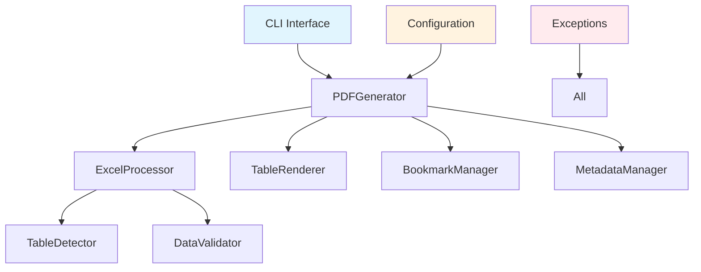

# Developer Guide

Welcome to the developer guide for exc-to-pdf! This section provides comprehensive information for developers who want to contribute to the project, extend its functionality, or integrate it into their own applications.

## 🚀 Getting Started

### Development Environment Setup

1. **Clone the Repository**
    ```bash
    git clone https://github.com/exc-to-pdf/exc-to-pdf.git
    cd exc-to-pdf
    ```

2. **Set Up Virtual Environment**
    ```bash
    python -m venv .venv
    source .venv/bin/activate  # On Windows: .venv\Scripts\activate
    ```

3. **Install Development Dependencies**
    ```bash
    pip install -e ".[dev]"
    ```

4. **Verify Installation**
    ```bash
    # Run tests
    pytest

    # Check code style
    black --check src tests

    # Type checking
    mypy src
    ```

### Project Structure

```
exc-to-pdf/
├── src/                    # Source code
│   ├── exc_to_pdf/        # Main package
│   │   ├── __init__.py
│   │   ├── main.py        # CLI entry point
│   │   ├── pdf_generator.py
│   │   ├── excel_processor.py
│   │   ├── config/
│   │   ├── exceptions.py
│   │   └── utils/
│   └── tests/              # Test suite
├── docs/                   # Documentation
├── scripts/               # Development scripts
├── .github/               # GitHub workflows
└── pyproject.toml         # Project configuration
```

## 🏗️ Architecture Overview

### Core Components



### Design Principles

1. **Modular Architecture** - Each component has a single responsibility
2. **Type Safety** - Full type hints throughout the codebase
3. **Error Handling** - Comprehensive exception hierarchy
4. **Testability** - 95%+ test coverage requirement
5. **Performance** - Memory-efficient processing with caching
6. **Extensibility** - Plugin-ready architecture for future enhancements

## 🔧 Development Workflow

### 1. Development Setup

```bash
# Install pre-commit hooks
pre-commit install

# Start development server (for documentation)
mkdocs serve

# Run tests in watch mode
pytest --watch
```

### 2. Making Changes

1. **Create Feature Branch**
    ```bash
    git checkout -b feature/your-feature-name
    ```

2. **Write Code**
    - Follow the existing code style
    - Add comprehensive tests
    - Update documentation

3. **Run Tests**
    ```bash
    pytest
    ```

4. **Code Quality Checks**
    ```bash
    # Format code
    black src tests

    # Check style
    flake8 src tests

    # Type checking
    mypy src

    # Security check
    bandit -r src
    ```

### 3. Testing

#### Running Tests

```bash
# Run all tests
pytest

# Run specific test file
pytest tests/unit/test_pdf_generator.py

# Run with coverage
pytest --cov=src --cov-report=html

# Run integration tests
pytest tests/integration/
```

#### Writing Tests

```python
import pytest
from exc_to_pdf import PDFGenerator
from exc_to_pdf.exceptions import InvalidFileException

class TestPDFGenerator:
    def setup_method(self):
        """Set up test fixtures"""
        self.generator = PDFGenerator()
        self.test_input = "tests/fixtures/test_data.xlsx"
        self.test_output = "/tmp/test_output.pdf"

    def test_basic_conversion(self):
        """Test basic Excel to PDF conversion"""
        # Arrange
        # Test file should exist in fixtures

        # Act
        self.generator.convert_excel_to_pdf(
            input_file=self.test_input,
            output_file=self.test_output
        )

        # Assert
        assert os.path.exists(self.test_output)
        assert os.path.getsize(self.test_output) > 0

    def test_invalid_file_raises_exception(self):
        """Test that invalid files raise appropriate exceptions"""
        with pytest.raises(InvalidFileException):
            self.generator.convert_excel_to_pdf(
                input_file="nonexistent.xlsx",
                output_file=self.test_output
            )

    def test_custom_configuration(self):
        """Test conversion with custom configuration"""
        from exc_to_pdf.config import PDFConfig

        config = PDFConfig()
        config.table_style = "modern"
        config.orientation = "landscape"

        generator = PDFGenerator(config)
        # Test with custom configuration
```

### 4. Documentation

#### Code Documentation

```python
def convert_excel_to_pdf(
    self,
    input_file: str,
    output_file: str,
    worksheet_name: Optional[str] = None,
    progress_callback: Optional[Callable[[str, float, str], None]] = None
) -> None:
    """
    Convert Excel file to PDF format.

    Args:
        input_file: Path to the Excel file to convert
        output_file: Path for the output PDF file
        worksheet_name: Specific worksheet name to convert (default: all worksheets)
        progress_callback: Optional callback for progress updates

    Raises:
        InvalidFileException: If input file is not a valid Excel file
        WorksheetNotFoundException: If specified worksheet doesn't exist
        PDFGenerationException: If PDF generation fails

    Example:
        >>> generator = PDFGenerator()
        >>> generator.convert_excel_to_pdf("data.xlsx", "output.pdf")
    """
```

#### Documentation Updates

- Update API documentation when adding new methods
- Add examples to the user guide
- Update the changelog for new features
- Review and update the README if needed

## 📋 Code Standards

### 1. Code Style

We use several tools to maintain code quality:

```bash
# Black - Code formatting
black src tests

# isort - Import sorting
isort src tests

# flake8 - Linting
flake8 src tests

# mypy - Type checking
mypy src

# bandit - Security checking
bandit -r src
```

### 2. Type Hints

All public APIs must have complete type hints:

```python
from typing import Optional, Dict, List, Callable, Any

def process_data(
    data: Dict[str, Any],
    options: Optional[Dict[str, str]] = None,
    callback: Optional[Callable[[float], None]] = None
) -> List[str]:
    """Process data with type hints."""
    pass
```

### 3. Docstrings

Use Google-style docstrings:

```python
def calculate_metrics(
    data: List[Dict[str, float]],
    metric_type: str = "average"
) -> Dict[str, float]:
    """Calculate metrics from data.

    Args:
        data: List of data dictionaries with numeric values
        metric_type: Type of metric to calculate ("average", "sum", "max")

    Returns:
        Dictionary containing calculated metrics

    Raises:
        ValueError: If metric_type is not supported
        TypeError: If data contains non-numeric values

    Example:
        >>> data = [{"value": 1.0}, {"value": 2.0}, {"value": 3.0}]
        >>> result = calculate_metrics(data, "average")
        >>> print(result)
        {"average": 2.0}
    """
```

### 4. Error Handling

Use specific exceptions and provide context:

```python
from exc_to_pdf.exceptions import DataExtractionException

def extract_table_data(worksheet, table_range: str) -> List[List[Any]]:
    """Extract table data from worksheet."""
    try:
        # Extract data logic
        pass
    except IndexError as e:
        raise DataExtractionException(
            f"Invalid table range: {table_range}",
            file_path=worksheet.parent.path,
            context={"table_range": table_range, "original_error": str(e)}
        )
```

## 🔄 Contribution Guidelines

### 1. Pull Request Process

1. **Fork the Repository**
2. **Create Feature Branch**
3. **Make Changes**
4. **Add Tests**
5. **Update Documentation**
6. **Submit Pull Request**

### 2. Pull Request Template

```markdown
## Description
Brief description of changes made.

## Type of Change
- [ ] Bug fix
- [ ] New feature
- [ ] Breaking change
- [ ] Documentation update

## Testing
- [ ] Added unit tests
- [ ] Added integration tests
- [ ] All tests pass
- [ ] Manual testing completed

## Checklist
- [ ] Code follows project style guidelines
- [ ] Self-review completed
- [ ] Documentation updated
- [ ] CHANGELOG.md updated
```

### 3. Code Review Guidelines

#### Reviewer Checklist

- [ ] Code follows style guidelines
- [ ] Tests are comprehensive and pass
- [ ] Documentation is updated
- [ ] Error handling is appropriate
- [ ] Performance implications considered
- [ ] Security implications reviewed
- [ ] Backward compatibility maintained

#### Author Responsibilities

- [ ] Address all reviewer feedback
- [ ] Update tests based on feedback
- [ ] Update documentation
- [ ] Ensure CI/CD passes
- [ ] Respond to all comments

## 🧪 Testing Strategy

### Test Categories

1. **Unit Tests** - Test individual components in isolation
2. **Integration Tests** - Test component interactions
3. **End-to-End Tests** - Test complete workflows
4. **Performance Tests** - Test performance characteristics

### Test Structure

```
tests/
├── unit/                   # Unit tests
│   ├── test_pdf_generator.py
│   ├── test_excel_processor.py
│   └── test_config.py
├── integration/            # Integration tests
│   ├── test_workflows.py
│   └── test_api.py
├── fixtures/              # Test data
│   ├── sample_data.xlsx
│   └── complex_workbook.xlsx
└── conftest.py            # Test configuration
```

### Test Fixtures

```python
# conftest.py
import pytest
import tempfile
import os
from pathlib import Path

@pytest.fixture
def temp_output_file():
    """Create temporary output file for testing."""
    with tempfile.NamedTemporaryFile(suffix='.pdf', delete=False) as f:
        yield f.name
    os.unlink(f.name)

@pytest.fixture
def sample_excel_file():
    """Provide sample Excel file for testing."""
    return Path(__file__).parent / "fixtures" / "sample_data.xlsx"

@pytest.fixture
def pdf_generator():
    """Provide PDFGenerator instance for testing."""
    from exc_to_pdf import PDFGenerator
    return PDFGenerator()
```

## 📊 Performance Guidelines

### 1. Memory Management

- Use generators for large data processing
- Implement streaming for large files
- Monitor memory usage in tests
- Clean up resources properly

### 2. Caching Strategy

```python
from functools import lru_cache
from exc_to_pdf.cache_manager import CacheManager

class PDFGenerator:
    def __init__(self):
        self.cache = CacheManager()

    @lru_cache(maxsize=128)
    def _get_table_style(self, style_name: str) -> Dict[str, Any]:
        """Cache table style configurations."""
        return self._load_table_style(style_name)
```

### 3. Performance Testing

```python
import time
import psutil
import pytest

def test_performance_large_file():
    """Test performance with large files."""
    generator = PDFGenerator()

    # Monitor memory usage
    process = psutil.Process()
    initial_memory = process.memory_info().rss / 1024 / 1024  # MB

    start_time = time.time()
    generator.convert_excel_to_pdf("large_file.xlsx", "output.pdf")
    end_time = time.time()

    peak_memory = process.memory_info().rss / 1024 / 1024  # MB

    # Performance assertions
    assert end_time - start_time < 60  # Should complete within 60 seconds
    assert peak_memory - initial_memory < 500  # Should use less than 500MB additional memory
```

## 🔒 Security Guidelines

### 1. Input Validation

```python
def validate_file_path(file_path: str) -> bool:
    """Validate file path to prevent directory traversal."""
    try:
        # Resolve to absolute path
        abs_path = Path(file_path).resolve()

        # Check if path is within allowed directory
        allowed_dir = Path("/allowed/directory").resolve()
        return str(abs_path).startswith(str(allowed_dir))
    except Exception:
        return False
```

### 2. Security Testing

```python
def test_directory_traversal_protection():
    """Test protection against directory traversal attacks."""
    generator = PDFGenerator()

    malicious_paths = [
        "../../../etc/passwd",
        "..\\..\\..\\windows\\system32\\config\\sam",
        "/etc/shadow",
        "C:\\Windows\\System32\\config\\SAM"
    ]

    for malicious_path in malicious_paths:
        with pytest.raises(InvalidFileException):
            generator.convert_excel_to_pdf(malicious_path, "output.pdf")
```

## 📚 Documentation Development

### 1. API Documentation

API documentation is generated from docstrings using mkdocstrings:

```python
class PDFGenerator:
    """Main PDF generation engine.

    This class provides the primary interface for converting Excel files
    to PDF format with AI optimization features.

    Attributes:
        config: PDF configuration object
        table_renderer: Table rendering component
        bookmark_manager: Bookmark management component
    """
```

### 2. User Documentation

User documentation is written in Markdown and processed by MkDocs:

```markdown
# Quick Start Guide

## Installation

```bash
pip install exc-to-pdf
```

## Basic Usage

```python
from exc_to_pdf import PDFGenerator

generator = PDFGenerator()
generator.convert_excel_to_pdf("input.xlsx", "output.pdf")
```
```

## 🚀 Release Process

### 1. Version Management

We use semantic versioning (SemVer):
- **MAJOR**: Breaking changes
- **MINOR**: New features (backward compatible)
- **PATCH**: Bug fixes (backward compatible)

### 2. Release Checklist

- [ ] All tests pass
- [ ] Documentation updated
- [ ] CHANGELOG.md updated
- [ ] Version number updated
- [ ] Tag created
- [ ] PyPI package built and uploaded
- [ ] GitHub release created

### 3. Automated Releases

GitHub Actions handle automatic releases:

```yaml
# .github/workflows/release.yml
name: Release

on:
  push:
    tags:
      - 'v*'

jobs:
  release:
    runs-on: ubuntu-latest
    steps:
      - uses: actions/checkout@v2
      - name: Set up Python
        uses: actions/setup-python@v2
        with:
          python-version: 3.9
      - name: Build package
        run: |
          python -m pip install build
          python -m build
      - name: Publish to PyPI
        uses: pypa/gh-action-pypi-publish@release/v1
        with:
          password: ${{ secrets.PYPI_API_TOKEN }}
```

## 🔗 External Resources

### Development Tools

- **Black**: Code formatting
- **isort**: Import sorting
- **flake8**: Linting
- **mypy**: Type checking
- **pytest**: Testing framework
- **mkdocs**: Documentation
- **pre-commit**: Git hooks

### Useful Links

- [Python Packaging Guide](https://packaging.python.org/)
- [pytest Documentation](https://docs.pytest.org/)
- [MkDocs Documentation](https://www.mkdocs.org/)
- [GitHub Actions Documentation](https://docs.github.com/en/actions)

---

!!! info "Getting Help"
    * Check [existing issues](https://github.com/exc-to-pdf/exc-to-pdf/issues) for similar problems
    * Join our [discussions](https://github.com/exc-to-pdf/exc-to-pdf/discussions) for questions
    * Review our [code of conduct](https://github.com/exc-to-pdf/exc-to-pdf/blob/main/CODE_OF_CONDUCT.md) for community guidelines