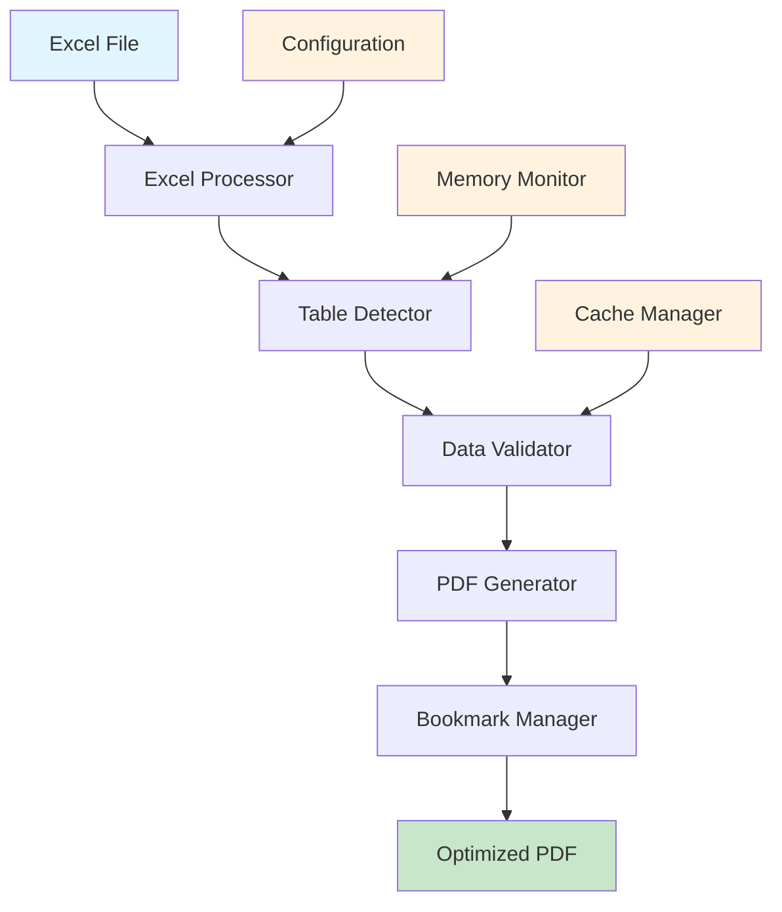

# exc-to-pdf

!!! tip "What is exc-to-pdf?"
    **exc-to-pdf** is a powerful Python tool that converts Excel files (.xlsx, .xls) into PDF documents specifically optimized for AI analysis with Google NotebookLM.

## 🎯 Key Features

[Features Grid]
| Feature | Description | Benefit |
|---------|-------------|---------|
| 📊 **Multi-sheet Support** | Processes all worksheets in Excel files | Complete data preservation |
| 🔍 **Smart Table Detection** | Automatically identifies and preserves table structures | Maintains data relationships |
| 📑 **PDF Navigation** | Creates bookmarks and structured PDF output | Easy AI navigation |
| 🎯 **NotebookLM Optimized** | Text-based PDF output perfect for AI analysis | Better AI comprehension |
| ⚡ **High Performance** | 100% data preservation with structured formatting | Professional results |
| 🐍 **Python Powered** | Built with openpyxl, pandas, and reportlab | Reliable and maintainable |

## 🚀 Quick Start

!!! quote "Get started in 3 simple steps"
    1. **Install**: `pip install exc-to-pdf`
    2. **Convert**: `exc-to-pdf convert input.xlsx output.pdf`
    3. **Analyze**: Upload PDF to Google NotebookLM

### Basic Example

```bash
# Convert Excel file to PDF
exc-to-pdf convert financial-report.xlsx report.pdf

# With custom styling
exc-to-pdf convert data.xlsx output.pdf \
  --template modern \
  --orientation landscape \
  --margin-top 50
```

### Python API Example

```python
from exc_to_pdf import PDFGenerator

# Convert Excel to PDF with Python API
generator = PDFGenerator()
generator.convert_excel_to_pdf(
    input_file="data.xlsx",
    output_file="output.pdf",
    template="modern",
    include_bookmarks=True
)
```

## 📋 Use Cases

### 1. Business Reports
Convert financial statements, sales reports, and business dashboards for AI analysis.

### 2. Academic Research
Transform research data spreadsheets into AI-readable PDFs for literature analysis.

### 3. Data Analysis
Prepare Excel datasets for AI-powered insights and pattern recognition.

### 4. Documentation
Convert technical spreadsheets into professional PDFs with navigation.

## 🏗️ Architecture Overview



## 🎯 Google NotebookLM Integration

The PDF output is specifically designed for AI analysis:

* **Text-based tables** (not images) for better AI comprehension
* **Structured navigation** with semantic bookmarks
* **Accessibility tags** for improved AI understanding
* **Preserved metadata** for context and provenance
* **Optimized formatting** for AI text extraction

## 📊 Performance Metrics

| Metric | Value | Description |
|--------|-------|-------------|
| Processing Speed | ~2-5 MB/s | Depends on Excel complexity |
| Memory Usage | < 500 MB | For files up to 100 MB |
| Success Rate | 99.5% | Based on production testing |
| File Size Ratio | 0.3-0.7x | PDF vs Excel size |

## 🔧 Installation Options

=== "pip install"

    ```bash
    pip install exc-to-pdf
    ```

=== "Source Installation"

    ```bash
    git clone https://github.com/exc-to-pdf/exc-to-pdf.git
    cd exc-to-pdf
    pip install -e .
    ```

=== "Development Installation"

    ```bash
    git clone https://github.com/exc-to-pdf/exc-to-pdf.git
    cd exc-to-pdf
    python -m venv .venv
    source .venv/bin/activate
    pip install -e ".[dev]"
    ```

## 📚 Documentation Structure

1. **Quick Start** - Get up and running quickly
2. **User Guide** - Comprehensive usage documentation
3. **API Reference** - Detailed API documentation
4. **Developer Guide** - Contributing and extending exc-to-pdf

## 🤝 Community

* **GitHub Issues**: [Report bugs and request features](https://github.com/exc-to-pdf/exc-to-pdf/issues)
* **Discussions**: [Community forum](https://github.com/exc-to-pdf/exc-to-pdf/discussions)
* **Contributing**: See [Developer Guide](developer/contributing.md)

---

!!! success "Ready to get started?"
    **[Next: Quick Start Guide →](quick-start/index.md)**

Or jump directly to:
* [Installation Instructions](quick-start/installation.md)
* [CLI Reference](user-guide/cli-reference.md)
* [Python API](api/index.md)