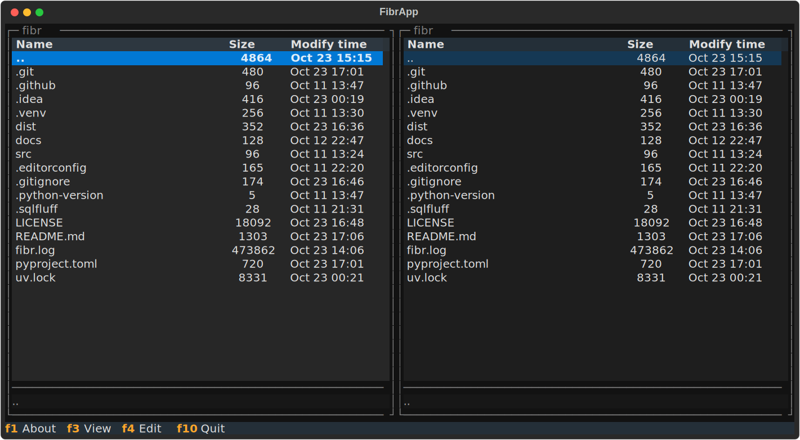

# fibr [faɪbə] - File Browser



A simple file browser with a [Midnight Commander](https://midnight-commander.org)-style interface featuring:

- traditional dual-pane layout
- find-as-you-type per default
- basic file operations vai UI: copy, move, mkdir _(Not implemented yet!)_
- view/edit file delegated to external tools

And that's about it!

It's a very short and select feature set, so this might not be the tool your're looking for. If you're looking for a comprehensive TUI file manager, take a look at the original or other popular choices like [lf](https://github.com/gokcehan/lf), [superfile](https://github.com/yorukot/superfile) or [yazi](https://github.com/sxyazi/yazi).

fibr was created to scratch an itch of mine and is not looking to become a contender in the space of TUI file managers.

The project status is currently "alpha", i.e. it is neither feature-complete nor extensively tested.

Written in Python using the excellent [Textual](https://textual.textualize.io) framework.

## Installation

`fibr` is on [PyPi](https://pypi.org/project/fibr/), you can use the tool of your choice (e.g. `pip`, `uv`, etc.) to install. Or simply give it a try without installing:

```bash
uvx fibr
```

## Usage

TBD

## License

[GPL-2.0-or-later](LICENSE)
