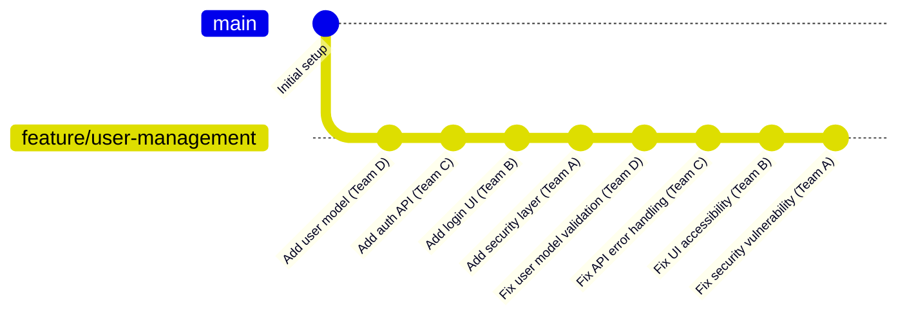

# Complex Workflows

This guide covers challenging scenarios that require advanced git-autosquash techniques and careful planning.

## Complex Scenario 1: Multi-Team Feature Integration

**Situation**: Large feature spanning multiple teams, with cross-cutting concerns and shared components.

### Team Structure
- **Team A**: Authentication & Security
- **Team B**: UI & Frontend  
- **Team C**: Backend API
- **Team D**: Database & Infrastructure

### Development Timeline



### Cross-Team Changes

After integration testing, multiple teams need to make fixes:

```bash
$ git status --porcelain
M  src/database/user_model.py      # Team D: Validation improvements
M  src/api/auth_endpoints.py       # Team C: Error handling fixes
M  src/ui/login_components.py      # Team B: Accessibility improvements  
M  src/security/auth_middleware.py # Team A: Security enhancements
M  src/shared/validation.py        # Multiple teams: Shared utility fixes
M  tests/integration/test_auth.py  # All teams: Integration test updates
```

### Coordinated git-autosquash

```bash
# Each team's changes go back to their original implementations
$ git-autosquash --line-by-line

# Results:
# - Database fixes → Original user model commit
# - API fixes → Original auth API commit
# - UI fixes → Original login UI commit  
# - Security fixes → Original security layer commit
# - Shared utility fixes → Most frequent contributor's commit
# - Integration tests → Distributed based on test content
```

### Benefits
- Each team's commit remains complete and self-contained
- Cross-cutting fixes distributed appropriately
- Integration branch maintains clear team boundaries
- Easier to track team contributions and review changes

## Complex Scenario 2: Performance Optimization Campaign

**Situation**: Systematic performance improvements across entire codebase affecting many historical commits.

### Performance Audit Results

```bash
# Profiling identified bottlenecks across multiple modules
src/database/query_engine.py     # N+1 query issues
src/cache/redis_client.py        # Connection pooling problems
src/api/serialization.py         # Inefficient JSON encoding
src/ui/data_tables.py            # Slow rendering algorithms
src/utils/image_processing.py    # Memory leaks in processing
src/background/task_queue.py     # Poor queue management
```

### Optimization Implementation

Each file requires multiple types of improvements:

```python
# Example: src/database/query_engine.py
# 1. Add query caching (lines 45-60)
# 2. Fix N+1 queries (lines 120-135) 
# 3. Add connection pooling (lines 200-215)
# 4. Optimize batch operations (lines 300-320)
```

### Advanced git-autosquash Strategy

```bash
# Use line-by-line for maximum precision
$ git-autosquash --line-by-line

# Each optimization technique goes to different historical commits:
# - Query caching → Original query implementation commit
# - N+1 fix → Commit that introduced the problematic pattern
# - Connection pooling → Original database connection commit
# - Batch optimization → Commit that added batch operations
```

### Result Analysis

```bash
$ git log --oneline -20
# Each historical commit now includes its performance improvements
a1b2c3d Add batch operations (now with optimizations)
4e5f6g7 Add database connection layer (now with pooling)
8h9i0j1 Implement query engine (now with caching and N+1 fixes)  
2k3l4m5 Add JSON serialization (now with efficient encoding)
...
```

### Verification

```bash
# Performance improvements distributed correctly
$ git show 8h9i0j1 --stat
src/database/query_engine.py | 45 ++++++++++++++++++++++++++++++++++++++++
# Shows original implementation plus all related optimizations

# Each commit is now performance-complete
$ git log --grep="performance" --oneline
# No separate performance commits - all integrated
```

## Complex Scenario 3: Security Hardening Across History

**Situation**: Security audit reveals vulnerabilities in multiple components introduced at different times.

### Security Audit Findings

1. **SQL Injection**: User input validation (3 different commits)
2. **XSS Vulnerabilities**: Template rendering (2 commits)  
3. **Authentication Bypass**: Session handling (4 commits)
4. **Information Disclosure**: Error messages (5 commits)
5. **CSRF Attacks**: Form handling (2 commits)

### Comprehensive Security Fixes

```bash
$ git status --porcelain
M  src/auth/session_manager.py     # Fix session vulnerabilities
M  src/auth/login_handler.py       # Fix auth bypass issues
M  src/ui/templates/base.html      # XSS prevention  
M  src/ui/forms/user_forms.py      # CSRF protection
M  src/database/user_queries.py    # SQL injection prevention
M  src/api/error_handlers.py       # Information disclosure fixes
M  src/utils/input_validator.py    # Input sanitization
M  src/middleware/security.py      # Additional security headers
M  tests/security/test_auth.py     # Security test coverage
```

### Security-Focused git-autosquash

```bash
# Line-by-line precision for security fixes
$ git-autosquash --line-by-line

# Security fixes distributed to vulnerable commits:
# - Session fixes → Original session implementation
# - Auth bypass → Authentication implementation commits
# - XSS prevention → Template system commits
# - SQL injection → Database query commits  
# - Error handling → Original error system commits
```

### Security Verification

```bash
# Each historical commit now secure
$ git log --oneline | while read commit message; do
    echo "Checking security of: $message"
    git show $commit:src/ | grep -E "(sql|exec|eval|innerHTML)" || echo "✓ Clean"
done

# Security improvements integrated throughout history
$ git log --grep="security" --oneline  
# Should show minimal separate security commits
```

## Complex Scenario 4: Large-Scale Refactoring

**Situation**: Architectural refactoring affecting directory structure, module organization, and design patterns.

### Refactoring Goals

1. **Extract service layer** from monolithic controllers
2. **Implement dependency injection** throughout application
3. **Add consistent error handling** across all modules
4. **Standardize logging patterns** in all components
5. **Refactor data access** to repository pattern

### Refactoring Implementation

```bash
# Before: Monolithic structure
src/
├── controllers/
│   ├── user_controller.py      # Mixed business logic + data access
│   ├── auth_controller.py      # No error handling consistency
│   └── api_controller.py       # Direct database calls
├── models/
└── utils/

# After: Clean architecture  
src/
├── controllers/     # Thin controllers
├── services/        # Business logic layer (NEW)
├── repositories/    # Data access layer (NEW)  
├── models/          # Domain models
└── utils/           # Cross-cutting concerns
```

### Complex Change Distribution

```python
# Example: user_controller.py transformation
# Original commit abc1234: "Add user management controller"

# Changes during refactoring:
# 1. Extract UserService → NEW service layer (stays as new)
# 2. Add dependency injection → Goes back to abc1234
# 3. Improve error handling → Goes back to abc1234  
# 4. Add consistent logging → Goes back to abc1234
# 5. Use repository pattern → Goes back to abc1234
```

### Advanced git-autosquash Execution

```bash
# Refactoring produces many files
$ git diff --name-only | wc -l
47

# Use line-by-line for architectural precision
$ git-autosquash --line-by-line

# Results:
# - Service extractions → Stay as new architecture commits
# - Controller improvements → Back to original controller commits
# - Repository pattern → Back to original data access commits  
# - Error handling → Back to original feature implementations
# - Logging improvements → Back to original implementations
```

### Post-Refactoring Verification

```bash
# Architecture commits remain clean
$ git log --oneline --grep="Add.*Service"
def5678 Add UserService and business logic layer
789abcd Add AuthService and security layer  
abc1234 Add EmailService and notification layer

# Historical commits enhanced with patterns
$ git show abc1234:src/controllers/user_controller.py | head -20
# Shows original controller now with DI, error handling, logging

# No refactoring noise in history
$ git log --oneline | grep -i refactor | wc -l
0  # All refactoring integrated into logical commits
```

## Complex Scenario 5: Multi-Platform Feature Consistency

**Situation**: Feature implemented separately for web, mobile, and API needs consistency fixes across all platforms.

### Platform-Specific Implementations

```bash
# Feature: User notifications
src/web/notifications/          # Web implementation (commit abc1234)
src/mobile/notifications/       # Mobile implementation (commit def5678)  
src/api/notifications/          # API implementation (commit ghi9012)
src/shared/notification_types/  # Shared types (commit jkl3456)
```

### Consistency Issues Discovered

1. **Different validation logic** across platforms
2. **Inconsistent error messages** between web and mobile
3. **Missing API endpoints** for some notification types
4. **Shared types incomplete** for all use cases

### Cross-Platform Fixes

```bash
$ git status --porcelain
M  src/web/notifications/validator.py      # Standardize validation
M  src/mobile/notifications/validator.py   # Match web validation
M  src/api/notifications/endpoints.py      # Add missing endpoints
M  src/api/notifications/validator.py      # Match other platforms  
M  src/shared/notification_types/base.py   # Extend shared types
M  src/shared/notification_types/email.py  # Add missing email types
M  tests/notifications/test_validation.py  # Cross-platform tests
```

### Platform-Aware git-autosquash

```bash
$ git-autosquash --line-by-line

# Platform-specific fixes go to platform commits:
# - Web validation → abc1234 (original web implementation)
# - Mobile validation → def5678 (original mobile implementation)  
# - API endpoints → ghi9012 (original API implementation)
# - Shared types → jkl3456 (original shared types)
# - Cross-platform tests → Distributed by test content
```

### Consistency Verification

```bash
# Each platform commit now complete and consistent
$ git show abc1234 --name-only | grep validation
src/web/notifications/validator.py       # Now standardized

$ git show def5678 --name-only | grep validation  
src/mobile/notifications/validator.py    # Now matches web

$ git show ghi9012 --name-only | grep endpoints
src/api/notifications/endpoints.py       # Now complete

# Cross-platform consistency achieved without noise
$ git log --oneline | grep -i "consistency\|standardize" | wc -l
0  # All integrated into platform-specific commits
```

## Complex Scenario 6: Legacy System Migration

**Situation**: Gradual migration from legacy system requires fixes to both old and new implementations.

### Migration Architecture

```bash
# Parallel implementations during transition
src/
├── legacy/
│   ├── user_auth.py        # Old authentication (commit abc1234)
│   ├── data_access.py      # Old database layer (commit def5678)
│   └── session_mgmt.py     # Old session handling (commit ghi9012)
├── modern/
│   ├── auth_service.py     # New authentication (commit jkl3456) 
│   ├── repository.py       # New data layer (commit mno7890)
│   └── session_store.py    # New session handling (commit pqr1234)
└── bridge/
    ├── auth_adapter.py     # Legacy bridge (commit stu5678)
    └── data_adapter.py     # Data bridge (commit vwx9012)
```

### Migration Issues

During parallel operation, bugs found in both systems:

```bash
$ git status --porcelain  
M  src/legacy/user_auth.py      # Security fix for legacy system
M  src/modern/auth_service.py   # Corresponding fix in modern system
M  src/bridge/auth_adapter.py   # Bridge compatibility fix
M  src/legacy/data_access.py    # Performance fix in legacy
M  src/modern/repository.py     # Equivalent modern improvement  
M  src/bridge/data_adapter.py   # Bridge performance optimization
M  tests/legacy/test_auth.py    # Legacy system tests
M  tests/modern/test_auth.py    # Modern system tests
M  tests/bridge/test_adapter.py # Bridge integration tests
```

### Migration-Aware git-autosquash

```bash
$ git-autosquash --line-by-line

# Fixes distributed to appropriate system commits:
# - Legacy auth fix → abc1234 (legacy auth implementation)
# - Modern auth fix → jkl3456 (modern auth implementation)  
# - Bridge fixes → stu5678 (auth bridge implementation)
# - Legacy data fix → def5678 (legacy data implementation)
# - Modern data fix → mno7890 (modern data implementation)
# - Data bridge fix → vwx9012 (data bridge implementation)
```

### Migration History Integrity

```bash
# Both systems maintain clean, parallel histories
$ git log --oneline src/legacy/
abc1234 Add legacy authentication system (with security fixes)
def5678 Add legacy data access layer (with performance improvements)
ghi9012 Add legacy session management

$ git log --oneline src/modern/  
jkl3456 Add modern authentication service (with security fixes)
mno7890 Add modern repository pattern (with performance improvements)
pqr1234 Add modern session store

$ git log --oneline src/bridge/
stu5678 Add authentication bridge (with compatibility fixes)
vwx9012 Add data access bridge (with performance optimizations)

# No migration noise - each system's history remains clean
```

## Best Practices for Complex Scenarios

### Pre-Analysis Planning

1. **Map change intentions** to historical commits
2. **Identify cross-cutting concerns** that should stay together
3. **Plan line-by-line vs standard mode** usage
4. **Coordinate with team** for shared branches

### Execution Strategy

1. **Start with line-by-line mode** for complex scenarios
2. **Review mappings carefully** - complexity increases false positives
3. **Test thoroughly** after each git-autosquash operation
4. **Use incremental approach** - process subsets if needed

### Verification Checklist

- [ ] Each historical commit tells complete story
- [ ] No functionality broken by distribution  
- [ ] Cross-cutting concerns properly handled
- [ ] Team boundaries respected in shared development
- [ ] Security/performance improvements integrated appropriately
- [ ] Test coverage distributed correctly
- [ ] Documentation updated with code changes

### Recovery Planning

For complex scenarios, always have recovery plan:

```bash
# Before starting complex git-autosquash
git branch backup-before-autosquash

# If results unsatisfactory
git reset --hard backup-before-autosquash

# Try different approach
git-autosquash --line-by-line  # Or other options
```

Complex scenarios benefit most from git-autosquash's intelligence, but require careful planning and verification to ensure optimal results.