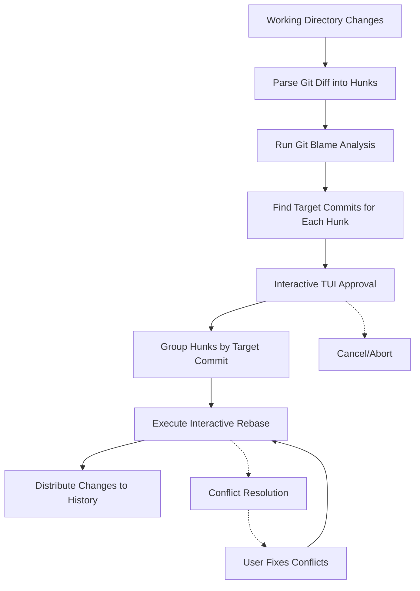

# git-autosquash

[](https://github.com/andrewleech/git-autosquash/actions/workflows/ci.yml)
[](https://badge.fury.io/py/git-autosquash)
[](https://www.python.org/downloads/)

**Automatically squash changes back into historical commits where they belong.**

git-autosquash eliminates "cleanup" commits by analyzing git blame to determine which historical commits should receive your current changes. Instead of accumulating "fix lint", "address PR feedback", or "update tests" commits, it distributes improvements back to their logical origin points.


Common scenario: You're working on a feature branch and need to address code review feedback, fix lint errors, or update tests across multiple files. Instead of creating cleanup commits, git-autosquash pushes each fix back to the commit that originally introduced the code.

## Key Features

- **Smart Targeting**: Uses git blame to find commits where code was last modified
- **Interactive TUI**: Terminal interface with diff viewer and approval controls
- **Safety First**: All changes require explicit user approval
- **Conflict Resolution**: Clear guidance when merge conflicts occur during rebase
- **Progress Tracking**: Real-time feedback with detailed commit summaries
- **Automatic Rollback**: Repository restored to original state on errors

## Quick Start

### Installation

=== "uv (Recommended)"
    ```bash
    uv tool install git-autosquash
    ```

=== "pipx"
    ```bash
    pipx install git-autosquash
    ```

=== "pip"
    ```bash
    pip install git-autosquash
    ```

### Basic Usage

1. Make changes to your codebase
2. Run analysis:
   ```bash
   git-autosquash
   ```
3. Review proposed hunk → commit mappings in TUI
4. Approve changes to squash back into target commits
5. git-autosquash performs the interactive rebase

## How It Works



## Use Cases

- Code review feedback distribution
- Lint and formatting fix integration
- Test update consolidation
- Documentation synchronization
- Security patch application
- Refactoring optimization placement

## Safety Features

- Default rejection: All changes start unapproved, require explicit user consent
- Conflict detection: Clear guidance when rebase conflicts occur
- Automatic rollback: Repository restored to original state on errors or interruption
- Branch validation: Only works on feature branches with clear merge-base
- Stash management: Safely handles mixed staged/unstaged states

## Next Steps

- [Installation Guide](installation.md) - Detailed setup instructions
- [Getting Started](user-guide/getting-started.md) - Your first git-autosquash workflow
- [Basic Workflow](user-guide/basic-workflow.md) - Common usage patterns
- [CLI Reference](reference/cli-options.md) - All command-line options
- [Examples](examples/basic-scenarios.md) - Real-world scenarios and solutions

## Contributing

- [Development Guide](technical/development.md) - Set up development environment
- [Architecture Overview](technical/architecture.md) - Understand the codebase
- [Testing Guide](technical/testing.md) - Run and write tests