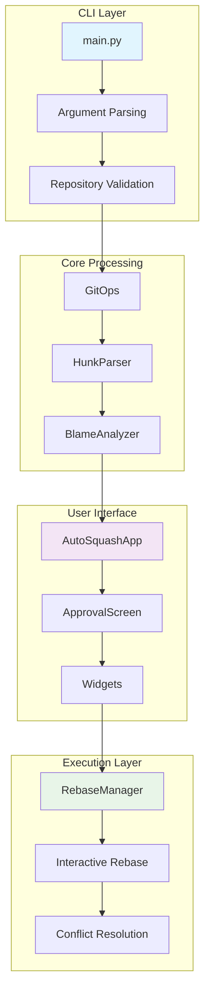
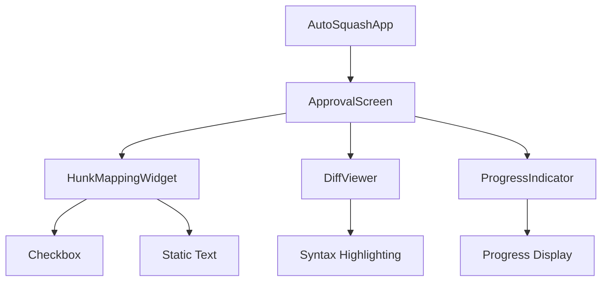
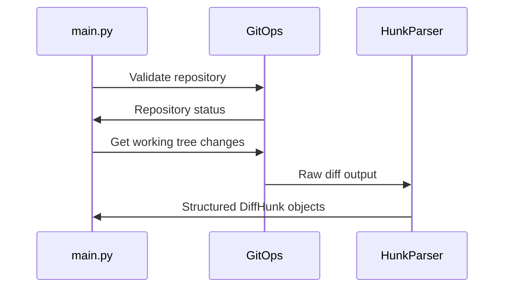
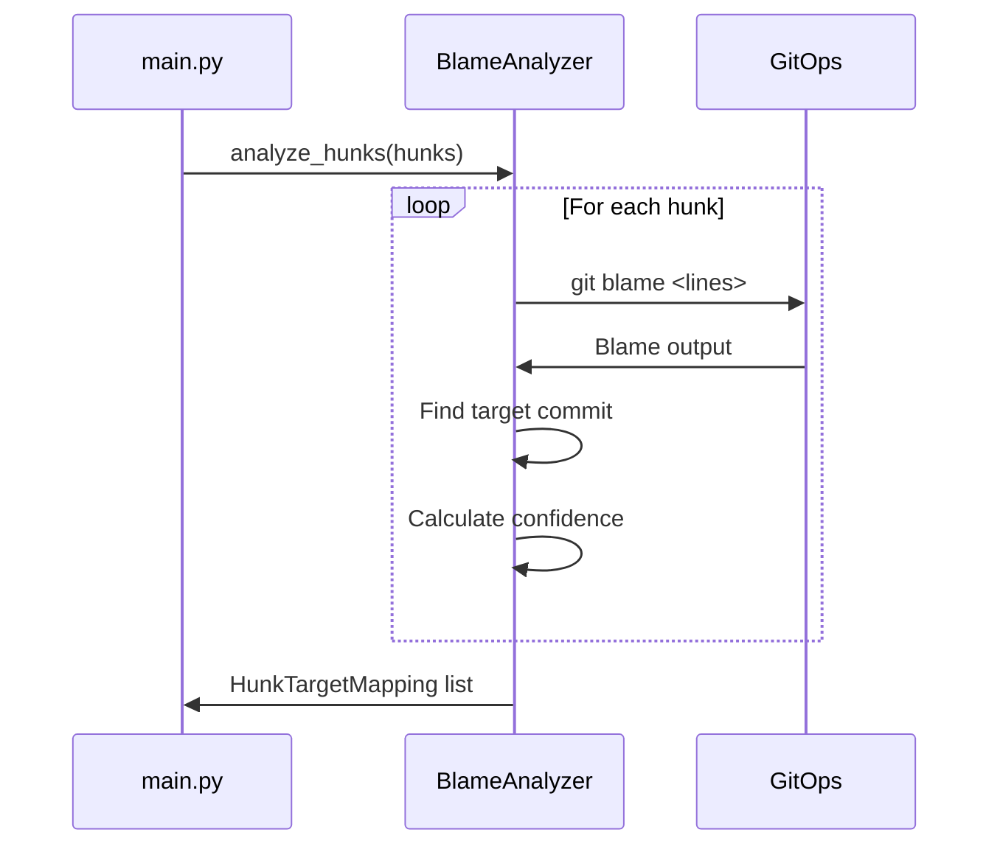
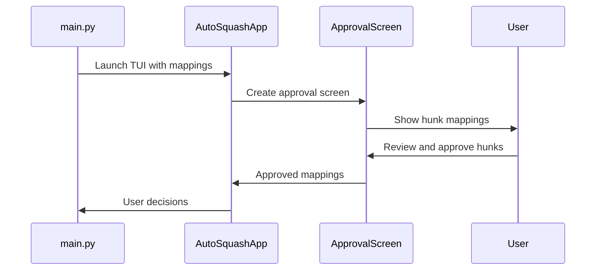
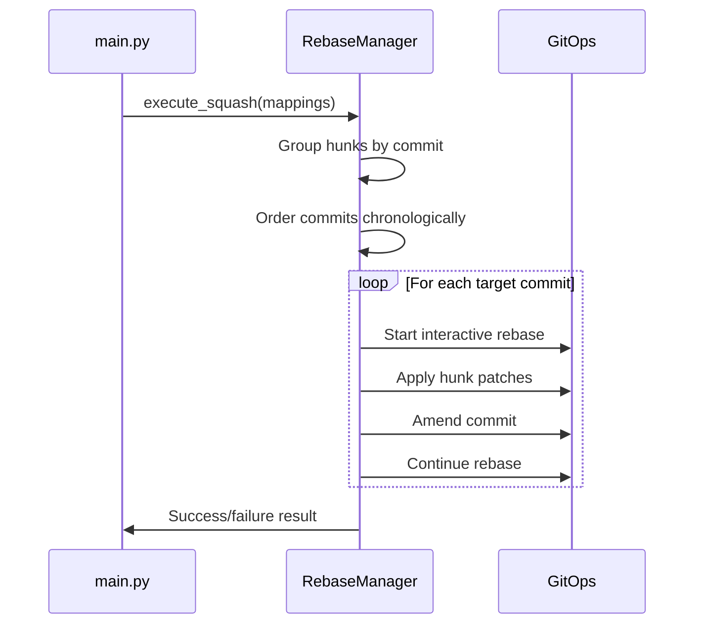

# Architecture Overview

git-autosquash is designed as a modular system with clear separation of concerns. This document provides a comprehensive overview of the system architecture, component interactions, and design decisions.

## System Overview



## Core Components

### 1. GitOps (`git_ops.py`)

**Purpose**: Central interface for all Git operations with proper error handling and subprocess management.

**Key Responsibilities**:
- Repository validation and branch detection
- Working tree status analysis  
- Git command execution with timeout and error handling
- Merge base calculation and commit validation

**Design Patterns**:
- **Facade Pattern**: Simplifies complex Git interactions
- **Error Handling**: Comprehensive subprocess error management
- **Caching**: Intelligent caching of expensive Git operations

```python
class GitOps:
    def __init__(self, repo_path: str = ".") -> None
    def is_git_repo(self) -> bool
    def get_current_branch(self) -> str | None
    def get_merge_base_with_main(self, current_branch: str) -> str | None
    def get_working_tree_status(self) -> dict[str, bool]
    def run_git_command(self, args: list[str], env: dict[str, str] | None = None) -> subprocess.CompletedProcess[str]
```

### 2. HunkParser (`hunk_parser.py`)

**Purpose**: Parses Git diff output into structured hunk objects for analysis and processing.

**Key Responsibilities**:
- Parse `git diff` output into structured `DiffHunk` objects
- Support both default and line-by-line hunk splitting modes
- Extract file context and line range information
- Handle various diff formats and edge cases

**Design Decisions**:
- **Immutable Data Structures**: `DiffHunk` objects are immutable for safety
- **Flexible Parsing**: Supports multiple diff modes and contexts
- **Line Preservation**: Maintains exact line content including whitespace

```python
@dataclass(frozen=True)
class DiffHunk:
    file_path: str
    old_start: int
    old_count: int  
    new_start: int
    new_count: int
    lines: list[str]
    context_before: list[str]
    context_after: list[str]
```

### 3. BlameAnalyzer (`blame_analyzer.py`)

**Purpose**: Analyzes Git blame information to determine target commits for each hunk with confidence scoring.

**Key Responsibilities**:
- Run git blame analysis on hunk line ranges
- Determine most frequent commit for each hunk (frequency-first algorithm)
- Filter commits to branch scope (merge-base to HEAD)
- Calculate confidence levels based on blame consistency
- Cache commit metadata for performance

**Algorithm Design**:
- **Frequency-First Scoring**: Prioritizes commits that modified the most lines
- **Recency Tiebreaking**: Uses commit timestamps to break frequency ties
- **Branch Scoping**: Only considers commits on current branch since merge-base

```python
class BlameAnalyzer:
    def analyze_hunks(self, hunks: List[DiffHunk]) -> List[HunkTargetMapping]
    def _analyze_single_hunk(self, hunk: DiffHunk) -> HunkTargetMapping
    def _get_branch_commits(self) -> Set[str]  # Cached
    def _get_commit_timestamp(self, commit_hash: str) -> int  # Cached
```

### 4. TUI System (`tui/`)

**Purpose**: Rich terminal interface using Textual framework for user interaction and approval workflow.

**Component Structure**:



**Key Design Principles**:
- **Reactive UI**: Real-time updates based on user interactions
- **Safety Defaults**: All hunks start unapproved requiring explicit consent
- **Keyboard Navigation**: Full keyboard control for efficient workflows
- **Graceful Fallback**: Text-based fallback when TUI unavailable

### 5. RebaseManager (`rebase_manager.py`)

**Purpose**: Orchestrates interactive rebase operations to apply approved hunks to historical commits.

**Key Responsibilities**:
- Group hunks by target commit for batch processing
- Execute interactive rebase with chronological ordering
- Handle stash/unstash operations for working tree management
- Detect and report conflicts with resolution guidance
- Provide automatic rollback on errors or interruption

**Execution Flow**:
1. **Preparation**: Stash uncommitted changes, validate branch state
2. **Grouping**: Organize hunks by target commit hash
3. **Ordering**: Sort commits chronologically (oldest first) for history integrity
4. **Processing**: For each commit:
   - Start interactive rebase to edit the commit
   - Apply hunk patches using `git apply`
   - Amend the commit with new changes
   - Continue rebase to next commit
5. **Cleanup**: Restore stash, handle any remaining cleanup

**Error Handling Strategy**:
- **Conflict Detection**: Identify merge conflicts and pause with guidance
- **Automatic Rollback**: Restore repository state on errors or cancellation
- **Resource Cleanup**: Ensure temporary files and stashes are properly cleaned up

## Data Flow

### 1. Input Processing



### 2. Analysis Phase



### 3. User Approval



### 4. Execution Phase  



## Design Patterns and Principles

### 1. Separation of Concerns

Each component has a single, well-defined responsibility:
- **GitOps**: Git command interface
- **HunkParser**: Diff parsing and structure  
- **BlameAnalyzer**: Blame analysis and targeting
- **TUI Components**: User interface and interaction
- **RebaseManager**: Rebase orchestration and execution

### 2. Error Handling Strategy

**Defensive Programming**:
- Validate all inputs at component boundaries
- Handle subprocess failures gracefully
- Provide meaningful error messages to users
- Implement automatic rollback mechanisms

**Error Categories**:
- **User Errors**: Invalid repository state, detached HEAD
- **Git Errors**: Command failures, conflicts, repository issues  
- **System Errors**: File I/O, permissions, resource constraints
- **Interruption**: User cancellation, keyboard interrupt

### 3. Performance Optimizations

**Caching Strategy**:
- **Commit metadata**: Timestamps and summaries cached to avoid repeated Git calls
- **Branch commits**: Expensive commit list operations cached per session
- **Blame results**: Reuse blame data across multiple hunk analyses

**Resource Management**:
- **Subprocess timeouts**: Prevent hanging on Git operations
- **Temporary file cleanup**: Automatic cleanup of patches and todo files
- **Memory efficiency**: Stream processing of large diffs when possible

### 4. Testing Architecture

**Test Categories**:
- **Unit Tests**: Individual component functionality with mocking
- **Integration Tests**: Component interaction with real Git repositories  
- **TUI Tests**: User interface behavior without DOM dependencies
- **End-to-End Tests**: Complete workflow simulation

**Test Infrastructure**:
- **Mocking Strategy**: Mock Git operations for reliable, fast tests
- **Test Data**: Structured test repositories and diff scenarios
- **Edge Case Coverage**: Boundary conditions and error scenarios

## Configuration and Extensibility

### Future Extension Points

1. **Configuration System**: 
   - User preferences for approval defaults
   - Custom confidence thresholds
   - Blame analysis parameters

2. **Plugin Architecture**:
   - Custom hunk filtering rules
   - Alternative conflict resolution strategies  
   - Integration with external tools

3. **Output Formats**:
   - JSON output for tooling integration
   - Structured logging for automation
   - Custom report generation

## Security Considerations

### Git Command Safety

- **Command Injection Prevention**: All Git arguments properly escaped
- **Repository Validation**: Verify repository integrity before operations
- **Branch Protection**: Only operate on feature branches with clear merge-base

### Data Integrity

- **Atomic Operations**: Rebase operations are atomic where possible
- **Backup Strategy**: Automatic stashing preserves user work  
- **Rollback Capability**: Complete restoration on failure or cancellation

### User Safety

- **Default Deny**: All operations require explicit user approval
- **Clear Feedback**: Detailed progress and error reporting
- **Escape Mechanisms**: Multiple ways to safely abort operations

This architecture provides a robust, maintainable foundation for git-autosquash while supporting future enhancements and ensuring user safety throughout the workflow.