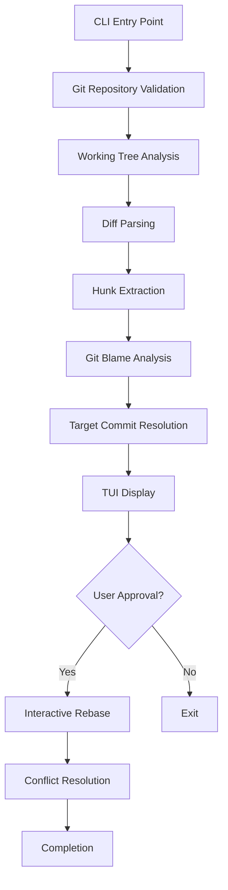

# Development Guide

This guide covers the technical aspects of developing and contributing to git-autosquash.

## Project Architecture

### Core Components

```
src/git_autosquash/
├── __init__.py              # Package initialization
├── main.py                  # CLI entry point and argument parsing  
├── git_ops.py              # Git operations facade
├── hunk_parser.py          # Diff parsing and hunk extraction
├── blame_analyzer.py       # Git blame analysis and target resolution
├── rebase_manager.py       # Interactive rebase execution
└── tui/                    # Terminal User Interface
    ├── __init__.py
    ├── app.py              # Main Textual application
    ├── screens.py          # Approval screen implementation  
    └── widgets.py          # Custom TUI widgets
```

### Data Flow Architecture



### Module Responsibilities

#### `git_ops.py` - Git Operations Facade
- Repository validation and status checking
- Git command execution with error handling
- Branch analysis and merge-base calculation
- Working tree state management

#### `hunk_parser.py` - Diff Analysis  
- Parse `git diff` output into structured hunks
- Handle both standard and line-by-line splitting modes
- Preserve file paths, line numbers, and change content
- Support various diff formats and edge cases

#### `blame_analyzer.py` - Target Resolution
- Execute `git blame` on hunk line ranges
- Analyze blame results to find target commits
- Apply frequency-based selection with recency tiebreaker
- Filter results by branch scope (merge-base to HEAD)

#### `rebase_manager.py` - Rebase Orchestration
- Group approved hunks by target commit
- Generate interactive rebase todo lists
- Execute rebase operations with conflict handling
- Manage stash/unstash for staged-only workflows

#### `tui/` - Terminal User Interface
- Rich terminal interface using Textual framework
- Interactive approval/rejection of hunk mappings
- Diff display with syntax highlighting
- Progress indicators and status updates

## Development Environment Setup

### Prerequisites

```bash
# Required tools
git --version     # 2.25+
python --version  # 3.9+
uv --version      # Latest

# Optional but recommended
pre-commit --version
ruff --version
mypy --version
```

### Initial Setup

```bash
# Clone repository
git clone https://github.com/andrewleech/git-autosquash.git
cd git-autosquash

# Install in development mode with dependencies
uv pip install -e ".[dev]"

# Install pre-commit hooks (REQUIRED)
uv run pre-commit install

# Verify installation
git-autosquash --version
uv run pytest --version
```

### Development Dependencies

Key development dependencies managed in `pyproject.toml`:

```toml
[project.optional-dependencies]
dev = [
    "pytest>=7.0",
    "pytest-cov>=4.0", 
    "pytest-mock>=3.10",
    "mypy>=1.0",
    "ruff>=0.1.0",
    "pre-commit>=3.0",
    "textual-dev>=1.2.0",
]
```

## Code Quality Standards

### Pre-commit Hooks

All commits **must** pass pre-commit hooks. Never use `git commit --no-verify`.

```yaml
# .pre-commit-config.yaml
repos:
  - repo: https://github.com/astral-sh/ruff-pre-commit
    rev: v0.1.6
    hooks:
      - id: ruff
        args: [--fix, --exit-non-zero-on-fix]
      - id: ruff-format

  - repo: https://github.com/pre-commit/mirrors-mypy
    rev: v1.7.1
    hooks:
      - id: mypy
        additional_dependencies: [textual]
```

### Code Style

**Formatting**: Managed by `ruff format`
- Line length: 88 characters
- String quotes: Double quotes preferred
- Import sorting: Automatic via ruff

**Linting**: Managed by `ruff check`
- Based on flake8, pycodestyle, pyflakes
- Additional rules: unused imports, complexity limits
- Automatic fixes applied where possible

**Type Checking**: Managed by `mypy`
- Strict mode enabled
- All public functions must have type annotations
- Generic types properly specified

### Example Code Standards

```python
from __future__ import annotations

from typing import List, Optional, Tuple
import subprocess
from pathlib import Path

class GitOps:
    """Git operations facade with comprehensive error handling."""
    
    def __init__(self, repo_path: Path) -> None:
        """Initialize git operations for repository.
        
        Args:
            repo_path: Path to git repository root
            
        Raises:
            ValueError: If path is not a git repository
        """
        self._repo_path = repo_path
        self._validate_repository()
    
    def get_diff_hunks(
        self, 
        staged_only: bool = False,
        line_by_line: bool = False
    ) -> List[DiffHunk]:
        """Extract diff hunks from working tree or staging area.
        
        Args:
            staged_only: Only include staged changes
            line_by_line: Split hunks into individual lines
            
        Returns:
            List of structured diff hunks
            
        Raises:
            GitError: If git command fails
        """
        # Implementation with proper error handling
        pass
```

## Testing Strategy

### Test Structure

```
tests/
├── conftest.py              # Pytest configuration and fixtures
├── test_git_ops.py          # Git operations tests
├── test_hunk_parser.py      # Diff parsing tests
├── test_blame_analyzer.py   # Blame analysis tests
├── test_rebase_manager.py   # Rebase execution tests
├── tui/
│   ├── test_app.py          # TUI application tests
│   ├── test_screens.py      # Screen interaction tests
│   └── test_widgets.py      # Widget behavior tests
└── integration/
    ├── test_full_workflow.py # End-to-end workflow tests
    └── test_complex_scenarios.py # Complex scenario tests
```

### Test Categories

#### Unit Tests
Focus on individual components in isolation:

```python
def test_hunk_parser_basic_diff(mock_git_diff):
    """Test parsing basic git diff output."""
    parser = HunkParser()
    hunks = parser.parse_diff(mock_git_diff)
    
    assert len(hunks) == 2
    assert hunks[0].file_path == "src/example.py"
    assert hunks[0].line_range == (10, 15)
```

#### Integration Tests
Test component interactions with git repositories:

```python
def test_full_workflow_with_real_repo(tmp_git_repo):
    """Test complete workflow on temporary git repository."""
    # Setup repository with commits and changes
    create_test_commits(tmp_git_repo)
    make_test_changes(tmp_git_repo)
    
    # Run git-autosquash workflow
    result = run_autosquash(tmp_git_repo, approve_all=True)
    
    # Verify results
    assert result.success
    assert len(result.conflicts) == 0
    verify_commit_organization(tmp_git_repo)
```

#### TUI Tests
Test terminal interface components:

```python
async def test_approval_screen_navigation():
    """Test keyboard navigation in approval screen."""
    app = AutoSquashApp()
    screen = ApprovalScreen(test_mappings)
    
    # Simulate user interactions
    await screen.press("j", "j", "space", "enter")
    
    # Verify state changes
    assert len(screen.approved_mappings) == 1
```

### Test Fixtures

Common fixtures in `conftest.py`:

```python
@pytest.fixture
def tmp_git_repo(tmp_path):
    """Create temporary git repository for testing."""
    repo_path = tmp_path / "test_repo"
    repo_path.mkdir()
    
    # Initialize git repository
    subprocess.run(["git", "init"], cwd=repo_path, check=True)
    subprocess.run(["git", "config", "user.email", "test@example.com"], 
                   cwd=repo_path, check=True)
    subprocess.run(["git", "config", "user.name", "Test User"], 
                   cwd=repo_path, check=True)
    
    return repo_path

@pytest.fixture  
def mock_git_ops():
    """Mock git operations for isolated testing."""
    with patch('git_autosquash.git_ops.GitOps') as mock:
        # Configure mock behavior
        mock.return_value.get_current_branch.return_value = "feature/test"
        mock.return_value.is_clean_working_tree.return_value = False
        yield mock
```

### Running Tests

```bash
# Run all tests
uv run pytest

# Run with coverage
uv run pytest --cov=src/git_autosquash --cov-report=html

# Run specific test categories
uv run pytest tests/unit/
uv run pytest tests/integration/
uv run pytest tests/tui/

# Run tests with verbose output
uv run pytest -v

# Run specific test file
uv run pytest tests/test_hunk_parser.py

# Run tests matching pattern
uv run pytest -k "test_blame_analysis"
```

## Contributing Guidelines

### Workflow

1. **Fork and Clone**: Fork the repository and clone your fork
2. **Branch**: Create feature branch from `main`
3. **Develop**: Implement changes with tests
4. **Quality**: Ensure pre-commit hooks pass
5. **Test**: Run full test suite
6. **Document**: Update documentation if needed
7. **PR**: Submit pull request with clear description

### Commit Standards

Follow conventional commit format:

```
type(scope): description

body (optional)

footer (optional)
```

**Types**:
- `feat`: New feature
- `fix`: Bug fix
- `docs`: Documentation changes
- `test`: Test additions or modifications
- `refactor`: Code refactoring
- `perf`: Performance improvements
- `ci`: CI/CD changes

**Examples**:
```
feat(hunk-parser): add line-by-line splitting mode

Implement optional line-by-line hunk splitting for more granular 
blame analysis. Useful for complex refactoring scenarios.

Closes #123
```

```
fix(blame-analyzer): correct confidence scoring algorithm

Changed from recency-first to frequency-first selection with 
recency as tiebreaker. Fixes issue where newest commits were 
always preferred over more logical targets.

Fixes #456
```

### Pull Request Template

```markdown
## Description
Brief description of changes and motivation.

## Type of Change
- [ ] Bug fix (non-breaking change which fixes an issue)
- [ ] New feature (non-breaking change which adds functionality)  
- [ ] Breaking change (fix or feature that would cause existing functionality to not work as expected)
- [ ] Documentation update

## Testing
- [ ] Added tests for new functionality
- [ ] All tests pass locally
- [ ] Pre-commit hooks pass

## Checklist  
- [ ] Code follows project style guidelines
- [ ] Self-review of code completed
- [ ] Documentation updated if needed
- [ ] No breaking changes without version bump
```

## Performance Considerations

### Optimization Strategies

#### Git Command Efficiency
- Minimize git subprocess calls
- Use appropriate git options (`--no-pager`, `--porcelain`)
- Cache results within single operation
- Batch similar operations when possible

#### Memory Management
- Use generators for large diff processing
- Stream blame results rather than loading all at once
- Release objects promptly in TUI updates
- Monitor memory usage in tests

#### TUI Responsiveness
- Use async operations for git commands
- Update UI progressively during analysis
- Implement cancellation for long operations
- Cache rendered content where appropriate

### Performance Testing

```python
def test_performance_large_repository(large_repo_fixture):
    """Test performance with large repository."""
    import time
    
    start_time = time.time()
    result = run_autosquash_analysis(large_repo_fixture)
    duration = time.time() - start_time
    
    # Performance assertions
    assert duration < 30.0  # Should complete within 30 seconds
    assert len(result.hunks) > 100  # Verify substantial work done
    assert result.memory_peak < 100 * 1024 * 1024  # Under 100MB
```

## Debugging and Troubleshooting

### Debug Mode

Enable detailed logging:

```bash
# Enable git tracing
GIT_TRACE=1 git-autosquash

# Python debugging
python -X dev -c "import git_autosquash.main; git_autosquash.main.main()"

# Textual debugging
textual console
# In another terminal:
git-autosquash
```

### Common Development Issues

#### Pre-commit Hook Failures
```bash
# Fix formatting issues
uv run ruff format .

# Fix linting issues  
uv run ruff check . --fix

# Check types
uv run mypy src/
```

#### Test Failures
```bash
# Run specific failing test with verbose output
uv run pytest tests/test_specific.py::test_function -v -s

# Debug test with pdb
uv run pytest tests/test_specific.py::test_function --pdb
```

#### TUI Development
```bash
# Use textual development tools
uv run textual run --dev src/git_autosquash/tui/app.py

# Console debugging
uv run textual console
```

### Logging Configuration

```python
import logging

# Enable debug logging during development
logging.basicConfig(
    level=logging.DEBUG,
    format='%(asctime)s - %(name)s - %(levelname)s - %(message)s'
)

logger = logging.getLogger(__name__)
logger.debug("Debug information here")
```

## Documentation Screenshot System

git-autosquash includes a comprehensive screenshot capture system for documentation and marketing materials. The system generates authentic terminal screenshots by running the real git-autosquash application on realistic test repositories using pyte terminal emulation.

### Screenshot Categories

The system generates authentic screenshots organized into categories:

- **Hero Screenshot**: Main visual showing the actual git-autosquash TUI
- **Workflow Steps (6)**: Complete user journey from git status to completion using real git commands
- **Feature Demonstrations (3)**: Smart targeting, interactive TUI, safety features captured from actual application
- **Comparison Views (3)**: Before/after git history visualization using real git repositories
- **Fallback Scenarios (2)**: New files, manual override captured from realistic scenarios

### Generating Screenshots

```bash
# Generate all documentation screenshots using real application
python3 capture_readme_screenshots.py

# Screenshots saved to screenshots/readme/ as PNG files
```

### Screenshot Implementation

**Official Method**: Use Textual's native screenshot capabilities via `scripts/generate_screenshots.py`.

This is the recommended approach, replacing legacy pexpect/pyte methods. See [CLAUDE.md](../../CLAUDE.md#screenshot-generation) for complete documentation.

```bash
# Generate all screenshots
python scripts/generate_screenshots.py

# Generate only hero screenshot
python scripts/generate_screenshots.py --hero-only

# Custom output directory
python scripts/generate_screenshots.py --output-dir screenshots/new
```

The system creates realistic git repositories with:
- Meaningful Python project structure (auth, dashboard, tests, utils)
- 7 commits with realistic history
- Working directory changes that demonstrate git-autosquash functionality
- Files with and without git history for fallback scenarios

### Screenshot Specifications

- **Terminal Size**: 120 columns × 40 rows (customizable)
- **Capture Method**: Textual's `app.run_test()` with Pilot framework
- **Source Format**: SVG (scalable, character-perfect)
- **Distribution Format**: PNG (converted from SVG for git-lfs compatibility)
- **Conversion**: ImageMagick/Inkscape at 200-300 DPI

### Updating Screenshots

When TUI interface or workflow changes, regenerate screenshots:

1. **Modify interaction sequences** in `scripts/generate_screenshots.py`
2. **Update test repository structure** in `scripts/screenshot_test_repo.py` if needed
3. **Generate screenshots**: `python scripts/generate_screenshots.py --output-dir /tmp/new`
4. **Convert SVG to PNG**:
   ```bash
   cd /tmp/new
   for svg in *.svg; do
       convert -density 200 "$svg" "${svg%.svg}.png"
   done
   ```
5. **Copy to screenshots/readme**: `cp /tmp/new/*.png screenshots/readme/`
6. **Verify all expected screenshots** were generated correctly

### Screenshot Naming Convention

Screenshots follow consistent naming patterns:

- `hero_screenshot.png` - Main application screenshot
- `workflow_step_XX.png` - Numbered workflow steps (01-06)  
- `feature_*.png` - Feature demonstration screenshots
- `comparison_*.png` - Before/after comparison views
- `fallback_*.png` - Edge case and fallback scenarios

This system ensures documentation remains visually current as the application evolves.

## Release Process

### Version Management

Uses `setuptools-scm` for automatic versioning from git tags:

```bash
# Check current version
git-autosquash --version

# Create release
git tag v1.2.3
git push origin v1.2.3

# Version automatically derived from tag
```

### Release Workflow

1. **Prepare Release**:
   - Update CHANGELOG.md
   - Ensure all tests pass
   - Update documentation if needed

2. **Create Release**:
   ```bash
   git tag -a v1.2.3 -m "Release version 1.2.3"
   git push origin v1.2.3
   ```

3. **CI/CD Pipeline**:
   - GitHub Actions automatically builds and deploys to PyPI
   - Documentation updated on GitHub Pages
   - Release notes generated from tag

4. **Verify Release**:
   ```bash
   # Test installation from PyPI
   pipx install git-autosquash==1.2.3
   git-autosquash --version
   ```

For detailed contribution instructions, see the project's CONTRIBUTING.md file.