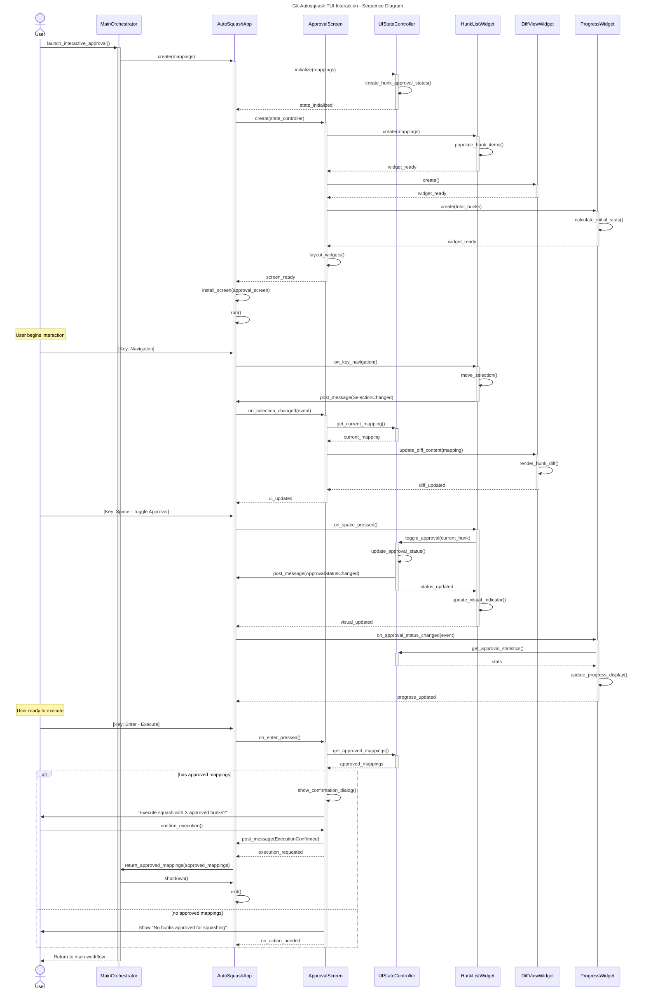
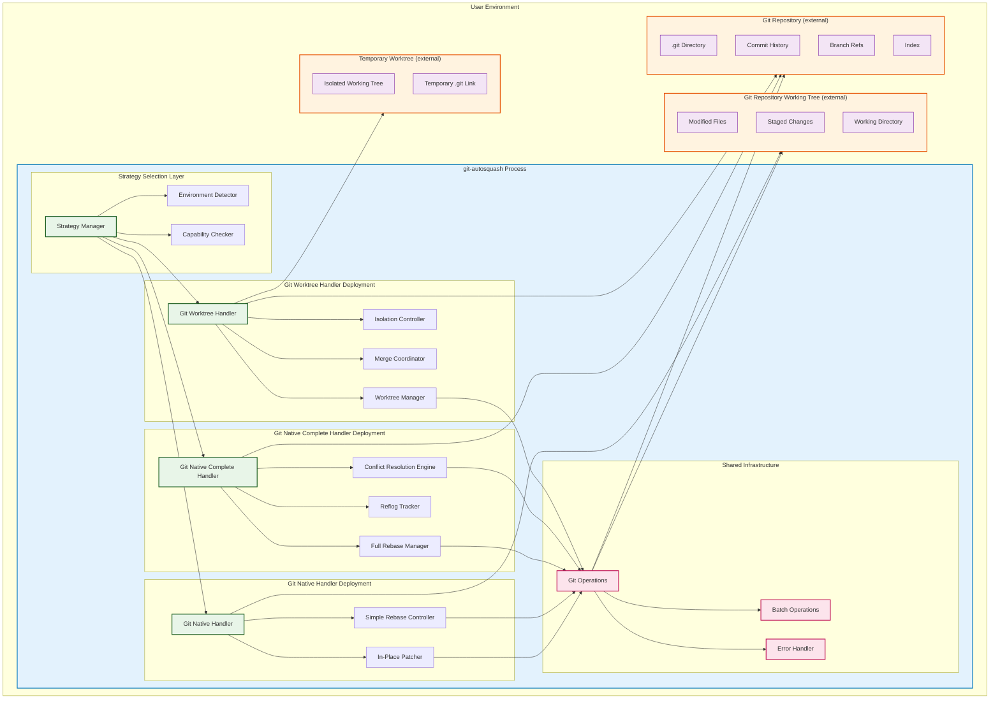

# Software Architecture Document
## Git-Autosquash Interactive Git Rebase Tool

**Document Version:** 1.1
**Date:** September 15, 2025
**Prepared By:** Architecture Analysis Team
**Document Type:** Technical Architecture Specification

> **⚠️ ARCHITECTURAL UPDATE (v1.1)**: The worktree strategy has been removed from the codebase due to architectural simplification. The current system uses a simplified 2-strategy architecture: Index strategy (direct index manipulation) and Legacy strategy (manual patch application).  

---

## Table of Contents

1. [Executive Summary](#executive-summary)
2. [System Overview](#system-overview)
3. [Architectural Goals and Constraints](#architectural-goals-and-constraints)
4. [System and Software Architecture](#system-and-software-architecture)
5. [Component Specifications](#component-specifications)
6. [Interface Specifications](#interface-specifications)
7. [Data Flow and Control Flow](#data-flow-and-control-flow)
8. [Security Architecture](#security-architecture)
9. [Error Handling and Recovery](#error-handling-and-recovery)
10. [Performance and Scalability](#performance-and-scalability)
11. [External Dependencies](#external-dependencies)
12. [Deployment Architecture](#deployment-architecture)
13. [Traceability Matrix](#traceability-matrix)
14. [Appendices](#appendices)

---

## Executive Summary

Git-Autosquash is a command-line tool that intelligently distributes working directory changes back to their appropriate commits in git history through automated blame analysis and interactive rebase operations. The system employs a layered architecture with multiple execution strategies to handle varying complexity scenarios while maintaining repository safety through atomic operations and comprehensive error recovery.

### Key Architectural Features
- **Layered Architecture**: Clear separation of concerns across CLI, business logic, git operations, and user interface layers
- **Strategy Pattern**: Multiple execution strategies (Native, Complete) for different operational scenarios
- **Safety-First Design**: Atomic operations, reflog tracking, and automatic rollback capabilities
- **Interactive User Interface**: Terminal-based user interface with fallback mechanisms
- **Batch Optimization**: Intelligent batching of git operations to minimize subprocess overhead

### System Purpose
The system addresses the common developer workflow problem of having mixed changes in working directory that logically belong to different historical commits, providing an automated solution that maintains git history cleanliness while preserving code safety.

---

## System Overview

### System Context

Git-Autosquash operates as a standalone command-line application that integrates with existing git repositories. The system analyzes uncommitted changes, uses git blame to identify target commits, presents options to users via an interactive terminal interface, and executes repository modifications through controlled git rebase operations.

### Primary Users
- **Software Developers**: Primary users who need to maintain clean git history
- **DevOps Engineers**: Users managing repository workflows and integration
- **Code Reviewers**: Users who benefit from cleaner commit history for reviews

### System Boundaries
- **Included**: Git repository analysis, change distribution, interactive user interface, rebase execution
- **Excluded**: Git repository creation, remote repository operations, merge conflict resolution beyond rebase scope

### Key System Capabilities
1. **Automated Change Analysis**: Parse git diffs and identify individual code hunks
2. **Intelligent Target Resolution**: Use git blame analysis to identify appropriate target commits
3. **Interactive Decision Making**: Provide user interface for reviewing and approving suggested changes
4. **Safe Repository Modification**: Execute changes through controlled interactive rebase with rollback capability
5. **Fallback Handling**: Provide alternative workflows when automated analysis fails

---

## Architectural Goals and Constraints

### Architectural Goals

#### Primary Goals
1. **Safety and Reliability**: Ensure repository integrity is never compromised during operations
2. **User Experience**: Provide intuitive interface that minimizes cognitive load for complex git operations
3. **Performance**: Minimize execution time through optimized git command batching and caching
4. **Maintainability**: Clear separation of concerns and modular design for long-term maintenance
5. **Extensibility**: Support for multiple execution strategies and user interface modes

#### Secondary Goals
1. **Cross-Platform Compatibility**: Support major operating systems with consistent behavior
2. **Git Version Compatibility**: Support wide range of git versions with capability detection
3. **Resource Efficiency**: Minimize memory usage and temporary file creation
4. **Observability**: Comprehensive logging and error reporting for debugging and monitoring

### Architectural Constraints

#### Technical Constraints
1. **Git Dependency**: System requires functional git installation and valid git repository
2. **Terminal Interface**: Requires terminal environment capable of interactive display
3. **File System Access**: Needs read/write access to git repository and temporary directories
4. **Process Execution**: Requires ability to spawn subprocess for git command execution

#### Design Constraints
1. **Single Repository Scope**: Operations limited to single git repository per execution
2. **Local Operation Only**: No remote repository operations during core workflow
3. **Text-Based Interface**: Primary interface is terminal-based, no GUI components
4. **Atomic Operation Requirement**: All repository modifications must be atomic with rollback capability

#### Operational Constraints
1. **Memory Limits**: Must operate efficiently within typical development environment memory constraints
2. **Execution Time**: Interactive operations should complete within reasonable user expectations
3. **Concurrency**: Single-threaded execution to avoid git repository conflicts
4. **State Management**: Stateless operation with no persistent configuration requirements

---

## System and Software Architecture

### Architectural Style

The system employs a **Layered Architecture** pattern with **Strategy Pattern** implementation for execution handling. This approach provides clear separation of concerns while maintaining flexibility for different operational scenarios.

#### Architecture Layers
1. **Presentation Layer**: Command-line interface and terminal user interface
2. **Application Layer**: Main orchestration and workflow management
3. **Business Logic Layer**: Target resolution, hunk processing, and decision logic
4. **Integration Layer**: Git operations, file system access, and external system interaction
5. **Infrastructure Layer**: Caching, error handling, logging, and security

### High-Level System Architecture

```
┌─────────────────────────────────────────────────────────────────┐
│                    Presentation Layer                           │
├─────────────────┬───────────────────────┬───────────────────────┤
│   CLI Interface │    TUI Interface      │   Enhanced TUI        │
│                 │   (Standard Mode)     │  (Fallback Mode)      │
└─────────────────┴───────────────────────┴───────────────────────┘
                              │
┌─────────────────────────────────────────────────────────────────┐
│                   Application Layer                             │
├─────────────────────────────────────────────────────────────────┤
│           Main Orchestrator & Workflow Manager                 │
└─────────────────────────────────────────────────────────────────┘
                              │
┌─────────────────────────────────────────────────────────────────┐
│                  Business Logic Layer                          │
├─────────────┬─────────────────┬─────────────────┬───────────────┤
│ Hunk Parser │ Target Resolver │ Strategy Manager│ State Manager │
└─────────────┴─────────────────┴─────────────────┴───────────────┘
                              │
┌─────────────────────────────────────────────────────────────────┐
│                  Integration Layer                              │
├─────────────────┬─────────────────────┬─────────────────────────┤
│  Git Operations │  Batch Operations   │  Rebase Management      │
└─────────────────┴─────────────────────┴─────────────────────────┘
                              │
┌─────────────────────────────────────────────────────────────────┐
│                 Infrastructure Layer                           │
├─────────────┬─────────────┬─────────────┬─────────────────────────┤
│   Caching   │ Error       │  Logging    │   Security             │
│   System    │ Handling    │  System     │   & Validation         │
└─────────────┴─────────────┴─────────────┴─────────────────────────┘
```

### Component Interaction Overview

The system follows a **request-response flow** with **event-driven user interaction**:

1. **CLI Layer** receives user command and parses arguments
2. **Main Orchestrator** validates environment and coordinates workflow
3. **Hunk Parser** analyzes git changes and extracts modification units
4. **Target Resolver** uses blame analysis to identify appropriate target commits
5. **TUI Interface** presents options and collects user decisions
6. **Strategy Manager** selects appropriate execution approach
7. **Git Operations** execute repository modifications safely
8. **Error Handling** manages failures and provides recovery options

---

## Component Specifications

### Core Components

#### Main Orchestrator (`src/git_autosquash/main.py`)

**Purpose**: Central coordination component that manages the complete workflow from CLI input to operation completion.

**Responsibilities**:
- Command-line argument parsing and validation
- Environment validation (git availability, repository state)
- Workflow orchestration across all system components
- Error handling and user communication
- Cleanup and resource management

**Key Interfaces**:
- `main()`: Primary entry point for command execution
- `setup_logging()`: Configure logging based on user preferences
- `validate_repository_state()`: Ensure git repository is in valid state
- `execute_workflow()`: Coordinate complete operation workflow

**Dependencies**:
- GitOps (git command execution)
- HunkParser (diff analysis)
- HunkTargetResolver (target identification)
- TUI Components (user interaction)
- Strategy Manager (execution strategy selection)

#### Git Operations (`src/git_autosquash/git_ops.py`)

**Purpose**: Abstraction layer for all git command execution with consistent error handling and security validation.

**Responsibilities**:
- Execute git commands via subprocess with proper error handling
- Provide high-level git operations (diff, blame, rebase, etc.)
- Manage git repository state and validation
- Handle git command output parsing and error translation

**Key Interfaces**:
- `run_command(cmd: List[str]) -> Result[str, str]`: Execute git command safely
- `get_current_branch() -> str`: Retrieve current branch information
- `get_merge_base(branch: str) -> str`: Find merge base for analysis
- `get_diff(base_commit: str) -> str`: Generate diff output for parsing
- `get_blame(file_path: str, line_range: Range) -> BlameInfo`: Blame analysis
- `apply_patch(patch: str) -> Result[void, str]`: Apply code changes
- `start_interactive_rebase(base_commit: str) -> void`: Begin rebase operation

**Security Features**:
- Path validation and symlink detection
- Command injection prevention
- Proper argument escaping for subprocess calls

#### Hunk Parser (`src/git_autosquash/hunk_parser.py`)

**Purpose**: Parse git diff output and extract individual code modification units (hunks) for analysis.

**Responsibilities**:
- Parse git diff output into structured hunk objects
- Extract context lines, added lines, and removed lines
- Identify hunk types (added, modified, deleted, renamed)
- Generate patch format for individual hunks

**Key Interfaces**:
- `parse_diff_output(diff_text: str) -> List[DiffHunk]`: Main parsing interface
- `extract_hunks_from_files(file_paths: List[str]) -> List[DiffHunk]`: File-based parsing

**Data Structures**:
- `DiffHunk`: Individual code modification with metadata
- `HunkType`: Enumeration of modification types
- `Range`: Line range representation for hunk boundaries

#### Hunk Target Resolver (`src/git_autosquash/hunk_target_resolver.py`)

**Purpose**: Central coordinator for determining appropriate target commits for code hunks through blame analysis and fallback mechanisms.

**Responsibilities**:
- Coordinate blame analysis for hunk target identification
- Manage fallback scenarios when blame analysis fails
- Apply consistency rules across hunks in same file
- Calculate confidence levels for target suggestions

**Key Interfaces**:
- `resolve_targets(hunks: List[DiffHunk]) -> List[HunkTargetMapping]`: Main resolution interface
- `get_confidence_level(mapping: HunkTargetMapping) -> ConfidenceLevel`: Confidence assessment

**Sub-Components**:
- **BlameAnalysisEngine**: Git blame analysis implementation
- **FallbackTargetProvider**: Alternative targeting when blame fails
- **FileConsistencyTracker**: Consistency enforcement across file hunks

#### Strategy Manager (`src/git_autosquash/git_native_strategy_manager.py`)

**Purpose**: Factory for execution strategy selection based on repository state and operation complexity.

**Responsibilities**:
- Evaluate repository state and operation requirements
- Select optimal execution strategy for current scenario
- Instantiate and configure selected strategy implementation
- Provide fallback strategy selection on failures

**Key Interfaces**:
- `create_handler(strategy_type: StrategyType) -> ExecutionStrategy`: Strategy factory
- `select_optimal_strategy(repo_state: RepositoryState) -> ExecutionStrategy`: Automatic selection

**Strategy Implementations**:
- **GitNativeHandler**: Simple in-place operations for basic scenarios
- **GitNativeCompleteHandler**: Comprehensive operations with full safety features
- **GitWorktreeHandler**: Isolated operations for complex conflict scenarios

### User Interface Components

#### TUI Application (`src/git_autosquash/tui/app.py`, `src/git_autosquash/tui/enhanced_app.py`)

**Purpose**: Terminal-based user interface for interactive hunk approval and configuration.

**Responsibilities**:
- Display hunk information and target commit details
- Collect user approval/rejection decisions
- Provide navigation and interaction capabilities
- Handle keyboard input and screen updates

**Key Components**:
- **ApprovalScreen**: Main interface for hunk review
- **UIStateController**: Centralized state management
- **Widget Components**: Reusable UI elements for different display needs

**Interface Modes**:
- **Standard Mode**: Full-featured interface for typical scenarios
- **Enhanced Mode**: Extended interface with fallback option handling

### Execution Strategy Components

#### Git Native Handler (`src/git_autosquash/git_native_handler.py`)

**Purpose**: Simple execution strategy for basic scenarios with minimal overhead.

**Use Cases**:
- Clean repository with simple changes
- Low conflict probability scenarios
- Single or few hunk operations

**Implementation**:
- Direct patch application to working tree
- Simple interactive rebase execution
- Minimal safety checks for performance

#### Git Native Complete Handler (`src/git_autosquash/git_native_complete_handler.py`)

**Purpose**: Comprehensive execution strategy with full safety features and conflict handling.

**Use Cases**:
- Complex operations with multiple hunks
- Scenarios requiring maximum safety
- Default choice for most operations

**Implementation**:
- Full interactive rebase with conflict resolution
- Reflog tracking for operation recovery
- Atomic operation guarantees
- Comprehensive pre-condition validation


---

## Interface Specifications

### Command-Line Interface

#### Primary Command Interface
```bash
git-autosquash [OPTIONS]
```

**Options**:
- `--auto-accept`: Automatically approve high-confidence mappings without user interaction
- `--strategy {index|legacy}`: Force specific execution strategy
- `--log-level {DEBUG|INFO|WARNING|ERROR}`: Configure logging verbosity
- `--help`: Display usage information and available options

#### Return Codes
- `0`: Successful operation completion
- `1`: Operation failed or user cancelled
- `2`: Invalid command-line arguments
- `3`: Git repository validation failed
- `4`: Execution strategy failed

### Internal API Interfaces

#### Git Operations Interface
```python
class GitOps:
    def run_command(self, cmd: List[str]) -> Result[str, str]
    def get_current_branch(self) -> str
    def get_merge_base(self, branch: str) -> str
    def get_diff(self, base_commit: str) -> str
    def get_blame(self, file_path: str, line_range: Range) -> BlameInfo
    def apply_patch(self, patch: str) -> Result[void, str]
    def start_interactive_rebase(self, base_commit: str) -> void
```

#### Target Resolution Interface
```python
class HunkTargetResolver:
    def resolve_targets(self, hunks: List[DiffHunk]) -> List[HunkTargetMapping]
    def get_confidence_level(self, mapping: HunkTargetMapping) -> ConfidenceLevel
```

#### Execution Strategy Interface
```python
class ExecutionStrategy:
    def execute(self, mappings: List[HunkTargetMapping]) -> Result[void, str]
    def can_handle(self, repository_state: RepositoryState) -> bool
    def get_strategy_name(self) -> str
    def validate_preconditions(self) -> Result[void, str]
    def cleanup_on_failure(self) -> void
```

### Data Structure Interfaces

#### Core Data Structures
```python
@dataclass
class DiffHunk:
    file_path: str
    line_range: Range
    content: str
    hunk_type: HunkType
    context_lines: List[str]
    added_lines: List[str]
    removed_lines: List[str]

@dataclass
class HunkTargetMapping:
    hunk: DiffHunk
    target_commit: Optional[str]
    confidence: ConfidenceLevel
    targeting_method: TargetingMethod
    fallback_options: List[FallbackTarget]

@dataclass
class BlameInfo:
    commit_hash: str
    author: str
    timestamp: datetime
    line_number: int
    original_line: str
    file_path: str
```

### External System Interfaces

#### Git Repository Interface
- **Read Operations**: Status, log, diff, blame, branch information
- **Write Operations**: Interactive rebase, patch application, index manipulation
- **Validation**: Repository state, git version, capability detection

#### File System Interface
- **Read Operations**: Configuration files, temporary file access
- **Write Operations**: Temporary patch files, log files
- **Security**: Path validation, symlink detection, permission verification

#### Terminal Interface
- **Input**: Keyboard events, terminal size detection
- **Output**: Formatted text display, color support, screen management
- **Capabilities**: Interactive display, cursor control, screen clearing

---

## Data Flow and Control Flow

### Primary Data Flow

The system processes data through a sequential pipeline with user interaction points:

```
User Command → Argument Parsing → Repository Validation → 
Diff Generation → Hunk Parsing → Target Resolution → 
User Approval → Strategy Selection → Execution → Cleanup
```

#### Detailed Data Flow Stages

1. **Input Processing Stage**
   - Command-line arguments parsed into configuration object
   - Repository state validated and captured
   - Git capabilities detected and recorded

2. **Analysis Stage**
   - Git diff generated from merge base to working tree
   - Diff output parsed into individual DiffHunk objects
   - Each hunk analyzed for file path, line ranges, and change type

3. **Target Resolution Stage**
   - Blame analysis executed for each hunk's modified lines
   - Target commits identified based on blame information
   - Fallback mechanisms applied when blame analysis fails
   - Confidence levels calculated for each target suggestion

4. **User Interaction Stage**
   - HunkTargetMapping objects presented via TUI interface
   - User approval/rejection collected for each mapping
   - Alternative target selection supported for ambiguous cases

5. **Execution Stage**
   - Approved mappings processed by selected execution strategy
   - Interactive rebase coordinated with patch application
   - Conflicts handled through user interaction or automatic resolution

6. **Cleanup Stage**
   - Ignored hunks applied back to working tree
   - Temporary files removed
   - Operation results logged and reported

### Control Flow Architecture

#### Main Control Flow
The system uses **sequential control flow** with **exception-based error handling**:

```python
def main_workflow():
    try:
        # Validation Phase
        validate_environment()
        repository_state = validate_repository()
        
        # Analysis Phase
        hunks = parse_changes(repository_state)
        mappings = resolve_targets(hunks)
        
        # User Interaction Phase
        approved_mappings = get_user_approval(mappings)
        
        # Execution Phase
        strategy = select_strategy(repository_state, approved_mappings)
        result = strategy.execute(approved_mappings)
        
        # Cleanup Phase
        apply_ignored_hunks()
        return success_result()
        
    except GitAutoSquashError as e:
        handle_known_error(e)
        return error_result(e)
    except Exception as e:
        handle_unexpected_error(e)
        return critical_error_result(e)
```

#### TUI Control Flow
The Terminal User Interface uses **event-driven control flow**:

```python
class TUIControlFlow:
    def handle_user_input(self, event):
        match event.type:
            case KeyPress.NAVIGATION:
                self.update_selection(event.direction)
            case KeyPress.TOGGLE:
                self.toggle_approval(self.current_selection)
            case KeyPress.CONFIRM:
                return self.collect_approved_mappings()
            case KeyPress.CANCEL:
                return self.cancel_operation()
            case KeyPress.FALLBACK:
                self.show_fallback_options(self.current_selection)
```

#### Strategy Selection Control Flow
Strategy selection uses **rule-based evaluation**:

```python
def select_strategy(repo_state, mappings):
    if force_strategy_specified():
        return create_forced_strategy()
    
    if is_simple_scenario(repo_state, mappings):
        return GitNativeHandler()
    elif requires_isolation(repo_state, mappings):
        return GitWorktreeHandler()
    else:
        return GitNativeCompleteHandler()  # Default choice
```

### Error Control Flow

#### Exception Hierarchy
```
GitAutoSquashError (base)
├── GitOperationError (git command failures)
├── HunkResolutionError (analysis failures)  
├── RebaseConflictError (rebase conflicts)
├── UserCancellationError (user-initiated cancellation)
└── ValidationError (precondition failures)
```

#### Error Handling Strategy
1. **Immediate Recovery**: Attempt automatic recovery for transient failures
2. **User Interaction**: Present options for recoverable failures
3. **Graceful Degradation**: Fall back to simpler strategies when possible
4. **Safe Termination**: Ensure repository integrity on unrecoverable failures

---

## Security Architecture

### Security Principles

#### Defense in Depth
Multiple security layers protect against various attack vectors:
1. **Input Validation**: All external inputs validated before processing
2. **Path Security**: File system access restricted and validated
3. **Command Injection Prevention**: Git commands properly escaped
4. **Resource Limits**: Memory and execution time bounds enforced
5. **Privilege Minimization**: Only necessary file system permissions required

### Security Controls

#### Path Traversal Protection
```python
class PathSecurity:
    def validate_path(self, path: Path) -> Result[Path, str]:
        # Resolve symbolic links
        resolved_path = path.resolve()
        
        # Check for path traversal attempts
        if not self.is_within_repository(resolved_path):
            return Err("Path outside repository boundary")
        
        # Validate against symlink attacks
        if self.contains_malicious_symlink(resolved_path):
            return Err("Malicious symlink detected")
        
        return Ok(resolved_path)
```

#### Command Injection Prevention
```python
class GitOps:
    def run_command(self, cmd: List[str]) -> Result[str, str]:
        # Validate git command whitelist
        if not self.is_allowed_git_command(cmd[0]):
            return Err("Unauthorized git command")
        
        # Escape arguments properly
        escaped_args = [shlex.quote(arg) for arg in cmd[1:]]
        
        # Execute with controlled environment
        return self.execute_subprocess([cmd[0]] + escaped_args)
```

#### Resource Protection
```python
class ResourceLimits:
    MAX_MEMORY_USAGE = 512 * 1024 * 1024  # 512MB
    MAX_EXECUTION_TIME = 300  # 5 minutes
    MAX_TEMP_FILES = 100
    
    def enforce_limits(self, operation):
        with self.memory_limit(self.MAX_MEMORY_USAGE):
            with self.time_limit(self.MAX_EXECUTION_TIME):
                with self.temp_file_limit(self.MAX_TEMP_FILES):
                    return operation()
```

### Security Boundaries

#### Trust Boundaries
1. **User Input Boundary**: All CLI arguments and interactive input validated
2. **File System Boundary**: Repository and temporary file access controlled
3. **Process Boundary**: Git subprocess execution monitored and limited
4. **Network Boundary**: No network operations during core workflow

#### Data Classification
- **Public Data**: Git commit metadata, file paths, command-line options
- **Sensitive Data**: File contents, working directory state, user preferences
- **Critical Data**: Git repository integrity, rebase state, operation history

### Threat Model

#### Identified Threats
1. **Path Traversal Attack**: Malicious file paths to access system files
2. **Command Injection**: Crafted input to execute arbitrary commands
3. **Symlink Attack**: Malicious symlinks to access restricted files
4. **Resource Exhaustion**: Operations designed to consume excessive resources
5. **Repository Corruption**: Operations that could damage git repository

#### Mitigations
1. **Path Traversal**: Resolved path validation and boundary checking
2. **Command Injection**: Argument escaping and command whitelisting
3. **Symlink Attack**: Symlink resolution and validation
4. **Resource Exhaustion**: Memory, time, and file limits enforcement
5. **Repository Corruption**: Atomic operations and automatic rollback

---

## Error Handling and Recovery

### Error Handling Philosophy

The system implements **graceful degradation** with **automatic recovery** where possible, and **user-guided recovery** for complex scenarios.

#### Error Categories
1. **Transient Errors**: Temporary failures that may succeed on retry
2. **User Errors**: Invalid input or incorrect usage requiring user correction
3. **System Errors**: Environment or dependency failures requiring system intervention
4. **Critical Errors**: Failures that could compromise repository integrity

### Error Handling Mechanisms

#### Result Pattern Implementation
```python
class Result[T, E]:
    def __init__(self, value: T = None, error: E = None):
        self.value = value
        self.error = error
    
    def is_ok(self) -> bool:
        return self.error is None
    
    def unwrap(self) -> T:
        if self.error:
            raise Exception(f"Unwrap failed: {self.error}")
        return self.value
    
    def unwrap_or(self, default: T) -> T:
        return self.value if self.is_ok() else default
```

#### Exception Hierarchy
```python
class GitAutoSquashError(Exception):
    def __init__(self, message: str, recovery_suggestions: List[str] = None):
        self.message = message
        self.recovery_suggestions = recovery_suggestions or []
        super().__init__(message)
    
    def get_user_message(self) -> str:
        msg = f"Error: {self.message}"
        if self.recovery_suggestions:
            msg += "\n\nSuggested actions:"
            for suggestion in self.recovery_suggestions:
                msg += f"\n  • {suggestion}"
        return msg
```

### Recovery Strategies

#### Automatic Recovery
```python
class AutomaticRecovery:
    def retry_with_backoff(self, operation, max_retries=3):
        for attempt in range(max_retries):
            try:
                return operation()
            except TransientError as e:
                if attempt == max_retries - 1:
                    raise
                time.sleep(2 ** attempt)  # Exponential backoff
    
    def fallback_strategy(self, primary_strategy, fallback_strategy):
        try:
            return primary_strategy()
        except RecoverableError:
            return fallback_strategy()
```

#### Repository State Recovery
```python
class RepositoryRecovery:
    def create_safety_checkpoint(self):
        self.checkpoint_ref = self.git_ops.create_reflog_entry("git-autosquash-checkpoint")
        self.checkpoint_stash = self.git_ops.create_stash("git-autosquash-working-state")
    
    def restore_from_checkpoint(self):
        if self.checkpoint_stash:
            self.git_ops.apply_stash(self.checkpoint_stash)
        if self.checkpoint_ref:
            self.git_ops.reset_to_ref(self.checkpoint_ref)
```

#### User-Guided Recovery
```python
class InteractiveRecovery:
    def handle_rebase_conflict(self, conflict_info):
        while True:
            choice = self.prompt_user([
                "Abort rebase and restore original state",
                "Skip this commit and continue",
                "Open external merge tool",
                "Show conflict details"
            ])
            
            match choice:
                case "abort":
                    return self.abort_and_restore()
                case "skip":
                    return self.skip_and_continue()
                case "merge_tool":
                    return self.launch_merge_tool()
                case "details":
                    self.show_conflict_details(conflict_info)
```

### Error Reporting

#### Error Context Collection
```python
class ErrorContext:
    def collect_context(self, error: Exception) -> Dict[str, Any]:
        return {
            "error_type": type(error).__name__,
            "error_message": str(error),
            "git_version": self.git_ops.get_git_version(),
            "repository_state": self.git_ops.get_repository_state(),
            "operation_history": self.get_operation_history(),
            "system_info": self.get_system_info(),
            "timestamp": datetime.now().isoformat()
        }
```

#### User-Friendly Error Messages
```python
class ErrorFormatter:
    def format_user_error(self, error: GitAutoSquashError) -> str:
        template = self.get_error_template(error)
        context = self.get_error_context(error)
        
        formatted_message = template.format(**context)
        
        if error.recovery_suggestions:
            formatted_message += self.format_recovery_suggestions(error.recovery_suggestions)
        
        return formatted_message
```

---

## Performance and Scalability

### Performance Requirements

#### Response Time Requirements
- **Command Startup**: < 2 seconds for typical repository analysis
- **User Interface Response**: < 100ms for keyboard interaction
- **Git Operations**: < 5 seconds for standard rebase operations
- **Large Repository Handling**: Linear scalability with repository size

#### Resource Requirements
- **Memory Usage**: < 512MB for typical operations
- **CPU Usage**: Single-core efficiency with burst capability
- **Disk I/O**: Minimized through intelligent caching and batching
- **Temporary Storage**: < 100MB temporary file usage

### Performance Optimization Strategies

#### Batch Git Operations
```python
class BatchGitOperations:
    def __init__(self, git_ops: GitOps):
        self.git_ops = git_ops
        self.blame_cache = BoundedCache(max_size=1000)
        self.commit_cache = BoundedCache(max_size=500)
    
    def batch_blame_analysis(self, hunks: List[DiffHunk]) -> Dict[DiffHunk, BlameInfo]:
        # Group hunks by file to minimize git blame calls
        file_groups = self.group_hunks_by_file(hunks)
        
        results = {}
        for file_path, file_hunks in file_groups.items():
            # Single git blame call per file
            blame_result = self.git_ops.get_blame_full_file(file_path)
            
            # Extract relevant blame info for each hunk
            for hunk in file_hunks:
                results[hunk] = self.extract_hunk_blame(blame_result, hunk)
        
        return results
```

#### Intelligent Caching
```python
class BoundedCache[K, V]:
    def __init__(self, max_size: int = 1000):
        self.cache: Dict[K, V] = {}
        self.access_order: List[K] = []
        self.max_size = max_size
        self.lock = threading.RLock()
    
    def get(self, key: K) -> Optional[V]:
        with self.lock:
            if key in self.cache:
                self.access_order.remove(key)
                self.access_order.append(key)
                return self.cache[key]
            return None
    
    def put(self, key: K, value: V) -> None:
        with self.lock:
            if len(self.cache) >= self.max_size:
                oldest_key = self.access_order.pop(0)
                del self.cache[oldest_key]
            
            self.cache[key] = value
            self.access_order.append(key)
```

#### Memory Management
```python
class MemoryEfficientProcessing:
    def process_large_diff(self, diff_text: str) -> Iterator[DiffHunk]:
        # Stream processing for large diffs
        for chunk in self.stream_diff_chunks(diff_text):
            hunk = self.parse_diff_chunk(chunk)
            yield hunk
            # Allow garbage collection of processed chunks
            del chunk
    
    def stream_diff_chunks(self, diff_text: str) -> Iterator[str]:
        # Process diff in chunks to avoid loading entire diff into memory
        chunk_size = 64 * 1024  # 64KB chunks
        buffer = StringIO(diff_text)
        
        while True:
            chunk = buffer.read(chunk_size)
            if not chunk:
                break
            yield chunk
```

### Scalability Considerations

#### Repository Size Scaling
- **Small Repositories** (< 1000 commits): Optimal performance with full feature set
- **Medium Repositories** (1000-10000 commits): Good performance with intelligent caching
- **Large Repositories** (> 10000 commits): Acceptable performance with streaming and batching

#### Change Volume Scaling
- **Few Hunks** (< 10): Interactive mode with full UI features
- **Many Hunks** (10-100): Batch processing with progress indicators
- **Very Many Hunks** (> 100): Streaming processing with auto-accept recommendations

#### Concurrent Usage
- **Single User**: Full feature set with optimal performance
- **Team Environment**: Safe concurrent usage through git locking mechanisms
- **CI/CD Integration**: Batch mode operation with minimal resource usage

### Performance Monitoring

#### Metrics Collection
```python
class PerformanceMetrics:
    def __init__(self):
        self.operation_times = {}
        self.memory_usage = {}
        self.git_command_counts = defaultdict(int)
    
    @contextmanager
    def measure_operation(self, operation_name: str):
        start_time = time.time()
        start_memory = self.get_memory_usage()
        
        try:
            yield
        finally:
            end_time = time.time()
            end_memory = self.get_memory_usage()
            
            self.operation_times[operation_name] = end_time - start_time
            self.memory_usage[operation_name] = end_memory - start_memory
```

---

## External Dependencies

### Required Dependencies

#### Git Version Control System
- **Minimum Version**: Git 2.25.0 (released January 2020)
- **Recommended Version**: Git 2.40.0+ for optimal feature support
- **Required Commands**: `git diff`, `git blame`, `git rebase`, `git stash`
- **Optional Commands**: `git config` for advanced configuration

#### Python Runtime Environment
- **Minimum Version**: Python 3.11
- **Required Modules**: `subprocess`, `pathlib`, `tempfile`, `argparse`, `logging`
- **Standard Library Only**: No external Python packages required for core functionality

#### Terminal Environment
- **Terminal Capabilities**: ANSI color support, cursor positioning, keyboard input
- **Screen Size**: Minimum 80x24 characters for optimal display
- **Keyboard Support**: Arrow keys, space, enter, escape key handling

### Optional Dependencies

#### Enhanced UI Framework
- **Textual Framework** (>= 0.40.0): Advanced terminal user interface
- **Rich Library**: Enhanced text formatting and display
- **Fallback**: Text-based interface when Textual unavailable

#### Development and Testing
- **pytest**: Unit and integration testing framework
- **mypy**: Static type checking
- **ruff**: Code linting and formatting
- **pyte**: Terminal emulator for screenshot testing

### Dependency Management

#### Version Compatibility
```python
class DependencyChecker:
    MIN_GIT_VERSION = (2, 25, 0)
    MIN_PYTHON_VERSION = (3, 11, 0)
    
    def check_git_version(self) -> Result[str, str]:
        try:
            version_output = subprocess.check_output(['git', '--version'])
            version_str = version_output.decode().strip()
            version_parts = self.parse_git_version(version_str)
            
            if version_parts >= self.MIN_GIT_VERSION:
                return Ok(version_str)
            else:
                return Err(f"Git version {version_str} is too old. Minimum required: {'.'.join(map(str, self.MIN_GIT_VERSION))}")
        except subprocess.CalledProcessError as e:
            return Err(f"Git not available: {e}")
```

#### Feature Detection
```python
class GitCapabilities:
    def __init__(self, git_ops: GitOps):
        self.git_ops = git_ops
        self._capabilities_cache = {}
    
    
    def supports_interactive_rebase_autosquash(self) -> bool:
        if 'autosquash' not in self._capabilities_cache:
            result = self.git_ops.run_command(['git', 'config', 'rebase.autosquash'])
            self._capabilities_cache['autosquash'] = result.is_ok()
        return self._capabilities_cache['autosquash']
```

#### Graceful Degradation
```python
class FeatureDegradation:
    def select_ui_mode(self) -> UIMode:
        try:
            import textual
            return UIMode.ENHANCED_TUI
        except ImportError:
            return UIMode.BASIC_TEXT
    
    def select_execution_strategy(self, capabilities: GitCapabilities) -> StrategyType:
            return StrategyType.WORKTREE
        elif capabilities.supports_interactive_rebase():
            return StrategyType.COMPLETE
        else:
            return StrategyType.NATIVE
```

### External System Integration

#### Operating System Integration
- **Linux**: Full feature support with POSIX compliance
- **macOS**: Full feature support with BSD utilities
- **Windows**: Limited support through Git for Windows
- **Cross-Platform**: Path handling and command execution abstraction

#### Shell Integration
- **Bash**: Command completion and alias support
- **Zsh**: Advanced completion with argument hints
- **Fish**: Tab completion and command history
- **PowerShell**: Basic command support on Windows

#### Editor Integration
- **Merge Tools**: Integration with configured git merge tools
- **Diff Viewers**: Support for external diff visualization
- **Conflict Resolution**: Seamless handoff to user's preferred editor

---

## Deployment Architecture

### Deployment Models

#### Standalone Command-Line Tool
Primary deployment as single executable command-line utility:

```
User Workstation
├── Git Repository (target)
├── git-autosquash executable
├── Python Runtime (3.11+)
└── Git Installation (2.25.0+)
```

**Installation Methods**:
- **PyPI Package**: `pip install git-autosquash`
- **System Package**: Distribution-specific packages (DEB, RPM)
- **Portable Binary**: Self-contained executable with embedded Python
- **Development Install**: `pip install -e .` for source development

#### Strategy Deployment Patterns

The system uses **runtime strategy selection** based on detected capabilities and operation requirements:

##### Simple Deployment (Git Native Handler)
```
┌─────────────────────────┐
│   User Workstation      │
├─────────────────────────┤
│  git-autosquash         │
│  ├─ Git Operations      │
│  ├─ Simple Rebase       │
│  └─ In-place Patches    │
├─────────────────────────┤
│  Git Repository         │
│  ├─ Working Tree        │
│  ├─ Index               │
│  └─ Commit History      │
└─────────────────────────┘
```

##### Comprehensive Deployment (Git Native Complete Handler)
```
┌─────────────────────────┐
│   User Workstation      │
├─────────────────────────┤
│  git-autosquash         │
│  ├─ Full Rebase Mgr     │
│  ├─ Conflict Engine     │
│  ├─ Reflog Tracker      │
│  └─ Atomic Operations   │
├─────────────────────────┤
│  Git Repository         │
│  ├─ Working Tree        │
│  ├─ Index               │
│  ├─ Reflog              │
│  └─ Commit History      │
└─────────────────────────┘
```

##### Isolated Deployment (Git Worktree Handler)
```
┌─────────────────────────┐
│   User Workstation      │
├─────────────────────────┤
│  git-autosquash         │
│  ├─ Worktree Manager    │
│  ├─ Isolation Ctrl      │
│  ├─ Merge Coordinator   │
│  └─ Cleanup Handler     │
├─────────────────────────┤
│  Main Git Repository    │
│  ├─ Working Tree        │
│  ├─ Index               │
│  └─ Commit History      │
├─────────────────────────┤
│  Temporary Worktree     │
│  ├─ Isolated Tree       │
│  ├─ Temp Index          │
│  └─ Git Link            │
└─────────────────────────┘
```

### Deployment Configuration

#### Environment Configuration
```python
class DeploymentConfig:
    # Git Integration
    GIT_EXECUTABLE_PATH = os.getenv('GIT_EXECUTABLE', 'git')
    GIT_CONFIG_GLOBAL = os.getenv('GIT_CONFIG_GLOBAL', True)
    
    # Strategy Selection
    DEFAULT_STRATEGY = os.getenv('AUTOSQUASH_STRATEGY', 'index')
    FORCE_STRATEGY = os.getenv('AUTOSQUASH_FORCE_STRATEGY', None)
    
    # Performance Tuning
    MAX_MEMORY_MB = int(os.getenv('AUTOSQUASH_MAX_MEMORY', '512'))
    CACHE_SIZE = int(os.getenv('AUTOSQUASH_CACHE_SIZE', '1000'))
    BATCH_SIZE = int(os.getenv('AUTOSQUASH_BATCH_SIZE', '50'))
    
    # UI Configuration
    UI_MODE = os.getenv('AUTOSQUASH_UI_MODE', 'auto')  # auto, tui, text
    COLOR_SUPPORT = os.getenv('AUTOSQUASH_COLOR', 'auto') == 'true'
    
    # Logging Configuration
    LOG_LEVEL = os.getenv('AUTOSQUASH_LOG_LEVEL', 'INFO')
    LOG_FILE = os.getenv('AUTOSQUASH_LOG_FILE', None)
```

#### Runtime Deployment Detection
```python
class DeploymentDetector:
    def detect_deployment_environment(self) -> DeploymentEnvironment:
        env = DeploymentEnvironment()
        
        # Detect git capabilities
        env.git_version = self.detect_git_version()
        env.supports_interactive_rebase = self.test_rebase_support()
        
        # Detect UI capabilities
        env.terminal_size = self.get_terminal_size()
        env.color_support = self.test_color_support()
        env.interactive_capable = self.test_interactive_support()
        
        # Detect system resources
        env.available_memory = self.get_available_memory()
        env.temp_space = self.get_temp_space()
        env.cpu_cores = self.get_cpu_count()
        
        return env
```

### Deployment Validation

#### Pre-deployment Checks
```python
class DeploymentValidator:
    def validate_deployment(self) -> ValidationResult:
        checks = [
            self.check_python_version(),
            self.check_git_availability(),
            self.check_git_version(),
            self.check_repository_state(),
            self.check_file_permissions(),
            self.check_terminal_capabilities(),
        ]
        
        failures = [check for check in checks if not check.passed]
        
        if failures:
            return ValidationResult(
                success=False,
                failures=failures,
                recovery_suggestions=self.generate_recovery_suggestions(failures)
            )
        
        return ValidationResult(success=True)
```

#### Health Monitoring
```python
class DeploymentHealth:
    def monitor_system_health(self) -> HealthStatus:
        return HealthStatus(
            memory_usage=self.get_memory_usage(),
            disk_usage=self.get_disk_usage(),
            git_operations_per_second=self.get_git_ops_rate(),
            user_response_time=self.get_ui_response_time(),
            error_rate=self.get_error_rate()
        )
    
    def suggest_optimizations(self, health: HealthStatus) -> List[Optimization]:
        suggestions = []
        
        if health.memory_usage > 0.8:
            suggestions.append(Optimization.REDUCE_CACHE_SIZE)
        
        if health.git_operations_per_second < 5:
            suggestions.append(Optimization.INCREASE_BATCH_SIZE)
        
        if health.user_response_time > 0.5:
            suggestions.append(Optimization.ENABLE_CACHING)
        
        return suggestions
```

---

## Traceability Matrix

### Requirements to Architecture Mapping

| Requirement ID | Requirement Description | Architecture Component | Implementation Location |
|---|---|---|---|
| REQ-001 | Parse git diff into individual hunks | Hunk Processing Engine | `src/git_autosquash/hunk_parser.py` |
| REQ-002 | Identify target commits using git blame | Target Resolution System | `src/git_autosquash/blame_analyzer.py` |
| REQ-003 | Provide interactive user approval interface | User Interface Layer | `src/git_autosquash/tui/app.py` |
| REQ-004 | Execute safe repository modifications | Execution Strategy Layer | `src/git_autosquash/git_native_*_handler.py` |
| REQ-005 | Handle rebase conflicts gracefully | Error Handling System | `src/git_autosquash/rebase_manager.py` |
| REQ-006 | Support multiple execution strategies | Strategy Pattern Implementation | `src/git_autosquash/git_native_strategy_manager.py` |
| REQ-007 | Provide fallback when blame fails | Fallback Target Provider | `src/git_autosquash/hunk_target_resolver.py` |
| REQ-008 | Ensure repository integrity | Security Architecture | `src/git_autosquash/main.py` |
| REQ-009 | Optimize git command execution | Batch Git Operations | `src/git_autosquash/batch_git_ops.py` |
| REQ-010 | Support cross-platform deployment | External Dependencies | Platform abstraction throughout |

### Architecture to Implementation Traceability

| Architecture Component | Design Element | Implementation Files | Test Coverage |
|---|---|---|---|
| Main Orchestrator | Workflow coordination | `main.py` | `tests/test_main_integration.py` |
| Git Operations Layer | Command abstraction | `git_ops.py` | `tests/test_git_operations.py` |
| Hunk Processing Engine | Diff parsing | `hunk_parser.py` | `tests/test_hunk_parser.py` |
| Target Resolution System | Blame analysis | `blame_analyzer.py`, `hunk_target_resolver.py` | `tests/test_blame_analyzer.py` |
| User Interface Layer | Interactive TUI | `tui/app.py`, `tui/screens.py` | `tests/test_tui_widgets.py` |
| Execution Strategies | Strategy pattern | `git_native_*_handler.py` | `tests/test_execution_strategies.py` |
| Error Handling System | Exception management | Throughout codebase | `tests/test_error_handling.py` |
| Security Architecture | Path validation | `main.py`, security utilities | `tests/test_security_edge_cases.py` |
| Performance Optimization | Caching and batching | `batch_git_ops.py`, `bounded_cache.py` | `tests/test_performance_benchmarks.py` |

### Design Decision Rationale

| Design Decision | Rationale | Alternative Considered | Trade-off Analysis |
|---|---|---|---|
| Layered Architecture | Clear separation of concerns, maintainability | Monolithic design | Complexity vs. maintainability |
| Strategy Pattern for Execution | Flexibility for different scenarios | Single execution path | Complexity vs. robustness |
| Result Type for Error Handling | Explicit error handling, functional approach | Exception-only approach | Verbosity vs. safety |
| Textual Framework for TUI | Modern terminal interface capabilities | ncurses or custom solution | Dependency vs. functionality |
| Batch Git Operations | Performance optimization for large repositories | Individual command execution | Memory vs. speed |
| Path Security Validation | Security against path traversal attacks | Trust user input | Security vs. performance |
| Bounded Caching | Memory efficiency for large operations | Unbounded caching | Memory vs. speed |
| Interactive Rebase | Leverage git's native capabilities | Custom rebase implementation | Complexity vs. reliability |

---

## Appendices

### Appendix A: UML Diagrams

The following UML diagrams provide detailed architectural views:

#### A.1 Class Diagram - Core Components

Complete class hierarchy with relationships, interface definitions, and data structure specifications:

```mermaid
classDiagram
    %% Main Entry Point
    class MainOrchestrator {
        +main() int
        +setup_logging() void
        +handle_cli_args(args) void
        +validate_repository_state() Result
        +execute_workflow() Result
    }

    %% Git Operations Layer
    class GitCommandInterface {
        <<interface>>
        +execute_command(cmd)* Result
        +get_repository_state()* RepositoryState
    }
    
    class GitOps {
        -repo_path: Path
        -env: Dict
        +run_command(cmd) Result
        +get_current_branch() str
        +get_merge_base(branch) str
        +get_diff(base_commit) str
        +get_blame(file_path, line_range) BlameInfo
        +apply_patch(patch) Result
        +start_interactive_rebase(base_commit) void
    }
    
    class BatchGitOperations {
        -git_ops: GitOps
        -command_cache: BoundedCache
        +batch_blame_analysis(hunks) Dict
        +batch_commit_info(commit_hashes) Dict
        +preload_file_history(file_paths) void
    }
    
    class RebaseManager {
        -git_ops: GitOps
        -strategy: ExecutionStrategy
        +execute_interactive_rebase(mappings) Result
        +handle_conflicts() ConflictResolutionResult
        +abort_rebase() Result
        +continue_rebase() Result
    }

    %% Hunk Processing Engine
    class DiffHunk {
        +file_path: str
        +line_range: Range
        +content: str
        +hunk_type: HunkType
        +context_lines: List
        +added_lines: List
        +removed_lines: List
        +get_modified_lines() List
        +to_patch_format() str
    }
    
    class HunkParser {
        -git_ops: GitOps
        +parse_diff_output(diff_text) List
        +extract_hunks_from_files(file_paths) List
    }
    
    class HunkType {
        <<enumeration>>
        ADDED
        MODIFIED
        DELETED
        RENAMED
        MOVED
    }

    %% Target Resolution System
    class HunkTargetResolver {
        -blame_analyzer: BlameAnalysisEngine
        -fallback_provider: FallbackTargetProvider
        -consistency_tracker: FileConsistencyTracker
        +resolve_targets(hunks) List
        +get_confidence_level(mapping) ConfidenceLevel
    }
    
    class BlameAnalysisEngine {
        -git_ops: GitOps
        -batch_ops: BatchGitOperations
        +analyze_hunk_blame(hunk) Result
        +find_target_commit(blame_info) Optional
        +calculate_confidence(blame_info) ConfidenceLevel
    }
    
    class FallbackTargetProvider {
        -commit_analyzer: CommitHistoryAnalyzer
        -git_ops: GitOps
        +provide_fallback_targets(hunk) List
        +handle_new_file_scenario(file_path) List
        +handle_ambiguous_blame(blame_results) List
    }
    
    class HunkTargetMapping {
        +hunk: DiffHunk
        +target_commit: Optional
        +confidence: ConfidenceLevel
        +targeting_method: TargetingMethod
        +fallback_options: List
        +requires_user_decision() bool
        +to_display_format() str
    }

    %% Execution Strategies
    class ExecutionStrategy {
        <<abstract>>
        +execute(mappings)* Result
        +can_handle(repository_state)* bool
        +get_strategy_name()* str
        +validate_preconditions() Result
        +cleanup_on_failure() void
    }
    
    class GitNativeHandler {
        -git_ops: GitOps
        +execute(mappings) Result
        +can_handle(repository_state) bool
        +get_strategy_name() str
    }
    
    class GitNativeCompleteHandler {
        -git_ops: GitOps
        -rebase_manager: RebaseManager
        +execute(mappings) Result
        +can_handle(repository_state) bool
        +get_strategy_name() str
    }
    
    class GitWorktreeHandler {
        -git_ops: GitOps
        +execute(mappings) Result
        +can_handle(repository_state) bool
        +get_strategy_name() str
    }

    %% Relationships
    MainOrchestrator --> GitOps
    MainOrchestrator --> HunkParser
    MainOrchestrator --> HunkTargetResolver

    GitOps ..|> GitCommandInterface
    BatchGitOperations --> GitOps
    RebaseManager --> GitOps

    HunkParser --> GitOps
    HunkParser --> DiffHunk
    HunkParser --> HunkType

    HunkTargetResolver --> BlameAnalysisEngine
    HunkTargetResolver --> FallbackTargetProvider
    HunkTargetResolver --> HunkTargetMapping

    BlameAnalysisEngine --> GitOps
    BlameAnalysisEngine --> BatchGitOperations

    FallbackTargetProvider --> GitOps

    HunkTargetMapping --> DiffHunk

    GitNativeHandler ..|> ExecutionStrategy
    GitNativeCompleteHandler ..|> ExecutionStrategy
    GitWorktreeHandler ..|> ExecutionStrategy

    GitNativeHandler --> GitOps
    GitNativeCompleteHandler --> GitOps
    GitNativeCompleteHandler --> RebaseManager
    GitWorktreeHandler --> GitOps
```



#### A.2 Sequence Diagram - Main Workflow

End-to-end operation flow showing component interactions and error handling:

```mermaid
sequenceDiagram
    participant User
    participant Main as MainOrchestrator
    participant Git as GitOps
    participant Parser as HunkParser
    participant Resolver as HunkTargetResolver
    participant UI as TUI
    participant Strategy as ExecutionStrategy

    User->>Main: git-autosquash [options]
    activate Main

    Main->>Main: setup_logging()
    Main->>Main: parse_arguments()

    Note over Main: Validation Phase
    Main->>Git: validate_repository_state()
    activate Git
    Git->>Git: check_git_availability()
    Git->>Git: get_current_branch()
    Git->>Git: check_uncommitted_changes()
    Git-->>Main: RepositoryState
    deactivate Git

    alt Repository validation fails
        Main-->>User: Error: Invalid repository state
        Main->>Main: exit(1)
    end

    Note over Main: Analysis Phase
    Main->>Git: get_merge_base()
    activate Git
    Git-->>Main: base_commit
    deactivate Git

    Main->>Git: get_diff(base_commit)
    activate Git
    Git-->>Main: diff_output
    deactivate Git

    Main->>Parser: parse_diff_output(diff_output)
    activate Parser
    Parser->>Parser: extract_hunks_from_files()
    Parser-->>Main: List[DiffHunk]
    deactivate Parser

    alt No hunks found
        Main-->>User: Info: No changes to squash
        Main->>Main: exit(0)
    end

    Main->>Resolver: resolve_targets(hunks)
    activate Resolver
    Resolver->>Resolver: analyze_blame_for_hunks()
    Resolver->>Resolver: apply_fallback_when_needed()
    Resolver->>Resolver: apply_consistency_rules()
    Resolver-->>Main: List[HunkTargetMapping]
    deactivate Resolver

    Note over Main: User Interaction Phase
    alt auto_accept_mode = false
        Main->>UI: launch_interactive_approval(mappings)
        activate UI
        
        loop User reviews each mapping
            UI->>UI: display_hunk_details()
            UI->>User: Show hunk and target commit
            User->>UI: approve/reject/modify
            UI->>UI: update_mapping_status()
        end
        
        UI->>User: Press Enter to continue
        User->>UI: confirm_selections()
        UI-->>Main: approved_mappings
        deactivate UI
        
        alt User cancelled
            Main-->>User: Operation cancelled
            Main->>Main: exit(0)
        end
    else auto_accept_mode = true
        Main->>Main: auto_approve_high_confidence()
    end

    alt No mappings approved
        Main-->>User: Info: No changes approved for squashing
        Main->>Main: exit(0)
    end

    Note over Main: Execution Phase
    Main->>Strategy: execute(approved_mappings)
    activate Strategy

    Strategy->>Strategy: validate_preconditions()

    alt preconditions failed
        Strategy-->>Main: Error: Preconditions not met
        Main-->>User: Error message
        Main->>Main: exit(1)
    end

    Strategy->>Git: execute_interactive_rebase()
    activate Git

    loop for each approved mapping
        Git->>Git: apply_patch()
        
        alt patch application successful
            Git->>Git: continue_rebase()
        else conflict detected
            Git-->>Strategy: conflict_error
            Strategy->>User: Show conflict resolution options
            User->>Strategy: resolve_conflict_choice()
            
            alt user chooses to abort
                Git->>Git: abort_rebase()
                Strategy-->>Main: ExecutionFailed
                Main-->>User: Rebase aborted
                Main->>Main: exit(1)
            else user resolves conflicts
                Git->>Git: continue_rebase()
            end
        end
    end

    Git->>Git: complete_rebase()
    Git-->>Strategy: rebase_completed
    deactivate Git

    Strategy-->>Main: OperationSuccess
    deactivate Strategy

    Note over Main: Cleanup Phase
    Main->>Main: apply_ignored_hunks()

    Main-->>User: Success: Changes squashed
    Main->>Main: exit(0)

    deactivate Main
```



#### A.3 Sequence Diagram - TUI Interaction

User interface interaction patterns and event handling:



#### A.4 Component Diagram - System Architecture

High-level system structure with component relationships:

```mermaid
graph TB
    %% Command Line Interface Layer
    subgraph CLI["Command Line Interface Layer"]
        MainOrch["Main Orchestrator<br/>(entry_point)"]
        CLIStrategy["CLI Strategy Manager<br/>(command)"]
        ArgParser["Argument Parser<br/>(utility)"]
    end

    %% Git Operations Layer  
    subgraph GitOps_Layer["Git Operations Layer"]
        IGitCmd{{"Git Command Interface"}}
        GitOps["Git Operations<br/>(core)"]
        BatchGit["Batch Git Operations<br/>(optimization)"]
        RebaseMgr["Rebase Manager<br/>(execution)"]
        
        GitOps -.->|implements| IGitCmd
    end

    %% Hunk Processing Engine
    subgraph HunkProc["Hunk Processing Engine"]
        IHunkProc{{"Hunk Processing Interface"}}
        HunkParser["Hunk Parser<br/>(parser)"]
        DiffAnalyzer["Diff Analyzer<br/>(analysis)"]
        
        HunkParser -.->|implements| IHunkProc
    end

    %% Target Resolution System
    subgraph TargetRes["Target Resolution System"]
        ITargetRes{{"Target Resolution Interface"}}
        TargetResolver["Hunk Target Resolver<br/>(coordinator)"]
        BlameEngine["Blame Analysis Engine<br/>(analysis)"]
        FallbackProvider["Fallback Target Provider<br/>(fallback)"]
        ConsistencyTracker["File Consistency Tracker<br/>(state)"]
        HistoryAnalyzer["Commit History Analyzer<br/>(analysis)"]
        
        TargetResolver -.->|implements| ITargetRes
    end

    %% User Interface Layer
    subgraph UI["User Interface Layer"]
        IUI{{"UI Interface"}}
        AutoApp["Auto Squash App<br/>(tui_standard)"]
        EnhancedApp["Enhanced Auto Squash App<br/>(tui_fallback)"]
        StateController["UI State Controller<br/>(state_management)"]
        ApprovalScreen["Approval Screen<br/>(screen)"]
        TUIWidgets["TUI Widgets<br/>(widgets)"]
        
        AutoApp -.->|implements| IUI
        EnhancedApp -.->|implements| IUI
    end

    %% Execution Strategy Layer
    subgraph ExecStrategy["Execution Strategy Layer"]
        IExecStrategy{{"Execution Strategy Interface"}}
        StrategyMgr["Strategy Manager<br/>(factory)"]
        NativeHandler["Git Native Handler<br/>(strategy_simple)"]
        CompleteHandler["Git Native Complete Handler<br/>(strategy_comprehensive)"]
        WorktreeHandler["Git Worktree Handler<br/>(strategy_isolated)"]
        
        NativeHandler -.->|implements| IExecStrategy
        CompleteHandler -.->|implements| IExecStrategy
        WorktreeHandler -.->|implements| IExecStrategy
    end

    %% External Systems
    subgraph External["External Systems"]
        GitRepo["Git Repository<br/>(external)"]
        FileSystem["File System<br/>(external)"]
        Terminal["Terminal/Console<br/>(external)"]
    end

    %% Main connections
    MainOrch --> GitOps
    MainOrch --> HunkParser
    MainOrch --> TargetResolver
    MainOrch --> AutoApp
    MainOrch --> StrategyMgr

    GitOps --> BatchGit
    GitOps --> RebaseMgr

    HunkParser --> DiffAnalyzer
    TargetResolver --> BlameEngine
    TargetResolver --> FallbackProvider
    TargetResolver --> ConsistencyTracker
    FallbackProvider --> HistoryAnalyzer

    AutoApp --> StateController
    AutoApp --> ApprovalScreen
    ApprovalScreen --> TUIWidgets

    StrategyMgr --> NativeHandler
    StrategyMgr --> CompleteHandler
    StrategyMgr --> WorktreeHandler

    %% External connections
    GitOps --> GitRepo
    GitOps --> FileSystem
    AutoApp --> Terminal

    %% Styling
    classDef interface fill:#e1f5fe,stroke:#01579b,stroke-width:2px,stroke-dasharray: 5 5
    classDef external fill:#fff3e0,stroke:#e65100,stroke-width:2px
    classDef core fill:#f3e5f5,stroke:#4a148c,stroke-width:2px
    classDef strategy fill:#e8f5e8,stroke:#1b5e20,stroke-width:2px
    
    class IGitCmd,IHunkProc,ITargetRes,IUI,IExecStrategy interface
    class GitRepo,FileSystem,Terminal external
    class GitOps,MainOrch,TargetResolver core
    class NativeHandler,CompleteHandler,WorktreeHandler,StrategyMgr strategy
```



#### A.5 Deployment Diagram - Execution Strategies

Strategy deployment patterns and runtime configuration:



### Appendix B: Configuration Reference

#### Environment Variables
```bash
# Strategy Configuration
export AUTOSQUASH_STRATEGY="index"          # index|legacy
export AUTOSQUASH_FORCE_STRATEGY=""            # Force specific strategy

# Performance Configuration
export AUTOSQUASH_MAX_MEMORY="512"             # Maximum memory usage (MB)
export AUTOSQUASH_CACHE_SIZE="1000"            # Blame cache size
export AUTOSQUASH_BATCH_SIZE="50"              # Git batch operation size

# UI Configuration
export AUTOSQUASH_UI_MODE="auto"               # auto|tui|text
export AUTOSQUASH_COLOR="auto"                 # auto|true|false

# Logging Configuration
export AUTOSQUASH_LOG_LEVEL="INFO"             # DEBUG|INFO|WARNING|ERROR
export AUTOSQUASH_LOG_FILE=""                  # Optional log file path

# Git Configuration
export GIT_EXECUTABLE="git"                    # Git executable path
```

#### Git Configuration Integration
```bash
# Set default strategy
git config --global autosquash.strategy index

# Configure UI preferences
git config --global autosquash.ui.mode tui
git config --global autosquash.ui.color auto

# Performance tuning
git config --global autosquash.performance.cache-size 1000
git config --global autosquash.performance.batch-size 50
```

### Appendix C: API Reference

#### Core API Interfaces
```python
# Main entry point
def main(args: List[str] = None) -> int:
    """Main entry point for git-autosquash command."""

# Git operations interface
class GitOps:
    def get_diff(self, base_commit: str) -> str: ...
    def get_blame(self, file_path: str, line_range: Range) -> BlameInfo: ...
    def apply_patch(self, patch: str) -> Result[void, str]: ...

# Target resolution interface
class HunkTargetResolver:
    def resolve_targets(self, hunks: List[DiffHunk]) -> List[HunkTargetMapping]: ...

# Execution strategy interface
class ExecutionStrategy:
    def execute(self, mappings: List[HunkTargetMapping]) -> Result[void, str]: ...
```

### Appendix D: Testing Strategy

#### Test Categories
1. **Unit Tests**: Individual component functionality
2. **Integration Tests**: Component interaction testing
3. **End-to-End Tests**: Complete workflow validation
4. **Performance Tests**: Scalability and resource usage
5. **Security Tests**: Attack vector validation
6. **Compatibility Tests**: Cross-platform and version testing

#### Test Coverage Requirements
- **Unit Test Coverage**: > 90% line coverage
- **Integration Test Coverage**: All component interfaces
- **End-to-End Coverage**: All primary user workflows
- **Error Path Coverage**: All error handling scenarios

### Appendix E: Deployment Guidelines

#### System Requirements
- **Python**: 3.11 or higher
- **Git**: 2.25.0 or higher (2.40.0+ recommended)
- **Memory**: Minimum 256MB available, 512MB recommended
- **Storage**: 50MB for installation, 100MB temporary space
- **Terminal**: 80x24 minimum, color and cursor support

#### Installation Verification
```bash
# Verify installation
git-autosquash --version

# Test basic functionality
git-autosquash --help

# Validate environment
python -c "import git_autosquash; print('Installation OK')"
```

#### Troubleshooting Guide
1. **Git Version Issues**: Upgrade git or use compatibility mode
2. **Permission Problems**: Check repository and temporary directory permissions
3. **Terminal Issues**: Verify terminal capabilities or use text mode
4. **Memory Constraints**: Reduce cache sizes or use streaming mode
5. **Performance Issues**: Enable batch processing and caching optimizations

---

**Document Control**
- **Version**: 1.0
- **Last Updated**: August 29, 2025
- **Review Status**: Architecture Review Complete
- **Approval**: Technical Architecture Committee
- **Next Review**: Scheduled for major version updates

**References**
- FDA Guidance: "Content of Premarket Submissions for Device Software Functions" (June 2023)
- IEC 62304: Medical Device Software - Software Life Cycle Processes
- IEEE 1471: Recommended Practice for Architectural Description of Software-Intensive Systems
- Git Documentation: https://git-scm.com/docs
- Python Software Architecture Best Practices