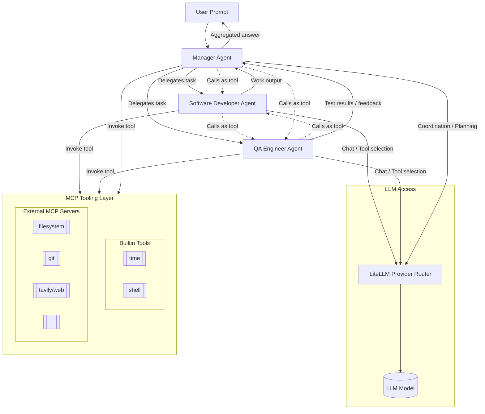
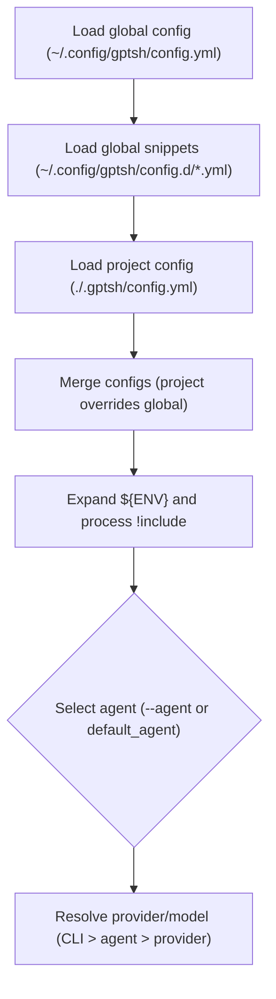
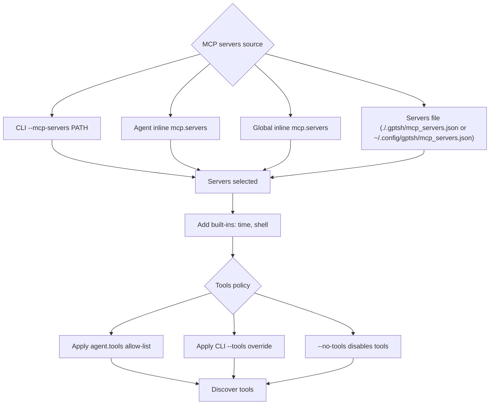
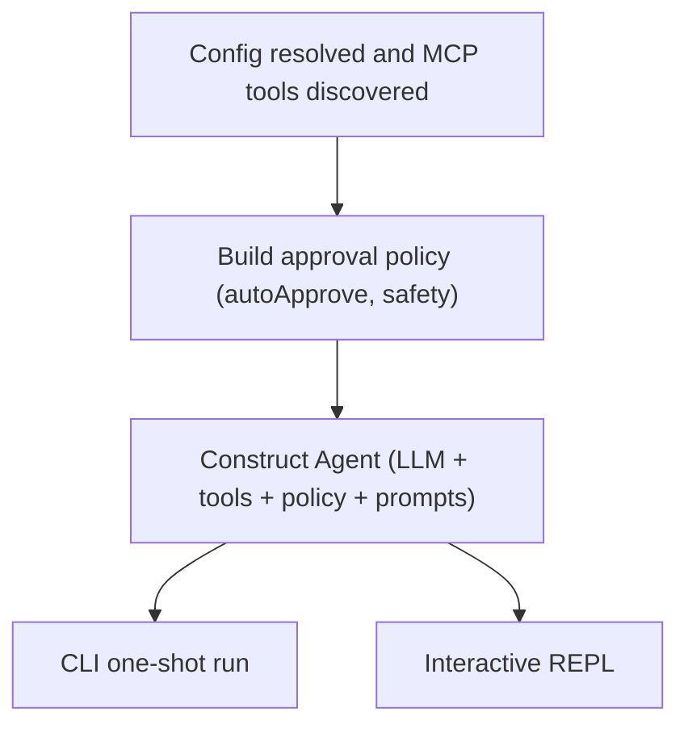

# gptsh

A modern, modular shell assistant powered by LLMs with first-class Model Context Protocol (MCP) support.

- Async-first core
- Configurable providers via LiteLLM (OpenAI, Claude, Perplexity, Azure, etc.)
- MCP tools discovery and invocation with resilient lifecycle
- Interactive REPL with persistent MCP sessions and per-session chat history
- Colored REPL prompt showing "<agent>|<model>>" and support for initial prompt via stdin or arg
- Clean CLI UX with progress spinners and Markdown rendering

See AGENTS.md for development standards, coding conventions, and architecture details.

## Goal

There's already many CLI tools for interaction with LLMs. Some of them are
designed for coding (eg. Aider, Opencode, Codex), some others are meant for
sysadmin or generic use (eg. shell-gpt).
Having a tool is no longer an issue, with LLMs almost anyone can vibe-code
anything they like, even people without prior experience. We can argue about
quality and security of resulting products but the fact is that over time, as
LLMs are getting rapidly better as well as people are finding new approaches,
it will become irrelevant.

As this world evolves quickly, it is clear that it is not about tools; it is
about **human creativity**, ideas, and building a modular architecture using
blocks that can be replaced at any time.

gptsh aims to be a versatile, simple, and extensible tool built around the idea of
agents, where an agent is an LLM with a role-specific prompt that defines its behavior
and an assigned set of tools (using MCP).

It is meant to be simple—mostly plug-and-play—with examples and proven setups
and usage patterns shared by others.

You can easily use it with a single/default agent and a Claude-like
`mcp_servers.json` as-is.

Or you can define multiple agents with different roles and tools and use them as
needed.

Or you can set up a more complex environment with multiple agents (e.g.,
Software Developer, QA Engineer) and one agent (Manager) that receives the user
prompt, orchestrates work, and delegates tasks to these agents. Even an agent can be
invoked as a tool from another agent.



## Installation

We use uv/uvx for environment management and running:

### Python package

#### UV

Best way to install `gptsh` is using `uv tool`

For the latest **stable release**:
```bash
uv tool install gptsh-cli
```

To install the **latest unreleased (main branch) version**:
```bash
uv tool install git+https://github.com/fpytloun/gptsh.git@main
```


This will put executables into `~/.local/bin` so make sure it is in your `$PATH`

```bash
export PATH="${PATH}:~/.local/bin"
```

#### UVX

If you prefer uvx, then use this command:

```bash
uvx --from gptsh-cli gptsh --help
```

You can also set alias:

```sh
alias gptsh="uvx --from gptsh-cli gptsh"
```

Not pinning version will cause that `uvx` will try to update on each run so it
will increase startup time. You can set version like this (check for latest
release first):

```sh
uvx --from gptsh-cli==<version> gptsh
```

## Quick Start

Single-shot prompt:

```bash
gptsh "Summarize the latest project changes"
```

Pipe input from stdin:

```bash
git diff | gptsh "Explain the changes and suggest a commit message"
```

Plain text output (default is markdown):

```bash
gptsh -o text --no-progress "Generate shell command to rename all files in directory and prefix them with xxx_"
```

## CLI Usage

```text
Usage: gptsh [OPTIONS] [PROMPT]

  gptsh: Modular shell/LLM agent client.

Options:
  --provider TEXT               Override LiteLLM provider from config
  --model TEXT                  Override LLM model
  --agent TEXT                  Named agent preset from config
  --config TEXT                 Specify alternate config path
  --stream / --no-stream
  --progress / --no-progress
  --debug
  -v, --verbose                 Enable verbose logging (INFO)
  --mcp-servers TEXT            Override path to MCP servers file
  --list-tools
  --list-providers              List configured providers
  --list-agents                 List configured agents and their tools
  -o, --output [text|markdown]  Output format
  --no-tools                    Disable MCP tools (discovery and execution)
  --tools TEXT                  Comma/space-separated MCP server labels to
                                allow (others skipped)
  -i, --interactive             Run in interactive REPL mode
  -h, --help                    Show this message and exit.
```

## MCP Tools

List available tools discovered from configured MCP servers:

```bash
gptsh --list-tools
```

Disable tools entirely:

```bash
gptsh --no-tools "Explain which tools are available to you"
```

Allow only specific MCP servers (whitelist):

```bash
gptsh --tools serena --list-tools
gptsh --tools serena "Only Serena tools will be available"
```

This flag supports multiple labels with comma/space separation:

```bash
uvx gptsh --tools serena,tavily
```

## Configuration

Config is merged from:
1) Global: ~/.config/gptsh/config.yml
2) Global snippets: ~/.config/gptsh/config.d/*.yml (merged in lexicographic order)
3) Project: ./.gptsh/config.yml

Merge semantics:
- The per-project config is merged into the global config (project overrides global where keys overlap).
- MCP servers definitions follow precedence (see below) and are not merged across files; the first matching source wins. Practically, a project-local `./.gptsh/mcp_servers.json` takes precedence over the user-level `~/.config/gptsh/mcp_servers.json`.



Environment variables may be referenced using ${VAR_NAME} (and ${env:VAR_NAME} in mcp_servers.json is normalized to ${VAR_NAME}). YAML also supports a custom !include tag resolved relative to the including file, with wildcard support. For example:
- agents: !include agents.yml
- agents: !include agents/*

### MCP

You can configure MCP servers inline in YAML or via a Claude-compatible JSON file. Only one servers definition is used at a time with this precedence:
1) CLI parameter (e.g., `--mcp-servers mcp_servers.json`)
2) Per-agent inline YAML `agents.<name>.mcp.servers`
3) Global inline YAML `mcp.servers`
4) Servers file (first existing): `./.gptsh/mcp_servers.json` then `~/.config/gptsh/mcp_servers.json`

Inline YAML is equivalent in structure to the JSON file and enables self-contained agents: you can define the required MCP servers directly on an agent and avoid relying on global server files. This lets a project ship agents that "just work" without external setup.



Inline YAML mapping (preferred):
```yaml
mcp:
  servers:
    tavily:
      transport: { type: sse, url: "https://api.tavily.com/mcp" }
      credentials:
        headers:
          Authorization: "Bearer ${TAVILY_API_KEY}"
    filesystem:
      transport: { type: stdio }
      command: uvx
      args: ["mcp-filesystem", "--root", "."]
      env: {}
```

You can also embed JSON as a string. If the JSON includes a top-level `mcpServers`, it will be unwrapped automatically:
```yaml
mcp:
  servers: |
    {"mcpServers": {"tavily": {"transport": {"type": "sse", "url": "https://api.tavily.com/mcp"}}}}
```

Built-in in-process servers `time` and `shell` are always available and are merged into your configuration (inline or file-based). To limit which servers/tools are used at runtime, use the `tools` allow-list on the agent (e.g., `tools: ["git"]`). This filters the merged set to only those servers. To completely override or effectively disable built-ins for an agent, set `tools` to a list without them.

Per-agent tools allow-list:
- Define `agents.<name>.tools` as a list of MCP server labels to expose to that agent (e.g., `tools: ["tavily", "serena"]`).
- This is a filter over all configured MCP servers (from inline/global or servers file). You can override it at runtime with `--tools`.



### Project Structure (overview)

```
gptsh/
  cli/
    entrypoint.py        # thin CLI, defers to core
    utils.py             # CLI helpers: agent resolution, listings
  core/
    approval.py          # DefaultApprovalPolicy
    config_api.py        # config helpers (now use core.models)
    config_resolver.py   # build_agent
    exceptions.py        # ToolApprovalDenied
    logging.py           # logger setup
    models.py            # typed config models (moved from domain/)
    progress.py          # RichProgressReporter
    repl.py              # interactive REPL (uses runner)
    runner.py            # unified run_turn (stream + tools + fallback)
    session.py           # ChatSession (tool loop, params)
    stdin_handler.py     # safe stdin handling
  llm/
    litellm_client.py    # LiteLLMClient + stream chunk logging
    chunk_utils.py       # extract_text
    tool_adapter.py      # tool specs + tool_calls parsing
  mcp/
    client.py            # persistent sessions
    manager.py           # MCPManager
    api.py               # facade
    tools_resolver.py    # ToolHandle resolver
    builtin/
      time.py, shell.py  # builtin tools
  tests/                 # pytest suite (unit tests)
```

### Example config.yml

```yaml
default_agent: default
default_provider: openai

providers:
  openai:
    model: openai/gpt-4.1

agents:
  default:
    model: gpt-4.1
    output: markdown
    autoApprove: ["time"]
    prompt:
      system: "You are a helpful assistant called gptsh."
  cli:
    output: text
    model: "gpt-4.1-mini"
    tools: ["shell"]
    prompt:
      system: |
        You are expert system administrator with deep knowledge of Linux and Unix-based systems.
        You have in two modes: either you execute command using tool (default if tool is available) or you provide command that user can execute.

        **Instructions (tool):**
        - If you have shell execution tool available, call that tool to execute command by yourself
        - After command is completed, check exit code and return tool output
        - Return only tool output as it would return if executed directly
        - Do not make up output of tool and pretend you executed something!

        **Instructions (without tool):**
        - Return command that can be executed as is on given system and does what user wants
        - Make sure your output is compatible with POSIX-compliant shell
        - Return only ready to be executed command and nothing else!
        - It is likely to be passed to sh/bash via stdin
        - If command is destructive, make sure to use echo/read for user confirmation unless user commands to skip confirmation
  hello:
    tools: []
    prompt:
      user: "Hello, are you here?"
```

Agents at a glance:
- An agent bundles LLM + tools + prompt. The prompt includes a system prompt and may also include a pre-defined user prompt so you do not have to pass a prompt for routine tasks (e.g., a `changelog` or `committer` agent).

For full example, see `examples` directory.

### Example MCP servers file (mcp_servers.json)

```json
{
  "mcpServers": {
    "sequentialthinking": {
      "args": [
        "run",
        "--rm",
        "-i",
        "mcp/sequentialthinking"
      ],
      "autoApprove": [
        "sequentialthinking"
      ],
      "command": "docker"
    },
    "filesystem": {
      "args": [
        "run",
        "-i",
        "--rm",
        "--mount",
        "type=bind,src=${HOME},dst=${HOME}",
        "mcp/filesystem",
        "${HOME}"
      ],
      "autoApprove": [
        "directory_tree",
        "get_file_info",
        "list_allowed_directories",
        "list_directory",
        "read_file",
        "read_multiple_files",
        "search_files"
      ],
      "command": "docker"
    },
    "git": {
      "args": [
        "mcp-server-git"
      ],
      "autoApprove": [
        "git_diff",
        "git_diff_staged",
        "git_diff_unstaged",
        "git_log",
        "git_show",
        "git_status",
        "git_branch"
      ],
      "command": "uvx"
    },
    "tavily": {
      "args": [
        "run",
        "-i",
        "--rm",
        "-e",
        "TAVILY_API_KEY",
        "mcp/tavily"
      ],
      "autoApprove": [
        "tavily-search",
        "tavily-extract",
        "tavily-crawl",
        "tavily-map"
      ],
      "command": "docker",
      "env": {
        "TAVILY_API_KEY": "${TAVILY_API_KEY}"
      }
    }
  }
}
```

- Use ${VAR} for env expansion.
- autoApprove lists tools that should be pre-approved by the UI.

You can override servers files with the CLI:

```bash
gptsh --mcp-servers ./.gptsh/mcp_servers.json --list-tools
```

You can restrict which servers load by using:

```bash
gptsh --tools serena "Only serena’s tools are available"
```

## Examples

Ask with project context piped in:

```bash
rg -n "async def" -S | gptsh "What async entry points exist and what do they do?"
```

Use Text output for plain logs:

```bash
gptsh -o text "Return a one-line status summary"
```

Use a different provider/model:

```bash
gptsh --provider openai --model gpt-4o-mini "Explain MCP in a paragraph"
```

Interactive REPL:

- Start a REPL:
```bash
gptsh -i
```

- Provide an initial prompt and continue in REPL:
```bash
gptsh -i "Say hello"
```

- Pipe stdin as the initial prompt and continue in REPL:
```bash
echo "Summarize this input" | gptsh -i
```

REPL slash-commands:
- /exit or /quit — exit the REPL
- /model <model> — switch the active model
- /agent <agent> — switch the active agent and reload tools according to agent config
- /reasoning_effort [minimal|low|medium|high] — adjust reasoning effort
(Tab completion works for slash-commands and agent names.)

Disable progress UI:

```bash
gptsh --no-progress "Describe current repo structure"
```

## Exit Codes

- 0   success
- 1   generic failure
- 2   configuration error (invalid/missing)
- 3   MCP connection/spawn failure (after retries)
- 4   tool approval denied
- 124 operation timeout
- 130 interrupted (Ctrl-C)

## Development

### Install

```bash
uv venv
UV_CACHE_DIR=.uv-cache uv pip install -e .[dev]
```

Run:

```bash
UV_CACHE_DIR=.uv-cache uv run gptsh --help
``````

### Linting and Tests

Ruff is configured as the primary linter in `pyproject.toml` (line length 100, isort enabled). Run lint + tests before committing:

```bash
UV_CACHE_DIR=.uv-cache uv run ruff check
UV_CACHE_DIR=.uv-cache uv run pytest
```

Project scripts:

- Entry point: gptsh = "gptsh.cli.entrypoint:main"
- Keep code async; don’t log secrets; prefer uv/uvx for all dev commands.

For full development instructions, read `AGENTS.md`.

## Troubleshooting

- No tools found: check --mcp-servers path, server definitions, and network access.
- Stuck spinner: use --no-progress to disable UI or run with --debug for logs.
- Markdown output looks odd: try -o text to inspect raw content.

---
## Roadmap

- Session management: persist one-shot and REPL conversations as sessions you can return to later.
- Workflow orchestration: define runnable workflows composed of steps (shell/Python/agents), similar to invoking targets with simple task runners.
- SRE copilot focus: practical day-to-day automation with safe approvals and rich tool integrations.

For full roadmap see `TODO.md`

---
Feedback and contributions are welcome!
