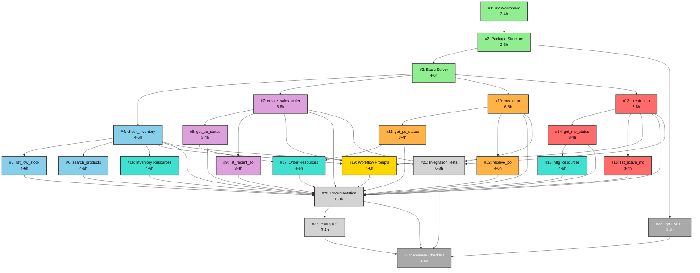

# MCP Server Implementation Plan

This document tracks the implementation of the Katana MCP Server as defined in
[ADR-010](../adr/0010-katana-mcp-server.md).

## ⚠️ Issue Number Mapping

**IMPORTANT**: This document uses internal sequential issue numbers (#1-#24) for
clarity, but the actual GitHub issues are numbered #32-#55.

**Quick Reference**:

- Internal #1 →
  [GitHub #32](https://github.com/dougborg/katana-openapi-client/issues/32)
- Internal #2 →
  [GitHub #33](https://github.com/dougborg/katana-openapi-client/issues/33)
- Internal #3 →
  [GitHub #34](https://github.com/dougborg/katana-openapi-client/issues/34)
- **Formula**: GitHub Issue # = Internal # + 31

## ⚠️ IMPORTANT: Domain Helpers Dependency

**NEW REQUIREMENT** (Added 2025-10-22): All MCP tool implementations (#35-46) now depend
on domain helpers
([Issue #60](https://github.com/dougborg/katana-openapi-client/issues/60)) being
implemented first.

**Why**: Domain helpers provide reusable business logic that serves as the foundation
for MCP tools. This creates a clean 3-layer architecture:

```
Raw OpenAPI Client → Domain Helpers → MCP Tools
```

**Impact on Timeline**:

- Domain helpers: 38-54 hours (1-1.5 weeks)
- MCP tools become 30-50% faster to implement (thin wrappers)
- **Net result**: Faster overall delivery + better code quality

**Updated Dependency Chain**:

```
#32 (workspace) → #33 (package) → #60 (domain helpers) → #34 (basic server) → #35-46 (tools)
```

See [DOMAIN_HELPERS_IMPLEMENTATION_PLAN.md](../DOMAIN_HELPERS_IMPLEMENTATION_PLAN.md)
for details.

## Overview

- **Total Issues**: 24 (GitHub #32-#55)
- **Total Estimate**: 110-146 hours (~3 weeks with 2-3 developers)
- **Architecture**: Monorepo with uv workspace
- **Target**: v0.1.0 MVP release

## Milestones

### Milestone 1: Infrastructure Setup (Week 1)

**Goal**: Repository structure and basic server ready

- Issue #1: Set up uv workspace
- Issue #2: Create package structure
- Issue #3: Basic FastMCP server

**Completion Criteria**: Server runs and authenticates, ready for tools

### Milestone 2: Core Tools (Week 1-2)

**Goal**: All 12 tools implemented and tested

**Inventory Tools** (Issues #4-6):

- Issue #4: check_inventory
- Issue #5: list_low_stock_items
- Issue #6: search_products

**Sales Order Tools** (Issues #7-9):

- Issue #7: create_sales_order
- Issue #8: get_sales_order_status
- Issue #9: list_recent_sales_orders

**Purchase Order Tools** (Issues #10-12):

- Issue #10: create_purchase_order
- Issue #11: get_purchase_order_status
- Issue #12: receive_purchase_order

**Manufacturing Tools** (Issues #13-15):

- Issue #13: create_manufacturing_order
- Issue #14: get_manufacturing_order_status
- Issue #15: list_active_manufacturing_orders

**Completion Criteria**: All 12 tools working with tests

### Milestone 3: Resources & Prompts (Week 3)

**Goal**: MCP resources and workflow prompts

- Issue #16: Inventory resources
- Issue #17: Order resources
- Issue #18: Manufacturing resources
- Issue #19: Workflow prompts

**Completion Criteria**: 5 resources + 3 prompts implemented

### Milestone 4: Documentation & Release (Week 3)

**Goal**: Production-ready v0.1.0 release

- Issue #20: Comprehensive documentation
- Issue #21: Integration tests
- Issue #22: Usage examples
- Issue #23: PyPI publishing setup
- Issue #24: Release checklist

**Completion Criteria**: v0.1.0 published to PyPI

## Dependency Graph



## Parallelization Strategy

### Can Work in Parallel (No Dependencies Between Groups)

**Group A - Inventory Tools** (After #3):

- #4, then #5 and #6 can run in parallel

**Group B - Sales Order Tools** (After #3):

- #7, then #8 and #9 can run in parallel

**Group C - Purchase Order Tools** (After #3):

- #10, then #11 and #12 can run in parallel

**Group D - Manufacturing Tools** (After #3):

- #13, then #14 and #15 can run in parallel

**Maximum Parallelization**: After #3 is complete, 4 agents can work simultaneously on
#4, #7, #10, and #13.

### Must Run Sequentially

1. #1 → #2 → #3 (Infrastructure setup)
1. Each tool group's first issue must complete before related issues
1. Resources (#16-18) require their respective tools
1. Documentation (#20-22) requires all tools complete
1. Release (#24) requires everything

## Critical Path

The longest dependency chain determines minimum completion time:

```
#1 → #2 → #3 → #7 → #8 → #17 → #20 → #22 → #24
2h + 3h + 6h + 8h + 4h + 6h + 8h + 4h + 6h = 47 hours minimum
```

With 3 developers working in parallel on independent tasks, realistic completion is
**2-3 weeks**.

## Assignment Strategy

### Week 1 - Infrastructure & First Tools

**Agent 1** (Infrastructure specialist):

- #1: UV workspace setup
- #2: Package structure
- #3: Basic server
- Then: #16 (Inventory resources)

**Agent 2** (Inventory & Purchase Orders):

- Wait for #3
- #4: check_inventory
- #5: list_low_stock_items
- #10: create_purchase_order

**Agent 3** (Sales & Manufacturing):

- Wait for #3
- #7: create_sales_order
- #13: create_manufacturing_order

### Week 2 - Complete Tools & Resources

**Agent 1**:

- #6: search_products
- #17: Order resources
- #23: PyPI setup

**Agent 2**:

- #11: get_purchase_order_status
- #12: receive_purchase_order
- #18: Manufacturing resources

**Agent 3**:

- #8: get_sales_order_status
- #9: list_recent_sales_orders
- #14: get_manufacturing_order_status
- #15: list_active_manufacturing_orders

### Week 3 - Polish & Release

**Agent 1**:

- #20: Comprehensive documentation

**Agent 2**:

- #21: Integration tests

**Agent 3**:

- #19: Workflow prompts
- #22: Usage examples

**All Agents**:

- #24: Release checklist (collaborative final testing)

## Issue Dependencies Reference

Use this when creating issues to set proper `blocked-by` labels:

| Issue | Blocked By         | Blocks                     |
| ----- | ------------------ | -------------------------- |
| #1    | -                  | #2                         |
| #2    | #1                 | #3, #23                    |
| #3    | #2                 | #4, #7, #10, #13           |
| #4    | #3                 | #5, #6, #16, #19, #20, #21 |
| #5    | #4                 | #20                        |
| #6    | #4                 | #20                        |
| #7    | #3                 | #8, #9, #19, #20, #21      |
| #8    | #7                 | #17, #20                   |
| #9    | #7                 | #20                        |
| #10   | #3                 | #11, #12, #20, #21         |
| #11   | #10                | #17, #20                   |
| #12   | #10                | #20                        |
| #13   | #3                 | #14, #15, #19, #20, #21    |
| #14   | #13                | #18, #20                   |
| #15   | #13                | #20                        |
| #16   | #4                 | #20                        |
| #17   | #8, #11            | #20                        |
| #18   | #14                | #20                        |
| #19   | #4, #7, #13        | #20                        |
| #20   | All tools          | #22, #24                   |
| #21   | #4, #7, #10, #13   | #24                        |
| #22   | #20                | #24                        |
| #23   | #2                 | #24                        |
| #24   | #20, #21, #22, #23 | -                          |

## Labels

Each issue should have these labels:

- **Type**: `infrastructure`, `tool`, `resource`, `prompt`, `documentation`, `testing`,
  `release`
- **Domain**: `inventory`, `sales-orders`, `purchase-orders`, `manufacturing`,
  `mcp-server`
- **Milestone**: `phase-1`, `phase-2` (future)
- **Priority**: `p0-critical`, `p1-high`, `p2-medium`, `p3-low`

## Next Steps

1. Create GitHub milestone: "MCP Server v0.1.0 MVP"
1. Create labels in repository
1. Create all 24 issues with proper dependencies
1. Set up GitHub Project board with dependency visualization
1. Assign issues to agents based on availability
