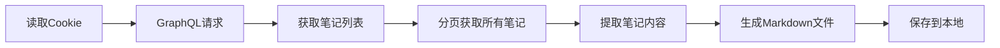

# LeetCode 笔记同步工具

<div align="center">

📝 自动将你的 LeetCode 中国版笔记同步到本地 Obsidian/Markdown 笔记库

[](https://www.python.org/)
[](LICENSE)

</div>

---

## 📖 项目简介

这是一个 Python 脚本，可以自动从 **LeetCode 中国版**（leetcode.cn）爬取你的所有题目笔记，并同步到本地的 Markdown 文件中，方便在 Obsidian 等笔记工具中管理和查阅。

### ✨ 主要特性

- 🚀 **全自动同步** - 一键获取所有题目笔记
- 📦 **增量更新** - 智能对比，只更新有变化的笔记
- 🎯 **完整元数据** - 包含题目ID、标题、链接等信息
- 📝 **Markdown 格式** - 原生支持 Obsidian 等笔记工具
- 🔄 **分页获取** - 自动处理大量笔记的分页加载
- 🛡️ **安全可靠** - Cookie 保存在本地 `.env` 文件中

---

## 🎯 功能展示

### 同步前（LeetCode 网页）
```
在 LeetCode 上有 12 条题目笔记，散落在各个题目下
```

### 同步后（本地 Obsidian）
```
📁 Obsidian Vault/
  └── 📁 Leetcode Notes/
      └── 📁 MyNotebook/
          ├── 📄 27. 移除元素.md
          ├── 📄 58. 最后一个单词的长度.md
          ├── 📄 165. 比较版本号.md
          ├── 📄 976. 三角形的最大周长.md
          ├── 📄 1486. 数组异或操作.md
          ├── 📄 2221. 数组的三角和.md
          ├── 📄 2236. 判断根结点是否等于子结点之和.md
          ├── 📄 2413. 最小偶倍数.md
          ├── 📄 3005. 最大频率元素计数.md
          ├── 📄 3074. 重新分装苹果.md
          ├── 📄 3147. 从魔法师身上吸取的最大能量.md
          └── 📄 3688. 偶数的按位或运算.md
```

### 生成的笔记格式
```markdown
---
id: 1
title: 两数之和
source: https://leetcode.cn/problems/two-sum/
tags: [LeetCode, 算法]
---

# 1. 两数之和

## 题目链接
[两数之和](https://leetcode.cn/problems/two-sum/)

## 解题笔记
这里是你在 LeetCode 上写的笔记内容...
```

---

## 🔧 技术原理

### 核心技术栈
- **Python 3.9+** - 编程语言
- **Requests** - HTTP 请求库
- **GraphQL** - 与 LeetCode API 交互
- **python-dotenv** - 环境变量管理

### 工作流程



### API 说明

本工具使用 LeetCode 的 GraphQL API：

**端点**: `https://leetcode.cn/graphql/`

**核心查询**: `noteAggregateNote`

**支持的笔记类型**:
- `QUESTION_NOTE` - 题目笔记
- `LEETBOOK_NOTE` - 教程笔记
- `ALL` - 所有类型（当前版本不支持）

**分页机制**:
- `limit`: 每次请求获取的笔记数量（默认 100）
- `skip`: 跳过前 N 条笔记
- `orderBy`: 排序方式（`DESCENDING` - 最新在前）

---

## 📦 安装与配置

### 1. 克隆项目

```bash
git clone <your-repo-url>
cd LeetCodeUpdate
```

### 2. 安装依赖

```bash
pip install requests python-dotenv
```

或使用 `requirements.txt`（如果有）:
```bash
pip install -r requirements.txt
```

### 3. 获取 Cookie

这是最关键的一步！你需要从浏览器中获取 LeetCode 的登录 Cookie。

#### 详细步骤：

1. **打开浏览器并登录 LeetCode**
   - 访问 [https://leetcode.cn/](https://leetcode.cn/)
   - 登录你的账号

2. **访问笔记页面**
   - 访问 [https://leetcode.cn/notes/my-notes/](https://leetcode.cn/notes/my-notes/)
   - **确认能看到你的笔记列表**

3. **打开开发者工具**
   - 按 `F12` (Windows) 或 `Cmd + Option + I` (Mac)
   - 切换到 **Network**（网络）标签

4. **刷新页面并找到请求**
   - 按 `Cmd + R` / `Ctrl + R` 刷新页面
   - 在左侧请求列表中找到 URL 包含 `graphql` 的请求
   - 点击这个请求

5. **复制 Cookie**
   - 在右侧找到 **Headers**（请求头）标签
   - 滚动到 **Request Headers**（请求标头）部分
   - 找到 `Cookie:` 这一行
   - 复制完整的 Cookie 字符串

6. **提取关键字段**

   从 Cookie 字符串中提取以下三个值：
   
   ```
   csrftoken=xxxxxxxxxxxxxxxxxxxxxxxxxxxxxxxx
   sl-session=yyyyyyyyyyyyyyyyyyyyyyyy==
   LEETCODE_SESSION=zzzzzz.zzzzzzzzzzzzzzzzzzzzzz.zzzzzz
   ```

### 4. 配置环境变量

在项目根目录创建 `.env` 文件：

```bash
touch .env
```

编辑 `.env` 文件，填入以下内容：

```env
# LeetCode Cookie 配置（必填）
LEETCODE_CSRFTOKEN="你的csrftoken值"
LEETCODE_SLSSESSION="你的sl-session值"
LEETCODE_SESSION="你的LEETCODE_SESSION值"

# Obsidian 笔记保存路径（必填）
OBSIDIAN_PATH="/Users/your-name/Documents/Obsidian Vault/Leetcode Notes/MyNotebook"

# 以下为可选配置（如果不使用账号密码登录可忽略）
LEETCODE_USERNAME=your-username
LEETCODE_PASSWORD=your-password
```

**⚠️ 重要提示：**
- 所有三个 Cookie 字段（`csrftoken`、`sl-session`、`LEETCODE_SESSION`）都必须填写
- `LEETCODE_SESSION` 是最重要的，缺少它会导致未登录状态
- Cookie 会过期，如果同步失败，请重新获取
- `.env` 文件包含敏感信息，请勿上传到公开仓库

### 5. 设置笔记保存路径

修改 `.env` 中的 `OBSIDIAN_PATH` 为你的实际路径：

```env
# macOS / Linux 示例
OBSIDIAN_PATH="/Users/bob/Documents/Obsidian Vault/LeetCode"

# Windows 示例
OBSIDIAN_PATH="C:/Users/Bob/Documents/Obsidian Vault/LeetCode"
```

---

## 🚀 使用方法

### 基本使用

运行主程序开始同步：

```bash
python3 leetcode_notes_crawler.py
```

### ⭐ 定时自动同步（推荐）

让程序每天自动运行，无需手动执行！

#### 🎉 快速设置（交互式）

```bash
./setup_schedule.sh
```

然后按照提示选择方案即可。

#### 方法1：launchd（macOS 最推荐）

```bash
chmod +x setup_launchd.sh
./setup_launchd.sh
```

系统会自动在每天早上 9:00 同步笔记。

#### 方法2：cron（macOS/Linux）

```bash
chmod +x setup_cron.sh
./setup_cron.sh
```

#### 方法3：Python schedule 库（跨平台）

```bash
pip install schedule
python3 scheduler.py
```

📝 **详细说明**：请查阅 [定时任务设置指南.md](定时任务设置指南.md)

### 预期输出

```
✅ 隐私配置加载完成，开始爬取...

📋 正在通过GraphQL API爬取笔记题目列表...

🔍 尝试获取类型: QUESTION_NOTE
   请求中（已获取: 0）...
   📈 当前类型共 12 条笔记
   累计获取 5/12 条
   请求中（已获取: 5）...
   📈 当前类型共 12 条笔记
   累计获取 10/12 条
   请求中（已获取: 10）...
   📈 当前类型共 12 条笔记
   累计获取 12/12 条
   📌 已识别：1486. 数组异或操作
   📌 已识别：3147. 从魔法师身上吸取的最大能量
   ...

✅ 共爬取到 12 个有效笔记题目

📝 处理第 1/12 个：1486. 数组异或操作
✅ 已创建

...

🎉 所有笔记同步完成！
```

### 高级功能

#### 1. 调试用户信息

验证 Cookie 是否有效：

```bash
python3 verify_user.py
```

输出示例：
```
✅ 当前Cookie对应的用户:
   用户名: practical-hugle5r2
   真实姓名: sychostar
   是否登录: True
   是否会员: False
```

#### 2. 调试笔记获取

详细查看笔记数据：

```bash
python3 debug_notes.py
```

#### 3. API 探测工具

自动尝试多种 API 端点：

```bash
python3 api_detector.py
```
#### 4. Obdisian内部显示元数据

***工具:***  
依赖Obdisian内部插件**Dataview**([其项目地址](https://github.com/blacksmithgu/obsidian-dataview))


***操作方法:***  
打开Obsidian -> 打开左下角设置 -> 在第三方插件中关闭安全模式 
-> 在插件市场中安装Dataview -> 在笔记目录外写入Index.md文件

Index.md参考以下形式：

```yml
TABLE 
	id AS "题号", 
	title AS "题目名称", 
	difficulty AS "难度", 
	tags AS "标签", 
	file.mtime AS "最后更新时间" FROM #LeetCode 
	SORT id ASC
```


***扩展功能:***  
若想要显示其他元数据，可以在leetcode_notes_crawler.py中添加获取其他元数据的功能   
（***To be continued...***）


---

## ⚙️ 配置说明

### 环境变量详解

| 变量名 | 说明 | 是否必填 | 示例 |
|--------|------|----------|------|
| `LEETCODE_CSRFTOKEN` | CSRF 保护令牌 | ✅ 必填 | `yW7xzWXpFToYoyCByY4a...` |
| `LEETCODE_SLSSESSION` | 会话令牌 | ✅ 必填 | `8kFQNi3U+WjaasRQ8jbt1Q==` |
| `LEETCODE_SESSION` | 登录会话（JWT） | ✅ 必填 | `eyJhbGciOiJIUzI1NiIs...` |
| `OBSIDIAN_PATH` | 笔记保存路径 | ✅ 必填 | `/path/to/your/notes` |
| `LEETCODE_USERNAME` | LeetCode 用户名 | ❌ 可选 | `your-username` |
| `LEETCODE_PASSWORD` | LeetCode 密码 | ❌ 可选 | `your-password` |

### 程序配置参数

在 `leetcode_notes_crawler.py` 中可以修改：

```python
# GraphQL API 地址
GRAPHQL_API = "https://leetcode.cn/graphql/"

# 请求间隔（秒），避免反爬
REQUEST_DELAY = 2

# 每次获取的笔记数量
limit = 100
```

---

## 🔍 故障排查

### 常见问题

#### 1. ❌ 未找到任何笔记

**可能原因**:
- Cookie 过期或无效
- Cookie 对应的不是你的账号
- 你的账号确实没有笔记

**解决方案**:
```bash
# 1. 验证用户信息
python3 verify_user.py

# 2. 如果显示未登录，重新获取 Cookie
# 3. 确保在笔记页面上获取 Cookie
```

#### 2. ❌ Cookie 无效/未登录

**症状**: `是否登录: False`

**解决方案**:
- 确保填写了完整的三个 Cookie 字段
- 特别检查 `LEETCODE_SESSION` 是否填写
- 在浏览器无痕模式中重新登录并获取 Cookie

#### 3. ❌ 只同步了部分笔记

**已修复**: 之前的版本存在分页 bug，现已修复。
- 确保使用最新版本的代码
- `skip` 计算方式已从 `skip += limit` 改为 `skip = len(type_notes)`

#### 4. ⚠️ SSL 警告

**症状**:
```
NotOpenSSLWarning: urllib3 v2 only supports OpenSSL 1.1.1+
```

**说明**: 这只是警告，不影响功能。如需消除：
```bash
# 方法1: 降级 urllib3
pip install 'urllib3<2.0'

# 方法2: 升级系统 OpenSSL（推荐但复杂）
```

#### 5. ❌ 无法创建笔记文件夹

**解决方案**:
- 检查 `OBSIDIAN_PATH` 路径是否正确
- 确保有写入权限
- 手动创建目标文件夹

### 获取帮助

如果遇到其他问题：

1. 运行调试工具查看详细信息
2. 检查 `.env` 配置是否正确
3. 在浏览器中确认笔记页面能正常访问
4. 提交 Issue 并附上错误日志（记得删除敏感信息）

---

## 📂 项目结构

```
LeetCodeUpdate/
├── README.md                     # 项目说明文档（本文件）
├── 定时任务设置指南.md          # 定时任务详细教程
├── 抓包指南.md                   # Cookie 获取详细教程
├── .env                          # 环境变量配置（需自行创建）
├── .gitignore                    # Git 忽略文件配置
├── requirements.txt              # Python 依赖包
├── leetcode_notes_crawler.py    # 主程序 - 笔记同步脚本
├── scheduler.py                  # 定时调度器 (Python schedule)
├── setup_schedule.sh             # 交互式设置向导
├── setup_launchd.sh              # launchd 自动设置脚本
├── setup_cron.sh                 # cron 自动设置脚本
├── verify_user.py                # 工具 - 验证用户信息
├── debug_notes.py                # 工具 - 调试笔记获取
└── api_detector.py               # 工具 - API 端点探测
```

### 文件说明

| 文件 | 功能 | 用途 |
|------|------|------|
| `leetcode_notes_crawler.py` | 主程序 | 执行笔记同步 |
| `scheduler.py` | 定时调度器 | Python 进程常驻，定时执行 |
| `setup_schedule.sh` | 设置向导 | 交互式选择定时方案 |
| `setup_launchd.sh` | launchd 设置 | 自动配置 macOS 定时任务 |
| `setup_cron.sh` | cron 设置 | 自动配置 cron 定时任务 |
| `verify_user.py` | 调试工具 | 验证 Cookie 有效性 |
| `debug_notes.py` | 调试工具 | 查看详细笔记数据 |
| `api_detector.py` | 调试工具 | 自动探测可用 API |
| `.env` | 配置文件 | 存储敏感信息（需手动创建）|
| `定时任务设置指南.md` | 教程 | 定时任务详细说明 |
| `抓包指南.md` | 教程 | Cookie 获取步骤 |

---

## 🔒 安全说明

### 隐私保护

- ✅ 所有数据保存在本地，不会上传到任何服务器
- ✅ Cookie 存储在 `.env` 文件中，建议加入 `.gitignore`
- ✅ 不使用账号密码登录，只使用 Cookie
- ⚠️ 不要将 `.env` 文件上传到公开仓库

### `.gitignore` 配置

确保你的 `.gitignore` 包含：

```gitignore
# 敏感信息
.env
.env.local
.env.*.local

# Python
__pycache__/
*.py[cod]
*$py.class
*.so

# IDE
.vscode/
.idea/
*.swp
*.swo

# 系统文件
.DS_Store
Thumbs.db
```

---

## 🛠️ 开发指南

### 添加新功能

如果你想扩展功能，可以参考以下结构：

```python
# 1. 在 leetcode_notes_crawler.py 中
def your_new_feature(session):
    """你的新功能"""
    headers = {
        "Content-Type": "application/json",
        "X-CSRFToken": MANUAL_COOKIES["csrftoken"],
        "Cookie": f"csrftoken={MANUAL_COOKIES['csrftoken']}; ..."
    }
    
    # 你的实现...
    
# 2. 在 main 函数中调用
if __name__ == "__main__":
    # ... 现有代码 ...
    your_new_feature(session)
```

### GraphQL 查询调试

使用 GraphQL Playground 测试查询：
1. 访问 [https://leetcode.cn/graphql/](https://leetcode.cn/graphql/)
2. 在浏览器开发者工具中复制 Cookie 到请求头
3. 测试你的查询

---

## 📊 性能说明

- **速度**: 约 2-3 秒/条笔记（受 `REQUEST_DELAY` 影响）
- **限制**: 理论上无笔记数量限制（支持分页）
- **内存**: 极低，流式处理笔记

### 优化建议

如果你有大量笔记（100+ 条），可以：

1. 减少 `REQUEST_DELAY`（但可能触发反爬）
2. 增加 `limit` 值（每次请求更多笔记）
3. 使用多线程（需自行实现）

---

## 🤝 贡献指南

欢迎提交 Issue 和 Pull Request！

### 提交 Bug

请提供：
- 错误日志（删除敏感信息）
- 运行环境（Python 版本、操作系统）
- 复现步骤

### 功能建议

请说明：
- 功能描述
- 使用场景
- 实现思路（可选）

---

## 📜 许可证

MIT License

---

## 🙏 致谢

- [LeetCode](https://leetcode.cn/) - 提供优秀的算法学习平台
- [Obsidian](https://obsidian.md/) - 强大的本地 Markdown 笔记工具
- 所有贡献者和使用者

---

## 📮 联系方式

- 作者: Haoze Li
- Email: haoze.li@outlook.com
- GitHub: https://github.com/LiHaoze-Bob

---

<div align="center">

**如果这个项目对你有帮助，请给一个 ⭐ Star！**

Made with ❤️ by Haoze Li

</div>
