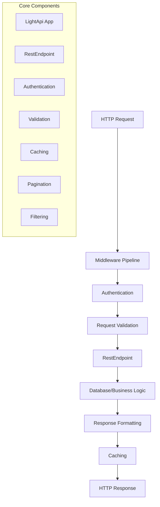

# LightAPI Documentation

**LightAPI** is a powerful yet lightweight Python framework for building REST APIs with minimal code. Built on aiohttp and SQLAlchemy, it automatically generates REST APIs from your existing database tables using either Python code or simple YAML configuration files.

## Key Features

### 🚀 **Rapid Development**
- **Zero-Code APIs** - Create REST APIs from YAML configuration files without writing Python code
- **Database Reflection** - Automatically discovers and exposes existing database tables as REST endpoints
- **Full CRUD Operations** - GET, POST, PUT, PATCH, DELETE operations generated automatically
- **Automatic OpenAPI/Swagger documentation** - Interactive API docs generated automatically
- **Built-in validation** - Request/response validation based on database schema constraints

### 🔒 **Security & Authentication**
- **JWT Authentication** - Built-in JSON Web Token support
- **Flexible authentication system** - Easy to extend with custom authentication methods
- **CORS support** - Built-in Cross-Origin Resource Sharing middleware
- **Request/response middleware** - Custom middleware for security, logging, and more

### ⚡ **Performance & Scalability**
- **Async/Await Support** - Built on aiohttp for high-performance async operations
- **Redis caching** - Built-in caching system with Redis support and TTL management
- **Query optimization** - Automatic query filtering, pagination, and sorting
- **Multiple Databases** - SQLite, PostgreSQL, MySQL support via SQLAlchemy
- **Connection Pooling** - Efficient database connection management

### 🛠 **Developer Experience**
- **YAML Configuration** - Define APIs using simple YAML files with environment variable support
- **Environment-Based Deployment** - Different configurations for development, staging, and production
- **Comprehensive Examples** - Real-world examples for all features and use cases
- **Rich error handling** - Detailed error messages and debugging support
- **Production Ready** - Docker, Kubernetes, and cloud deployment support

## Quick Start

### Installation

```bash
pip install lightapi
```

### Option 1: YAML Configuration (Zero Code)

Create a YAML configuration file:

```yaml
# config.yaml
database_url: "sqlite:///my_app.db"
swagger_title: "My API"
swagger_version: "1.0.0"
enable_swagger: true

tables:
  - name: users
    crud: [get, post, put, delete]
  - name: posts
    crud: [get, post, put]
```

Run your API:

```python
from lightapi import LightApi

# Create API from YAML configuration
app = LightApi.from_config('config.yaml')
app.run()
```

### Option 2: Python Code (Traditional)

```python
from sqlalchemy import Column, Integer, String
from lightapi import LightApi, RestEndpoint, Base, register_model_class


class User(Base, RestEndpoint):
    __tablename__ = 'users'
    
    id = Column(Integer, primary_key=True)
    name = Column(String(100))
    email = Column(String(100))

# Create and run the API
app = LightApi(database_url="sqlite:///app.db")
app.register({'/users': User})
app.run()
```

**Both approaches create a full REST API with:**
- Full CRUD operations (GET, POST, PUT, PATCH, DELETE)
- Automatic input validation based on database schema
- Interactive Swagger documentation at `/docs`
- JSON responses with proper HTTP status codes
- Error handling and constraint validation

## Architecture Overview

LightAPI follows a modular architecture with clear separation of concerns:



## Core Concepts

### RestEndpoint
The foundation of LightAPI - combines SQLAlchemy models with REST endpoint logic:
- **Database Model**: Defines table structure and relationships
- **HTTP Methods**: Handles GET, POST, PUT, DELETE, PATCH, OPTIONS
- **Configuration**: Customizes authentication, validation, caching, and more

### Middleware System
Flexible request/response processing pipeline:
- **Built-in middleware**: CORS, Authentication, Error handling
- **Custom middleware**: Easy to create and integrate
- **Order matters**: Middleware processes requests in registration order

### Configuration System
Environment-based configuration with sensible defaults:
- **Database settings**: Connection strings and options
- **Security settings**: JWT secrets, CORS origins
- **API documentation**: Swagger/OpenAPI configuration
- **Cache settings**: Redis connection and timeout options

## What Makes LightAPI Different?

| Feature | LightAPI | FastAPI | Flask-RESTful | Django REST |
|---------|----------|---------|---------------|-------------|
| **Zero Boilerplate** | ✅ | ❌ | ❌ | ❌ |
| **Built-in ORM** | ✅ | ❌ | ❌ | ✅ |
| **Auto CRUD** | ✅ | ❌ | ❌ | ❌ |
| **Auto Swagger** | ✅ | ✅ | ❌ | ✅ |
| **Built-in Auth** | ✅ | ❌ | ❌ | ✅ |
| **Caching** | ✅ | ❌ | ❌ | ✅ |
| **Learning Curve** | Low | Medium | Medium | High |

## Getting Started

Ready to build your first API? Choose your path:

### 🚀 For Beginners
1. **[Introduction](getting-started/introduction.md)** - Framework overview and concepts
2. **[Installation](getting-started/installation.md)** - Setup and requirements  
3. **[Quickstart](getting-started/quickstart.md)** - Your first API in 5 minutes
4. **[Configuration](getting-started/configuration.md)** - YAML and Python configuration

### 📚 Learning Path
1. **[Basic API Tutorial](tutorial/basic-api.md)** - Step-by-step API creation
2. **[Database Setup](tutorial/database.md)** - Working with different databases
3. **[YAML Configuration](examples/yaml-configuration.md)** - Zero-code API creation
4. **[Authentication](examples/auth.md)** - Securing your APIs

### 💡 Real-World Examples
- **[Basic CRUD](examples/basic-crud.md)** - Simple CRUD operations
- **[E-commerce API](examples/advanced-permissions.md)** - Role-based permissions
- **[Analytics API](examples/readonly-apis.md)** - Read-only data access
- **[Multi-Environment](examples/environment-variables.md)** - Dev/staging/production setup

See the [README](../README.md) for a full feature overview and advanced usage.

## Community & Support

- **GitHub**: [LightAPI Repository](https://github.com/henriqueblobato/LightApi)
- **Issues**: [Report bugs or request features](https://github.com/henriqueblobato/LightApi/issues)
- **Discussions**: Share ideas and get help from the community

## License

LightAPI is released under the [MIT License](https://github.com/henriqueblobato/LightApi/blob/main/LICENSE).

---

*Built with ❤️ for Python developers who value simplicity and productivity.*

> **Note:** Only GET, POST, PUT, PATCH, DELETE HTTP verbs are supported. OPTIONS and HEAD are not available. Required fields must be NOT NULL in the schema. Constraint violations (NOT NULL, UNIQUE, FK) return 409.

> To start your API, always use `api.run(host, port)`. Do not use external libraries or 'app = api.app' to start the server directly.

## Mega Example: All Features in One App

The `examples/mega_example.py` script demonstrates the full capabilities of LightAPI:
- RESTful models (products, categories, orders, users, etc.)
- Custom endpoints (auth, weather, hello, secret, public, etc.)
- JWT authentication and protected resources
- Middleware (logging, CORS, rate limiting, authentication)
- Caching, filtering, pagination, and more

**Available Endpoints:**

| Path                  | Methods                                    | Description                  |
|-----------------------|--------------------------------------------|------------------------------|
| /products             | GET, POST, PUT, PATCH, DELETE, OPTIONS     | Product CRUD                 |
| /categories           | GET, POST, PUT, PATCH, DELETE, OPTIONS     | Category CRUD                |
| /orders               | GET, POST, PUT, PATCH, DELETE, OPTIONS     | Order CRUD                   |
| /order_items          | GET, POST, PUT, PATCH, DELETE, OPTIONS     | Order item CRUD              |
| /users                | GET, POST, PUT, PATCH, DELETE, OPTIONS     | User CRUD                    |
| /user_profiles        | GET, POST, PUT, PATCH, DELETE, OPTIONS     | User profile (JWT protected) |
| /auth/login           | POST, OPTIONS                              | JWT login                    |
| /secret               | GET, OPTIONS (JWT required)                | Protected resource           |
| /public               | GET, OPTIONS                               | Public resource              |
| /weather/{city}       | GET, OPTIONS                               | Weather info (custom path)   |
| /hello                | GET, OPTIONS                               | Hello world (custom path)    |

> All endpoints are registered with explicit RESTful or custom paths using `route_patterns` or `__tablename__`.

